# Linux 中断管理详解

> 参考书目：《Linux内核设计与实现》、《图解Linux内核 基于6.x》

---

## 一、中断概述

### 1.1 什么是中断

中断是硬件或软件发出的信号，用于通知CPU有事件需要处理。中断机制允许CPU在执行正常程序时，能够响应外部或内部事件。

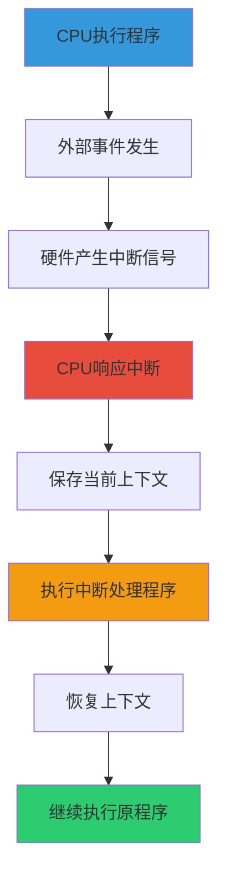

### 1.2 中断的作用

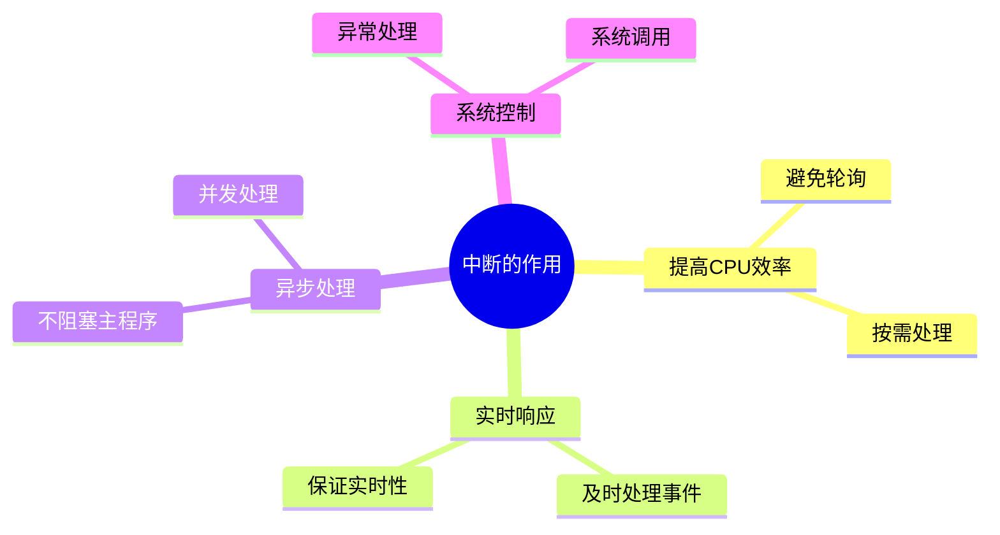

### 1.3 中断与异常的区别

| 特性 | 中断 | 异常 |
|------|------|------|
| 来源 | 外部硬件或软件 | 内部CPU指令 |
| 同步性 | 异步 | 同步 |
| 可预测性 | 不可预测 | 可预测 |
| 处理时机 | 当前指令完成后 | 当前指令执行时 |
| 示例 | 定时器、网络包 | 除零错误、缺页异常 |

---

## 二、中断分类

### 2.1 中断分类体系

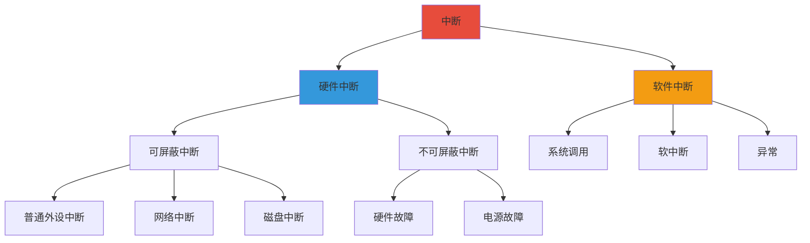

### 2.2 硬件中断

#### 2.2.1 可屏蔽中断（IRQ）

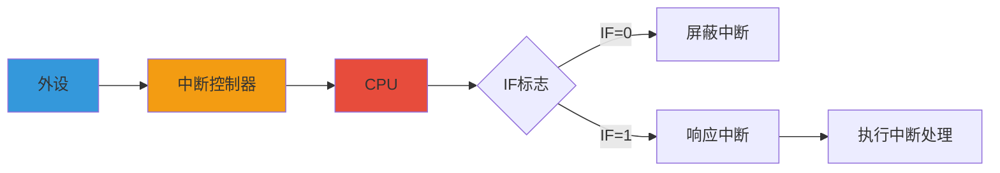

#### 2.2.2 不可屏蔽中断（NMI）

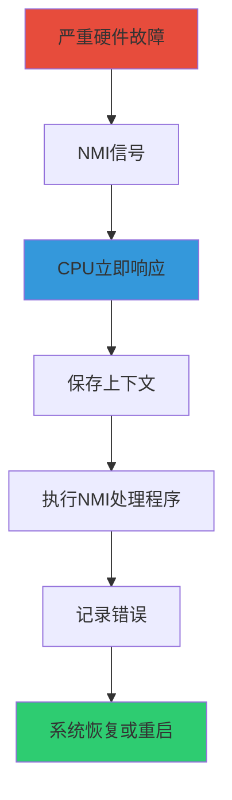

### 2.3 软件中断

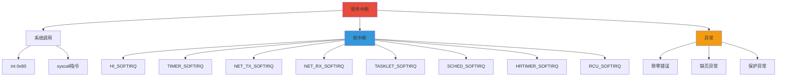

---

## 三、中断控制器

### 3.1 中断控制器概述

中断控制器是连接外设和CPU的桥梁，负责：
- 接收外设的中断请求
- 优先级仲裁
- 向CPU发送中断信号
- 提供中断向量号

### 3.2 中断控制器类型

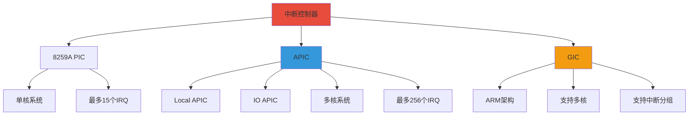

### 3.3 x86 APIC 架构

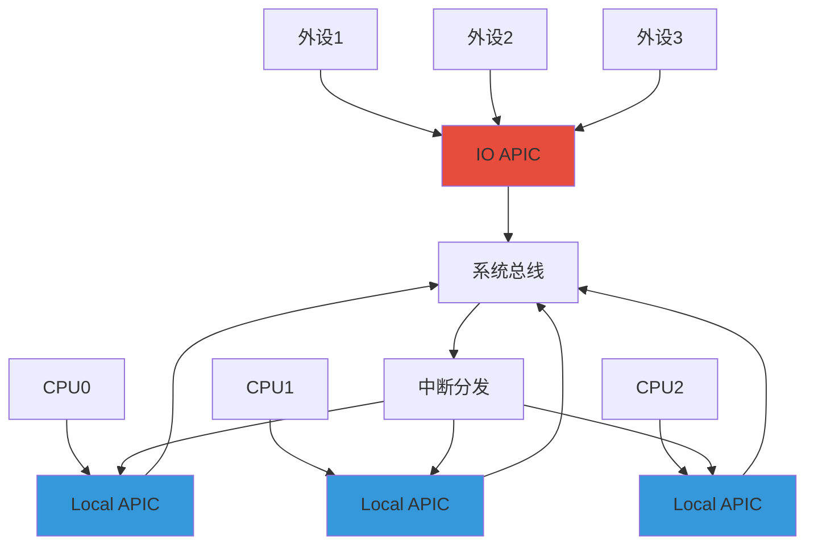

### 3.4 ARM GIC 架构

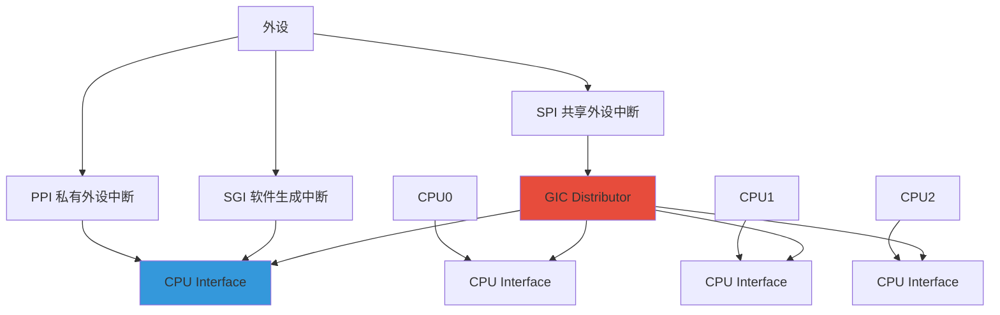

---

## 四、中断处理流程

### 4.1 硬件中断处理流程

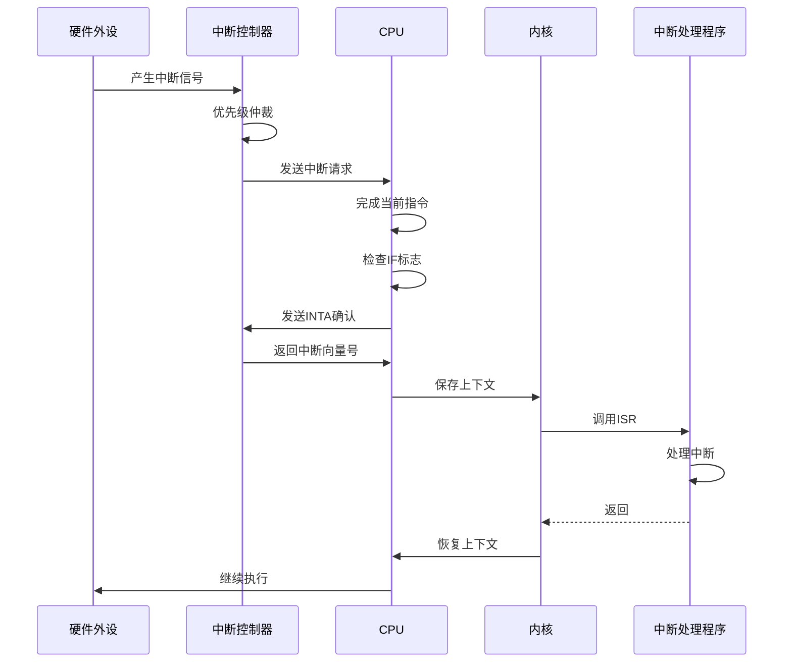

### 4.2 中断处理流程详细步骤

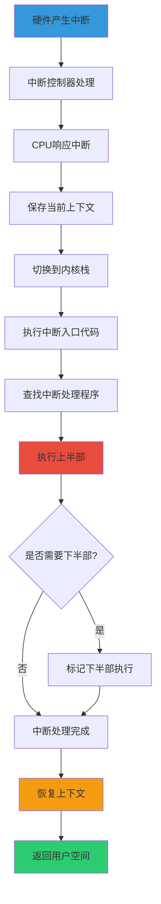

### 4.3 中断上下文

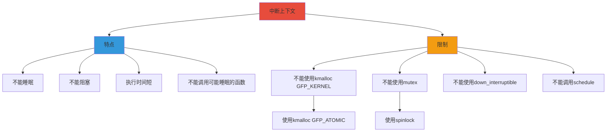

---

## 五、软中断

### 5.1 软中断概述

软中断是内核中用于延迟处理中断下半部的机制。它在中断上下文中执行，但可以被打断。

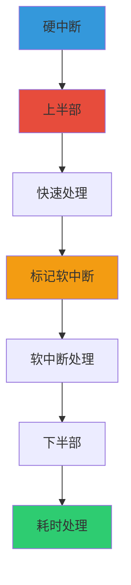

### 5.2 软中断类型

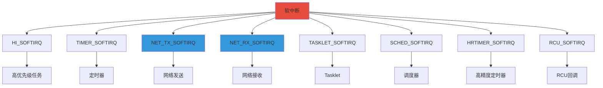

### 5.3 软中断处理流程

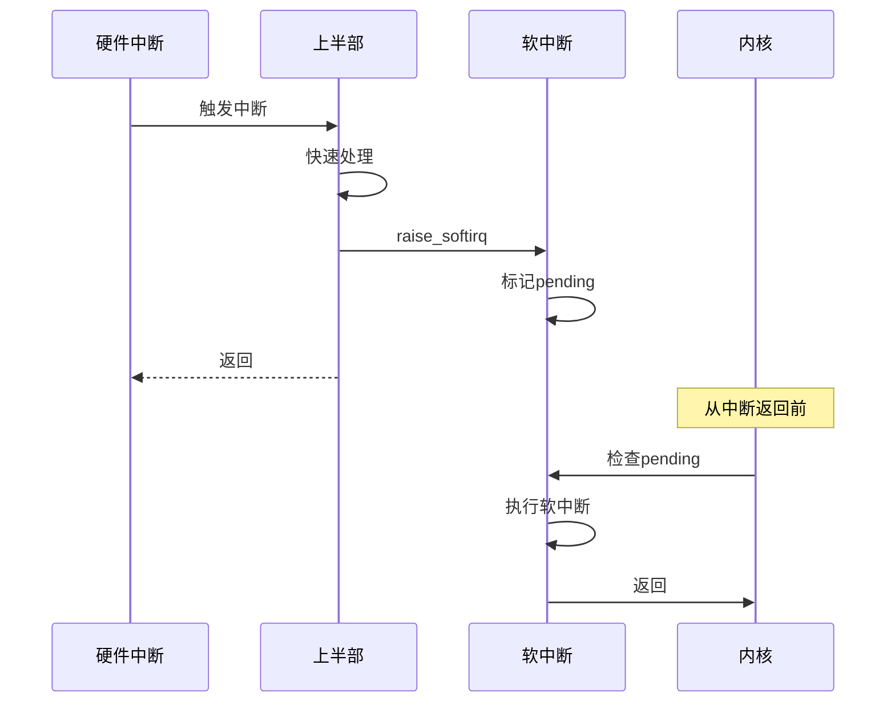

### 5.4 软中断相关API

```c
// 定义软中断
static void my_softirq_handler(struct softirq_action *h);

// 注册软中断
open_softirq(MY_SOFTIRQ, my_softirq_handler);

// 触发软中断
raise_softirq(MY_SOFTIRQ);

// 在本地CPU上触发软中断
raise_softirq_irqoff(MY_SOFTIRQ);

// 禁用本地软中断
local_bh_disable();

// 启用本地软中断
local_bh_enable();
```

---

## 六、Tasklet

### 6.1 Tasklet概述

Tasklet是基于软中断的机制，提供了更简单的接口。它是动态分配的，可以有多个实例。

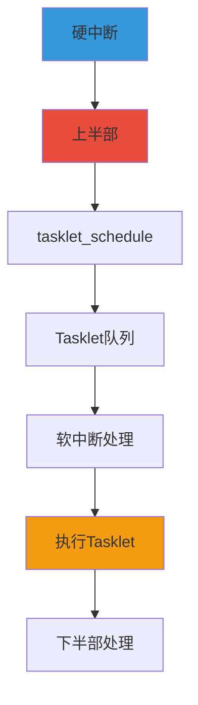

### 6.2 Tasklet特性

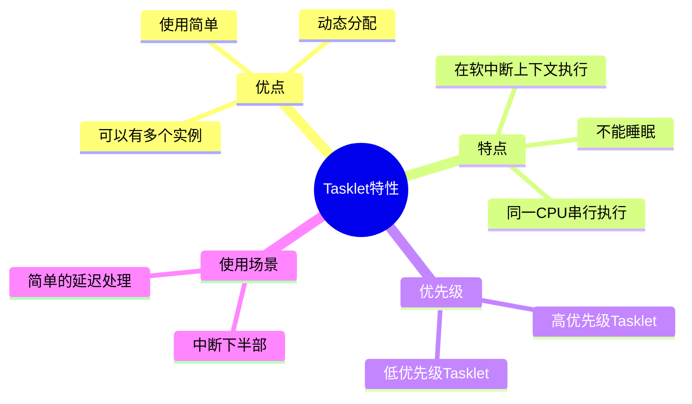

### 6.3 Tasklet类型

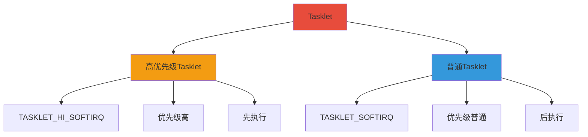

### 6.4 Tasklet相关API

```c
// 定义Tasklet结构
DECLARE_TASKLET(my_tasklet, my_tasklet_handler, data);

// 或者动态初始化
struct tasklet_struct my_tasklet;
tasklet_init(&my_tasklet, my_tasklet_handler, data);

// Tasklet处理函数
void my_tasklet_handler(unsigned long data);

// 调度Tasklet
tasklet_schedule(&my_tasklet);

// 调度高优先级Tasklet
tasklet_hi_schedule(&my_tasklet);

// 禁用Tasklet
tasklet_disable(&my_tasklet);

// 启用Tasklet
tasklet_enable(&my_tasklet);

// 杀死Tasklet
tasklet_kill(&my_tasklet);
```

### 6.5 Tasklet使用示例

```c
#include <linux/interrupt.h>
#include <linux/module.h>

static struct tasklet_struct my_tasklet;
static int counter = 0;

static void my_tasklet_handler(unsigned long data)
{
    counter++;
    printk(KERN_INFO "Tasklet handler called, counter = %d\n", counter);
}

static int __init my_init(void)
{
    // 初始化Tasklet
    tasklet_init(&my_tasklet, my_tasklet_handler, 0);
    
    // 调度Tasklet
    tasklet_schedule(&my_tasklet);
    
    printk(KERN_INFO "Module loaded\n");
    return 0;
}

static void __exit my_exit(void)
{
    // 杀死Tasklet
    tasklet_kill(&my_tasklet);
    printk(KERN_INFO "Module unloaded\n");
}

module_init(my_init);
module_exit(my_exit);

MODULE_LICENSE("GPL");
```

---

## 七、工作队列

### 7.1 工作队列概述

工作队列是将工作推迟到进程上下文中执行的机制，可以睡眠和阻塞。

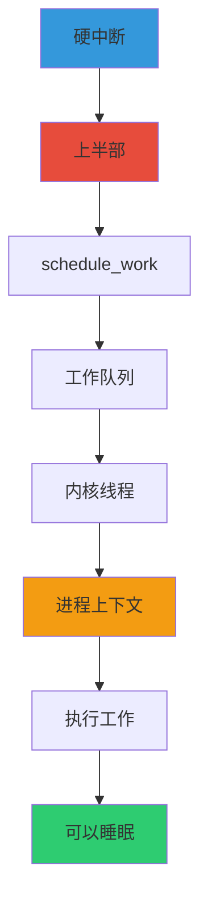

### 7.2 工作队列特性

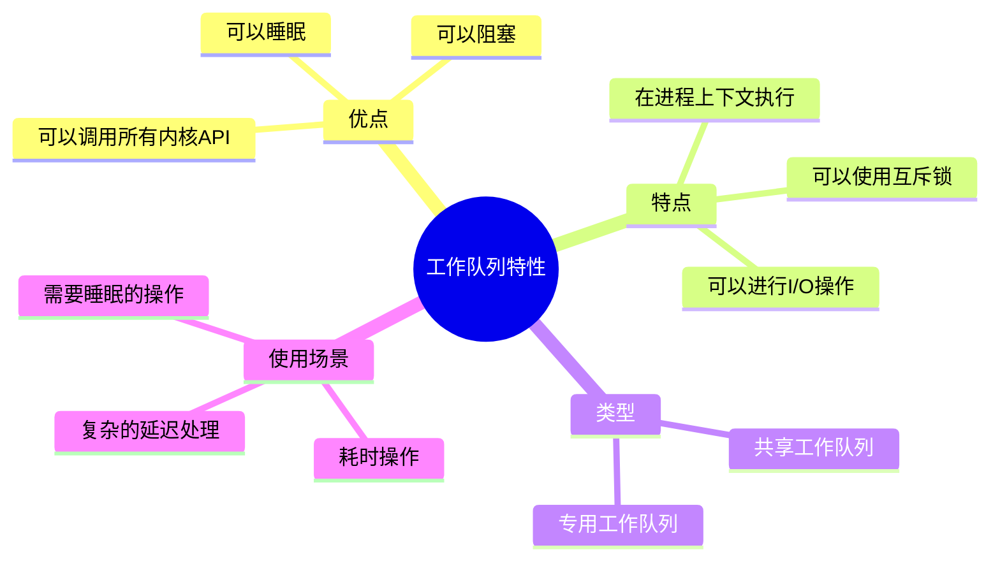

### 7.3 工作队列类型

```mermaid
graph TB
    A[工作队列] --> B[共享工作队列]
    A --> C[专用工作队列]
    
    B --> B1[events]
    B --> B2[events_n]
    B --> B3[events_long]
    B --> B4[系统共享]
    
    C --> C1[create_workqueue]
    C --> C2[create_singlethread_workqueue]
    C --> C3[create_freezable_workqueue]
    C --> C4[用户自定义]
    
    style A fill:#e74c3c
    style B fill:#3498db
    style C fill:#f39c12
```

### 7.4 工作队列相关API

```c
// 定义工作
DECLARE_WORK(my_work, my_work_handler);

// 或者动态初始化
struct work_struct my_work;
INIT_WORK(&my_work, my_work_handler);

// 工作处理函数
void my_work_handler(struct work_struct *work);

// 调度工作到共享队列
schedule_work(&my_work);

// 调度工作到延迟队列
schedule_delayed_work(&my_work, delay);

// 创建工作队列
struct workqueue_struct *wq;
wq = create_workqueue("my_wq");

// 调度工作到专用队列
queue_work(wq, &my_work);

// 刷新工作队列
flush_workqueue(wq);

// 销毁工作队列
destroy_workqueue(wq);
```

### 7.5 工作队列使用示例

```c
#include <linux/workqueue.h>
#include <linux/module.h>

static struct workqueue_struct *my_wq;
static struct work_struct my_work;
static int counter = 0;

static void my_work_handler(struct work_struct *work)
{
    // 可以睡眠
    msleep(1000);
    
    counter++;
    printk(KERN_INFO "Work handler called, counter = %d\n", counter);
}

static int __init my_init(void)
{
    // 创建工作队列
    my_wq = create_workqueue("my_wq");
    if (!my_wq) {
        return -ENOMEM;
    }
    
    // 初始化工作
    INIT_WORK(&my_work, my_work_handler);
    
    // 调度工作
    queue_work(my_wq, &my_work);
    
    printk(KERN_INFO "Module loaded\n");
    return 0;
}

static void __exit my_exit(void)
{
    // 刷新工作队列
    flush_workqueue(my_wq);
    
    // 销毁工作队列
    destroy_workqueue(my_wq);
    
    printk(KERN_INFO "Module unloaded\n");
}

module_init(my_init);
module_exit(my_exit);

MODULE_LICENSE("GPL");
```

---

## 八、中断相关数据结构

### 8.1 irq_desc（中断描述符）

```mermaid
classDiagram
    class irq_desc {
        +unsigned int irq
        +struct irq_chip *irq_chip
        +struct irq_data irq_data
        +struct irqaction *action
        +unsigned int status_use_accessors
        +unsigned int depth
        +unsigned int wake_depth
        +unsigned int irq_count
        +unsigned long last_unhandled
        +unsigned int irqs_unhandled
        +raw_spinlock_t lock
        +struct cpumask *affinity_hint
        +struct irq_domain *irq_common_data
    }
    
    note for irq_desc "中断描述符，描述一个中断线"
```

### 8.2 irq_chip（中断控制器芯片）

```mermaid
classDiagram
    class irq_chip {
        +const char *name
        +void (*irq_startup)(struct irq_data *data)
        +void (*irq_shutdown)(struct irq_data *data)
        +void (*irq_enable)(struct irq_data *data)
        +void (*irq_disable)(struct irq_data *data)
        +void (*irq_ack)(struct irq_data *data)
        +void (*irq_mask)(struct irq_data *data)
        +void (*irq_unmask)(struct irq_data *data)
        +void (*irq_eoi)(struct irq_data *data)
        +int (*irq_set_affinity)(struct irq_data *data, const struct cpumask *dest, bool force)
        +int (*irq_set_type)(struct irq_data *data, unsigned int flow_type)
        +int (*irq_retrigger)(struct irq_data *data)
    }
    
    note for irq_chip "中断控制器操作接口"
```

### 8.3 irqaction（中断处理动作）

```mermaid
classDiagram
    class irqaction {
        +irq_handler_t handler
        +void *dev_id
        +struct irqaction *next
        +irq_handler_t thread_fn
        +struct task_struct *thread
        +unsigned int irq
        +unsigned int flags
        +unsigned long thread_flags
        +const char *name
        +struct proc_dir_entry *dir
    }
    
    note for irqaction "中断处理程序及相关信息"
```

### 8.4 中断相关数据结构关系

```mermaid
graph TB
    A[irq_desc数组] --> B[irq_desc 0]
    A --> C[irq_desc 1]
    A --> D[irq_desc N]
    
    B --> E[irq_chip]
    B --> F[irq_data]
    B --> G[irqaction链表]
    
    G --> H[irqaction 1]
    G --> I[irqaction 2]
    
    H --> J[handler]
    H --> K[dev_id]
    H --> L[thread_fn]
    
    style A fill:#e74c3c
    style B fill:#3498db
    style G fill:#f39c12
```

---

## 九、中断相关API

### 9.1 申请和释放中断

```c
// 申请中断
int request_irq(unsigned int irq,
                irq_handler_t handler,
                unsigned long flags,
                const char *name,
                void *dev_id);

// 释放中断
void free_irq(unsigned int irq, void *dev_id);

// 申请线程化中断
int request_threaded_irq(unsigned int irq,
                         irq_handler_t handler,
                         irq_handler_t thread_fn,
                         unsigned long flags,
                         const char *name,
                         void *dev_id);
```

### 9.2 中断标志

```mermaid
graph TB
    A[中断标志] --> B[IRQF_SHARED]
    A --> C[IRQF_TRIGGER_NONE]
    A --> D[IRQF_TRIGGER_RISING]
    A --> E[IRQF_TRIGGER_FALLING]
    A --> F[IRQF_TRIGGER_HIGH]
    A --> G[IRQF_TRIGGER_LOW]
    A --> H[IRQF_ONESHOT]
    A --> I[IRQF_PERCPU]
    
    B --> B1[共享中断线]
    C --> C2[默认触发方式]
    D --> D3[上升沿触发]
    E --> E4[下降沿触发]
    F --> F5[高电平触发]
    G --> G6[低电平触发]
    H --> H7[单次触发]
    I --> I8[每CPU中断]
    
    style A fill:#e74c3c
    style B fill:#3498db
    style D fill:#f39c12
```

### 9.3 中断控制

```c
// 禁用本地中断
local_irq_disable();
local_irq_save(flags);

// 启用本地中断
local_irq_enable();
local_irq_restore(flags);

// 禁用指定中断
disable_irq(irq);
disable_irq_nosync(irq);

// 启用指定中断
enable_irq(irq);

// 同步中断
synchronize_irq(irq);

// 检查是否在硬中断上下文
in_interrupt();
in_irq();
```

### 9.4 中断亲和性

```c
// 设置中断亲和性
int irq_set_affinity(unsigned int irq, const struct cpumask *cpumask);

// 获取中断亲和性
const struct cpumask *irq_get_affinity(unsigned int irq);

// 设置默认亲和性
int irq_set_affinity_hint(unsigned int irq, const struct cpumask *m);
```

---

## 十、中断实战应用

### 10.1 实战场景：编写中断处理程序

#### 需求描述
为一个虚拟设备编写中断处理程序，使用工作队列处理下半部。

#### 实现代码

```c
#include <linux/module.h>
#include <linux/interrupt.h>
#include <linux/workqueue.h>
#include <linux/slab.h>

#define DEVICE_IRQ 42

static struct workqueue_struct *my_wq;
static struct work_struct my_work;
static int interrupt_count = 0;

// 工作队列处理函数（下半部）
static void my_work_handler(struct work_struct *work)
{
    // 可以睡眠
    msleep(100);
    
    printk(KERN_INFO "Work handler: processed interrupt %d\n", interrupt_count);
}

// 中断处理函数（上半部）
static irqreturn_t my_interrupt_handler(int irq, void *dev_id)
{
    interrupt_count++;
    
    // 快速处理
    printk(KERN_INFO "Interrupt %d occurred\n", interrupt_count);
    
    // 调度下半部
    schedule_work(&my_work);
    
    return IRQ_HANDLED;
}

static int __init my_interrupt_init(void)
{
    int ret;
    
    // 创建工作队列
    my_wq = create_workqueue("my_wq");
    if (!my_wq) {
        printk(KERN_ERR "Failed to create workqueue\n");
        return -ENOMEM;
    }
    
    // 初始化工作
    INIT_WORK(&my_work, my_work_handler);
    
    // 申请中断
    ret = request_irq(DEVICE_IRQ, my_interrupt_handler,
                      IRQF_SHARED, "my_device", &my_wq);
    if (ret) {
        printk(KERN_ERR "Failed to request IRQ %d\n", DEVICE_IRQ);
        destroy_workqueue(my_wq);
        return ret;
    }
    
    printk(KERN_INFO "Interrupt handler registered for IRQ %d\n", DEVICE_IRQ);
    return 0;
}

static void __exit my_interrupt_exit(void)
{
    // 释放中断
    free_irq(DEVICE_IRQ, &my_wq);
    
    // 刷新工作队列
    flush_workqueue(my_wq);
    
    // 销毁工作队列
    destroy_workqueue(my_wq);
    
    printk(KERN_INFO "Interrupt handler unregistered\n");
}

module_init(my_interrupt_init);
module_exit(my_interrupt_exit);

MODULE_LICENSE("GPL");
MODULE_AUTHOR("Your Name");
MODULE_DESCRIPTION("Interrupt handler example");
```

### 10.2 实战场景：中断性能分析

#### 实战命令

```bash
# 1. 查看中断统计
cat /proc/interrupts
watch -n 1 cat /proc/interrupts

# 2. 查看中断详细信息
cat /proc/irq/<IRQ>/spurious
cat /proc/irq/<IRQ>/smp_affinity

# 3. 设置中断亲和性
echo 2 > /proc/irq/<IRQ>/smp_affinity

# 4. 查看中断延迟
cat /proc/irq/<IRQ>/latency

# 5. 使用perf分析中断
perf record -e irq:* sleep 10
perf report

# 6. 使用ftrace跟踪中断
echo function > /sys/kernel/debug/tracing/current_tracer
echo handle_irq > /sys/kernel/debug/tracing/set_ftrace_filter
cat /sys/kernel/debug/tracing/trace

# 7. 查看软中断统计
cat /proc/softirqs
watch -n 1 cat /proc/softirqs

# 8. 查看Tasklet统计
cat /proc/timer_list

# 9. 查看工作队列
cat /proc/workqueues

# 10. 监控中断
mpstat -I SUM -P ALL 1
```

### 10.3 实战场景：中断优化

#### 优化策略

```mermaid
graph TB
    A[中断优化] --> B[减少中断频率]
    A --> C[优化中断处理]
    A --> D[合理分配CPU]
    A --> E[使用轮询]
    
    B --> B1[中断合并]
    B --> B2[NAPI]
    B --> B3[中断节流]
    
    C --> C1[快速上半部]
    C --> C2[延迟下半部]
    C --> C3[使用工作队列]
    
    D --> D1[设置亲和性]
    D --> D2[负载均衡]
    D --> D3[避免热点CPU]
    
    E --> E1[高流量场景]
    E --> E2[混合模式]
    
    style A fill:#e74c3c
    style B fill:#3498db
    style C fill:#f39c12
    style D fill:#2ecc71
```

#### 优化示例

```bash
# 1. 设置中断亲和性
echo 1 > /proc/irq/24/smp_affinity_list
echo 2 > /proc/irq/25/smp_affinity_list

# 2. 启用RPS（Receive Packet Steering）
echo 1 > /sys/class/net/eth0/queues/rx-0/rps_cpus
echo 2 > /sys/class/net/eth0/queues/rx-1/rps_cpus

# 3. 启用XPS（Transmit Packet Steering）
echo 1 > /sys/class/net/eth0/queues/tx-0/xps_cpus
echo 2 > /sys/class/net/eth0/queues/tx-1/xps_cpus

# 4. 调整中断节流
echo 100 > /proc/sys/kernel/irq_timeout

# 5. 启用NAPI（New API）用于网络
# 网卡驱动支持NAPI

# 6. 调整软中断优先级
echo 1 > /proc/irq/<IRQ>/smp_affinity

# 7. 禁用不需要的中断
echo 0 > /proc/irq/<IRQ>/smp_affinity
```

---

## 十一、中断调试技巧

### 11.1 中断调试工具

```mermaid
graph TB
    A[中断调试工具] --> B[/proc/interrupts]
    A --> C[ftrace]
    A --> D[perf]
    A --> E[crash]
    A --> F[sysrq]
    
    B --> B1[查看中断统计]
    B --> B2[查看中断分布]
    
    C --> C3[跟踪中断函数]
    C --> C4[分析中断流程]
    
    D --> D5[性能分析]
    D --> D6[热点分析]
    
    E --> E7[崩溃分析]
    E --> E8[状态查看]
    
    F --> F9[系统状态]
    F --> F10[任务状态]
    
    style A fill:#e74c3c
    style C fill:#3498db
    style D fill:#f39c12
```

### 11.2 调试命令

```bash
# 1. 查看中断统计
cat /proc/interrupts

# 2. 实时监控中断
watch -n 1 cat /proc/interrupts

# 3. 查看软中断
cat /proc/softirqs

# 4. 查看特定中断信息
ls -la /proc/irq/<IRQ>/
cat /proc/irq/<IRQ>/smp_affinity

# 5. 使用ftrace
echo 1 > /sys/kernel/debug/tracing/tracing_on
echo function_graph > /sys/kernel/debug/tracing/current_tracer
echo handle_irq > /sys/kernel/debug/tracing/set_ftrace_filter
cat /sys/kernel/debug/tracing/trace

# 6. 使用perf
perf record -e irq:* -a sleep 10
perf report

# 7. 查看内核日志
dmesg | grep -i irq
dmesg | grep -i interrupt

# 8. 使用sysrq
echo 1 > /proc/sys/kernel/sysrq
# Alt+SysRq+i - 显示中断信息

# 9. 查看工作队列
cat /proc/workqueues

# 10. 使用crash
sudo crash vmlinux /var/crash/<vmcore>
> foreach bt
> foreach task -R
```

### 11.3 常见问题排查

```mermaid
graph TB
    A[中断问题] --> B{问题类型}
    
    B --> C[中断丢失]
    B --> D[中断风暴]
    B --> E[中断延迟高]
    B --> F[死锁]
    
    C --> C1[检查中断是否被禁用]
    C --> C2[检查中断标志]
    C --> C3[检查中断优先级]
    
    D --> D4[检查中断处理时间]
    D --> D5[检查中断频率]
    D --> D6[启用中断节流]
    
    E --> E7[检查CPU负载]
    E --> E8[检查中断亲和性]
    E --> E9[优化中断处理]
    
    F --> F10[检查锁使用]
    F --> F11[检查死锁]
    F --> F12[修复死锁]
    
    style A fill:#e74c3c
    style C fill:#3498db
    style D fill:#f39c12
    style E fill:#2ecc71
```

---

## 十二、总结

### 12.1 中断核心概念

1. **中断分类**：硬件中断（可屏蔽/不可屏蔽）、软件中断（系统调用/软中断/异常）
2. **中断控制器**：APIC（x86）、GIC（ARM）
3. **中断处理**：上半部（快速处理）、下半部（延迟处理）
4. **下半部机制**：软中断、Tasklet、工作队列
5. **中断上下文**：不能睡眠、不能阻塞、执行时间短
6. **中断优化**：减少中断频率、优化处理、合理分配CPU

### 12.2 学习要点

```mermaid
mindmap
  root((中断管理))
    基础概念
      中断分类
      中断控制器
      中断处理流程
    下半部机制
      软中断
      Tasklet
      工作队列
    数据结构
      irq_desc
      irq_chip
      irqaction
    API使用
      request_irq
      free_irq
      中断控制
    性能优化
      中断亲和性
      NAPI
      中断节流
    调试技巧
      ftrace
      perf
      /proc/interrupts
```

---

## 参考资源

- 《Linux内核设计与实现》
- 《图解Linux内核 基于6.x》
- Linux内核源码：https://github.com/torvalds/linux
- Linux内核文档：https://www.kernel.org/doc/html/latest/
- 内核中断文档：https://www.kernel.org/doc/html/latest/core-api/irq/concepts.html

---

*文档创建时间：2026年1月18日*
*内核版本参考：Linux 6.x*