# Linux内存分配释放详细过程讲解

## 📋 目录
1. [内存分配完整流程](#内存分配完整流程)
2. [内存释放完整流程](#内存释放完整流程)
3. [关键数据结构](#关键数据结构)
4. [优化机制](#优化机制)
5. [性能监控](#性能监控)

---

## 🚀 内存分配完整流程

### 1. 整体架构概览

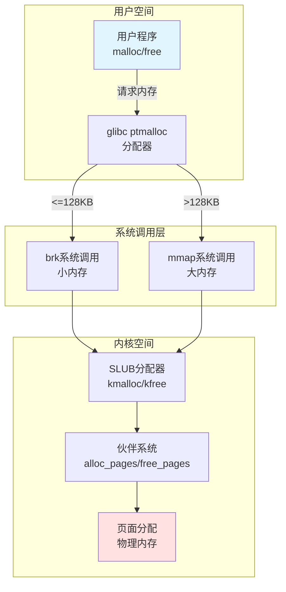

### 2. 用户空间分配流程

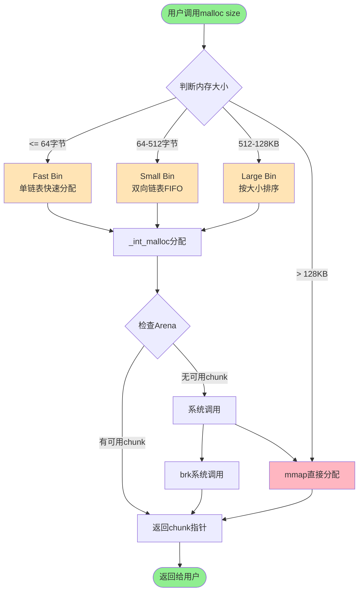

### 3. ptmalloc分配策略选择

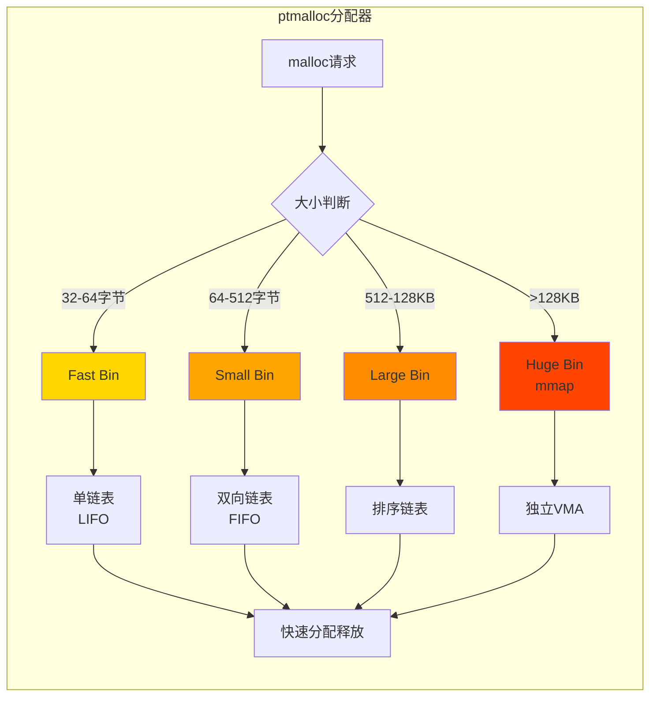

### 4. 系统调用层分配

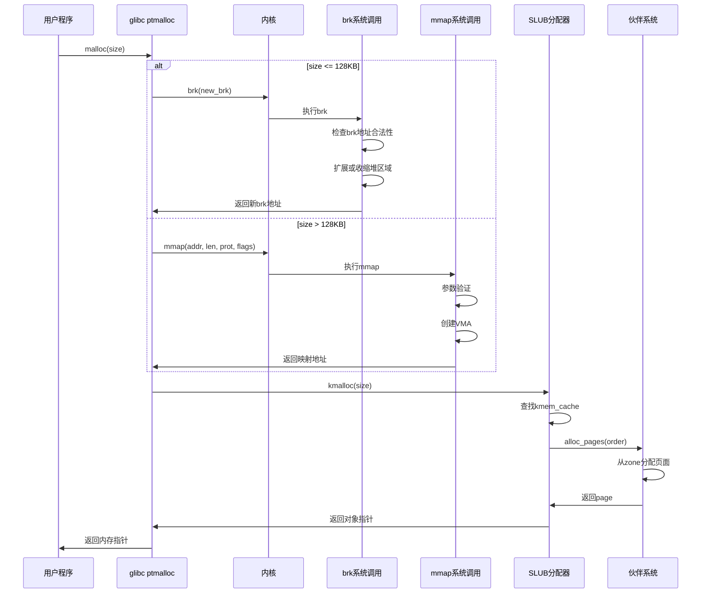

### 5. SLUB分配器详细流程

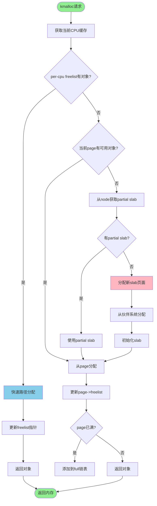

### 6. 伙伴系统分配算法

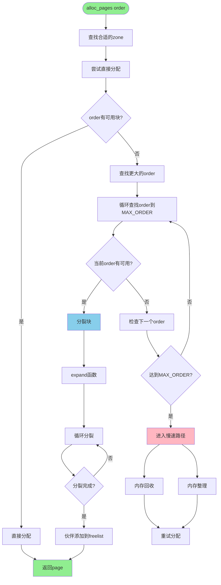

### 7. 伙伴系统页面分裂示例

```mermaid
graph TB
    subgraph 分配order=0 (1页)
        A0[Order 3: 8页] --> B0[分裂为两个Order 2]
        B0 --> C0[Order 2: 4页<br/>使用] & D0[Order 2: 4页<br/>空闲]
    end
    
    subgraph 分配order=1 (2页)
        A1[Order 3: 8页] --> B1[分裂为两个Order 2]
        B1 --> C1[Order 2: 4页] & D1[Order 2: 4页]
        C1 --> E1[分裂为两个Order 1]
        E1 --> F1[Order 1: 2页<br/>使用] & G1[Order 1: 2页<br/>空闲]
    end
    
    style A0 fill:#FFE4B5
    style A1 fill:#FFE4B5
    style C0 fill:#90EE90
    style F1 fill:#90EE90
```

---

## 🗑️ 内存释放完整流程

### 1. 整体释放流程

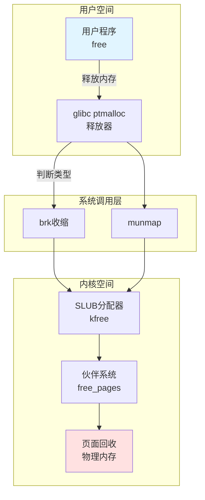

### 2. 用户空间释放流程

```mermaid
flowchart TD
    Start([用户调用free ptr]) --> CheckNull{指针为空?}
    CheckNull -->|是| ReturnNull[直接返回]
    CheckNull -->|否| GetChunk[获取chunk指针]
    
    GetChunk --> CheckMmap{是mmap分配?}
    
    CheckMmap -->|是| MunmapChunk[munmap_chunk]
    MunmapChunk --> SysMunmap[系统调用munmap]
    SysMunmap --> End([释放完成])
    
    CheckMmap -->|否| CheckFastBin{大小<=FASTBIN_MAX?}
    
    CheckFastBin -->|是| ReturnFastBin[放回fast bin]
    ReturnFastBin --> UpdateFastList[更新fast bin链表]
    UpdateFastList --> End
    
    CheckFastBin -->|否| CheckMerge{可合并?}
    
    CheckMerge -->|前chunk空闲| MergePrev[与前chunk合并]
    CheckMerge -->|后chunk空闲| MergeNext[与后chunk合并]
    CheckMerge -->|都可合并| MergeBoth[双向合并]
    
    MergePrev --> CheckMerge
    MergeNext --> CheckMerge
    MergeBoth --> CheckMerge
    
    CheckMerge -->|合并完成| CheckSize{合并后大小?}
    
    CheckSize -->|<MMAP_THRESHOLD| UnsortedBin[放回unsorted bin]
    CheckSize -->|>=MMAP_THRESHOLD| MunmapLarge[munmap大块]
    
    UnsortedBin --> End
    MunmapLarge --> SysMunmap
    
    ReturnNull --> End
    
    style Start fill:#90EE90
    style End fill:#90EE90
    style MunmapChunk fill:#FFB6C1
    style MergeBoth fill:#87CEEB
```

### 3. SLUB释放详细流程

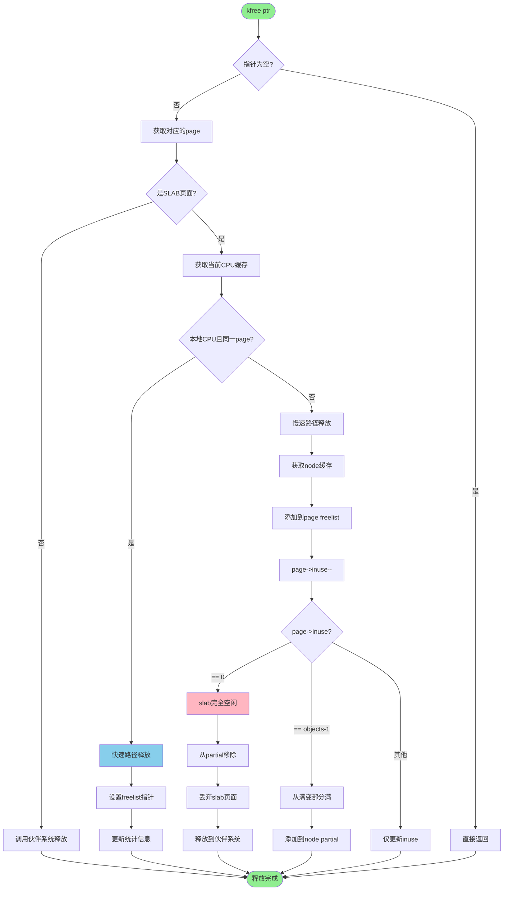

### 4. 伙伴系统释放流程

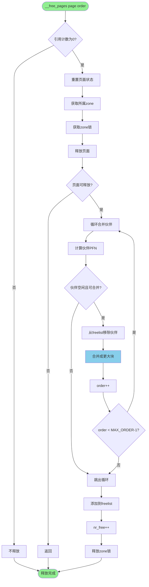

### 5. 伙伴系统合并示例

```mermaid
graph TB
    subgraph 释放order=0 (1页)
        A0[释放Order 0] --> B0{伙伴Order 0空闲?}
        B0 -->|是| C0[合并为Order 1]
        B0 -->|否| D0[直接放回freelist]
        
        C0 --> E0{伙伴Order 1空闲?}
        E0 -->|是| F0[合并为Order 2]
        E0 -->|否| G0[Order 1放回freelist]
    end
    
    subgraph 释放order=1 (2页)
        A1[释放Order 1] --> B1{伙伴Order 1空闲?}
        B1 -->|是| C1[合并为Order 2]
        B1 -->|否| D1[直接放回freelist]
    end
    
    style A0 fill:#FFE4B5
    style A1 fill:#FFE4B5
    style C0 fill:#87CEEB
    style F0 fill:#87CEEB
    style C1 fill:#87CEEB
    style D0 fill:#90EE90
    style D1 fill:#90EE90
```

### 6. munmap系统调用流程

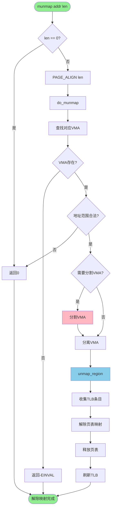

---

## 🏗️ 关键数据结构

### 1. 内存管理层次结构

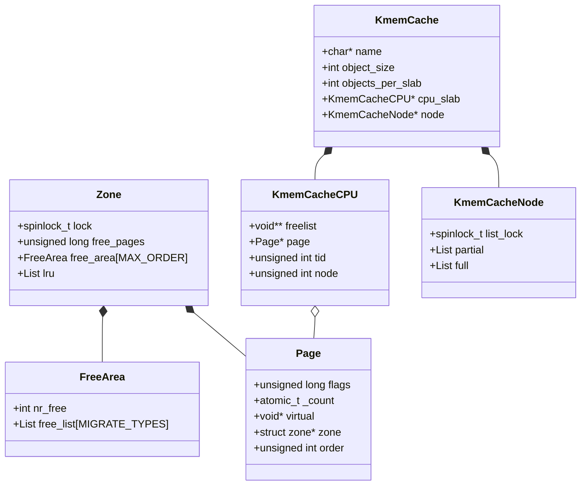

### 2. ptmalloc数据结构

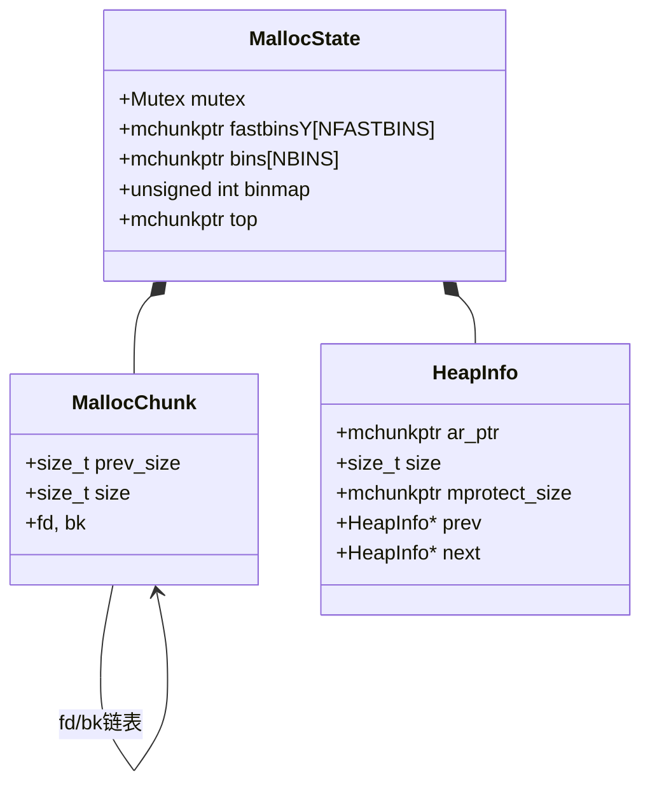

---

## ⚡ 优化机制

### 1. Per-CPU缓存优化

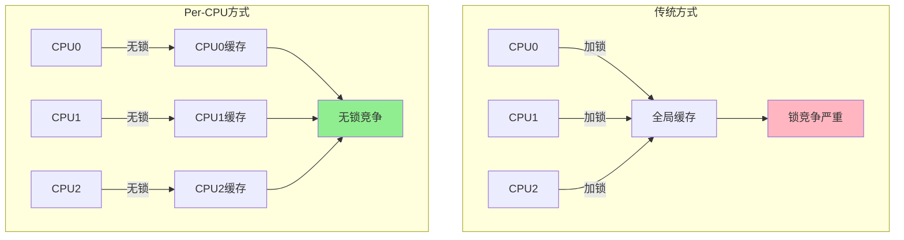

### 2. SLAB颜色算法

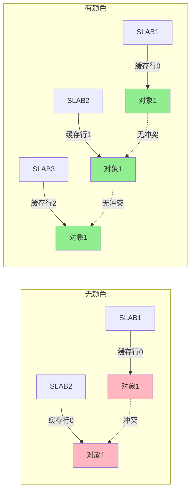

### 3. 批量操作优化

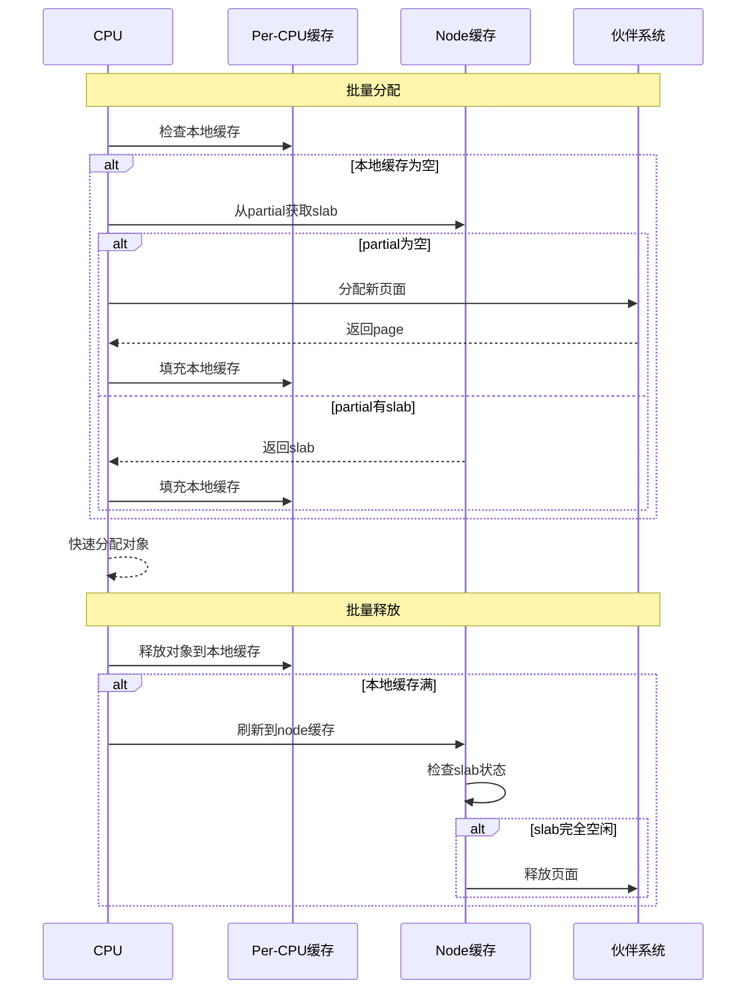

---

## 📊 性能监控

### 1. 监控命令流程

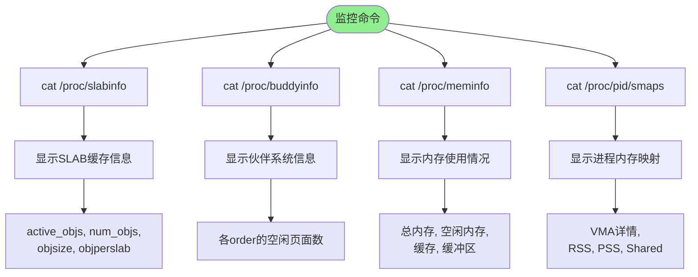

### 2. 内存统计结构

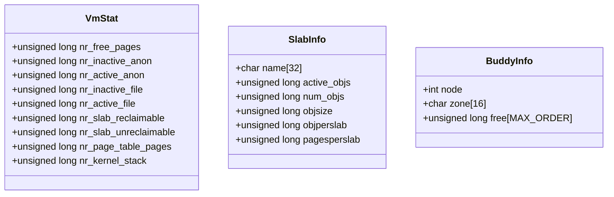

---

## 🎯 总结

### 内存分配关键路径

```mermaid
flowchart LR
    A[malloc] --> B[ptmalloc]
    B --> C[brk/mmap]
    C --> D[SLUB]
    D --> E[伙伴系统]
    E --> F[物理页面]
    
    style A fill:#90EE90
    style F fill:#FFB6C1
```

### 内存释放关键路径

```mermaid
flowchart LR
    A[free] --> B[ptmalloc]
    B --> C[munmap/brk]
    C --> D[SLUB]
    D --> E[伙伴系统]
    E --> F[物理页面回收]
    
    style A fill:#90EE90
    style F fill:#FFB6C1
```

### 调试命令速查

```bash
# SLAB缓存信息
cat /proc/slabinfo

# 伙伴系统信息
cat /proc/buddyinfo

# 内存使用情况
cat /proc/meminfo

# 进程内存映射
cat /proc/<pid>/smaps

# 内存分配跟踪
echo 1 > /proc/sys/vm/drop_caches
```

通过以上图表，可以清晰地理解Linux内存分配释放的完整流程和关键机制！