# Linux内存池Slab机制详解

## 📋 目录
1. [核心概念](#核心概念)
2. [数据结构关系](#数据结构关系)
3. [kmalloc/kfree使用](#kmallockfree使用)
4. [dev_kmalloc使用](#dev_kmalloc使用)
5. [实际应用场景](#实际应用场景)
6. [完整工作流程](#完整工作流程)

---

## 🎯 核心概念

### 1. 三层架构关系

```mermaid
graph TB
    subgraph kmem_cache
        A1[kmem_cache<br/>内存池]
        A2[对象大小: 32字节]
        A3[对象数量: 128个]
        A4[对齐方式: 8字节]
    end
    
    subgraph slab页面
        B1[slab页面1<br/>4KB]
        B2[slab页面2<br/>4KB]
        B3[slab页面3<br/>4KB]
    end
    
    subgraph object对象
        C1[obj1<br/>32字节]
        C2[obj2<br/>32字节]
        C3[obj3<br/>32字节]
        C4[obj128<br/>32字节]
    end
    
    A1 --> B1
    A1 --> B2
    A1 --> B3
    
    B1 --> C1
    B1 --> C2
    B1 --> C3
    B2 --> C4
    
    style A1 fill:#FFD700
    style B1 fill:#87CEEB
    style C1 fill:#90EE90
```

### 2. 内存池层次结构

```mermaid
graph LR
    subgraph 内核空间
        A[kmem_cache<br/>内存池管理器] --> B[slab页面集合]
        B --> C[object对象集合]
    end
    
    subgraph 示例
        D[task_struct缓存<br/>对象大小: 1.5KB] --> E[slab1: 4KB页面]
        E --> F[task1<br/>task2]
        D --> G[slab2: 4KB页面]
        G --> H[task3<br/>task4]
    end
    
    style A fill:#FFD700
    style B fill:#87CEEB
    style C fill:#90EE90
```

### 3. kmem_cache结构详解


---

## 🔗 数据结构关系

### 1. slab页面布局

```mermaid
graph TB
    subgraph 4KB slab页面
        A[页面头部<br/>page结构<br/>64字节] --> B[对象区域]
        B --> C[obj0<br/>32字节]
        B --> D[obj1<br/>32字节]
        B --> E[obj2<br/>32字节]
        B --> F[obj...<br/>32字节]
        B --> G[obj126<br/>32字节]
        B --> H[空闲链表指针<br/>freelist]
    end
    
    style A fill:#FFB6C1
    style C fill:#90EE90
    style D fill:#FFD700
    style E fill:#87CEEB
    style H fill:#FF6347
```

### 2. 三种slab状态

```mermaid
graph TB
    subgraph slab状态
        A[Full Slab<br/>完全使用] --> A1[inuse == objects]
        A1 --> A2[所有对象已分配]
        
        B[Partial Slab<br/>部分使用] --> B1[0 < inuse < objects]
        B1 --> B2[部分对象空闲]
        
        C[Empty Slab<br/>完全空闲] --> C1[inuse == 0]
        C1 --> C2[所有对象空闲]
    end
    
    subgraph 存储位置
        D[full链表] --> A
        E[partial链表] --> B
        F[待释放] --> C
    end
    
    style A fill:#FF6347
    style B fill:#FFD700
    style C fill:#90EE90
```

### 3. Per-CPU缓存结构

```mermaid
graph TB
    subgraph CPU0
        A1[cpu_slab] --> B1[freelist: obj指针]
        B1 --> C1[page: slab页面1]
        C1 --> D1[tid: 线程ID]
    end
    
    subgraph CPU1
        A2[cpu_slab] --> B2[freelist: obj指针]
        B2 --> C2[page: slab页面2]
        C2 --> D2[tid: 线程ID]
    end
    
    subgraph CPU2
        A3[cpu_slab] --> B3[freelist: obj指针]
        B3 --> C3[page: slab页面3]
        C3 --> D3[tid: 线程ID]
    end
    
    subgraph Node缓存
        E[partial链表] --> F[full链表]
    end
    
    C1 -.->|刷新| E
    C2 -.->|刷新| E
    C3 -.->|刷新| E
    
    style A1 fill:#87CEEB
    style A2 fill:#FFD700
    style A3 fill:#FFB6C1
    style E fill:#90EE90
```

---

## 💻 kmalloc/kfree使用

### 1. kmalloc分配流程

```mermaid
flowchart TD
    Start([kmalloc size flags]) --> CheckSize{大小判断}
    
    CheckSize -->|<= KMALLOC_MAX_CACHE| FindCache[查找kmem_cache]
    CheckSize -->|> KMALLOC_MAX_CACHE| LargeAlloc[kmalloc_large]
    
    FindCache --> GetIndex[kmalloc_index]
    GetIndex --> GetCache["kmalloc_caches idx"]
    GetCache --> CacheAlloc[kmem_cache_alloc]
    
    CacheAlloc --> GetCPU[获取cpu_slab]
    GetCPU --> CheckFreelist{freelist有对象?}
    
    CheckFreelist -->|是| FastAlloc[快速路径]
    FastAlloc --> UpdateFreelist["c->freelist = next"]
    UpdateFreelist --> ReturnPtr[返回指针]
    
    CheckFreelist -->|否| SlowAlloc[慢速路径]
    SlowAlloc --> GetPartial[从node获取partial]
    GetPartial --> HasPartial{有partial?}
    
    HasPartial -->|是| AllocFromPartial[从partial分配对象]
    AllocFromPartial --> UpdatePageFreelist["更新page->freelist"]
    UpdatePageFreelist --> ReturnPtr
    
    HasPartial -->|否| NewSlab[分配新slab]
    NewSlab --> AllocPages[alloc_pages]
    AllocPages --> InitSlab[初始化slab]
    InitSlab --> AllocFromNewSlab[从新slab分配]
    AllocFromNewSlab --> ReturnPtr
    
    LargeAlloc --> AllocPages
    AllocPages --> ReturnPtr
    
    ReturnPtr --> End([返回内存指针])
    
    style Start fill:#90EE90
    style End fill:#90EE90
    style FastAlloc fill:#87CEEB
    style SlowAlloc fill:#FFB6C1
    style AllocFromPartial fill:#FFD700
    style AllocFromNewSlab fill:#FFD700
```



### 2. kfree释放流程

```mermaid
flowchart TD
    Start([kfree ptr]) --> CheckNull{指针为空?}
    CheckNull -->|是| ReturnNull[直接返回]
    CheckNull -->|否| GetPage[virt_to_head_page]
    
    GetPage --> CheckSlab{PageSlab?}
    
    CheckSlab -->|否| FreePages[__free_pages]
    FreePages --> End([释放完成])
    
    CheckSlab -->|是| SlabFree[slab_free]
    SlabFree --> GetCPU[获取cpu_slab]
    GetCPU --> CheckFastPath{本地CPU且同page?}
    
    CheckFastPath -->|是| FastFree[快速路径]
    FastFree --> SetFreelist[设置freelist]
    SetFreelist --> UpdateStat[更新统计]
    UpdateStat --> End
    
    CheckFastPath -->|否| SlowFree[慢速路径]
    SlowFree --> GetNode[获取node]
    GetNode --> AddToPage[添加到page freelist]
    AddToPage --> DecInuse[page->inuse--]
    
    DecInuse --> CheckInuse{inuse == 0?}
    CheckInuse -->|是| DiscardSlab[丢弃slab]
    DiscardSlab --> FreeToBuddy[释放到伙伴系统]
    FreeToBuddy --> End
    
    CheckInuse -->|否| CheckPartial{inuse == objects-1?}
    CheckPartial -->|是| AddPartial[添加到partial]
    CheckPartial -->|否| End
    
    AddPartial --> End
    
    ReturnNull --> End
    
    style Start fill:#90EE90
    style End fill:#90EE90
    style FastFree fill:#87CEEB
    style SlowFree fill:#FFB6C1
```



### 3. kmalloc/kfree时序图

```mermaid
sequenceDiagram
    participant App as 应用程序
    participant K as kmalloc
    participant Cache as kmem_cache
    participant CPU as cpu_slab
    participant Node as node缓存
    participant Buddy as 伙伴系统
    
    Note over App,Buddy: 分配内存
    App->>K: kmalloc(64, GFP_KERNEL)
    K->>Cache: 查找64字节缓存
    Cache->>CPU: 获取per-cpu缓存
    
    alt 快速路径
        CPU->>CPU: 从freelist获取对象
        CPU-->>K: 返回对象指针
    else 慢速路径
        CPU->>Node: 从partial获取slab
        alt partial为空
            Node->>Buddy: alloc_pages(order)
            Buddy-->>Node: 返回page
            Node->>CPU: 初始化slab
        end
        CPU->>CPU: 从slab分配对象
        CPU-->>K: 返回对象指针
    end
    
    K-->>App: 返回内存指针
    
    Note over App,Buddy: 使用内存
    App->>App: 读写内存
    
    Note over App,Buddy: 释放内存
    App->>K: kfree(ptr)
    K->>Cache: slab_free
    Cache->>CPU: 获取per-cpu缓存
    
    alt 快速路径
        CPU->>CPU: 放回freelist
    else 慢速路径
        CPU->>Node: 放回node缓存
        Node->>Node: 检查slab状态
        alt slab完全空闲
            Node->>Buddy: __free_pages
        end
    end
    
    K-->>App: 释放完成
```



### 4. kmalloc使用示例

```mermaid
graph TB
    subgraph 内核代码
        A[定义指针] --> B[kmalloc分配]
        B --> C[检查分配结果]
        C --> D{分配成功?}
        D -->|否| E[返回错误]
        D -->|是| F[使用内存]
        F --> G[kfree释放]
    end
    
    subgraph 实际示例
        H["struct task_struct *task"] --> I["task = kmalloc<br/>sizeof(*task), GFP_KERNEL"]
        I --> J["if (!task)<br/>return -ENOMEM"]
        J --> K[初始化task]
        K --> L[使用task]
        L --> M[kfree task]
    end
    
    style B fill:#87CEEB
    style G fill:#FFB6C1
    style I fill:#87CEEB
    style M fill:#FFB6C1
```

---

## 📡 dev_kmalloc使用

### 1. dev_kmalloc结构体构成详解

#### 1.1 dev_kmalloc内存布局

```mermaid
graph TB
    subgraph dev_kmalloc分配的完整内存块
        A[管理结构体<br/>dev_mem_header] --> B[用户数据区<br/>实际使用的数据]
    end
    
    subgraph 管理结构体详细内容
        C[dev_mem_header结构体] --> D[magic: 魔数标识<br/>0xDEADBEEF]
        C --> E[size: 请求大小]
        C --> F[flags: 分配标志]
        C --> G[owner: 所属设备]
        C --> H[next: 链表指针]
        C --> I[timestamp: 分配时间]
    end
    
    subgraph 地址关系
        J[分配返回地址] --> K[指向用户数据区起始位置]
        K --> L[跳过管理结构体]
        L --> M[实际可用地址]
    end
    
    A --> J
    J --> K
    
    style A fill:#FFD700
    style B fill:#90EE90
    style C fill:#FFB6C1
    style J fill:#87CEEB
    style K fill:#87CEEB
```

#### 1.2 dev_mem_header结构体定义

```mermaid
classDiagram
    class dev_mem_header {
        +unsigned int magic
        +size_t size
        +unsigned int flags
        +void* owner
        +struct list_head list
        +unsigned long timestamp
        +void* caller_addr
    }
    
    class user_data {
        +实际数据内容
        +大小: size字节
    }
    
    dev_mem_header --> user_data : 紧邻
```



#### 1.3 内存分配详细过程

```mermaid
sequenceDiagram
    participant Driver as 设备驱动
    participant DevKmalloc as dev_kmalloc
    participant Header as dev_mem_header
    participant Slab as kmem_cache
    participant User as 用户数据区
    
    Note over Driver,User: dev_kmalloc分配过程
    Driver->>DevKmalloc: dev_kmalloc(100, GFP_KERNEL)
    DevKmalloc->>Slab: kmalloc(sizeof(header) + 100)
    Slab-->>DevKmalloc: 返回起始地址 0xffff880000100000
    
    DevKmalloc->>Header: 初始化管理结构体
    Header->>Header: magic = 0xDEADBEEF
    Header->>Header: size = 100
    Header->>Header: flags = GFP_KERNEL
    Header->>Header: owner = current_device
    
    DevKmalloc->>DevKmalloc: 计算用户数据地址
    DevKmalloc->>DevKmalloc: user_addr = base_addr + sizeof(header)
    Note over DevKmalloc: 跳过管理结构体
    
    DevKmalloc-->>Driver: 返回 0xffff880000100040<br/>(用户数据区地址)
    
    Note over Driver,User: 实际内存布局
    Note over Slab: 0xffff880000100000: dev_mem_header (64字节)
    Note over Slab: 0xffff880000100040: 用户数据区 (100字节)
```



#### 1.4 地址偏移计算

```mermaid
graph TB
    subgraph 完整分配内存
        A[基地址<br/>0xffff880000100000] --> B[管理结构体<br/>0-63字节]
        B --> C[用户数据区<br/>64-163字节]
    end
    
    subgraph 地址计算
        D[base_addr] --> E[0xffff880000100000]
        F[sizeof header] --> G[64字节]
        H[user_addr] --> I[base_addr + sizeof header]
        I --> J[0xffff880000100000 + 64]
        J --> K[0xffff880000100040]
    end
    
    subgraph 返回值
        L[dev_kmalloc返回] --> M[返回user_addr]
        M --> N[0xffff880000100040]
    end
    
    K --> N
    
    style A fill:#FFD700
    style B fill:#FFB6C1
    style C fill:#90EE90
    style N fill:#87CEEB
```

#### 1.5 kfree释放过程

```mermaid
sequenceDiagram
    participant Driver as 设备驱动
    participant Kfree as kfree
    participant UserPtr as 用户指针
    participant HeaderPtr as 管理结构体
    participant Slab as kmem_cache
    
    Note over Driver,Slab: 正确的kfree释放
    Driver->>Kfree: kfree(user_ptr)
    Note over Driver: user_ptr = 0xffff880000100040
    Kfree->>Kfree: 计算管理结构体地址
    Kfree->>Kfree: header_addr = user_ptr - sizeof(header)
    Note over Kfree: 0xffff880000100040 - 64 = 0xffff880000100000
    
    Kfree->>HeaderPtr: 检查magic
    HeaderPtr-->>Kfree: magic = 0xDEADBEEF ✓
    
    Kfree->>HeaderPtr: 读取size字段
    HeaderPtr-->>Kfree: size = 100
    
    Kfree->>Slab: 释放内存<br/>sizeof(header) + size
    Note over Slab: 释放 64 + 100 = 164字节
    
    Note over Driver,Slab: 错误: 如果用free释放
    Driver->>Kfree: 错误: free(user_ptr)
    Kfree->>Kfree: free只释放size字节
    Note over Kfree: 只释放100字节<br/>剩余64字节管理结构体未释放
    Kfree->>Slab: 内存泄漏
```



### 2. dev_kmalloc函数关系

```mermaid
graph LR
    A[dev_kmalloc] --> B{设备驱动上下文?}
    B -->|是| C[使用GFP_ATOMIC<br/>不能睡眠]
    B -->|否| D[使用GFP_KERNEL<br/>可以睡眠]
    
    C --> E[kmalloc size GFP_ATOMIC]
    D --> F[kmalloc size GFP_KERNEL]
    
    E --> G[快速分配<br/>不等待]
    F --> H[可能睡眠<br/>等待内存]
    
    G --> I[返回指针]
    H --> I
    
    style C fill:#FF6347
    style D fill:#90EE90
    style E fill:#FFB6C1
    style F fill:#87CEEB
```



### 2. dev_kmalloc使用场景

```mermaid
flowchart TD
    Start([dev_kmalloc调用]) --> CheckContext{执行上下文?}
    
    CheckContext -->|中断上下文| UseAtomic[GFP_ATOMIC]
    CheckContext -->|持有自旋锁| UseAtomic
    CheckContext -->|进程上下文| UseKernel[GFP_KERNEL]
    
    UseAtomic --> AtomicAlloc[kmalloc size GFP_ATOMIC]
    AtomicAlloc --> CheckAtomic{分配成功?}
    CheckAtomic -->|否| ReturnNull[返回NULL]
    CheckAtomic -->|是| ReturnPtr[返回指针]
    
    UseKernel --> KernelAlloc[kmalloc size GFP_KERNEL]
    KernelAlloc --> MaySleep[可能睡眠]
    MaySleep --> CheckKernel{分配成功?}
    CheckKernel -->|否| Retry[重试或回收]
    CheckKernel -->|是| ReturnPtr
    
    Retry --> KernelAlloc
    
    ReturnNull --> End([返回])
    ReturnPtr --> End
    
    style Start fill:#90EE90
    style UseAtomic fill:#FF6347
    style UseKernel fill:#90EE90
    style ReturnNull fill:#FFB6C1
```



### 3. dev_kmalloc实际应用

```mermaid
sequenceDiagram
    participant IRQ as 中断处理
    participant Driver as 设备驱动
    participant DevKmalloc as dev_kmalloc
    participant Slab as kmem_cache
    participant User as 用户空间
    
    Note over IRQ,User: 中断处理中分配
    IRQ->>Driver: 硬件中断
    Driver->>DevKmalloc: dev_kmalloc(size, GFP_ATOMIC)
    DevKmalloc->>Slab: kmalloc(size, GFP_ATOMIC)
    Slab->>Slab: 快速路径分配
    Slab-->>DevKmalloc: 返回指针
    DevKmalloc-->>Driver: 返回指针
    Driver->>Driver: 处理中断数据
    Driver->>DevKmalloc: dev_kfree(ptr)
    DevKmalloc->>Slab: kfree(ptr)
    Slab->>Slab: 快速路径释放
    
    Note over IRQ,User: 进程上下文中分配
    User->>Driver: ioctl请求
    Driver->>DevKmalloc: dev_kmalloc(size, GFP_KERNEL)
    DevKmalloc->>Slab: kmalloc(size, GFP_KERNEL)
    Slab->>Slab: 可能睡眠等待
    Slab-->>DevKmalloc: 返回指针
    DevKmalloc-->>Driver: 返回指针
    Driver->>Driver: 处理请求
    Driver->>User: 返回结果
    Driver->>DevKmalloc: dev_kfree(ptr)
```



### 4. dev_kmalloc代码示例

```mermaid
graph TB
    subgraph 中断处理函数
        A1[irq_handler] --> B1[dev_kmalloc<br/>size GFP_ATOMIC]
        B1 --> C1{分配成功?}
        C1 -->|否| D1[记录错误]
        C1 -->|是| E1[处理数据]
        E1 --> F1[dev_kfree ptr]
    end
    
    subgraph ioctl处理函数
        A2[ioctl_handler] --> B2[dev_kmalloc<br/>size GFP_KERNEL]
        B2 --> C2{分配成功?}
        C2 -->|否| D2[返回-ENOMEM]
        C2 -->|是| E2[处理请求]
        E2 --> F2[dev_kfree ptr]
        F2 --> G2[返回0]
    end
    
    style B1 fill:#FF6347
    style B2 fill:#90EE90
    style F1 fill:#FFB6C1
    style F2 fill:#FFB6C1
```

### 5. 网络驱动中的应用

```mermaid
sequenceDiagram
    participant NIC as 网卡硬件
    participant IRQ as 中断服务
    participant Driver as 网络驱动
    participant DevKmalloc as dev_kmalloc
    participant Slab as kmem_cache
    participant NetStack as 网络协议栈
    
    Note over NIC,NetStack: 接收数据包
    NIC->>IRQ: 接收完成中断
    IRQ->>Driver: 调用NAPI poll
    Driver->>DevKmalloc: dev_kmalloc(pkt_size, GFP_ATOMIC)
    DevKmalloc->>Slab: kmalloc(pkt_size, GFP_ATOMIC)
    Slab-->>DevKmalloc: 返回skb缓冲区
    DevKmalloc-->>Driver: 返回指针
    Driver->>Driver: 从DMA读取数据
    Driver->>Driver: 填充skb
    Driver->>NetStack: netif_rx(skb)
    NetStack->>NetStack: 处理数据包
    
    Note over NIC,NetStack: 发送数据包
    NetStack->>Driver: dev_queue_xmit(skb)
    Driver->>DevKmalloc: dev_kmalloc(tx_desc, GFP_ATOMIC)
    DevKmalloc->>Slab: kmalloc(tx_desc, GFP_ATOMIC)
    Slab-->>DevKmalloc: 返回描述符
    DevKmalloc-->>Driver: 返回指针
    Driver->>Driver: 准备发送描述符
    Driver->>NIC: DMA发送
    NIC-->>Driver: 发送完成中断
    Driver->>DevKmalloc: dev_kfree(skb)
    Driver->>DevKmalloc: dev_kfree(tx_desc)
```



### 6. 字符设备驱动中的应用

```mermaid
graph TB
    subgraph 字符设备open
        A1[char_open] --> B1[dev_kmalloc<br/>priv_data GFP_KERNEL]
        B1 --> C1{分配成功?}
        C1 -->|否| D1[返回-ENOMEM]
        C1 -->|是| E1[初始化私有数据]
        E1 --> F1[file->private_data = priv]
        F1 --> G1[返回0]
    end
    
    subgraph 字符设备read
        A2[char_read] --> B2[file->private_data]
        B2 --> C2[dev_kmalloc<br/>buffer GFP_KERNEL]
        C2 --> D2{分配成功?}
        D2 -->|否| E2[返回-ENOMEM]
        D2 -->|是| F2[从设备读取数据]
        F2 --> G2[copy_to_user]
        G2 --> H2[dev_kfree buffer]
        H2 --> I2[返回读取字节数]
    end
    
    subgraph 字符设备write
        A3[char_write] --> B3[dev_kmalloc<br/>buffer GFP_KERNEL]
        B3 --> C3{分配成功?}
        C3 -->|否| D3[返回-ENOMEM]
        C3 -->|是| E3[copy_from_user]
        E3 --> F3[写入设备]
        F3 --> G3[dev_kfree buffer]
        G3 --> H3[返回写入字节数]
    end
    
    subgraph 字符设备release
        A4[char_release] --> B4[file->private_data]
        B4 --> C4[dev_kfree priv_data]
        C4 --> D4[返回0]
    end
    
    style B1 fill:#90EE90
    style B2 fill:#90EE90
    style B3 fill:#90EE90
    style C4 fill:#FFB6C1
    style H2 fill:#FFB6C1
    style G3 fill:#FFB6C1
```

### 7. 块设备驱动中的应用

```mermaid
sequenceDiagram
    participant FS as 文件系统
    participant Block as 块设备层
    participant Driver as 块设备驱动
    participant DevKmalloc as dev_kmalloc
    participant Slab as kmem_cache
    participant HW as 硬盘
    
    Note over FS,HW: 读请求
    FS->>Block: submit_bio(read_req)
    Block->>Driver: request_fn(req)
    Driver->>DevKmalloc: dev_kmalloc(sg_list, GFP_ATOMIC)
    DevKmalloc->>Slab: kmalloc(sg_list, GFP_ATOMIC)
    Slab-->>DevKmalloc: 返回scatter-gather列表
    DevKmalloc-->>Driver: 返回指针
    Driver->>Driver: 构建DMA描述符
    Driver->>HW: 启动DMA读取
    HW-->>Driver: 中断完成
    Driver->>Driver: 检查状态
    Driver->>DevKmalloc: dev_kfree(sg_list)
    Driver->>Block: end_request(req)
    
    Note over FS,HW: 写请求
    FS->>Block: submit_bio(write_req)
    Block->>Driver: request_fn(req)
    Driver->>DevKmalloc: dev_kmalloc(sg_list, GFP_ATOMIC)
    DevKmalloc->>Slab: kmalloc(sg_list, GFP_ATOMIC)
    Slab-->>DevKmalloc: 返回scatter-gather列表
    DevKmalloc-->>Driver: 返回指针
    Driver->>Driver: 构建DMA描述符
    Driver->>HW: 启动DMA写入
    HW-->>Driver: 中断完成
    Driver->>Driver: 检查状态
    Driver->>DevKmalloc: dev_kfree(sg_list)
    Driver->>Block: end_request(req)
```

### 8. dev_kmalloc完整使用示例

```mermaid
graph TB
    subgraph 设备初始化
        A1[module_init] --> B1[alloc_chrdev_region]
        B1 --> C1[cdev_init]
        C1 --> D1[注册设备]
    end
    
    subgraph 设备打开
        A2[mydev_open] --> B2[dev_kmalloc<br/>dev_priv GFP_KERNEL]
        B2 --> C2{分配成功?}
        C2 -->|否| D2[返回-ENOMEM]
        C2 -->|是| E2[初始化互斥锁]
        E2 --> F2[初始化等待队列]
        F2 --> G2[file->private_data = dev_priv]
        G2 --> H2[返回0]
    end
    
    subgraph 中断处理
        A3[mydev_irq_handler] --> B3[dev_kmalloc<br/>work GFP_ATOMIC]
        B3 --> C3{分配成功?}
        C3 -->|否| D3[丢弃中断]
        C3 -->|是| E3[保存状态]
        E3 --> F3[schedule_work]
        F3 --> G3[workqueue处理]
        G3 --> H3[dev_kfree work]
    end
    
    subgraph 设备关闭
        A4[mydev_release] --> B4[file->private_data]
        B4 --> C4[清理资源]
        C4 --> D4[dev_kfree dev_priv]
        D4 --> E4[返回0]
    end
    
    subgraph 设备卸载
        A5[module_exit] --> B5[注销设备]
        B5 --> C5[释放设备号]
    end
    
    style B2 fill:#90EE90
    style B3 fill:#FF6347
    style D4 fill:#FFB6C1
```

### 9. dev_kmalloc错误场景

#### 9.1 错误场景：用free释放dev_kmalloc分配的内存

```mermaid
flowchart TD
    Start([dev_kmalloc分配]) --> Alloc[分配完整内存块<br/>header + user_data]
    Alloc --> ReturnAddr[返回用户数据地址<br/>跳过header]
    ReturnAddr --> UseData[使用用户数据]
    UseData --> WrongFree[错误: 使用free释放]
    
    WrongFree --> FreeCalc[free计算释放大小]
    FreeCalc --> FreeSize[只释放user_data大小<br/>100字节]
    FreeSize --> HeaderLeft[管理结构体未释放<br/>64字节残留]
    
    HeaderLeft --> MemoryLeak[内存泄漏]
    MemoryLeak --> Corruption[后续分配可能覆盖]
    Corruption --> Crash[内核崩溃]
    
    style Alloc fill:#87CEEB
    style WrongFree fill:#FF6347
    style HeaderLeft fill:#FF6347
    style MemoryLeak fill:#FF6347
    style Crash fill:#FF6347
```

#### 9.2 内存释放对比

```mermaid
graph TB
    subgraph dev_kmalloc分配的内存
        A[基地址: 0xffff880000100000] --> B[header: 64字节<br/>管理结构体]
        B --> C[user_data: 100字节<br/>用户数据]
    end
    
    subgraph 正确释放: kfree
        D[kfree 0xffff880000100040] --> E[回退到header地址]
        E --> F[释放 64 + 100 = 164字节]
        F --> G[完全释放<br/>无残留]
    end
    
    subgraph 错误释放: free
        H[free 0xffff880000100040] --> I[只从当前位置释放]
        I --> J[释放 100字节<br/>仅user_data]
        J --> K[header残留<br/>64字节泄漏]
        K --> L[内存碎片化]
        L --> M[系统不稳定]
    end
    
    C --> D
    C --> H
    
    style A fill:#FFD700
    style B fill:#FFB6C1
    style C fill:#90EE90
    style F fill:#90EE90
    style G fill:#90EE90
    style J fill:#FF6347
    style K fill:#FF6347
    style M fill:#FF6347
```

#### 9.3 释放过头的危害

```mermaid
sequenceDiagram
    participant Driver as 设备驱动
    participant DevKmalloc as dev_kmalloc
    participant WrongFree as 错误free
    participant Slab as slab缓存
    participant NextAlloc as 下次分配
    
    Note over Driver,NextAlloc: 第一次分配
    Driver->>DevKmalloc: dev_kmalloc(100)
    DevKmalloc-->>Driver: 返回 0xffff880000100040
    Note over DevKmalloc: header在 0xffff880000100000
    
    Note over Driver,NextAlloc: 错误释放
    Driver->>WrongFree: free(0xffff880000100040)
    WrongFree->>Slab: 释放100字节
    Note over Slab: header的64字节残留<br/>0xffff880000100000-0x03F
    
    Note over Driver,NextAlloc: 第二次分配
    Driver->>DevKmalloc: dev_kmalloc(50)
    DevKmalloc->>Slab: 分配新内存
    Slab->>Slab: 可能分配到残留区域
    Slab-->>DevKmalloc: 返回新地址
    
    Note over Driver,NextAlloc: 灾难发生
    DevKmalloc->>DevKmalloc: 初始化新header
    Note over DevKmalloc: 覆盖了残留的旧header
    Note over DevKmalloc: 导致内存破坏<br/>内核崩溃
    
    Driver->>Driver: 访问内存
    Driver->>Driver: 内核panic
```

#### 9.4 内存破坏示意图

```mermaid
graph TB
    subgraph 第一次分配
        A1[0xffff880000100000<br/>header1] --> A2[0xffff880000100040<br/>user_data1 100字节]
    end
    
    subgraph 错误释放后
        B1[0xffff880000100000<br/>header1残留 64字节] --> B2[0xffff880000100040<br/>已释放]
    end
    
    subgraph 第二次分配
        C1[0xffff880000100000<br/>header2 覆盖header1] --> C2[0xffff880000100040<br/>user_data2 50字节]
    end
    
    subgraph 破坏结果
        D1[header1被覆盖] --> D2[header1的magic失效]
        D2 --> D3[header1的size错误]
        D3 --> D4[内存管理混乱]
        D4 --> D5[内核崩溃]
    end
    
    A1 --> B1
    B1 --> C1
    C1 --> D1
    
    style A1 fill:#FFD700
    style A2 fill:#90EE90
    style B1 fill:#FF6347
    style B2 fill:#FFB6C1
    style C1 fill:#FF6347
    style C2 fill:#90EE90
    style D5 fill:#FF6347
```

#### 9.5 正确做法对比

```mermaid
graph TB
    subgraph 错误做法: 用free释放
        A1[dev_kmalloc 100] --> A2[返回 user_data地址]
        A2 --> A3[free user_data地址]
        A3 --> A4[只释放100字节]
        A4 --> A5[header 64字节残留]
        A5 --> A6[内存泄漏]
        A6 --> A7[内核崩溃]
    end
    
    subgraph 正确做法: 用kfree释放
        B1[dev_kmalloc 100] --> B2[返回 user_data地址]
        B2 --> B3[kfree user_data地址]
        B3 --> B4[回退到header地址]
        B4 --> B5[释放 64+100=164字节]
        B5 --> B6[完全释放]
        B6 --> B7[系统稳定]
    end
    
    style A5 fill:#FF6347
    style A6 fill:#FF6347
    style A7 fill:#FF6347
    style B5 fill:#90EE90
    style B6 fill:#90EE90
    style B7 fill:#90EE90
```

#### 9.6 总结

```mermaid
mindmap
  root((dev_kmalloc内存管理))
    正确使用
      dev_kmalloc分配
      返回user_data地址
      kfree释放
      完全释放header+data
    错误使用
      dev_kmalloc分配
      返回user_data地址
      free释放
      只释放data
      header残留
      内存泄漏
      内存破坏
      内核崩溃
    关键点
      header在内存前部
      返回地址跳过header
      kfree回退到header
      free不回退
      必须使用kfree

---

## 🎬 实际应用场景

### 1. 进程创建示例

```mermaid
sequenceDiagram
    participant Syscall as fork系统调用
    participant Kernel as 内核
    participant Cache as task_struct缓存
    participant Slab as slab页面
    participant Buddy as 伙伴系统
    
    Syscall->>Kernel: fork()
    Kernel->>Cache: kmem_cache_alloc(task_struct_cachep)
    
    alt 快速路径
        Cache->>Slab: 从cpu_slab分配
        Slab-->>Cache: 返回task_struct
    else 慢速路径
        Cache->>Slab: 从partial获取
        alt partial为空
            Slab->>Buddy: alloc_pages(order)
            Buddy-->>Slab: 返回page
            Slab->>Slab: 初始化新slab
        end
        Slab-->>Cache: 返回task_struct
    end
    
    Cache-->>Kernel: 返回task_struct
    Kernel->>Kernel: 初始化task_struct
    Kernel->>Kernel: 复制父进程信息
    Kernel-->>Syscall: 返回子进程PID
    
    Note over Syscall,Buddy: 进程退出时
    Syscall->>Kernel: exit()
    Kernel->>Cache: kmem_cache_free(task_struct_cachep, task)
    Cache->>Slab: slab_free
    Slab->>Slab: 放回freelist
    alt slab完全空闲
        Slab->>Buddy: __free_pages
    end
```

### 2. 文件系统inode分配

```mermaid
graph TB
    subgraph 文件系统操作
        A[创建文件] --> B[分配inode]
        B --> C[kmem_cache_alloc<br/>inode_cache]
        C --> D[初始化inode]
        D --> E[设置文件属性]
        E --> F[添加到inode哈希表]
    end
    
    subgraph slab缓存
        G[inode_cache<br/>对象大小: 512字节] --> H[slab1: 4KB]
        H --> I[inode1<br/>inode2<br/>inode3<br/>inode4]
        G --> J[slab2: 4KB]
        J --> K[inode5<br/>inode6<br/>inode7<br/>inode8]
    end
    
    C --> G
    
    style C fill:#87CEEB
    style G fill:#FFD700
    style I fill:#90EE90
    style K fill:#90EE90
```

### 3. 网络数据包处理

```mermaid
sequenceDiagram
    participant NIC as 网卡
    participant Driver as 网络驱动
    participant Skb as sk_buff缓存
    participant Slab as slab页面
    participant Protocol as 协议栈
    
    Note over NIC,Protocol: 接收数据包
    NIC->>Driver: 中断通知
    Driver->>Skb: kmem_cache_alloc(skbuff_head_cache, GFP_ATOMIC)
    Skb->>Slab: 快速路径分配
    Slab-->>Skb: 返回sk_buff
    Skb-->>Driver: 返回sk_buff
    Driver->>Driver: 复制数据到sk_buff
    Driver->>Protocol: 上报数据包
    Protocol->>Protocol: 处理数据包
    
    Note over NIC,Protocol: 释放数据包
    Protocol->>Skb: kmem_cache_free(skbuff_head_cache, skb)
    Skb->>Slab: 快速路径释放
    Slab->>Slab: 放回freelist
```

### 4. 设备驱动缓冲区管理

```mermaid
graph TB
    subgraph 设备驱动
        A[open设备] --> B[分配缓冲区]
        B --> C[dev_kmalloc<br/>buffer_size GFP_KERNEL]
        C --> D[初始化缓冲区]
        D --> E[注册到设备]
    end
    
    subgraph 读写操作
        F[read/write] --> G[使用缓冲区]
        G --> H{缓冲区足够?}
        H -->|是| I[直接操作]
        H -->|否| J[dev_kmalloc<br/>临时缓冲区]
        J --> K[复制数据]
        K --> L[dev_kfree临时缓冲区]
    end
    
    subgraph 关闭设备
        M[close设备] --> N[dev_kfree缓冲区]
        N --> O[清理资源]
    end
    
    E --> F
    I --> M
    L --> M
    
    style C fill:#87CEEB
    style J fill:#FFB6C1
    style N fill:#FFB6C1
```

---

## 🔄 完整工作流程

### 1. 从创建到使用的完整流程

```mermaid
flowchart TD
    Start([系统启动]) --> CreateCache[创建kmem_cache]
    CreateCache --> SetParams[设置参数<br/>name, size, align]
    SetParams --> InitCPU[初始化cpu_slab]
    InitCPU --> InitNode[初始化node缓存]
    InitNode --> Ready[缓存就绪]
    
    Ready --> Request[分配请求]
    Request --> AllocObj[分配object]
    AllocObj --> UseObj[使用object]
    UseObj --> FreeObj[释放object]
    
    FreeObj --> MoreRequests{更多请求?}
    MoreRequests -->|是| Request
    MoreRequests -->|否| CheckDestroy{需要销毁?}
    
    CheckDestroy -->|否| MoreRequests
    CheckDestroy -->|是| DestroyCache[销毁缓存]
    DestroyCache --> FreeSlabs[释放所有slab]
    FreeSlabs --> End([缓存销毁完成])
    
    style Start fill:#90EE90
    style Ready fill:#FFD700
    style End fill:#FFB6C1
```

### 2. 内核常用缓存列表

```mermaid
graph TB
    subgraph 内核预定义缓存
        A[task_struct_cachep<br/>进程描述符] --> A1[对象: 1.5KB]
        B[inode_cache<br/>inode节点] --> B1[对象: 512字节]
        C[dentry_cache<br/>目录项] --> C1[对象: 192字节]
        D[filp_cache<br/>文件对象] --> D1[对象: 224字节]
        E[skbuff_head_cache<br/>网络包] --> E1[对象: 256字节]
        F[mm_struct_cachep<br/>内存描述符] --> F1[对象: 896字节]
        G[vm_area_struct_cachep<br/>VMA区域] --> G1[对象: 96字节]
    end
    
    subgraph 通用缓存
        H[kmalloc-8] --> H1[8字节对象]
        I[kmalloc-16] --> I1[16字节对象]
        J[kmalloc-32] --> J1[32字节对象]
        K[kmalloc-64] --> K1[64字节对象]
        L[kmalloc-128] --> L1[128字节对象]
        M[kmalloc-256] --> M1[256字节对象]
        N[kmalloc-512] --> N1[512字节对象]
        O[kmalloc-1024] --> O1[1024字节对象]
        P[kmalloc-2048] --> P1[2048字节对象]
    end
    
    style A fill:#FFD700
    style B fill:#FFD700
    style C fill:#FFD700
    style D fill:#FFD700
    style E fill:#FFD700
    style F fill:#FFD700
    style G fill:#FFD700
    style H fill:#87CEEB
    style I fill:#87CEEB
    style J fill:#87CEEB
    style K fill:#87CEEB
    style L fill:#87CEEB
    style M fill:#87CEEB
    style N fill:#87CEEB
    style O fill:#87CEEB
    style P fill:#87CEEB
```

### 3. 性能优化总结

```mermaid
mindmap
  root((Slab性能优化))
    Per-CPU缓存
      减少锁竞争
      提高缓存局部性
      快速路径分配
    批量操作
      批量预取
      批量刷新
      减少系统调用
    颜色算法
      避免缓存冲突
      提高CPU缓存利用率
      减少缓存失效
    对象复用
      快速分配释放
      减少内存碎片
      提高分配速度
    按需分配
      延迟分配
      按需增长
      自动回收
```

---

## 📝 使用要点总结

### 1. kmalloc使用要点

```mermaid
graph TB
    A[kmalloc] --> B{选择GFP标志}
    B -->|进程上下文| C[GFP_KERNEL]
    B -->|中断上下文| D[GFP_ATOMIC]
    B -->|DMA分配| E[GFP_DMA]
    
    C --> F[可以睡眠]
    D --> G[不能睡眠]
    E --> H[适合DMA]
    
    F --> I[检查返回值]
    G --> I
    H --> I
    
    I --> J{指针为NULL?}
    J -->|是| K[处理错误]
    J -->|否| L[使用内存]
    
    L --> M[使用完毕]
    M --> N[kfree释放]
    
    style C fill:#90EE90
    style D fill:#FF6347
    style E fill:#FFD700
    style K fill:#FFB6C1
    style N fill:#FFB6C1
```

### 2. dev_kmalloc使用要点

```mermaid
graph TB
    A[dev_kmalloc] --> B{判断上下文}
    B -->|中断| C[使用GFP_ATOMIC]
    B -->|持有锁| C
    B -->|进程| D[使用GFP_KERNEL]
    
    C --> E[立即返回]
    D --> F[可能睡眠]
    
    E --> G[检查NULL]
    F --> G
    
    G --> H{分配成功?}
    H -->|否| I[返回错误]
    H -->|是| J[使用内存]
    
    J --> K[dev_kfree释放]
    
    style C fill:#FF6347
    style D fill:#90EE90
    style I fill:#FFB6C1
    style K fill:#FFB6C1
```

### 3. 调试技巧

```bash
# 查看slab缓存信息
cat /proc/slabinfo

# 查看特定缓存
cat /proc/slabinfo | grep task_struct

# 查看内存分配跟踪
echo 1 > /proc/sys/vm/slab_debug

# 查看slab统计
slabtop

# 查看内存使用
cat /proc/meminfo | grep Slab
```

---

## 🎯 总结

### 核心关系图

```mermaid
graph TB
    A[kmem_cache<br/>内存池] --> B[slab页面<br/>物理页面]
    B --> C[object对象<br/>实际数据]
    
    D[kmalloc] --> E[查找缓存]
    E --> A
    
    F[kfree] --> G[释放对象]
    G --> A
    
    H[dev_kmalloc] --> I{上下文判断}
    I -->|GFP_ATOMIC| E
    I -->|GFP_KERNEL| E
    
    J[进程] --> K[task_struct]
    K --> A
    
    L[文件] --> M[inode]
    M --> A
    
    N[网络包] --> O[sk_buff]
    O --> A
    
    style A fill:#FFD700
    style B fill:#87CEEB
    style C fill:#90EE90
```

通过以上图示，可以清晰地理解 kmem_cache、slab、object 以及 kmalloc、kfree、dev_kmalloc 的使用方式和相互关系！