# Linux 内存管理学习思维导图

> 基于 Linux 6.x 内核
> 参考书目：《Linux内核设计与实现》、《图解Linux内核 基于6.x》

---

## 📚 目录

- [一、基础概念层](#一基础概念层)
- [二、内核启动与引导](#二内核启动与引导)
- [三、进程地址空间管理](#三进程地址空间管理)
- [四、页面管理机制](#四页面管理机制)
- [五、内存分配与回收](#五内存分配与回收)
- [六、交换机制](#六交换机制)
- [七、内存映射](#七内存映射)
- [八、NUMA架构](#八numa架构)
- [九、内存调试与性能分析](#九内存调试与性能分析)
- [十、学习路径规划](#十学习路径规划)

---

## 一、基础概念层

### 1.1 内存管理基本概念


#### 内存单元对比

| 单位 | 大小 | 用途 |
|------|------|------|
| 位 | 最小单位 | 标志位 |
| 字节 | 8位 | 基本存储单位 |
| 字 | 32/64位 | CPU处理单位 |
| 页面 | 4KB | 虚拟内存管理单位 |
| 页框 | 4KB | 物理内存管理单位 |
| 段 | 可变 | 逻辑内存单位 |

### 1.2 地址类型详解

#### 1.2.1 三种地址类型对比


#### 1.2.2 地址转换流程


#### 1.2.3 Linux中的地址关系


**关键理解：**

- **线性地址 = 虚拟地址**（在Linux中）
- **逻辑地址 = 线性地址**（因为Linux段基址=0）
- **物理地址** = 真实的内存地址

#### 1.2.4 为什么叫"线性地址"？


#### 1.2.5 实际例子：x86-64 Linux地址转换


#### 1.2.6 Linux 6.x的段设置

```c
// Linux内核中的段描述符（简化）
// 所有段的基址都是0，限长都是最大

struct desc_struct {
    unsigned long a;
    unsigned long b;
};

// 用户代码段: 基址=0, 限长=4GB
// 用户数据段: 基址=0, 限长=4GB  
// 内核代码段: 基址=0, 限长=4GB
// 内核数据段: 基址=0, 限长=4GB
```


#### 1.2.7 地址类型总结表

| 地址类型 | 定义 | 特点 | Linux中的处理 |
|----------|------|------|---------------|
| **物理地址** | 实际内存地址 | 硬件RAM中的位置 | CPU直接访问 |
| **逻辑地址** | 程序中的地址 | 段选择符:偏移量 | 段基址=0，等于虚拟地址 |
| **线性地址** | 段转换后的地址 | x86术语 | 等于虚拟地址 |
| **虚拟地址** | 进程看到的地址 | Linux术语 | 通过页表转换为物理地址 |

**简单记忆公式（Linux中）：**

```
逻辑地址 = 线性地址 = 虚拟地址 → 页表转换 → 物理地址
```

#### 1.2.8 实战：查看进程地址映射

```bash
# 查看进程的虚拟地址空间（线性地址）
cat /proc/self/maps

# 输出示例：
# 00400000-00452000 r-xp 00000000 08:01 123456 /bin/ls
# 00652000-00653000 r--p 00012000 08:01 123456 /bin/ls
# 00653000-00654000 rw-p 00013000 08:01 123456 /bin/ls
# 7ff000000000-7ff000021000 rw-p 00000000 00:00 0          [heap]
# 7ffff7dda000-7ffff7dfd000 r-xp 00000000 08:01 789012 /lib/x86_64-linux-gnu/libc-2.31.so
```

这些地址都是**线性地址**（也就是虚拟地址），需要通过页表转换为物理地址。

### 1.3 段机制详解

#### 1.3.1 什么是段（Segment）？


**简单理解：**

段就像是把内存分成不同的"房间"，每个房间有特定的用途：
- **代码段**：存放程序指令（只读、可执行）
- **数据段**：存放全局变量（可读写）
- **栈段**：存放函数调用信息（可读写）
- **堆段**：存放动态分配的内存（可读写）

#### 1.3.2 段的历史背景


#### 1.3.3 段的组成结构


#### 1.3.4 逻辑地址的组成


**实际例子：**

```
逻辑地址: 0x0008:0x12345678
         ↓       ↓
      段选择符  偏移量
         ↓
      选择GDT第1个段
         ↓
      段基址 = 0x00000000
         ↓
      线性地址 = 0x00000000 + 0x12345678
                = 0x12345678
```

#### 1.3.5 段选择符详解


#### 1.3.6 GDT（全局描述符表）


#### 1.3.7 Linux 6.x中的段设置


**Linux内核代码：**

```c
// arch/x86/include/asm/segment.h

// 用户代码段
#define __USER_CS  (GDT_ENTRY_DEFAULT_USER_CS * 8 + 3)

// 用户数据段
#define __USER_DS  (GDT_ENTRY_DEFAULT_USER_DS * 8 + 3)

// 内核代码段
#define __KERNEL_CS (GDT_ENTRY_KERNEL_CS * 8)

// 内核数据段
#define __KERNEL_DS (GDT_ENTRY_KERNEL_DS * 8)
```

#### 1.3.8 段 vs 页的区别


| 特性 | 段 | 页 |
|------|-----|-----|
| **目的** | 逻辑划分、保护 | 物理内存管理 |
| **大小** | 可变 | 固定（4KB） |
| **可见性** | 程序可见 | 对程序透明 |
| **转换** | 逻辑→线性 | 线性→物理 |
| **现代使用** | 简化（Linux基址=0） | 广泛使用 |

#### 1.3.9 段保护机制


#### 1.3.10 实战：查看段寄存器

```bash
# 在Linux中查看段寄存器
cat /proc/self/status | grep -i seg

# 查看进程的段信息
cat /proc/self/maps

# 输出示例：
# 00400000-00452000 r-xp 00000000 08:01 123456 /bin/ls
# 00652000-00653000 r--p 00012000 08:01 123456 /bin/ls
# 00653000-00654000 rw-p 00013000 08:01 123456 /bin/ls
```

这些就是各个VMA（虚拟内存区域），在Linux中，段的概念被大大简化了。

#### 1.3.11 段机制总结


**关键要点：**

1. **段是逻辑划分**：将内存按功能分成不同的区域
2. **段保护**：通过特权级和权限实现保护
3. **Linux简化**：段基址=0，段机制几乎透明
4. **现代系统**：主要使用分页，段成为历史遗留

### 1.4 Linux内存架构 (6.x内核)


#### 内存区域划分


#### 内核虚拟地址空间详细划分

```mermaid
graph TB
    A["内核虚拟地址空间"] --> B["直接映射区 Direct Mapping"]
    A --> C["VMALLOC区"]
    A --> D["永久映射区 Permanent Mapping"]
    A --> E["固定映射区 Fixed Mapping"]
    A --> F["临时映射区 Temporary Mapping"]
    
    B --> B1["PAGE_OFFSET开始"]
    B --> B2["线性映射物理内存"]
    B --> B3["大小: 896MB或更大"]
    
    C --> C1["VMALLOC_START"]
    C --> C2["动态分配虚拟内存"]
    C --> C3["非连续物理内存"]
    
    D --> D1["PKMAP_BASE"]
    D --> D2["永久映射高端内存"]
    D --> D4["用于访问高端内存"]
    
    E --> E1["FIXADDR_START"]
    E --> E2["固定地址映射"]
    E --> E3["编译时确定"]
    
    F --> F1["临时映射"]
    F --> F2["kmap_atomic使用"]
    F --> F3["短期映射"]
    
    G[关系] --> H["high_memory: 物理内存结束地址"]
    G --> I["VMALLOC: vmalloc区"]
    G --> J["FIXADDR: 固定映射区"]
    G --> K["三者都是内核虚拟地址的不同区域"]
    
    style A fill:#e74c3c
    style G fill:#3498db
```



**内核虚拟地址空间五大区域：**

| 区域 | 起始地址 | 映射方式 | 用途 |
|------|----------|----------|------|
| **直接映射区** | PAGE_OFFSET | 线性映射 | 内核数据结构、页表 |
| **VMALLOC区** | VMALLOC_START | 动态非连续 | vmalloc、模块加载 |
| **永久映射区** | PKMAP_BASE | 固定页表 | kmap()长期映射 |
| **固定映射区** | FIXADDR_START | 编译时固定 | 内核特殊需求 |
| **临时映射区** | 与固定映射区重叠 | 临时映射 | kmap_atomic()短期映射 |

##### 1.4.1 直接映射区（Direct Mapping）

```mermaid
graph TB
    A[直接映射区] --> B["起始地址: PAGE_OFFSET"]
    A --> C["映射方式: 线性映射"]
    A --> D["映射关系: 虚拟地址 = 物理地址 + PAGE_OFFSET"]
    
    B --> B1["32位: 0xC0000000"]
    B --> B2["64位: 0xffff880000000000"]
    
    C --> C1["一对一映射"]
    C --> C2["物理内存直接可见"]
    C --> C3["访问速度快"]
    
    D --> D4["虚拟地址 - PAGE_OFFSET = 物理地址"]
    D --> D5["virt_to_phys()转换"]
    D --> D6["phys_to_virt()转换"]
    
    E[特点] --> F["大小: 896MB或更大"]
    E --> G["连续物理内存"]
    E --> H["用于内核数据结构"]
    
    I[示例] --> J["物理地址: 0x00100000"]
    I --> K["虚拟地址: 0xC0100000 (32位)"]
    I --> L["虚拟地址: 0xffff888000100000 (64位)"]
    
    style A fill:#e74c3c
    style E fill:#3498db
    style I fill:#2ecc71
```

**特点：**
- **线性映射**：虚拟地址 = 物理地址 + PAGE_OFFSET
- **访问速度快**：不需要页表查找
- **用途**：内核数据结构、内核栈、页表等

**API：**
```c
// 虚拟地址转物理地址
phys_addr_t virt_to_phys(const volatile void *addr);

// 物理地址转虚拟地址
void *phys_to_virt(phys_addr_t address);
```

##### 1.4.2 VMALLOC区（动态映射区）

```mermaid
graph TB
    A[VMALLOC区] --> B["起始地址: VMALLOC_START"]
    A --> C["结束地址: VMALLOC_END"]
    A --> D["映射方式: 动态非连续映射"]
    
    B --> B1["32位: 0xC0000000 + 896MB"]
    B --> B2["64位: VMALLOC_START"]
    
    C --> C3["32位: 0xFEC00000"]
    C --> C4["64位: VMALLOC_END"]
    
    D --> D1["非连续物理内存"]
    D --> D2["通过页表映射"]
    D --> D3["动态分配"]
    
    E[用途] --> F["vmalloc()分配"]
    E --> G["模块加载"]
    E --> H["ioremap()映射"]
    E --> I["大块内存分配"]
    
    J[特点] --> K["访问速度较慢"]
    J --> L["需要页表查找"]
    J --> M["不能用于DMA"]
    
    style A fill:#e74c3c
    style E fill:#3498db
    style J fill:#f39c12
```

**特点：**
- **动态非连续映射**：可以分配非连续的物理内存
- **需要页表**：访问速度较慢
- **用途**：vmalloc()、模块加载、ioremap()

**API：**
```c
// 分配虚拟内存
void *vmalloc(unsigned long size);

// 释放虚拟内存
void vfree(const void *addr);

// 分配并清零
void *vzalloc(unsigned long size);
```

##### 1.4.3 永久映射区（Permanent Mapping）

```mermaid
graph TB
    A[永久映射区] --> B["起始地址: PKMAP_BASE"]
    A --> C["大小: PKMAP_SIZE"]
    A --> D["映射方式: 固定页表"]
    
    B --> B1["32位: 0xC0000000 + 896MB + 8MB"]
    B --> B2["64位: PKMAP_BASE"]
    
    C --> C3["通常: 2MB或4MB"]
    C --> C4["LAST_PKMAP个页面"]
    
    D --> D1["固定映射高端内存页面"]
    D --> D2["使用kmap()函数"]
    D --> D3["可以睡眠"]
    
    E[用途] --> F["访问高端内存"]
    E --> G["长期映射"]
    E --> H["需要持久的访问"]
    
    I[特点] --> J["数量有限"]
    I --> K["需要互斥锁"]
    I --> L["用于非原子上下文"]
    
    M[API] --> N["kmap(page)"]
    M --> O["kunmap(page)"]
    
    style A fill:#e74c3c
    style E fill:#3498db
    style I fill:#f39c12
```

**特点：**
- **固定页表**：使用固定的页表项
- **数量有限**：LAST_PKMAP个页面
- **可以睡眠**：适用于进程上下文

**API：**
```c
// 映射高端内存页面
void *kmap(struct page *page);

// 解除映射
void kunmap(struct page *page);
```

##### 1.4.4 固定映射区（Fixed Mapping）

```mermaid
graph TB
    A[固定映射区] --> B["起始地址: FIXADDR_START"]
    A --> C["结束地址: FIXADDR_TOP"]
    A --> D["映射方式: 编译时固定"]
    
    B --> B1["32位: 0xFFFFE000"]
    B --> B2["64位: FIXADDR_START"]
    
    C --> C3["32位: 0xFFFFFFFF"]
    C --> C4["64位: FIXADDR_TOP"]
    
    D --> D1["编译时确定"]
    D --> D2["固定虚拟地址"]
    D --> D3["固定物理地址"]
    
    E[用途] --> F["固定虚拟地址的物理内存"]
    E --> G["内核特殊需求"]
    E --> H["中断处理等"]
    
    I[特点] --> J["地址固定"]
    I --> K["不动态分配"]
    I --> L["编译时配置"]
    
    M[API] --> N["fix_to_virt(index)"]
    M --> O["virt_to_fix(addr)"]
    
    style A fill:#e74c3c
    style E fill:#3498db
    style I fill:#f39c12
```

**特点：**
- **编译时固定**：地址在编译时确定
- **固定映射**：虚拟地址和物理地址固定对应
- **特殊用途**：内核特殊需求

**API：**
```c
// 索引转虚拟地址
unsigned long fix_to_virt(unsigned int idx);

// 虚拟地址转索引
unsigned int virt_to_fix(unsigned long addr);
```

##### 1.4.5 临时映射区（Temporary Mapping）

```mermaid
graph TB
    A[临时映射区] --> B["起始地址: FIXADDR_START"]
    A --> C["映射方式: 临时映射"]
    A --> D["使用kmap_atomic()"]
    
    B --> B1["与固定映射区重叠"]
    B --> B2["使用固定映射区的一部分"]
    
    C --> C3["临时映射高端内存"]
    C --> C4["短期访问"]
    
    D --> D1["原子操作"]
    D --> D2["不能睡眠"]
    D --> D3["中断上下文使用"]
    
    E[用途] --> F["中断处理"]
    E --> G["原子上下文"]
    E --> H["短期访问高端内存"]
    
    I[特点] --> J["速度快"]
    I --> K["不需要互斥锁"]
    I --> L["数量有限"]
    
    M[API] --> N["kmap_atomic(page, type)"]
    M --> O["kunmap_atomic(addr)"]
    
    style A fill:#e74c3c
    style E fill:#3498db
    style I fill:#f39c12
```

**特点：**
- **临时映射**：短期访问高端内存
- **原子操作**：不能睡眠
- **速度快**：不需要互斥锁

**API：**
```c
// 原子映射
void *kmap_atomic(struct page *page);

// 解除原子映射
void kunmap_atomic(void *addr);
```

##### 1.4.6 关键概念关系

```mermaid
graph TB
    A[关键概念] --> B["high_memory"]
    A --> C["VMALLOC"]
    A --> D["FIXADDR"]
    
    B --> B1["物理内存结束地址"]
    B --> B2["高端内存的起始"]
    B --> B3["high_memory = 直接映射区结束"]
    
    C --> C1["vmalloc区"]
    C --> C2["动态映射区"]
    C --> C3["用于vmalloc()"]
    
    D --> D1["固定映射区"]
    D --> D2["FIXADDR_START"]
    D --> D3["编译时确定的固定地址"]
    
    E[关系] --> F["high_memory: 物理内存边界"]
    E --> G["VMALLOC: 动态映射虚拟地址"]
    E --> H["FIXADDR: 固定映射虚拟地址"]
    E --> I["三者都是内核虚拟地址的不同区域"]
    
    style A fill:#e74c3c
    style E fill:#3498db
```

**重要说明：**

| 概念 | 含义 | 类型 |
|------|------|------|
| **high_memory** | 物理内存结束地址（高端内存起始） | 物理地址 |
| **VMALLOC** | vmalloc动态映射区 | 虚拟地址 |
| **FIXADDR** | 固定映射区 | 虚拟地址 |

**关键点：**
- **high_memory**：物理内存边界，不是虚拟地址
- **VMALLOC**：内核虚拟地址的一个区域
- **FIXADDR**：内核虚拟地址的一个区域
- 三者都是不同的概念，不要混淆！

##### 1.4.7 内核虚拟地址API对比

```mermaid
graph TB
    A[内核虚拟地址分配API] --> B["kmalloc"]
    A --> C["vmalloc"]
    A --> D["kmap"]
    A --> E["kmap_atomic"]
    
    B --> B1["直接映射区"]
    B --> B2["连续物理内存"]
    B --> B3["小对象分配"]
    
    C --> C1["VMALLOC区"]
    C --> C2["非连续物理内存"]
    C --> B3["大块内存分配"]
    
    D --> D1["永久映射区"]
    D --> D2["高端内存"]
    D --> B3["长期映射"]
    
    E --> E1["临时映射区"]
    E --> E2["高端内存"]
    E --> B3["短期映射"]
    
    F[选择] --> G["连续小内存: kmalloc"]
    F --> H["非连续大内存: vmalloc"]
    F --> I["高端内存长期: kmap"]
    F --> J["高端内存短期: kmap_atomic"]
    F --> K["特殊需求: fix_to_virt"]
    
    style A fill:#e74c3c
    style F fill:#3498db
```

**API选择指南：**

| 需求 | API | 区域 | 特点 |
|------|-----|------|------|
| **连续小内存** | kmalloc() | 直接映射区 | 速度快，适合小对象 |
| **非连续大内存** | vmalloc() | VMALLOC区 | 可以分配大块内存 |
| **高端内存长期** | kmap() | 永久映射区 | 长期访问，可睡眠 |
| **高端内存短期** | kmap_atomic() | 临时映射区 | 短期访问，原子操作 |
| **特殊需求** | fix_to_virt() | 固定映射区 | 固定地址，特殊用途 |

### 1.5 内存管理核心数据结构

```mermaid
classDiagram
    class task_struct {
        +struct mm_struct *mm
        +struct mm_struct *active_mm
    }
    
    class mm_struct {
        +pgd_t *pgd
        +struct vm_area_struct *mmap
        +struct rb_root mm_rbroot
        +unsigned long total_vm
        +unsigned long locked_vm
        +unsigned long start_code
        +unsigned long end_code
        +unsigned long start_data
        +unsigned long end_data
        +unsigned long start_brk
        +unsigned long brk
        +unsigned long start_stack
    }
    
    class vm_area_struct {
        +unsigned long vm_start
        +unsigned long vm_end
        +struct mm_struct *vm_mm
        +pgprot_t vm_page_prot
        +unsigned long vm_flags
        +struct rb_node vm_rb
        +struct list_head vm_list
        +const struct vm_operations_struct *vm_ops
        +struct file *vm_file
        +unsigned long vm_pgoff
    }
    
    class zone {
        +struct free_area free_area[]
        +struct list_head active_list
        +struct list_head inactive_list
        +unsigned long vm_stat[]
    }
    
    class page {
        +unsigned long flags
        +atomic_t _count
        +struct address_space *mapping
        +unsigned long index
        +void *virtual
    }
    
    task_struct "1" --> "1" mm_struct
    mm_struct "1" --> "*" vm_area_struct
    zone "1" --> "*" page
```

---

## 三、进程地址空间管理

### 3.1 进程内存布局 (64位Linux 6.x)

```mermaid
graph TB
    A[64位地址空间] --> B[内核空间 128TB]
    A --> C[用户空间 128TB]
    
    C --> D[高地址]
    D --> E[栈区 Stack]
    E --> F[空闲区域]
    F --> G[内存映射段 mmap]
    G --> H[堆区 Heap]
    H --> I[BSS段]
    I --> J[数据段 Data]
    J --> K[代码段 Text]
    K --> L[低地址]
    
    style A fill:#e74c3c
    style B fill:#f39c12
    style C fill:#3498db
```

#### 各段详细说明

| 段名 | 地址方向 | 内容 | 特点 |
|------|----------|------|------|
| 代码段 | 低→高 | 程序代码 | 只读、可共享 |
| 数据段 | 低→高 | 已初始化全局/静态变量 | 可读写 |
| BSS段 | 低→高 | 未初始化全局/静态变量 | 程序加载时清零 |
| 堆区 | 低→高 | 动态内存分配 | 向上增长 |
| 内存映射段 | 低→高 | mmap区域 | 共享库、文件映射 |
| 栈区 | 高→低 | 局部变量、函数参数 | 向下增长 |

### 3.2 VMA组织结构

```mermaid
graph TB
    A[mm_struct] --> B[链表组织]
    A --> C[红黑树组织]
    
    B --> D[VMA1] --> E[VMA2] --> F[VMA3] --> G[VMA4]
    
    C --> H[VMA3]
    H --> I[VMA2]
    H --> J[VMA4]
    I --> K[VMA1]
    
    L[查找时间复杂度] --> M["链表: O(n)"]
    L --> N["红黑树: O(log n)"]
    
    style A fill:#e74c3c
    style C fill:#2ecc71
```

---

## 二、内核启动与引导

### 2.1 Memblock内存管理器

#### 2.1.1 什么是Memblock？

```mermaid
graph TB
    A[Memblock] --> B[内核早期内存管理器]
    A --> C[Bootmem的替代品]
    A --> D[临时性内存管理]
    
    B --> B1["内核启动阶段使用"]
    B --> B2["伙伴系统初始化前"]
    B --> B3["简单高效"]
    
    C --> C1["Linux 2.6引入"]
    C --> C2["替代Bootmem"]
    C --> C3["支持更多功能"]
    
    D --> D1["仅在启动时使用"]
    D --> D2["启动后移交给伙伴系统"]
    D --> D3["不用于运行时分配"]
    
    E[使用阶段] --> F["内核初始化"]
    E --> G["设备初始化"]
    E --> H["伙伴系统建立"]
    
    I[特点] --> J["管理物理内存"]
    I --> K["支持内存预留"]
    I --> L["支持内存镜像"]
    
    style A fill:#e74c3c
    style E fill:#3498db
    style I fill:#2ecc71
```

**Memblock**是Linux内核启动阶段的临时内存管理器，用于在伙伴系统初始化之前管理物理内存。

#### 2.1.2 Memblock的作用

```mermaid
graph TB
    A[Memblock作用] --> B[内存分配]
    A --> C[内存预留]
    A --> D[内存镜像]
    A --> E[内存信息管理]
    
    B --> B1["分配物理内存"]
    B --> B2["用于内核数据结构"]
    B --> B3["用于设备初始化"]
    
    C --> C1["预留特定内存区域"]
    C --> C2["保留给设备使用"]
    C --> C3["保留给内核使用"]
    
    D --> D1["支持内存镜像"]
    D --> D2["RAS特性"]
    D --> D3["内存冗余"]
    
    E --> E1["记录内存布局"]
    E --> E2["传递给伙伴系统"]
    E --> E3["支持内存探测"]
    
    F[生命周期] --> G["内核启动"]
    F --> H["伙伴系统初始化"]
    F --> I["Memblock释放"]
    
    style A fill:#e74c3c
    style F fill:#3498db
```

#### 2.1.3 Memblock管理的内存类型

```mermaid
graph TB
    A[Memblock内存类型] --> B[Memory 可用内存]
    A --> C[Reserved 保留内存]
    A --> D[Nomad 无归属内存]
    
    B --> B1["可分配的物理内存"]
    B --> B2["RAM区域"]
    B --> B3["可以被分配使用"]
    
    C --> C1["被预留的内存"]
    C --> C2["不能被分配"]
    C --> C3["有特定用途"]
    
    D --> D1["未知的内存类型"]
    D --> D2["BIOS保留"]
    D --> D3["ACPI数据"]
    
    E[Reserved类型细分] --> F["内核代码段"]
    E --> G["内核数据段"]
    E --> H["设备寄存器"]
    E --> I["BIOS区域"]
    E --> J["ACPI表"]
    E --> K["内核参数"]
    
    style A fill:#e74c3c
    style E fill:#f39c12
```

**重要：Memblock管理的区域不都是Hole！**

**内存类型说明：**

| 类型 | 说明 | 是否Hole | 用途 |
|------|------|----------|------|
| **Memory** | 可用内存 | ❌ 不是 | 可以被分配使用 |
| **Reserved** | 保留内存 | ❌ 不是 | 有特定用途，不能分配 |
| **Nomad** | 无归属内存 | ⚠️ 可能是 | BIOS/ACPI保留区域 |

**Hole（空洞）**：指物理内存中不存在的地址空间，通常是因为：
- 内存地址不连续
- 某些地址范围没有物理RAM
- 硬件保留的地址空间

#### 2.1.4 Memblock数据结构

```c
// Memblock核心数据结构
struct memblock {
    bool bottom_up;  // 分配方向：从低地址到高地址
    phys_addr_t current_limit;  // 当前内存限制
    
    struct memblock_type memory;  // 可用内存区域
    struct memblock_type reserved;  // 保留内存区域
};

struct memblock_type {
    unsigned long cnt;  // 区域数量
    unsigned long max;  // 最大区域数
    phys_addr_t total_size;  // 总大小
    struct memblock_region *regions;  // 区域数组
};

struct memblock_region {
    phys_addr_t base;  // 起始物理地址
    phys_addr_t size;  // 大小
    unsigned long flags;  // 标志位
};
```

```mermaid
classDiagram
    class memblock {
        +bool bottom_up
        +phys_addr_t current_limit
        +struct memblock_type memory
        +struct memblock_type reserved
    }
    
    class memblock_type {
        +unsigned long cnt
        +unsigned long max
        +phys_addr_t total_size
        +struct memblock_region *regions
    }
    
    class memblock_region {
        +phys_addr_t base
        +phys_addr_t size
        +unsigned long flags
    }
    
    memblock "1" --> "1" memblock_type : memory
    memblock "1" --> "1" memblock_type : reserved
    memblock_type "1" --> "*" memblock_region : regions
```

#### 2.1.5 Memblock内存布局示例

```mermaid
graph TB
    A["物理内存 (8GB)"] --> B["0x00000000 - 0x000FFFFF"]
    A --> C["0x00100000 - 0x00FFFFFF"]
    A --> D["0x01000000 - 0x7FFFFFFF"]
    A --> E["0x80000000 - 0xFFFFFFFF"]
    A --> F["0x100000000 - 0x1FFFFFFFF"]
    
    B --> B1["BIOS/保留区域"]
    B --> B2["Reserved"]
    
    C --> C1["内核代码段"]
    C --> C2["Reserved"]
    
    D --> D1["可用内存"]
    D --> D2["Memory"]
    
    E --> E3["设备寄存器"]
    E --> E4["Reserved"]
    
    F --> F5["可用内存"]
    F --> F6["Memory"]
    
    G[Memblock管理] --> H["Memory: 0x01000000-0x00FFFFFF"]
    G --> I["Memory: 0x100000000-0x1FFFFFFFF"]
    G --> J["Reserved: 0x00000000-0x00FFFFFF"]
    G --> K["Reserved: 0x80000000-0xFFFFFFFF"]
    
    style A fill:#e74c3c
    style D fill:#2ecc71
    style F fill:#2ecc71
    style G fill:#3498db
```

**示例说明：**

- **Memory区域**：0x01000000-0x00FFFFFF 和 0x100000000-0x1FFFFFFFF
- **Reserved区域**：0x00000000-0x00FFFFFF 和 0x80000000-0xFFFFFFFF
- **Hole**：如果某些地址范围没有物理RAM，才是Hole

#### 2.1.6 Memblock API

```c
// Memblock分配API
void *memblock_alloc(phys_addr_t size, phys_addr_t align);
void *memblock_alloc_raw(phys_addr_t size, phys_addr_t align);
void *memblock_alloc_from(phys_addr_t size, phys_addr_t align,
                         phys_addr_t min_addr);
void *memblock_alloc_low_memory(phys_addr_t size, phys_addr_t align);

// Memblock释放API
void memblock_free(void *ptr, phys_addr_t size);

// Memblock预留API
int memblock_reserve(phys_addr_t base, phys_addr_t size);
void memblock_remove(phys_addr_t base, phys_addr_t size);

// Memblock查询API
phys_addr_t memblock_find_in_range(phys_addr_t start, phys_addr_t end,
                                   phys_addr_t size, phys_addr_t align);
bool memblock_is_memory(phys_addr_t addr);
bool memblock_is_reserved(phys_addr_t addr);
```

#### 2.1.7 Memblock到伙伴系统的转换

```mermaid
sequenceDiagram
    participant BIOS as BIOS/Bootloader
    participant Bootloader as Bootloader
    participant Memblock as Memblock
    participant Kernel as 内核
    participant Buddy as 伙伴系统
    
    BIOS->>Memblock: 1. 提供内存信息
    Bootloader->>Memblock: 2. 传递内存信息
    Memblock->>Memblock: 3. 初始化Memblock
    Memblock->>Kernel: 4. 分配内核内存
    Kernel->>Memblock: 5. 初始化页表
    Kernel->>Memblock: 6. 初始化伙伴系统
    Memblock->>Buddy: 7. 传递Memory区域
    Memblock->>Buddy: 8. 传递Reserved区域
    Buddy->>Buddy: 9. 初始化free_area
    Memblock->>Memblock: 10. 释放Memblock
    Buddy->>Kernel: 11. 接管内存管理
    
    Note over BIOS,Buddy: Memblock使命完成
```

**转换过程：**

1. **BIOS/Bootloader提供内存信息**：通过e820内存映射或设备树（DTB）
2. **Bootloader传递信息**：将内存信息传递给内核
3. **Memblock初始化**：根据内存信息初始化Memblock
4. **内核分配内存**：使用Memblock分配内核数据结构
5. **初始化页表**：建立页表映射
6. **初始化伙伴系统**：创建伙伴系统数据结构
7. **传递内存信息**：将Memory和Reserved区域传递给伙伴系统
8. **释放Memblock**：Memblock使命完成，释放资源
9. **伙伴系统接管**：伙伴系统接管内存管理

#### 2.1.8 Memblock调试

```bash
# 启动参数启用Memblock调试
memblock=debug

# 查看Memblock信息（在内核启动日志中）
# 早期内核日志包含Memblock信息
dmesg | grep memblock

# 示例输出：
# memblock_reserve: [0x0000000000001000-0x000000000009ffff] reserve BIOS area
# memblock_reserve: [0x0000000000100000-0x0000000000ffffff] reserve kernel text
# memblock_reserve: [0x0000000001000000-0x0000000001ffffff] reserve kernel data
# memblock_reserve: [0x0000000080000000-0x000000008fffffff] reserve device registers
# memblock: memory: [0x0000000001000000-0x000000007fffffff] available
# memblock: memory: [0x0000000100000000-0x00000001ffffffff] available
```

#### 2.1.9 Memblock总结

```mermaid
mindmap
  root((Memblock))
    定义
      内核早期内存管理器
      Bootmem的替代品
      临时性使用
    作用
      管理物理内存
      预留内存区域
      支持内存镜像
    内存类型
      Memory 可用内存
      Reserved 保留内存
      Nomad 无归属内存
    生命周期
      内核启动时使用
      伙伴系统初始化后释放
      不用于运行时
    重要概念
      Hole: 物理内存空洞
      Reserved: 预留区域
      Memory: 可用区域
```

**关键点总结：**

1. **Memblock管理的区域不都是Hole**
   - **Memory**：可用内存，可以分配
   - **Reserved**：保留内存，有特定用途
   - **Hole**：物理内存空洞，地址不存在

2. **Memblock是临时内存管理器**
   - 仅在内核启动阶段使用
   - 伙伴系统初始化后释放
   - 不用于运行时内存分配

3. **Memblock到伙伴系统的转换**
   - Memblock传递内存信息给伙伴系统
   - 伙伴系统接管内存管理
   - Memblock使命完成

---

## 四、页面管理机制

### 4.1 分页机制 (Linux 6.x四级页表)

```mermaid
graph TB
    A[64位虚拟地址 48位有效] --> B[PGD 9位]
    A --> C[PUD 9位]
    A --> D[PMD 9位]
    A --> E[PTE 9位]
    A --> F[Offset 12位]
    
    B --> G["页全局目录 PGD"]
    C --> H["页上级目录 PUD"]
    D --> I["页中间目录 PMD"]
    E --> J["页表 PTE"]
    F --> K["页内偏移"]
    
    G --> H --> I --> J --> K
    
    L[地址转换] --> M["虚拟地址"]
    M --> N["查PGD"]
    N --> O["查PUD"]
    O --> P["查PMD"]
    P --> Q["查PTE"]
    Q --> R["物理地址"]
    
    style A fill:#e74c3c
    style L fill:#3498db
    style R fill:#2ecc71
```

#### 页表层次结构

```mermaid
graph LR
    A[CR3寄存器] --> B[PGD]
    B --> C[PUD]
    C --> D[PMD]
    D --> E[PTE]
    E --> F[物理页面]
    
    A --> A1["指向当前进程PGD"]
    B --> B1["512项 × 8字节 = 4KB"]
    C --> C1["512项 × 8字节 = 4KB"]
    D --> D1["512项 × 8字节 = 4KB"]
    E --> E1["512项 × 8字节 = 4KB"]
    F --> F1["4KB页面"]
    
    style A fill:#e74c3c
    style F fill:#2ecc71
```

### 4.2 页面分配机制

#### 伙伴系统

```mermaid
graph TB
    A[伙伴系统原理] --> B["2^n阶页面分配"]
    A --> C["连续物理页面"]
    
    D[分配示例] --> E["初始: 16页 order=4"]
    E --> F["分配8页: 分裂为两个8页"]
    F --> G["再分配4页: 分裂剩余8页"]
    
    H[合并规则] --> I["两个相同大小空闲块"]
    I --> J["地址连续"]
    J --> K["合并为更大块"]
    K --> L["递归合并"]
    
    style A fill:#e74c3c
    style D fill:#3498db
    style H fill:#2ecc71
```

#### Slab分配器

```mermaid
graph TB
    A[Slab分配器] --> B[kmem_cache]
    B --> C[Slab 1 满]
    B --> D[Slab 2 部分满]
    B --> E[Slab 3 空]
    
    C --> F["Object1"]
    C --> G["Object2"]
    C --> H["Object3"]
    
    D --> I["Object1"]
    D --> J["Object2"]
    D --> K["空闲"]
    
    E --> L["空闲"]
    E --> M["空闲"]
    E --> N["空闲"]
    
    O[优势] --> P["减少内存碎片"]
    O --> Q["提高分配速度"]
    O --> R["对象预分配"]
    O --> S["利用局部性"]
    
    style A fill:#e74c3c
    style O fill:#3498db
```

### 4.3 页面回收机制

```mermaid
graph TB
    A[内存水位线] --> B[高水位线 high]
    A --> C[低水位线 low]
    A --> D[最低水位线 min]
    
    B --> B1["正常状态"]
    B --> B2["内存充足"]
    
    C --> C1["开始回收"]
    C --> C2["唤醒kswapd"]
    
    D --> D1["紧急回收"]
    D --> D2["同步直接回收"]
    
    E[回收策略] --> F[文件页面]
    E --> G[匿名页面]
    
    F --> F1["干净页面: 直接释放"]
    F --> F2["脏页面: 写回后释放"]
    
    G --> G1["交换到Swap分区"]
    G --> G2["释放物理内存"]
    
    style A fill:#e74c3c
    style E fill:#3498db
```

---

## 五、内存分配与回收

### 5.1 内存分配接口

```mermaid
graph TB
    A[用户空间分配] --> B[malloc/free]
    A --> C[new/delete]
    A --> D[mmap/munmap]
    
    B --> E[glibc ptmalloc2]
    E --> F[Arena 主分配区]
    E --> G[Thread Cache]
    
    F --> H[brk 堆扩展]
    G --> I[mmap 大块内存]
    
    H --> J[内核brk系统调用]
    I --> K[内核mmap系统调用]
    
    J --> L[扩展堆VMA]
    K --> M[创建新VMA]
    
    style A fill:#e74c3c
    style E fill:#3498db
```

#### 内核空间内存分配

```mermaid
graph TB
    A[内核内存分配] --> B[kmalloc/kfree]
    A --> C[vmalloc/vfree]
    A --> D[alloc_pages]
    
    B --> E[Slab/Slub分配器]
    B --> F["小对象 <128KB"]
    B --> G["物理连续"]
    
    C --> H[vmalloc分配器]
    C --> I["大块内存 >128KB"]
    C --> J["虚拟连续，物理可不连续"]
    
    D --> K[伙伴系统]
    D --> L["2^order页面"]
    D --> M["物理连续"]
    
    E --> K
    H --> K
    
    style A fill:#e74c3c
    style K fill:#2ecc71
```

### 5.2 内存回收机制

```mermaid
graph TB
    A[内存回收] --> B[页面回收 Paging]
    A --> C[内存压缩 Compaction]
    A --> D[内存压缩技术]
    A --> E[内存去重 KSM]
    
    B --> B1[LRU算法]
    B --> B2[水位线触发]
    B --> B3[kswapd线程]
    
    C --> C1[消除碎片]
    C --> C2[合并空闲页面]
    C --> C3[同步/异步压缩]
    
    D --> D1[zRAM]
    D --> D2[zSwap]
    D --> D3["压缩比 2:1~3:1"]
    
    E --> E1[相同页面合并]
    E --> E2[写时复制COW]
    E --> E3[节省物理内存]
    
    style A fill:#e74c3c
    style D fill:#f39c12
    style E fill:#3498db
```

---

## 六、交换机制

### 6.1 交换空间管理

```mermaid
graph TB
    A[Swap空间类型] --> B[Swap分区]
    A --> C[Swap文件]
    
    B --> B1["独立分区 /dev/sda2"]
    B --> B2["性能较好"]
    B --> B3["需预先规划"]
    
    C --> C1["文件系统上 /swapfile"]
    C --> C2["灵活可调"]
    C --> C3["性能略差"]
    
    D[Swap加密] --> E[dm-crypt]
    E --> F["提高安全性"]
    E --> G["防止数据泄露"]
    
    style A fill:#e74c3c
    style D fill:#f39c12
```

### 6.2 交换策略

```mermaid
graph TB
    A[Swap触发机制] --> B[内存压力检测]
    B --> C[kswapd监控]
    C --> D[低于低水位线]
    D --> E[根据swappiness决定]
    
    F[swappiness参数] --> F1["0: 尽量不Swap"]
    F --> F2["60: 默认平衡"]
    F --> F3["100: 积极Swap"]
    
    G[页面优先级] --> H[1. Inactive File]
    G --> I[2. Active File]
    G --> J[3. Inactive Anon]
    G --> K[4. Active Anon]
    
    style A fill:#e74c3c
    style F fill:#3498db
    style G fill:#f39c12
```

---

## 七、内存映射

### 7.1 文件映射

```mermaid
graph TB
    A[mmap系统调用] --> B[MAP_PRIVATE]
    A --> C[MAP_SHARED]
    
    B --> B1["写时复制COW"]
    B --> B2["修改不写回文件"]
    B --> B3["进程独立副本"]
    
    C --> C1["修改写回文件"]
    C --> C2["进程共享映射"]
    C --> C3["进程间通信IPC"]
    
    D[写时复制流程] --> E["初始: 多个进程共享只读页面"]
    E --> F["进程A写入"]
    F --> G["创建私有副本"]
    G --> H["其他进程仍共享原页面"]
    
    style A fill:#e74c3c
    style D fill:#3498db
```

### 7.2 内存映射优化

```mermaid
graph TB
    A[优化技术] --> B[MAP_POPULATE]
    A --> C[madvise]
    A --> D[readahead]
    A --> E[mlock]
    
    B --> B1["预填充页面"]
    B --> B2["避免缺页中断"]
    
    C --> C1[MADV_NORMAL]
    C --> C2[MADV_SEQUENTIAL]
    C --> C3[MADV_RANDOM]
    C --> C4[MADV_WILLNEED]
    
    D --> D1["系统自动预读取"]
    D --> D2["减少I/O等待"]
    
    E --> E1["锁定内存"]
    E --> E2["防止被换出"]
    
    style A fill:#e74c3c
    style C fill:#3498db
```

---

## 八、NUMA架构

### 8.0 CPU与核心的关系

在理解NUMA架构之前，需要先理解CPU、核心和线程的关系。

#### 8.0.1 基本概念

```mermaid
graph TB
    A[处理器 Processor] --> B[物理CPU Physical CPU]
    A --> C[核心 Core]
    A --> D[线程 Thread]
    
    B --> B1["一个物理CPU芯片"]
    B --> B2["可以包含多个核心"]
    
    C --> C1["独立执行单元"]
    C --> C2["每个核心有自己的寄存器、L1/L2缓存"]
    C --> C3["一个CPU可以有多个核心"]
    
    D --> D1["超线程技术"]
    D --> D2["一个核心可以模拟多个线程"]
    D --> D3["操作系统看到的是逻辑CPU"]
    
    E[关系] --> F["1个物理CPU"]
    E --> G["包含N个核心"]
    E --> H["每个核心可以有M个线程"]
    E --> I["逻辑CPU数 = N × M"]
    
    style A fill:#e74c3c
    style E fill:#3498db
    style I fill:#2ecc71
```

**核心概念：**

| 概念 | 定义 | 示例 |
|------|------|------|
| **物理CPU** | 插在主板上的CPU芯片 | 主板上有2个CPU插槽 |
| **核心 Core** | CPU内部的独立执行单元 | 一个CPU有8个核心 |
| **线程 Thread** | 通过超线程技术模拟的执行单元 | 一个核心有2个线程 |

**重要公式：**
```
逻辑CPU数 = 物理CPU数 × 每个CPU的核心数 × 每个核心的线程数
```

#### 8.0.2 物理CPU（Physical CPU）

```mermaid
graph TB
    A[物理CPU芯片] --> B["CPU0"]
    A --> C["CPU1"]
    
    B --> B1["插在主板上的CPU"]
    B --> B2["一个独立的物理处理器"]
    
    C --> C1["插在主板上的CPU"]
    C --> C2["另一个独立的物理处理器"]
    
    style A fill:#e74c3c
    style B fill:#3498db
    style C fill:#3498db
```

**物理CPU** = 插在主板上的CPU芯片，一个主板可以有多个物理CPU。

#### 8.0.3 核心（Core）

```mermaid
graph TB
    A[物理CPU] --> B[核心0]
    A --> C[核心1]
    A --> D[核心2]
    A --> E[核心3]
    
    B --> B1["独立执行单元"]
    B --> B2["有自己的L1/L2缓存"]
    
    C --> C1["独立执行单元"]
    C --> C2["有自己的L1/L2缓存"]
    
    style A fill:#e74c3c
    style B fill:#3498db
    style C fill:#3498db
    style D fill:#3498db
    style E fill:#3498db
```

**核心** = CPU内部的独立执行单元，每个核心都有自己的寄存器和L1/L2缓存。一个物理CPU可以包含多个核心。

#### 8.0.4 线程（Thread）- 超线程

```mermaid
graph TB
    A[核心 Core] --> B[线程0]
    A --> C[线程1]
    
    B --> B1["逻辑CPU 0"]
    C --> C2["逻辑CPU 1"]
    
    D[超线程技术] --> E["一个核心同时处理两个线程"]
    D --> F["提高资源利用率"]
    D --> G["不是真正的双核"]
    
    style A fill:#e74c3c
    style B fill:#3498db
    style C fill:#f39c12
    style D fill:#2ecc71
```

**线程** = 通过超线程技术，一个核心可以模拟出多个逻辑CPU，提高资源利用率。

**注意：** 超线程不是真正的双核，只是让一个核心能够更高效地利用资源。

#### 8.0.5 实际例子

##### 例子1：单CPU双核双线程

```mermaid
graph TB
    A["物理CPU 1"] --> B["核心 0"]
    A --> C["核心 1"]
    
    B --> D["线程 0"]
    B --> E["线程 1"]
    
    C --> F["线程 2"]
    C --> G["线程 3"]
    
    H["统计"] --> I["物理CPU数: 1"]
    H --> J["核心数: 2"]
    H --> K["线程数: 4"]
    H --> L["逻辑CPU数: 4"]
    
    style A fill:#e74c3c
    style B fill:#3498db
    style C fill:#3498db
    style H fill:#2ecc71
```

**配置：**
- 物理CPU数：1
- 核心数：2
- 每核心线程数：2
- 逻辑CPU数：1 × 2 × 2 = 4

##### 例子2：双CPU四核双线程

```mermaid
graph TB
    A["物理CPU 0"] --> B["核心 0"]
    A --> C["核心 1"]
    A --> D["核心 2"]
    A --> E["核心 3"]
    
    F["物理CPU 1"] --> G["核心 4"]
    F --> H["核心 5"]
    F --> I["核心 6"]
    F --> J["核心 7"]
    
    B --> K["线程 0,1"]
    C --> L["线程 2,3"]
    D --> M["线程 4,5"]
    E --> N["线程 6,7"]
    
    G --> O["线程 8,9"]
    H --> P["线程 10,11"]
    I --> Q["线程 12,13"]
    J --> R["线程 14,15"]
    
    S["统计"] --> T["物理CPU数: 2"]
    S --> U["核心数: 8"]
    S --> V["线程数: 16"]
    S --> W["逻辑CPU数: 16"]
    
    style A fill:#e74c3c
    style F fill:#e74c3c
    style S fill:#2ecc71
```

**配置：**
- 物理CPU数：2
- 核心数：8（每个CPU 4个核心）
- 每核心线程数：2
- 逻辑CPU数：2 × 4 × 2 = 16

##### 例子3：8核配置对比

###### 配置1：8核（4大核 + 4小核）

```mermaid
graph TB
    A["单物理CPU"] --> B["大核 x4"]
    A --> C["小核 x4"]
    
    B --> B1["核心0: 性能核"]
    B --> B2["核心1: 性能核"]
    B --> B3["核心2: 性能核"]
    B --> B4["核心3: 性能核"]
    
    C --> C1["核心4: 能效核"]
    C --> C2["核心5: 能效核"]
    C --> C3["核心6: 能效核"]
    C --> C4["核心7: 能效核"]
    
    D["统计"] --> E["物理CPU数: 1"]
    D --> F["核心数: 8"]
    D --> G["大核: 4个"]
    D --> H["小核: 4个"]
    D --> I["逻辑CPU数: 8"]
    
    style A fill:#e74c3c
    style B fill:#3498db
    style C fill:#f39c12
    style D fill:#2ecc71
```

**配置：**
- 物理CPU数：1
- 核心数：8（4大核 + 4小核）
- 没有超线程
- 逻辑CPU数：8

**特点：**
- 异构核心设计
- 大核处理高性能任务
- 小核处理低功耗任务
- 适合混合负载

###### 配置2：8核（全大核）

```mermaid
graph TB
    A["单物理CPU"] --> B["大核 x8"]
    
    B --> B1["核心0: 性能核"]
    B --> B2["核心1: 性能核"]
    B --> B3["核心2: 性能核"]
    B --> B4["核心3: 性能核"]
    B --> B5["核心4: 性能核"]
    B --> B6["核心5: 性能核"]
    B --> B7["核心6: 性能核"]
    B --> B8["核心7: 性能核"]
    
    C["统计"] --> D["物理CPU数: 1"]
    C --> E["核心数: 8"]
    C --> F["大核: 8个"]
    C --> G["逻辑CPU数: 8"]
    
    style A fill:#e74c3c
    style B fill:#3498db
    style C fill:#2ecc71
```

**配置：**
- 物理CPU数：1
- 核心数：8（全是大核）
- 没有超线程
- 逻辑CPU数：8

**特点：**
- 同构核心设计
- 所有核心性能相同
- 适合高性能计算
- 性能均衡

#### 8.0.6 查看系统CPU信息

```bash
# 查看CPU信息
lscpu

# 输出示例：
# CPU(s):                8
# On-line CPU(s) list:   0-7
# Thread(s) per core:    1
# Core(s) per socket:    8
# Socket(s):             1

# 解释：
# CPU(s): 8              = 逻辑CPU总数
# Socket(s): 1           = 物理CPU数
# Core(s) per socket: 8  = 每个物理CPU的核心数
# Thread(s) per core: 1  = 每个核心的线程数
```

#### 8.0.7 总结

```mermaid
mindmap
  root((CPU vs Core))
    物理CPU
      插在主板上的芯片
      可以有多个
      每个CPU包含多个核心
    核心 Core
      CPU内部的执行单元
      独立的寄存器和缓存
      真正的并行执行能力
    线程 Thread
      超线程技术
      一个核心模拟多个线程
      提高资源利用率
    关系公式
      逻辑CPU = 物理CPU × 每CPU核心数 × 每核心线程数
    简单理解
      物理CPU = 芯片
      核心 = 芯片内的处理器
      线程 = 超线程技术模拟的处理器
```

**简单记忆：**

- **物理CPU** = 芯片（插在主板上的）
- **核心** = 芯片里的处理器（一个芯片可以有多个）
- **线程** = 超线程技术（一个核心可以模拟多个）

**重要：** 不是"一个核包括多个CPU"，而是"一个CPU包括多个核心"！

#### 8.0.8 实际芯片案例：MT8676车机座舱芯片

MT8676是联发科（MediaTek）专为智能座舱设计的SoC芯片，广泛应用于车机系统。

##### 8.0.8.1 芯片基本信息

```mermaid
graph TB
    A["MT8676 SoC芯片"] --> B["厂商: 联发科 MediaTek"]
    A --> C["系列: Kompanio"]
    A --> D["定位: 智能座舱"]
    A --> E["制程: 6nm"]
    
    F["核心配置"] --> G["物理CPU: 1个"]
    F --> H["核心数: 8个"]
    F --> I["架构: ARMv8"]
    
    J["核心类型"] --> K["大核: 4个 Cortex-A78"]
    J --> L["小核: 4个 Cortex-A55"]
    
    M["应用场景"] --> N["车载娱乐系统"]
    M --> O["导航系统"]
    M --> P["语音助手"]
    M --> Q["OTA升级"]
    M --> R["多屏显示"]
    
    style A fill:#e74c3c
    style F fill:#3498db
    style J fill:#2ecc71
    style M fill:#f39c12
```

**基本规格：**

| 项目 | 规格 |
|------|------|
| **厂商** | 联发科（MediaTek） |
| **系列** | Kompanio |
| **制程** | 6nm |
| **物理CPU** | 1个SoC芯片 |
| **核心数** | 8核 |
| **架构** | ARMv8 |
| **大核** | 4× Cortex-A78 |
| **小核** | 4× Cortex-A55 |

##### 8.0.8.2 CPU详细配置

```mermaid
graph TB
    A["MT8676 CPU子系统"] --> B["大核集群"]
    A --> C["小核集群"]
    
    B --> B1["Cortex-A78 x4"]
    B --> B2["主频: 最高2.2GHz"]
    B --> B3["L2缓存: 512KB/核心"]
    B --> B4["L3共享缓存: 4MB"]
    
    C --> C1["Cortex-A55 x4"]
    C --> C2["主频: 最高2.0GHz"]
    C --> C3["L2缓存: 128KB/核心"]
    C --> C4["共享L3缓存: 4MB"]
    
    D["性能对比"] --> E["A78: 高性能"]
    D --> F["A55: 高能效"]
    D --> G["动态调度"]
    
    H["调度策略"] --> I["计算密集: A78"]
    H --> J["后台任务: A55"]
    H --> K["功耗优化: 混合使用"]
    
    style A fill:#e74c3c
    style B fill:#3498db
    style C fill:#f39c12
    style H fill:#2ecc71
```

**大核（Cortex-A78）：**
- 数量：4个
- 主频：最高2.2GHz
- L2缓存：512KB/核心
- 用途：处理复杂计算、3D渲染、AI推理

**小核（Cortex-A55）：**
- 数量：4个
- 主频：最高2.0GHz
- L2缓存：128KB/核心
- 用途：处理后台任务、轻量级应用、省电模式

##### 8.0.8.3 GPU配置

```mermaid
graph TB
    A["MT8676 GPU子系统"] --> B["型号: Arm Mali-G57"]
    A --> C["核心数: MC5"]
    A --> D["主频: 最高950MHz"]
    
    E["图形能力"] --> F["支持OpenGL ES 3.2"]
    E --> G["支持Vulkan 1.1"]
    E --> H["支持OpenCL 2.2"]
    
    I["显示能力"] --> J["4K@60fps"]
    I --> K["多屏显示支持"]
    I --> L["HDR支持"]
    
    M["应用场景"] --> N["车载UI渲染"]
    M --> O["导航3D渲染"]
    M --> P["游戏"]
    
    style A fill:#e74c3c
    style E fill:#3498db
    style I fill:#2ecc71
    style M fill:#f39c12
```

**GPU规格：**
- 型号：Arm Mali-G57 MC5
- 核心数：5核心
- 主频：最高950MHz
- API支持：OpenGL ES 3.2、Vulkan 1.1、OpenCL 2.2

##### 8.0.8.4 内存配置

```mermaid
graph TB
    A["MT8676内存子系统"] --> B["类型: LPDDR4X"]
    A --> C["频率: 2133MHz"]
    A --> D["容量: 最高8GB"]
    
    E["内存控制器"] --> F["双通道"]
    E --> G["32位总线宽度"]
    E --> H["带宽: 17GB/s"]
    
    I["内存管理"] --> J["NUMA: 单节点"]
    I --> K["统一内存架构"]
    I --> L["CPU/GPU共享"]
    
    M["特点"] --> N["低功耗"]
    M --> O["高性能"]
    M --> P["支持热插拔"]
    
    style A fill:#e74c3c
    style E fill:#3498db
    style I fill:#2ecc71
    style M fill:#f39c12
```

**内存规格：**
- 类型：LPDDR4X
- 频率：2133MHz
- 容量：最高8GB
- 带宽：17GB/s（双通道）
- NUMA架构：单节点（非NUMA）

**重要：** MT8676是单节点设计，不存在NUMA跨节点访问的问题。

##### 8.0.8.5 视频处理能力

```mermaid
graph TB
    A["MT8676视频子系统"] --> B["编解码器"]
    A --> C["显示控制器"]
    
    B --> B1["H.264/H.265"]
    B --> B2["VP9"]
    B --> B3["4K@60fps解码"]
    B --> B4["4K@30fps编码"]
    
    C --> C1["支持多屏输出"]
    C --> C2["HDMI输出"]
    C --> C3["LVDS/MIPI输出"]
    C --> C4["最大分辨率: 4K"]
    
    D["应用场景"] --> E["车载娱乐"]
    D --> F["倒车影像"]
    D --> G["360度环视"]
    D --> H["行车记录"]
    
    style A fill:#e74c3c
    style B fill:#3498db
    style C fill:#2ecc71
    style D fill:#f39c12
```

**视频能力：**
- 解码：H.264/H.265/VP9，4K@60fps
- 编码：H.264/H.265，4K@30fps
- 显示：多屏输出，最大4K分辨率

##### 8.0.8.6 AI处理能力

```mermaid
graph TB
    A["MT8676 AI子系统"] --> B["APU: AI处理单元"]
    A --> C["NPU: 神经网络处理器"]
    
    B --> B1["浮点运算: 0.5 TFLOPS"]
    B --> B2["AI推理加速"]
    
    C --> C1["INT8: 2 TOPS"]
    C --> C2["神经网络加速"]
    C --> C3["低功耗AI"]
    
    D["AI应用"] --> E["语音识别"]
    D --> F["人脸识别"]
    D --> G["驾驶员监测"]
    D --> H["手势识别"]
    
    style A fill:#e74c3c
    style B fill:#3498db
    style C fill:#f39c12
    style D fill:#2ecc71
```

**AI能力：**
- APU：0.5 TFLOPS浮点运算
- NPU：2 TOPS INT8性能
- 应用：语音识别、人脸识别、驾驶员监测

##### 8.0.8.7 接口支持

```mermaid
graph TB
    A["MT8676接口"] --> B["存储接口"]
    A --> C["网络接口"]
    A --> D["显示接口"]
    A --> E["外设接口"]
    
    B --> B1["eMMC 5.1"]
    B --> B2["UFS 2.1"]
    B --> B3["SD 3.0"]
    
    C --> C1["WiFi 6"]
    C --> C2["蓝牙5.0"]
    C --> C3["GPS/GNSS"]
    
    D --> D1["HDMI 2.0"]
    D --> D2["LVDS"]
    D --> D3["MIPI DSI"]
    
    E --> E1["USB 3.0"]
    E --> E2["PCIe 3.0"]
    E --> E3["I2C/SPI/GPIO"]
    
    style A fill:#e74c3c
    style B fill:#3498db
    style C fill:#2ecc71
    style D fill:#f39c12
    style E fill:#9b59b6
```

**接口支持：**
- 存储：eMMC 5.1、UFS 2.1、SD 3.0
- 网络：WiFi 6、蓝牙5.0、GPS
- 显示：HDMI 2.0、LVDS、MIPI DSI
- 外设：USB 3.0、PCIe 3.0、I2C/SPI/GPIO

##### 8.0.8.8 内存管理特性

```mermaid
graph TB
    A["MT8676内存管理"] --> B["单节点架构"]
    A --> C["统一内存"]
    A --> D["GPU共享"]
    
    B --> B1["无NUMA跨节点问题"]
    B --> B2["访问延迟一致"]
    B --> B3["简化内存管理"]
    
    C --> C1["CPU和GPU共享物理内存"]
    C --> C2["数据零拷贝"]
    C --> C3["降低延迟"]
    
    D --> D1["GPU直接访问系统内存"]
    D --> D2["无需显存"]
    D --> D3["节省成本"]
    
    E["Linux内核支持"] --> F["CMA: 连续内存分配器"]
    E --> G["ION: 内存管理框架"]
    E --> H["DMA-BUF: 缓冲区共享"]
    
    style A fill:#e74c3c
    style B fill:#3498db
    style C fill:#2ecc71
    style D fill:#f39c12
    style E fill:#9b59b6
```

**内存管理特点：**
- 单节点架构，无NUMA问题
- CPU/GPU统一内存
- 支持CMA、ION、DMA-BUF

##### 8.0.8.9 开发相关

```bash
# 查看MT8676 CPU信息
cat /proc/cpuinfo

# 输出示例：
# processor	: 0-7
# Hardware	: MT8676
# CPU implementer	: 0x41 (ARM)
# CPU part	: 0xd41 (Cortex-A78) 或 0xd05 (Cortex-A55)

# 查看内存信息
cat /proc/meminfo

# 查看NUMA节点（MT8676只有1个节点）
numactl --hardware

# 输出示例：
# available: 1 nodes (0)
# node 0 size: 8192 MB
# node 0 free: 4096 MB

# 查看CPU亲和性
taskset -pc

# 查看内存映射
cat /proc/self/maps

# 查看GPU信息
cat /sys/class/mali0/device/gpuinfo
```

##### 8.0.8.10 性能优化建议

```mermaid
graph TB
    A["MT8676性能优化"] --> B["CPU调度"]
    A --> C["内存管理"]
    A --> D["GPU优化"]
    
    B --> B1["大核处理计算密集任务"]
    B --> B2["小核处理后台任务"]
    B --> B3["使用CPU亲和性绑定"]
    
    C --> C1["避免频繁内存分配"]
    C --> C2["使用内存池"]
    C --> C3["利用CMA分配大块连续内存"]
    
    D --> D1["使用硬件加速"]
    D --> D2["优化纹理压缩"]
    D --> D3["减少状态切换"]
    
    E["工具"] --> F["perf: 性能分析"]
    E --> G["top/htop: CPU监控"]
    E --> H["vmstat: 内存监控"]
    E --> I[" Mali Profiler: GPU分析"]
    
    style A fill:#e74c3c
    style B fill:#3498db
    style C fill:#2ecc71
    style D fill:#f39c12
    style E fill:#9b59b6
```

**优化建议：**
1. **CPU调度**：合理使用大小核，计算密集任务分配到大核
2. **内存管理**：避免频繁分配，使用内存池和CMA
3. **GPU优化**：利用硬件加速，优化纹理压缩
4. **工具使用**：perf、vmstat、Mali Profiler

##### 8.0.8.11 总结

```mermaid
mindmap
  root((MT8676))
    基本信息
      联发科车机芯片
      6nm制程
      8核ARM架构
    CPU配置
      4x Cortex-A78 大核
      4x Cortex-A55 小核
      最高2.2GHz
    内存
      LPDDR4X
      最高8GB
      单节点非NUMA
    GPU
      Mali-G57 MC5
      4K@60fps
      多屏显示
    应用
      车载娱乐
      导航系统
      语音助手
    特点
      低功耗
      高性能
      成熟方案
```

**MT8676核心特点：**

- ✅ **1个SoC芯片**，集成8个CPU核心
- ✅ **异构架构**：4大核（A78）+ 4小核（A55）
- ✅ **单节点设计**：无NUMA跨节点问题
- ✅ **统一内存**：CPU/GPU共享物理内存
- ✅ **车机专用**：针对智能座舱优化

**适合你的工作：**

- 车载娱乐系统开发
- 导航应用开发
- 语音助手开发
- 多屏显示应用
- AI应用（驾驶员监测等）

### 8.1 什么是NUMA和Node？

#### 8.1.1 基本概念

```mermaid
graph TB
    A[NUMA概念] --> B[Node 节点]
    A --> C[本地内存]
    A --> D[远程内存]
    
    B --> B1["CPU + 内存组合"]
    B --> B2["独立的NUMA节点"]
    B --> B3["通过高速总线连接"]
    
    C --> C1["Node本地的内存"]
    C --> C2["访问速度快"]
    C --> C3["~60ns延迟"]
    
    D --> D1["其他Node的内存"]
    D --> D2["访问速度慢"]
    D --> D3["~120-150ns延迟"]
    
    style A fill:#e74c3c
    style B fill:#3498db
    style C fill:#2ecc71
    style D fill:#f39c12
```

**简单理解：**

- **NUMA（Non-Uniform Memory Access）**：非统一内存访问
- **Node（节点）**：一个CPU（或多个CPU）+ 它的本地内存的组合
- **本地内存**：本节点上的内存，访问快
- **远程内存**：其他节点的内存，访问慢（需要通过总线）

#### 8.1.2 实例对比：两种8核CPU配置

##### 配置1：8核（4大核 + 4小核）- 双Node NUMA

```mermaid
graph TB
    A["8核处理器: 4大核+4小核"] --> B[Node 0]
    A --> C[Node 1]
    
    B --> B1["大核 x4"]
    B1 --> B2["性能核 P-Core"]
    B1 --> B3["CPU0-3"]
    B --> B4["本地内存 8GB"]
    B --> B5["访问速度: 快"]
    
    C --> C1["小核 x4"]
    C1 --> C2["能效核 E-Core"]
    C1 --> C3["CPU4-7"]
    C --> C4["本地内存 8GB"]
    C --> C5["访问速度: 快"]
    
    B4 --> D["高速总线 QPI/Infinity Fabric"]
    C4 --> D
    
    D --> E["跨节点访问: 慢"]
    
    style A fill:#e74c3c
    style B fill:#3498db
    style C fill:#f39c12
    style D fill:#9b59b6
    style E fill:#e67e22
```

**特点：**
- **Node 0**：4个性能核（大核）+ 8GB本地内存
- **Node 1**：4个能效核（小核）+ 8GB本地内存
- **本地访问**：CPU访问自己节点的内存，速度快
- **远程访问**：CPU访问另一个节点的内存，速度慢

**适用场景：**
- 混合负载：大核处理计算密集型任务，小核处理后台任务
- 移动设备：平衡性能和功耗
- 桌面应用：根据任务类型调度到不同核心

##### 配置2：8核（全大核）- 双Node NUMA

```mermaid
graph TB
    A["8核处理器: 全大核"] --> B[Node 0]
    A --> C[Node 1]
    
    B --> B1["大核 x4"]
    B1 --> B2["性能核 P-Core"]
    B1 --> B3["CPU0-3"]
    B --> B4["本地内存 8GB"]
    B --> B5["访问速度: 快"]
    
    C --> C6["大核 x4"]
    C6 --> C7["性能核 P-Core"]
    C6 --> C8["CPU4-7"]
    C --> C9["本地内存 8GB"]
    C --> C10["访问速度: 快"]
    
    B4 --> D["高速总线 QPI/Infinity Fabric"]
    C9 --> D
    
    D --> E["跨节点访问: 慢"]
    
    F[性能对比] --> G["本地访问: ~60ns"]
    F --> H["远程访问: ~120-150ns"]
    F --> I["慢约2-3倍"]
    
    style A fill:#e74c3c
    style B fill:#3498db
    style C fill:#3498db
    style D fill:#9b59b6
    style E fill:#e67e22
    style F fill:#2ecc71
```

**特点：**
- **Node 0**：4个性能核 + 8GB本地内存
- **Node 1**：4个性能核 + 8GB本地内存
- **对称设计**：两个Node完全相同
- **性能一致**：所有核心性能相同

**适用场景：**
- 高性能计算（HPC）
- 数据库服务器
- 虚拟化环境
- 需要均匀性能的应用

#### 8.1.3 两种配置对比

```mermaid
graph TB
    A["8核CPU配置对比"] --> B["配置1: 4大+4小"]
    A --> C["配置2: 8大核"]
    
    B --> B1["Node 0: 4大核 + 8GB"]
    B --> B2["Node 1: 4小核 + 8GB"]
    B --> B3["异构核心"]
    B --> B4["性能不均衡"]
    B --> B5["适合混合负载"]
    
    C --> C1["Node 0: 4大核 + 8GB"]
    C --> C2["Node 1: 4大核 + 8GB"]
    C --> C3["同构核心"]
    C --> C4["性能均衡"]
    C --> C5["适合高性能计算"]
    
    D[共同点] --> E["都是NUMA架构"]
    D --> F["都有2个Node"]
    D --> G["每Node有独立内存"]
    D --> H["跨节点访问慢"]
    
    style A fill:#e74c3c
    style B fill:#3498db
    style C fill:#f39c12
    style D fill:#2ecc71
```

| 对比项 | 配置1（4大+4小） | 配置2（8大核） |
|--------|------------------|----------------|
| **核心类型** | 异构（大核+小核） | 同构（全大核） |
| **Node 0** | 4大核 + 8GB | 4大核 + 8GB |
| **Node 1** | 4小核 + 8GB | 4大核 + 8GB |
| **性能特点** | 性能不均衡 | 性能均衡 |
| **适用场景** | 混合负载、移动设备 | 高性能计算、服务器 |
| **功耗** | 较低（小核省电） | 较高 |
| **NUMA优化** | 需要区分大小核 | 对称优化更简单 |

#### 8.1.4 NUMA访问延迟

```mermaid
graph LR
    A[CPU0在Node0] --> B[访问Node0内存]
    A --> C[访问Node1内存]
    
    B --> D["本地访问 ~60ns"]
    C --> E["远程访问 ~120-150ns"]
    
    E --> F["慢2-3倍"]
    
    style A fill:#3498db
    style B fill:#2ecc71
    style C fill:#e67e22
    style D fill:#2ecc71
    style E fill:#e67e22
```

**关键点：**
- 本地访问：CPU访问自己Node的内存，约60ns
- 远程访问：CPU访问其他Node的内存，约120-150ns
- 延迟差异：远程访问比本地访问慢2-3倍

#### 8.1.5 为什么需要NUMA？

```mermaid
mindmap
  root((NUMA需求))
    性能问题
      UMA瓶颈
      单一内存控制器
      内存带宽限制
    解决方案
      多个内存控制器
      就近访问内存
      提高带宽利用率
    应用场景
      多核服务器
      高性能计算
      大型数据库
    优势
      扩展性好
      带宽高
      延迟低
```

### 8.2 NUMA基础

### 8.2 NUMA内存分配策略

```mermaid
graph TB
    A[分配策略] --> B[本地分配优先]
    A --> C[交错分配]
    A --> D[绑定分配]
    A --> E[首选节点]
    
    B --> B1["CPU从本地节点分配"]
    B --> B2["减少跨节点访问"]
    
    C --> C1["节点间轮询分配"]
    C --> C2["均衡各节点使用"]
    
    D --> D1["强制指定节点"]
    D --> D2["确保确定性"]
    
    E --> E1["优先指定节点"]
    E --> E2["不足时从其他节点"]
    
    style A fill:#e74c3c
    style B fill:#2ecc71
```

---

## 九、内存调试与性能分析

### 9.1 内存调试工具

```mermaid
graph TB
    A[调试工具] --> B[Valgrind]
    A --> C[AddressSanitizer]
    A --> D[GDB]
    A --> E[eBPF]
    
    B --> B1[Memcheck]
    B --> B2[Massif]
    B --> B3[Cachegrind]
    
    C --> C1["编译时插桩"]
    C --> C2["开销小 2x-5x"]
    
    D --> D1["查看栈内存"]
    D --> D2["监控内存变化"]
    
    E --> E1["动态跟踪"]
    E --> E2["实时分析"]
    
    style A fill:#e74c3c
    style B fill:#3498db
    style C fill:#2ecc71
```

### 9.2 性能监控

```mermaid
graph TB
    A[监控工具] --> B[free]
    A --> C[vmstat]
    A --> D[top/htop]
    A --> E[slabtop]
    A --> F[smem]
    
    B --> B1["内存使用情况"]
    
    C --> C1["虚拟内存统计"]
    C --> C2["Swap in/out"]
    
    D --> D1["实时进程监控"]
    
    E --> E1["Slab缓存监控"]
    
    F --> F1["详细内存分析"]
    F --> F2["PSS统计"]
    
    G[内核接口] --> H["/proc/meminfo"]
    G --> I["/proc/pid/smaps"]
    G --> J["/proc/pid/maps"]
    G --> K["/sys/kernel/mm/"]
    
    style A fill:#e74c3c
    style G fill:#f39c12
```

---

## 十、学习路径规划

### 10.1 学习阶段

```mermaid
timeline
    title Linux内存管理学习路径
    section 基础阶段 (1-2周)
        理论学习 : 内存管理基本概念<br>Linux 6.x架构
        实践操作 : free/vmstat命令<br>/proc文件系统
    section 进阶阶段 (2-3周)
        深入学习 : 页面管理机制<br>内存分配算法
        编程实践 : 内存分配测试<br>mmap文件映射
    section 高级阶段 (3-4周)
        高级特性 : NUMA架构<br>内存压缩技术
        性能调优 : perf分析<br>参数调优
    section 实战阶段 (持续)
        项目实践 : 内核模块开发<br>性能优化案例
        持续学习 : 跟踪内核更新<br>阅读内核文档
```

### 10.2 学习资源

```mermaid
mindmap
  root((学习资源))
    书籍
      图解Linux内核 基于6.x
      深入理解Linux内核
      Linux内核设计与实现
    在线资源
      Linux内核官方文档
      LWN.net文章
      Kernel.org邮件列表
    源码资源
      Linux内核源码
      内核代码浏览器
      Linux Cross Reference
    实验环境
      Linux虚拟机
      内核源码编译
      调试工具安装
```

---

## 十一、实战案例

### 11.1 内存泄漏检测

```c
// 使用Valgrind检测内存泄漏
// 编译: gcc -g program.c -o program
// 运行: valgrind --leak-check=full --show-leak-kinds=all ./program

#include <stdlib.h>
#include <stdio.h>

void memory_leak_example() {
    // 故意制造内存泄漏
    char *ptr1 = malloc(100);
    char *ptr2 = malloc(200);
    
    // 只释放ptr1，ptr2泄漏
    free(ptr1);
    
    printf("Memory leak example\n");
}

int main() {
    memory_leak_example();
    return 0;
}
```

### 11.2 使用mmap进行文件映射

```c
#include <sys/mman.h>
#include <sys/stat.h>
#include <fcntl.h>
#include <unistd.h>
#include <stdio.h>

int main() {
    int fd;
    char *mapped;
    struct stat sb;
    
    // 打开文件
    fd = open("test.txt", O_RDWR);
    if (fd == -1) {
        perror("open");
        return 1;
    }
    
    // 获取文件大小
    if (fstat(fd, &sb) == -1) {
        perror("fstat");
        close(fd);
        return 1;
    }
    
    // 映射文件到内存
    mapped = mmap(NULL, sb.st_size, PROT_READ | PROT_WRITE,
                  MAP_SHARED, fd, 0);
    if (mapped == MAP_FAILED) {
        perror("mmap");
        close(fd);
        return 1;
    }
    
    // 读写映射的内存
    printf("File content: %s\n", mapped);
    mapped[0] = 'H';  // 修改文件
    
    // 解除映射
    if (munmap(mapped, sb.st_size) == -1) {
        perror("munmap");
    }
    
    close(fd);
    return 0;
}
```

### 11.3 NUMA优化示例

```bash
# 查看NUMA拓扑
numactl --hardware

# 在指定节点上运行程序
numactl --cpunodebind=0 --membind=0 ./program

# 交错分配内存
numactl --interleave=all ./program

# 查看进程NUMA策略
numactl --show

# 迁移进程内存
migratepages <pid> <from_node> <to_node>
```

---

## 十二、常见问题与解决方案

### 12.1 内存问题诊断流程

```mermaid
flowchart TD
    A[发现内存问题] --> B{问题类型}
    
    B --> C[内存泄漏]
    B --> D[内存不足]
    B --> E[性能差]
    
    C --> C1[Valgrind/ASan检测]
    C1 --> C2[定位泄漏代码]
    C2 --> C3[修复代码]
    
    D --> D1[查看内存使用]
    D1 --> D2[检查Swap]
    D2 --> D3[优化内存分配]
    
    E --> E1[perf分析]
    E1 --> E2[检查缓存命中率]
    E2 --> E3[优化访问模式]
    
    style A fill:#e74c3c
    style C fill:#3498db
    style D fill:#f39c12
    style E fill:#2ecc71
```

### 12.2 常用调优参数

```bash
# Swap使用倾向 (0-100)
echo 10 > /proc/sys/vm/swappiness

# 最小空闲内存
echo 65536 > /proc/sys/vm/min_free_kbytes

# 启用大页
echo 100 > /proc/sys/vm/nr_hugepages

# 启用KSM
echo 1 > /sys/kernel/mm/ksm/run

# 调整脏页回写
echo 5 > /proc/sys/vm/dirty_background_ratio
echo 10 > /proc/sys/vm/dirty_ratio

# 永久生效
echo "vm.swappiness=10" >> /etc/sysctl.conf
sysctl -p
```

---

## 十三、Linux 6.x新特性

### 13.1 新特性概览

```mermaid
mindmap
  root((Linux 6.x新特性))
    Slub分配器改进
      性能提升
      内存开销减少
      NUMA支持增强
    Transparent Huge Pages
      默认启用
      自动管理
      减少TLB缺失
    内存回收优化
      智能LRU算法
      更好页面分类
      减少回收开销
    NUMA优化
      自动内存迁移
      更好本地性
      改进负载均衡
    内存压缩增强
      zRAM/zSwap改进
      更好压缩算法
      更低CPU开销
    eBPF支持
      动态内存跟踪
      实时性能分析
      灵活监控
```

---

## 附录

### A. 常用命令速查

```bash
# 内存使用
free -h
vmstat 1 5
top -p <pid>
htop

# 进程内存
cat /proc/<pid>/maps
cat /proc/<pid>/smaps
cat /proc/<pid>/statm

# Slab缓存
slabtop
cat /proc/slabinfo

# Swap
swapon -s
swapoff /swapfile

# NUMA
numactl --hardware
numastat
lscpu

# 调试
valgrind --leak-check=full ./program
perf stat -e page-faults ./program
strace -e trace=mmap,brk ./program
```

### B. 内核参数配置

```bash
# /etc/sysctl.conf
vm.swappiness = 10
vm.min_free_kbytes = 65536
vm.vfs_cache_pressure = 50
vm.dirty_ratio = 10
vm.dirty_background_ratio = 5
vm.overcommit_memory = 1
vm.overcommit_ratio = 50

# 应用配置
sysctl -p
```

### C. 参考资源

- **内核文档**: https://www.kernel.org/doc/html/latest/
- **内核源码**: https://github.com/torvalds/linux
- **代码浏览**: https://elixir.bootlin.com/
- **LWN**: https://lwn.net/

---

**文档版本**: v3.0
**最后更新**: 2026年1月18日
**基于内核版本**: Linux 6.x

**祝你学习顺利！🎉**