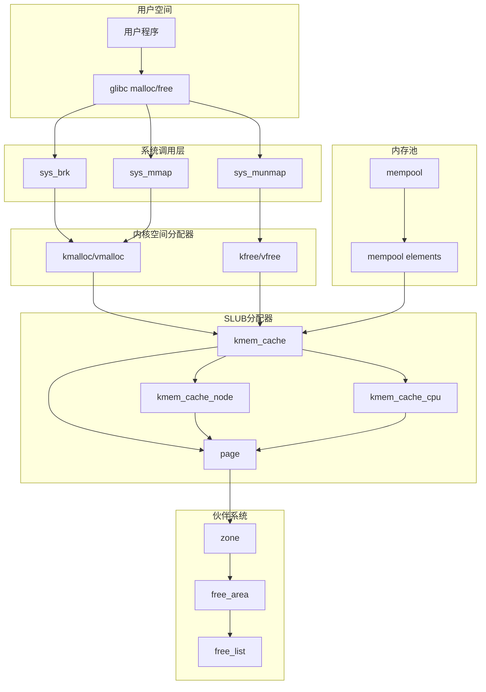
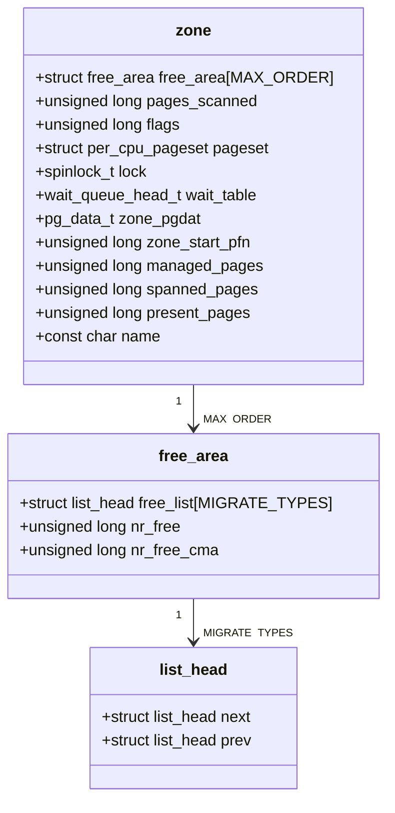
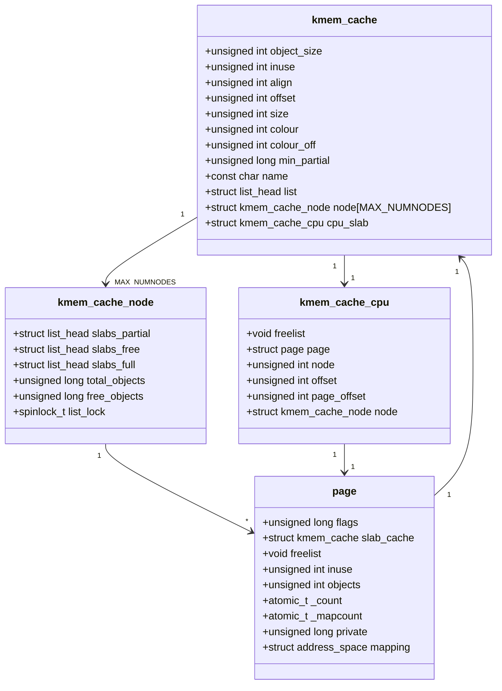
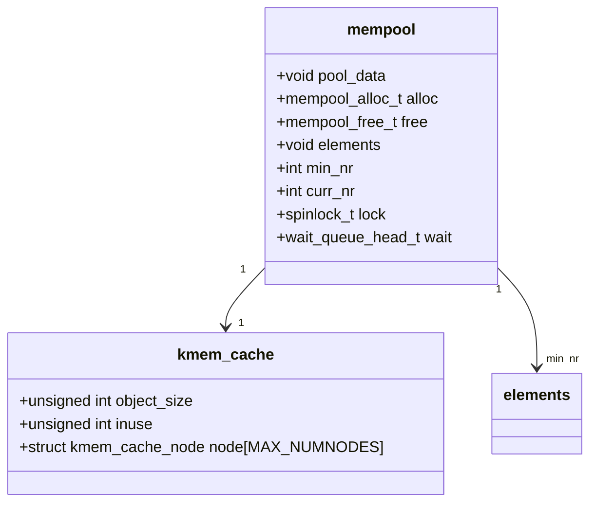
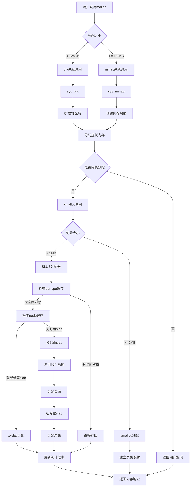
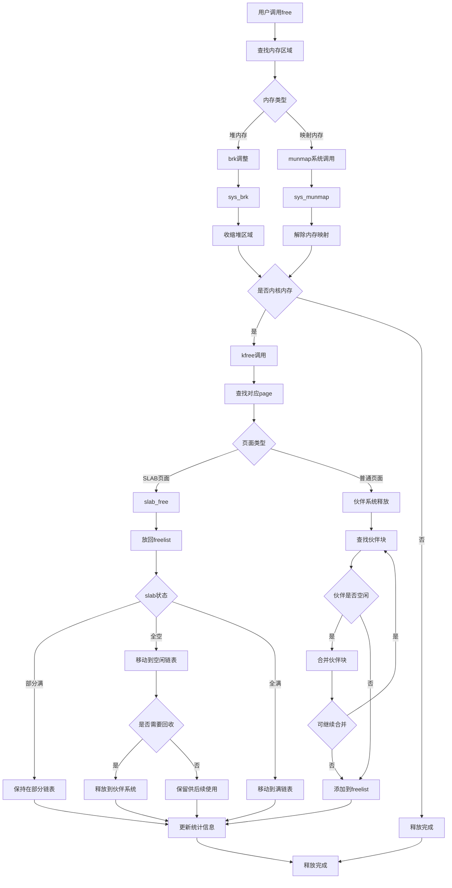
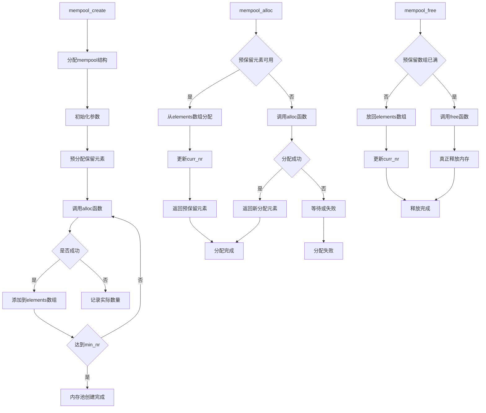
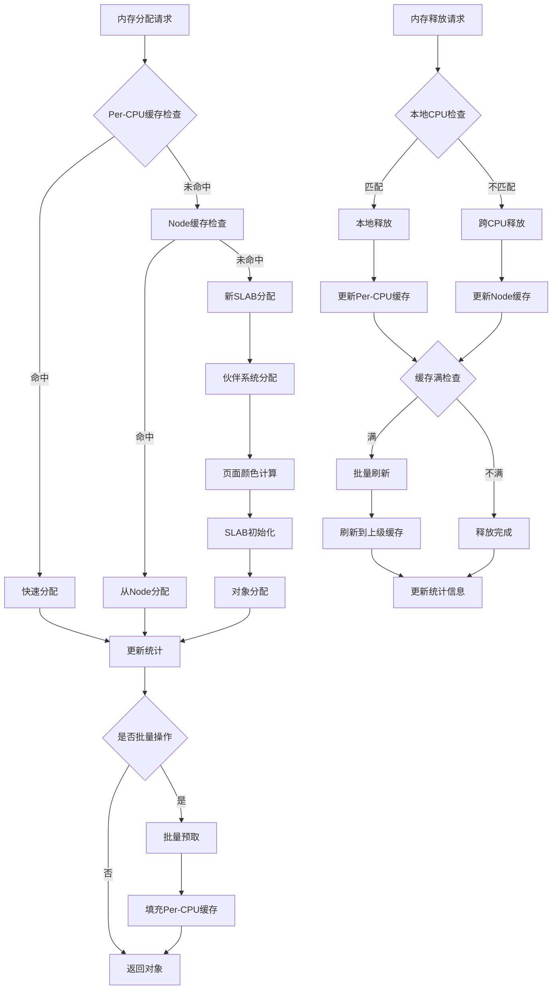

# Linux内存管理结构体关系流程图

## 🏗️ 核心结构体关系图



## 📊 详细结构体字段关系

### 1. 伙伴系统层次结构



### 2. SLUB分配器结构体关系



### 3. 内存池结构体关系



## 🔄 内存分配流程图



## 🗑️ 内存释放流程图



## 🏊‍♂️ 内存池工作流程图



## 📈 性能优化机制流程



## 🔍 调试和监控流程

```mermaid
flowchart TD
    A[内存调试启动] --> B{调试类型}
    
    B -->|SLAB调试| C[启用SLUB_DEBUG]
    B -->|泄漏检测| D[启用DEBUG_KMEMLEAK]
    B -->|页面投毒| E[启用PAGE_POISONING]
    
    C --> F[跟踪SLAB分配]
    D --> G[跟踪未释放对象]
    E --> H[填充释放页面]
    
    F --> I[/proc/slabinfo]
    G --> J[/sys/kernel/debug/kmemleak]
    H --> K[检测非法访问]
    
    L[性能监控] --> M[内存使用统计]
    M --> N[/proc/meminfo]
    M --> O[/proc/buddyinfo]
    M --> P[/proc/pid/smaps]
    
    N --> Q[系统内存概览]
    O --> R[伙伴系统状态]
    P --> S[进程内存详情]
    
    Q --> T[分析报告生成]
    R --> T
    S --> T
    
    I --> U[SLAB缓存分析]
    J --> V[内存泄漏报告]
    K --> W[访问错误报告]
    
    U --> X[问题定位]
    V --> X
    W --> X
    T --> Y[性能优化建议]
```

这个流程图详细展示了Linux内存管理中各个结构体之间的关系，以及内存分配和释放的完整流程。从用户空间的malloc到底层的伙伴系统，每一层的交互和数据结构都清晰可见，有助于深入理解Linux内存管理的工作原理。