# Linux 文件系统详解

> 参考书目：《Linux内核设计与实现》、《图解Linux内核 基于6.x》

---

## 一、文件系统概述

### 1.1 什么是文件系统

文件系统是操作系统用于管理存储设备上数据的方法和结构。它提供了：
- 文件的创建、删除、读取、写入
- 目录的创建、删除、遍历
- 空间管理和分配
- 权限控制
- 数据持久化

### 1.2 文件系统的层次结构

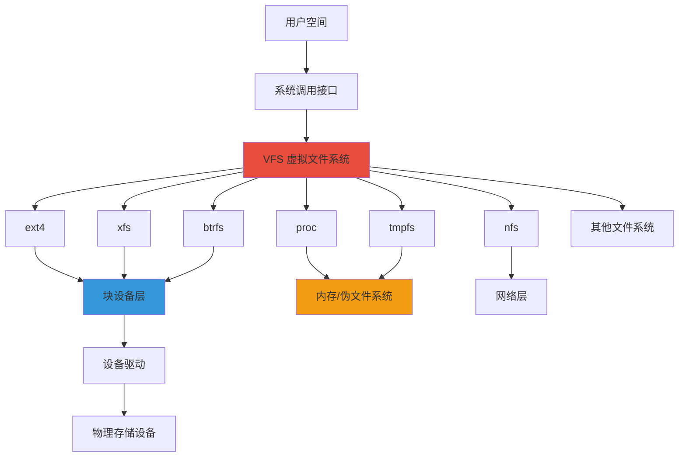

### 1.3 文件系统类型分类

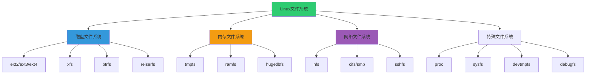

---

## 二、VFS（虚拟文件系统）

### 2.1 VFS 架构

VFS（Virtual File System）是 Linux 内核提供的抽象层，使得用户程序可以使用统一的接口访问不同类型的文件系统。

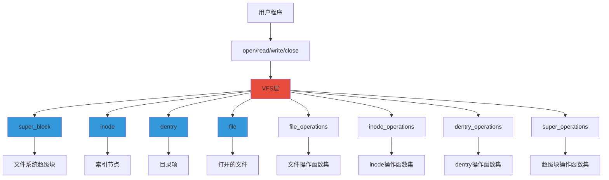

### 2.2 VFS 核心数据结构

#### 2.2.1 super_block（超级块）

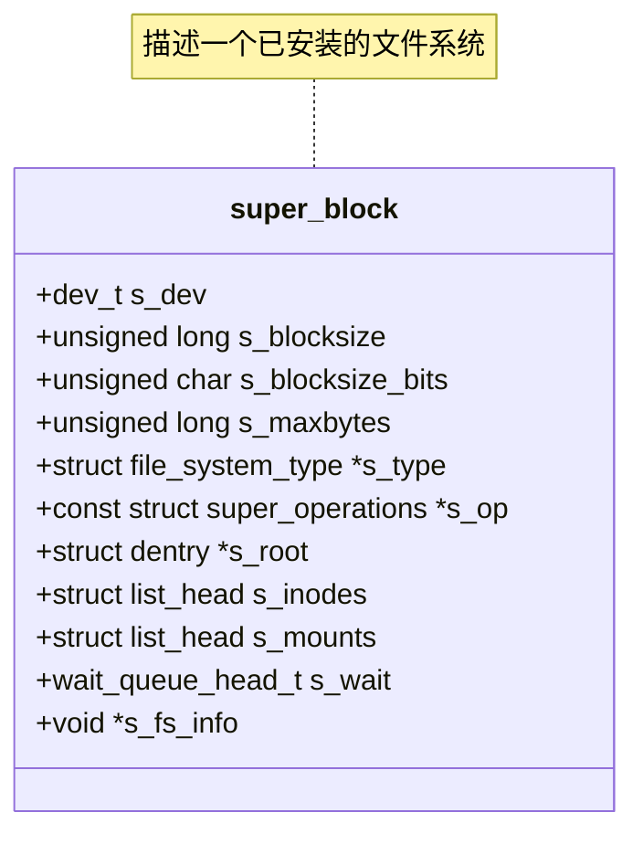

#### 2.2.2 inode（索引节点）

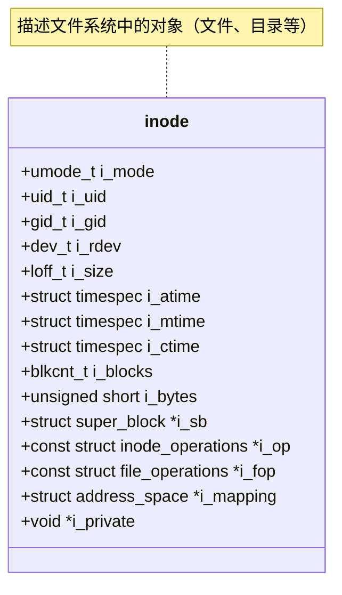

#### 2.2.3 dentry（目录项）

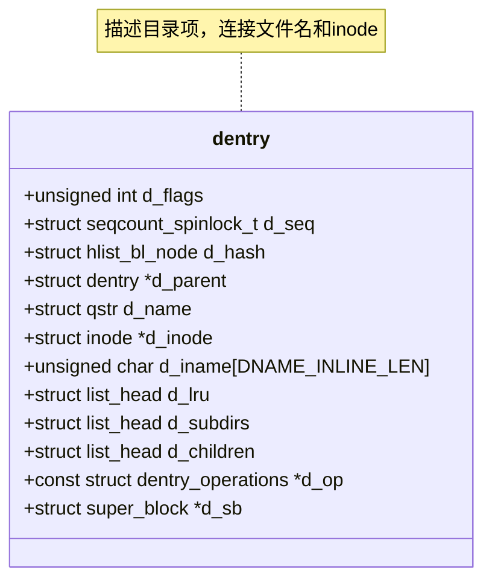

#### 2.2.4 file（打开的文件）

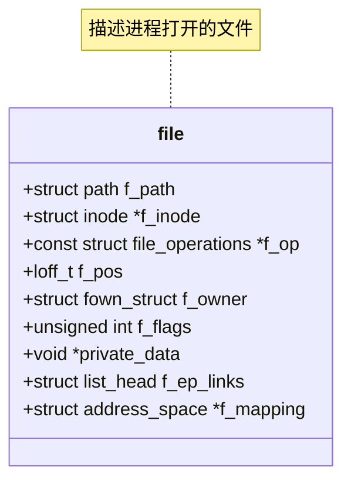

### 2.3 VFS 对象关系图

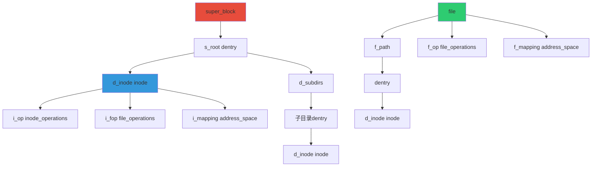

---

## 三、文件系统注册与挂载

### 3.1 文件系统注册流程

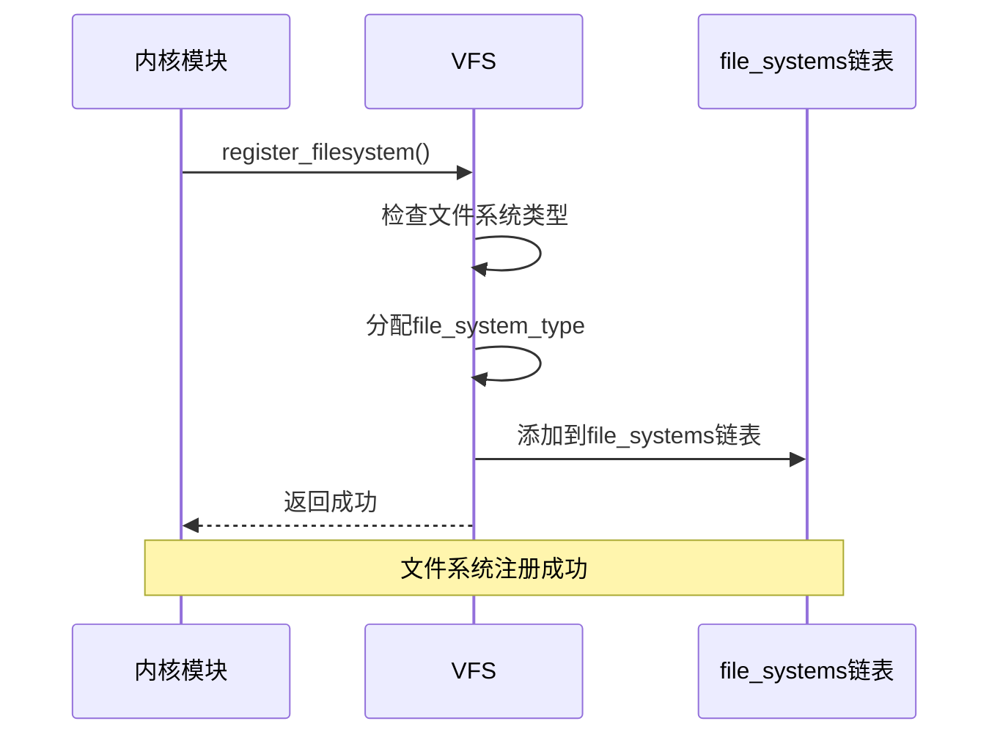

### 3.2 挂载流程

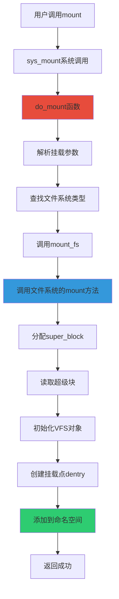

### 3.3 挂载类型

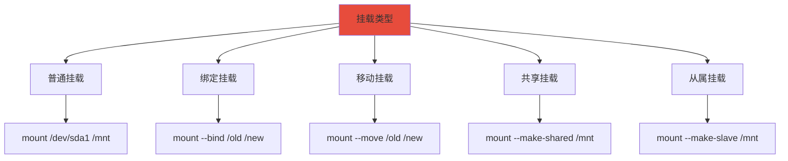

---

## 四、ext4 文件系统

### 4.1 ext4 特性

ext4 是 Linux 上最常用的文件系统之一，具有以下特性：


### 4.2 ext4 磁盘布局

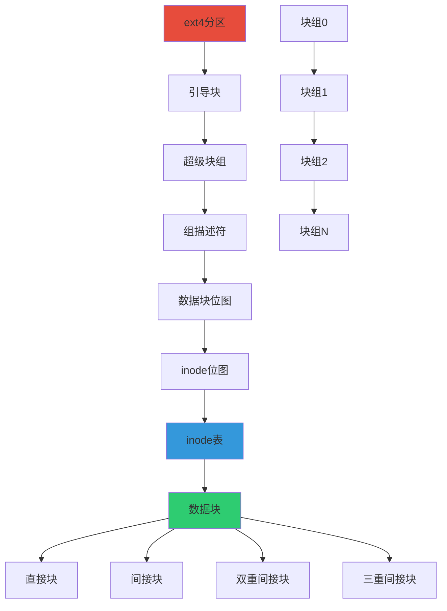

### 4.3 ext4 inode 结构

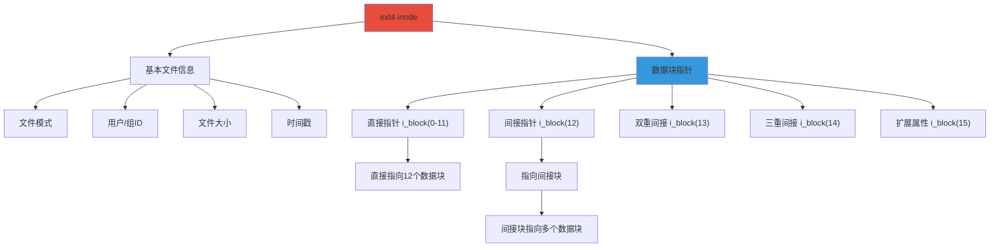

### 4.4 ext4 文件查找流程

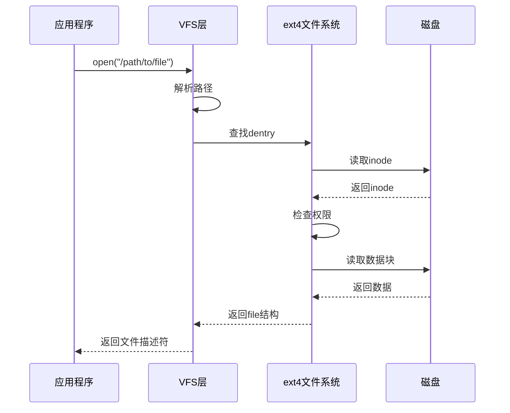

---

## 五、文件操作

### 5.1 文件打开流程

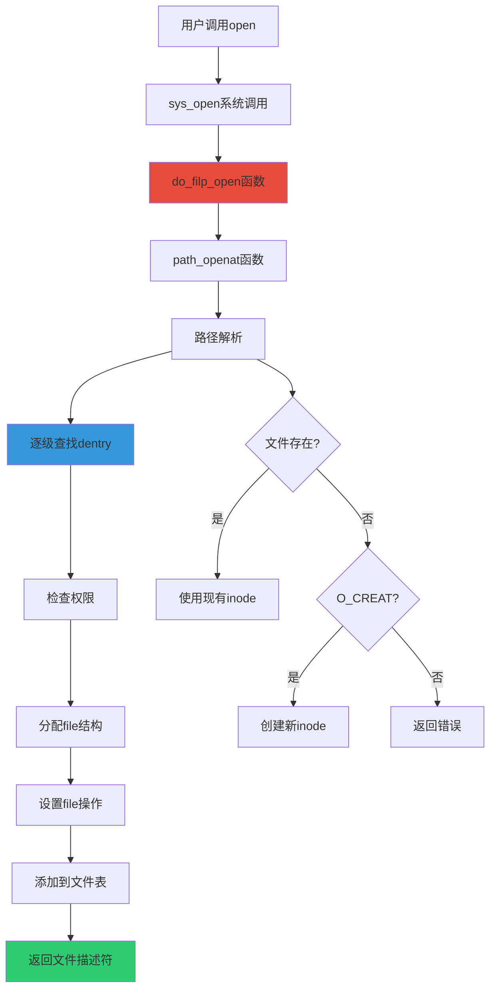

### 5.2 文件读写流程

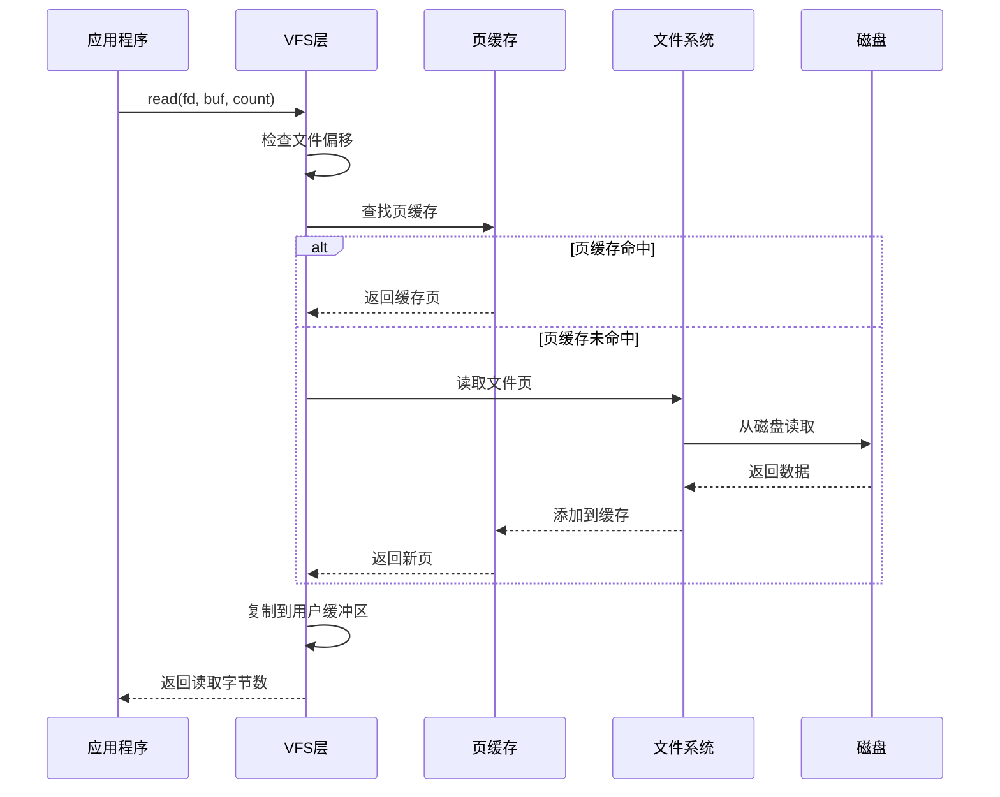

### 5.3 file_operations 结构

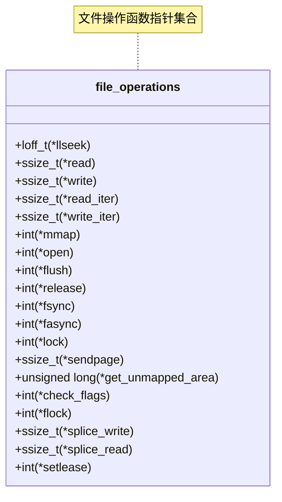

---

## 六、目录操作

### 6.1 目录结构

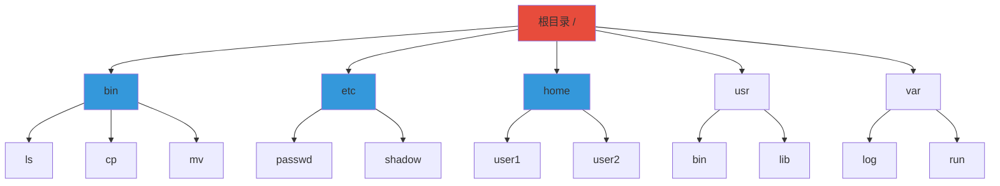

### 6.2 目录查找流程

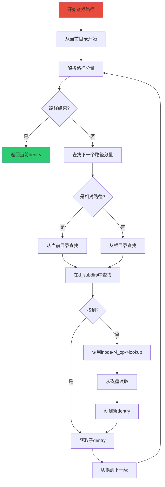

### 6.3 dentry 缓存

```mermaid
graph TB
    A[dentry缓存] --> B[哈希表]
    B --> C[dentry哈希链表]
    C --> D[dentry1]
    C --> E[dentry2]
    C --> F[dentry3]
    
    A --> G[LRU链表]
    G --> H[最近使用的dentry]
    G --> I[未使用的dentry]
    
    D --> D1[d_inode]
    D --> D2[d_parent]
    D --> D3[d_subdirs]
    
    style A fill:#e74c3c
    style B fill:#3498db
    style G fill:#f39c12
```

---

## 七、缓存机制

### 7.1 页缓存（Page Cache）

```mermaid
graph TB
    A[页缓存] --> B[address_space]
    B --> C[page_tree]
    C --> D[页哈希树]
    
    D --> E[page1]
    D --> F[page2]
    D --> G[page3]
    
    E --> E1[映射到文件偏移]
    F --> F1[映射到文件偏移]
    G --> G1[映射到文件偏移]
    
    A --> H[LRU链表]
    H --> I[活跃页链表]
    H --> J[非活跃页链表]
    
    style A fill:#e74c3c
    style D fill:#3498db
    style H fill:#f39c12
```

### 7.2 inode 缓存

```mermaid
graph TB
    A[inode缓存] --> B[inode哈希表]
    B --> C[inode链表]
    C --> D[inode1]
    C --> E[inode2]
    C --> F[inode3]
    
    A --> G[inode链表]
    G --> H[正在使用的inode]
    G --> I[未使用的inode]
    G --> J[脏inode]
    
    D --> D1[i_hash]
    D --> D2[i_list]
    D --> D3[i_sb]
    
    style A fill:#e74c3c
    style B fill:#3498db
    style G fill:#f39c12
```

### 7.3 dentry 缓存

```mermaid
graph TB
    A[dentry缓存] --> B[dentry哈希表]
    B --> C[dentry链表]
    C --> D[dentry1]
    C --> E[dentry2]
    
    A --> F[dentry LRU链表]
    F --> G[未使用的dentry]
    
    A --> H[未使用的dentry链表]
    H --> I[等待释放的dentry]
    
    style A fill:#e74c3c
    style B fill:#3498db
    style F fill:#f39c12
```

---

## 八、文件系统相关系统调用

### 8.1 文件操作系统调用

| 系统调用 | 功能 |
|----------|------|
| `open()` | 打开或创建文件 |
| `close()` | 关闭文件 |
| `read()` | 从文件读取数据 |
| `write()` | 向文件写入数据 |
| `lseek()` | 设置文件偏移量 |
| `stat()` / `fstat()` | 获取文件状态 |
| `truncate()` / `ftruncate()` | 截断文件 |
| `ioctl()` | 设备控制操作 |
| `mmap()` | 内存映射文件 |

### 8.2 目录操作系统调用

| 系统调用 | 功能 |
|----------|------|
| `mkdir()` | 创建目录 |
| `rmdir()` | 删除目录 |
| `opendir()` | 打开目录 |
| `readdir()` | 读取目录项 |
| `closedir()` | 关闭目录 |
| `chdir()` | 改变当前工作目录 |
| `getcwd()` | 获取当前工作目录 |

### 8.3 文件属性系统调用

| 系统调用 | 功能 |
|----------|------|
| `chmod()` / `fchmod()` | 修改文件权限 |
| `chown()` / `fchown()` | 修改文件所有者 |
| `utime()` | 修改文件时间戳 |
| `access()` | 检查文件访问权限 |
| `link()` | 创建硬链接 |
| `unlink()` | 删除链接 |
| `symlink()` | 创建符号链接 |
| `readlink()` | 读取符号链接 |

### 8.4 文件系统操作系统调用

| 系统调用 | 功能 |
|----------|------|
| `mount()` | 挂载文件系统 |
| `umount()` | 卸载文件系统 |
| `sync()` | 同步文件系统缓存 |
| `fsync()` / `fdatasync()` | 同步文件数据 |
| `statfs()` / `fstatfs()` | 获取文件系统状态 |

---

## 九、特殊文件系统

### 9.1 proc 文件系统

```mermaid
graph TB
    A[proc文件系统] --> B["proc挂载点 /proc"]
    B --> C[进程信息]
    C --> C1["进程目录 /proc/PID"]
    C1 --> C2[cmdline]
    C1 --> C3[status]
    C1 --> C4[maps]
    C1 --> C5[fd]
    
    B --> D[系统信息]
    D --> D1["cpuinfo"]
    D --> D2["meminfo"]
    D --> D3["version"]
    D --> D4["uptime"]
    
    B --> E[内核参数]
    E --> E1["sys目录 /proc/sys"]
    E1 --> E2[net]
    E1 --> E3[vm]
    E1 --> E4[kernel]
    
    style A fill:#e74c3c
    style B fill:#3498db
```

### 9.2 sysfs 文件系统

```mermaid
graph TB
    A[sysfs文件系统] --> B["sysfs挂载点 /sys"]
    B --> C[设备信息]
    C --> C1["devices目录"]
    C --> C2["class目录"]
    C --> C3["block目录"]
    
    B --> D[内核对象]
    D --> D1["kernel目录"]
    D --> D2["module目录"]
    D --> D3["fs目录"]
    
    B --> E[电源管理]
    E --> E1["power目录"]
    
    B --> F[固件信息]
    F --> F1["firmware目录"]
    
    style A fill:#e74c3c
    style B fill:#3498db
```

### 9.3 tmpfs 文件系统

```mermaid
graph TB
    A[tmpfs] --> B[基于内存的文件系统]
    B --> C[数据存储在RAM]
    B --> D[支持swap]
    B --> E[动态调整大小]
    B --> F[速度快]
    B --> G[断电数据丢失]
    
    C --> C1[不使用磁盘I/O]
    E --> E1[根据使用情况调整]
    
    style A fill:#e74c3c
    style B fill:#3498db
```

---

## 十、文件系统调试与分析

### 10.1 常用命令

```mermaid
graph TB
    A[文件系统工具] --> B[df]
    A --> C[du]
    A --> D[lsblk]
    A --> E[mount]
    A --> F[umount]
    A --> G[fsck]
    A --> H[tune2fs]
    A --> I[dumpe2fs]
    A --> J[debugfs]
    
    B --> B1[查看磁盘使用情况]
    C --> C1[查看目录大小]
    D --> D1[查看块设备]
    E --> E1[挂载文件系统]
    F --> F1[卸载文件系统]
    G --> G1[检查修复文件系统]
    H --> H1[调整ext4参数]
    I --> I1[查看ext4信息]
    J --> J1[调试ext4文件系统]
    
    style A fill:#e74c3c
    style G fill:#3498db
```

### 10.2 /proc 文件系统信息

```mermaid
graph TB
    A["proc文件系统"] --> B["mounts文件"]
    B --> B1[已挂载的文件系统]

    A --> C["filesystems文件"]
    C --> C1[支持的文件系统类型]

    A --> D["meminfo文件"]
    D --> D1[内存和缓存信息]

    A --> E["sys/fs目录"]
    E --> E1[文件系统参数]

    style A fill:#2ecc71
    style B fill:#3498db
    style C fill:#3498db
```

### 10.3 文件系统性能分析

```mermaid
graph TB
    A[性能分析] --> B[iostat]
    A --> C[vmstat]
    A --> D[slabtop]
    A --> E[perf]
    
    B --> B1[磁盘I/O统计]
    C --> C1[虚拟内存统计]
    D --> D1[内核slab缓存]
    E --> E1[性能分析工具]
    
    style A fill:#e74c3c
    style E fill:#3498db
```

---

## 十一、文件系统比较

### 11.1 常见文件系统对比

| 特性 | ext4 | xfs | btrfs |
|------|------|-----|-------|
| 最大文件大小 | 16TB | 8EB | 16EB |
| 最大卷大小 | 1EB | 16EB | 16EB |
| 日志功能 | 是 | 是 | 是 |
| 快照 | 否 | 是 | 是 |
| 压缩 | 否 | 否 | 是 |
| 检查速度 | 快 | 快 | 较慢 |
| 碎片整理 | 支持 | 支持 | 自动 |
| 用途 | 通用 | 大文件 | 高级功能 |

### 11.2 文件系统选择建议

```mermaid
graph TB
    A[文件系统选择] --> B{使用场景}
    
    B --> C[通用桌面/服务器]
    C --> C1[ext4]
    C1 --> C2[成熟稳定]
    C1 --> C3[工具完善]
    
    B --> D[大文件存储]
    D --> D1[xfs]
    D1 --> D2[高性能]
    D1 --> D3[可扩展性]
    
    B --> E[需要快照]
    E --> E1[btrfs]
    E1 --> E2[高级功能]
    E1 --> E3[快照/压缩]
    
    B --> F[嵌入式系统]
    F --> F1[ext2]
    F1 --> F2[无日志]
    F1 --> F3[简单高效]
    
    style A fill:#e74c3c
    style C1 fill:#3498db
    style D1 fill:#f39c12
    style E1 fill:#2ecc71
```

---

## 十二、总结

### 12.1 文件系统核心概念

1. **VFS（虚拟文件系统）**：提供统一的文件系统接口
2. **核心数据结构**：super_block、inode、dentry、file
3. **文件系统类型**：ext4、xfs、btrfs、proc、sysfs等
4. **文件操作**：打开、读写、关闭、映射等
5. **缓存机制**：页缓存、inode缓存、dentry缓存
6. **特殊文件系统**：proc、sysfs、tmpfs等

### 12.2 学习要点

```mermaid
mindmap
  root((文件系统))
    VFS
      super_block
      inode
      dentry
      file
      file_operations
    ext4
      磁盘布局
      inode结构
      数据块指针
      日志功能
    操作
      文件打开
      文件读写
      目录查找
      路径解析
    缓存
      页缓存
      inode缓存
      dentry缓存
      回写机制
    特殊文件系统
      proc
      sysfs
      tmpfs
      debugfs
    系统调用
      文件操作
      目录操作
      属性操作
      挂载操作
```

---

## 参考资源

- 《Linux内核设计与实现》
- 《图解Linux内核 基于6.x》
- Linux内核源码：https://github.com/torvalds/linux
- Linux内核文档：https://www.kernel.org/doc/html/latest/
- ext4 Wiki：https://ext4.wiki.kernel.org/

---

*文档创建时间：2026年1月17日*
*内核版本参考：Linux 6.x*