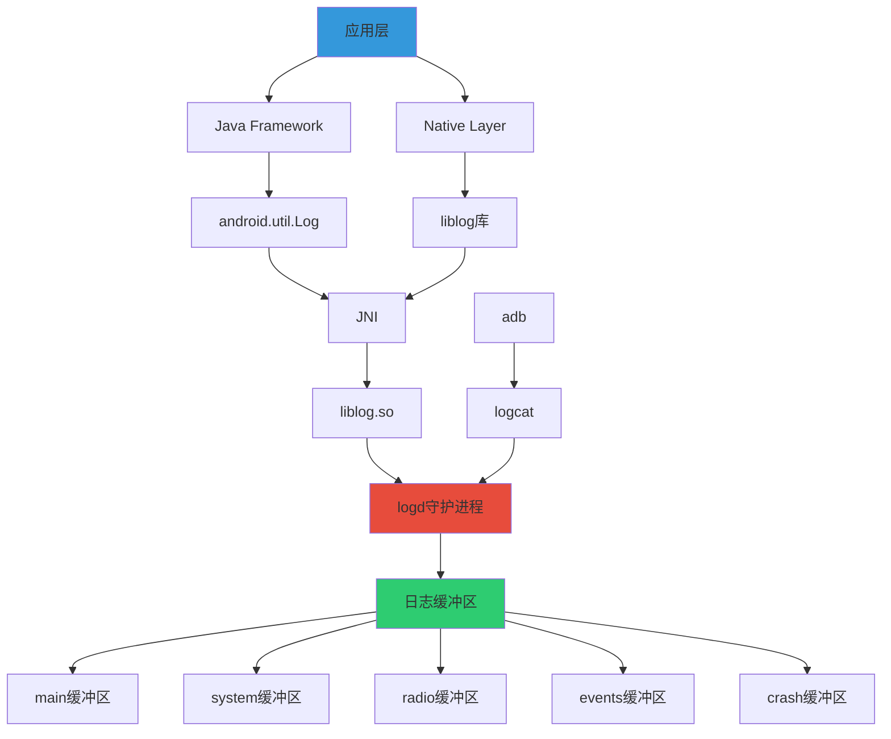
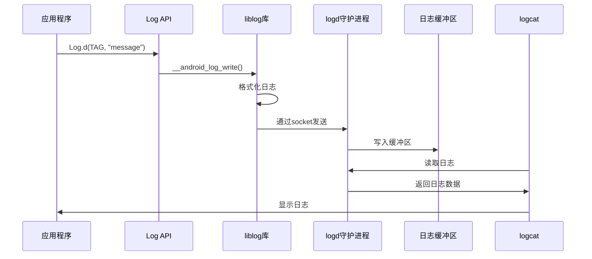
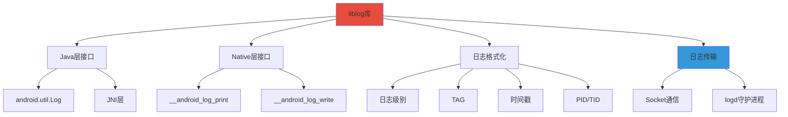
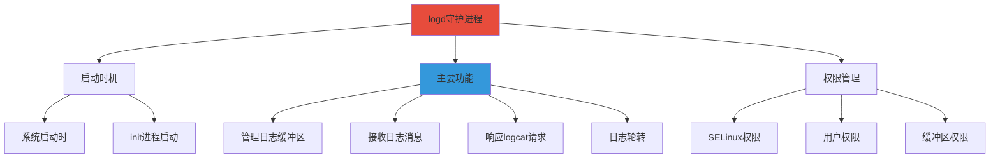
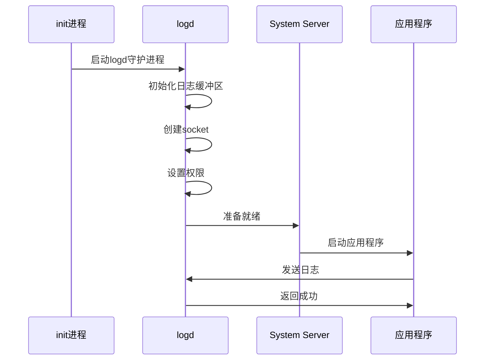
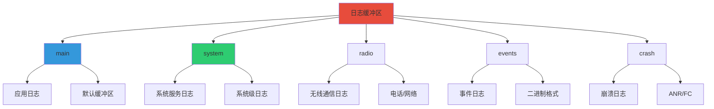

# Android日志机制详解

> 基于 Android 10+ (API Level 29+)
> 参考源码：system/core/liblog, system/core/logd

---

## 📚 目录

- [一、Android日志系统架构](#一android日志系统架构)
- [二、liblog库详解](#二liblog库详解)
- [三、logd守护进程](#三logd守护进程)
- [四、日志缓冲区](#四日志缓冲区)
- [五、Log API使用](#五log-api使用)
- [六、logcat命令详解](#六logcat命令详解)
- [七、日志分析与调试](#七日志分析与调试)

---

## 一、Android日志系统架构

### 1.1 整体架构



### 1.2 日志系统组件

| 组件 | 位置 | 作用 |
|------|------|------|
| **android.util.Log** | Java Framework | Java层日志API |
| **liblog** | system/core/liblog | 日志库，提供C/C++接口 |
| **logd** | system/core/logd | 日志守护进程，管理缓冲区 |
| **logcat** | system/core/logcat | 日志查看工具 |
| **adb** | platform/tools | Android调试桥，转发logcat |

### 1.3 日志流程



---

## 二、liblog库详解

### 2.1 liblog库概述



### 2.2 Native层API

#### 2.2.1 基本API

```c
#include <android/log.h>

// 基本日志输出
int __android_log_print(int prio, const char *tag, const char *fmt, ...);

// 简单日志输出
int __android_log_write(int prio, const char *tag, const char *text);

// 日志级别定义
#define ANDROID_LOG_VERBOSE 2
#define ANDROID_LOG_DEBUG   3
#define ANDROID_LOG_INFO    4
#define ANDROID_LOG_WARN    5
#define ANDROID_LOG_ERROR   6
#define ANDROID_LOG_FATAL   7
```

#### 2.2.2 使用示例

```c
#include <android/log.h>

#define LOG_TAG "NativeCode"
#define LOGV(...) __android_log_print(ANDROID_LOG_VERBOSE, LOG_TAG, __VA_ARGS__)
#define LOGD(...) __android_log_print(ANDROID_LOG_DEBUG,   LOG_TAG, __VA_ARGS__)
#define LOGI(...) __android_log_print(ANDROID_LOG_INFO,    LOG_TAG, __VA_ARGS__)
#define LOGW(...) __android_log_print(ANDROID_LOG_WARN,    LOG_TAG, __VA_ARGS__)
#define LOGE(...) __android_log_print(ANDROID_LOG_ERROR,   LOG_TAG, __VA_ARGS__)

void example_function() {
    LOGV("Verbose message: %d", value);
    LOGD("Debug message: %s", string);
    LOGI("Info message");
    LOGW("Warning message");
    LOGE("Error message: %d", error_code);
}
```

### 2.3 Java层API

#### 2.3.1 Log类方法

```java
package android.util;

public final class Log {
    public static int v(String tag, String msg);
    public static int v(String tag, String msg, Throwable tr);

    public static int d(String tag, String msg);
    public static int d(String tag, String msg, Throwable tr);

    public static int i(String tag, String msg);
    public static int i(String tag, String msg, Throwable tr);

    public static int w(String tag, String msg);
    public static int w(String tag, String msg, Throwable tr);
    public static int w(String tag, Throwable tr);

    public static int e(String tag, String msg);
    public static int e(String tag, String msg, Throwable tr);

    public static int wtf(String tag, String msg);
    public static int wtf(String tag, String msg, Throwable tr);
    public static int wtf(String tag, Throwable tr);

    public static boolean isLoggable(String tag, int level);
}
```

#### 2.3.2 使用示例

```java
import android.util.Log;

public class MyActivity extends Activity {
    private static final String TAG = "MyActivity";

    @Override
    protected void onCreate(Bundle savedInstanceState) {
        super.onCreate(savedInstanceState);

        // 基本日志
        Log.v(TAG, "Verbose message");
        Log.d(TAG, "Debug message");
        Log.i(TAG, "Info message");
        Log.w(TAG, "Warning message");
        Log.e(TAG, "Error message");

        // 带异常的日志
        try {
            // 某些操作
        } catch (Exception e) {
            Log.e(TAG, "Exception occurred", e);
        }

        // 条件日志
        if (Log.isLoggable(TAG, Log.DEBUG)) {
            Log.d(TAG, "This will only be logged if DEBUG is enabled");
        }
    }
}
```

### 2.4 日志格式

#### 2.4.1 日志消息结构

```
日期 时间 PID TID 级别 TAG: 消息
|   |   |   |   |   |    |
|   |   |   |   |   |    +-- 日志消息
|   |   |   |   |   +------- TAG标签
|   |   |   |   +----------- 日志级别
|   |   |   +--------------- 线程ID
|   |   +------------------- 进程ID
|   +----------------------- 时间
+--------------------------- 日期
```

#### 2.4.2 日志格式示例

```
01-20 10:30:45.123  1234  5678 D MyTag: Debug message
01-20 10:30:45.124  1234  5678 I MyTag: Info message
01-20 10:30:45.125  1234  5678 W MyTag: Warning message
01-20 10:30:45.126  1234  5678 E MyTag: Error message
```

---

## 三、logd守护进程

### 3.1 logd概述



### 3.2 logd启动流程



### 3.3 logd配置

#### 3.3.1 logd.rc配置

```rc
# system/core/rootdir/init.rc
service logd /system/bin/logd
    socket logd stream 0666 logd logd
    socket logdr seqpacket 0666 logd logd
    socket logdw dgram 0666 logd logd
    disabled
    oneshot

on property:sys.logd.enable=1
    start logd
```

#### 3.3.2 缓冲区配置

```c
// system/core/liblog/logd_write.c
#define LOG_BUFFER_SIZE (256 * 1024)  // 256KB

// 可通过系统属性配置
// ro.logd.size
// ro.logd.size.main
// ro.logd.size.system
// ro.logd.size.radio
// ro.logd.size.events
// ro.logd.size.crash
```

---

## 四、日志缓冲区

### 4.1 缓冲区类型



### 4.2 缓冲区详情

| 缓冲区 | 默认大小 | 用途 | 权限要求 |
|--------|----------|------|----------|
| **main** | 256KB | 应用主日志 | 普通应用 |
| **system** | 256KB | 系统服务日志 | 需要权限 |
| **radio** | 256KB | 无线通信日志 | 需要权限 |
| **events** | 256KB | 事件日志（二进制） | 需要权限 |
| **crash** | 256KB | 崩溃日志 | 需要权限 |

### 4.3 缓冲区管理

#### 4.3.1 缓冲区大小配置

```bash
# 查看当前缓冲区大小
adb logcat -g

# 输出示例：
# main: 256KB
# system: 256KB
# radio: 256KB
# events: 256KB
# crash: 256KB

# 修改缓冲区大小（需要root）
adb shell logcat -G 512K

# 指定缓冲区
adb shell logcat -b main -G 512K
```

#### 4.3.2 缓冲区清空

```bash
# 清空所有缓冲区
adb logcat -c

# 清空特定缓冲区
adb logcat -b main -c
adb logcat -b system -c
```

---

## 五、Log API使用

### 5.1 Java层最佳实践

#### 5.1.1 TAG定义规范

```java
public class MyActivity extends Activity {
    // 推荐：使用类名作为TAG
    private static final String TAG = "MyActivity";

    // 或使用简单类名
    private static final String TAG = MyActivity.class.getSimpleName();

    // 不推荐：硬编码字符串
    // private static final String TAG = "MyTag";
}
```

#### 5.1.2 日志级别选择

```java
public class NetworkManager {
    private static final String TAG = "NetworkManager";

    public void connect() {
        Log.v(TAG, "开始连接");  // 详细信息，仅在调试时使用
        Log.d(TAG, "连接参数: " + params);  // 调试信息
        Log.i(TAG, "连接成功");  // 重要信息
        Log.w(TAG, "连接超时，使用缓存");  // 警告信息
        Log.e(TAG, "连接失败", exception);  // 错误信息
        Log.wtf(TAG, "严重错误：数据库损坏");  // 致命错误
    }
}
```

#### 5.1.3 条件日志

```java
public class DataManager {
    private static final String TAG = "DataManager";
    private static final boolean DEBUG = BuildConfig.DEBUG;

    public void processData() {
        // 方式1：使用BuildConfig
        if (DEBUG) {
            Log.d(TAG, "处理数据: " + data);
        }

        // 方式2：使用isLoggable
        if (Log.isLoggable(TAG, Log.DEBUG)) {
            Log.d(TAG, "处理数据: " + data);
        }

        // 方式3：自定义工具类
        Logger.d(TAG, "处理数据: " + data);
    }
}
```

#### 5.1.4 自定义日志工具

```java
public class Logger {
    private static final String TAG = "MyApp";
    private static final boolean DEBUG = BuildConfig.DEBUG;

    public static void d(String tag, String message) {
        if (DEBUG && Log.isLoggable(tag, Log.DEBUG)) {
            Log.d(tag, message);
        }
    }

    public static void i(String tag, String message) {
        if (Log.isLoggable(tag, Log.INFO)) {
            Log.i(tag, message);
        }
    }

    public static void e(String tag, String message, Throwable throwable) {
        if (Log.isLoggable(tag, Log.ERROR)) {
            Log.e(tag, message, throwable);
        }
    }

    // 简化版
    public static void d(String message) {
        d(TAG, message);
    }
}
```

### 5.2 Native层最佳实践

#### 5.2.1 日志宏定义

```c
#include <android/log.h>

#define LOG_TAG "NativeLib"
#define LOGV(...) __android_log_print(ANDROID_LOG_VERBOSE, LOG_TAG, __VA_ARGS__)
#define LOGD(...) __android_log_print(ANDROID_LOG_DEBUG, LOG_TAG, __VA_ARGS__)
#define LOGI(...) __android_log_print(ANDROID_LOG_INFO, LOG_TAG, __VA_ARGS__)
#define LOGW(...) __android_log_print(ANDROID_LOG_WARN, LOG_TAG, __VA_ARGS__)
#define LOGE(...) __android_log_print(ANDROID_LOG_ERROR, LOG_TAG, __VA_ARGS__)

// 带文件名和行号的日志
#define LOGD_EXT(...) \
    __android_log_print(ANDROID_LOG_DEBUG, LOG_TAG, \
        "[%s:%d] " __VA_ARGS__, __FILE__, __LINE__)
```

#### 5.2.2 使用示例

```c
#include <jni.h>
#include <android/log.h>

#define LOG_TAG "JNIDemo"
#define LOGI(...) __android_log_print(ANDROID_LOG_INFO, LOG_TAG, __VA_ARGS__)
#define LOGE(...) __android_log_print(ANDROID_LOG_ERROR, LOG_TAG, __VA_ARGS__)

JNIEXPORT jstring JNICALL
Java_com_example_MainActivity_nativeFunction(JNIEnv *env, jobject thiz) {
    LOGI("Native function called");

    char *message = "Hello from Native!";
    LOGI("Message: %s", message);

    // 错误处理
    int error = some_function();
    if (error != 0) {
        LOGE("Error occurred: %d", error);
        return NULL;
    }

    return (*env)->NewStringUTF(env, message);
}
```

---

## 六、logcat命令详解

### 6.1 基本命令

#### 6.1.1 常用选项

```bash
# 基本用法
adb logcat                          # 查看所有日志
adb logcat -c                       # 清空日志
adb logcat -g                       # 查看缓冲区大小
adb logcat -G <size>                # 设置缓冲区大小

# 输出格式
adb logcat -v brief                 # 简洁格式
adb logcat -v process               # 进程格式
adb logcat -v tag                   # 标签格式
adb logcat -v thread                # 线程格式
adb logcat -v raw                   # 原始格式
adb logcat -v time                  # 时间格式
adb logcat -v threadtime            # 时间+线程格式
adb logcat -v long                  # 长格式
```

#### 6.1.2 缓冲区选择

```bash
# 选择特定缓冲区
adb logcat -b main                  # 主缓冲区
adb logcat -b system                # 系统缓冲区
adb logcat -b radio                 # 无线缓冲区
adb logcat -b events                # 事件缓冲区
adb logcat -b crash                 # 崩溃缓冲区

# 多个缓冲区
adb logcat -b main -b system
adb logcat -b all                   # 所有缓冲区
```

### 6.2 过滤技巧

#### 6.2.1 按级别过滤

```bash
# 显示特定级别及以上
adb logcat *:V                      # 显示所有级别
adb logcat *:D                      # Debug及以上
adb logcat *:I                      # Info及以上
adb logcat *:W                      # Warn及以上
adb logcat *:E                      # Error及以上

# 组合过滤
adb logcat MyTag:D *:S              # 只显示MyTag的Debug日志
adb logcat MyTag:I OtherTag:W *:S   # 多个标签组合
```

#### 6.2.2 按标签过滤

```bash
# 单个标签
adb logcat -s MyTag                 # 只显示MyTag
adb logcat -s MyTag:I               # MyTag的Info及以上

# 多个标签
adb logcat -s MyTag:I OtherTag:D

# 正则表达式
adb logcat -s MyTag.*:D
```

#### 6.2.3 按进程过滤

```bash
# 按PID过滤
adb logcat --pid=1234

# 按包名过滤（Android 8.0+）
adb logcat --pid=$(adb shell pidof com.example.app)

# 组合使用
adb logcat --pid=1234 MyTag:I
```

### 6.3 高级用法

#### 6.3.1 实时查看

```bash
# 实时查看
adb logcat

# 实时查看并过滤
adb logcat -s MyTag:I

# 实时查看并保存
adb logcat | tee log.txt
```

#### 6.3.2 时间过滤

```bash
# 显示最近N行
adb logcat -t 100

# 持续显示
adb logcat -d                       # 转储并退出
adb logcat -t                       # 转储并退出

# 时间范围
adb logcat -T "01-20 10:00:00.000" # 从指定时间开始
```

#### 6.3.3 保存和重放

```bash
# 保存到文件
adb logcat > log.txt

# 保存二进制格式
adb logcat -B > log.bin

# 重放日志
adb logcat -R log.bin
```

### 6.4 常用脚本

#### 6.4.1 日志收集脚本

```bash
#!/bin/bash
# collect_log.sh

LOG_DIR="./logs"
TIMESTAMP=$(date +"%Y%m%d_%H%M%S")
LOG_FILE="${LOG_DIR}/log_${TIMESTAMP}.txt"

mkdir -p ${LOG_DIR}

echo "Collecting logs to ${LOG_FILE}..."

# 清空旧日志
adb logcat -c

# 收集日志
adb logcat -v threadtime > ${LOG_FILE} &

echo "Press Ctrl+C to stop collecting..."

# 等待用户中断
wait

echo "Logs saved to ${LOG_FILE}"
```

#### 6.4.2 日志过滤脚本

```bash
#!/bin/bash
# filter_log.sh

TAG="MyApp"
LEVEL="I"
LOG_FILE="log.txt"

# 过滤日志
adb logcat -s ${TAG}:${LEVEL} | tee ${LOG_FILE}

# 或者使用grep
adb logcat | grep "${TAG}" | tee ${LOG_FILE}
```

---

## 七、日志分析与调试

### 7.1 崩溃日志分析

#### 7.1.1 Java崩溃日志

```
--------- beginning of crash
01-20 10:30:45.123  1234  1234 E AndroidRuntime: FATAL EXCEPTION: main
01-20 10:30:45.123  1234  1234 E AndroidRuntime: Process: com.example.app, PID: 1234
01-20 10:30:45.123  1234  1234 E AndroidRuntime: java.lang.NullPointerException: Attempt to invoke virtual method 'java.lang.String java.lang.Object.toString()' on a null object reference
01-20 10:30:45.123  1234  1234 E AndroidRuntime:    at com.example.app.MainActivity.onCreate(MainActivity.java:45)
01-20 10:30:45.123  1234  1234 E AndroidRuntime:    at android.app.Activity.performCreate(Activity.java:7802)
01-20 10:30:45.123  1234  1234 E AndroidRuntime:    at android.app.Instrumentation.callActivityOnCreate(Instrumentation.java:1299)
01-20 10:30:45.123  1234  1234 E AndroidRuntime:    at android.app.ActivityThread.performLaunchActivity(ActivityThread.java:3336)
01-20 10:30:45.123  1234  1234 E AndroidRuntime:    at android.app.ActivityThread.handleLaunchActivity(ActivityThread.java:3486)
01-20 10:30:45.123  1234  1234 E AndroidRuntime:    at android.app.servertransaction.LaunchActivityItem.execute(LaunchActivityItem.java:83)
```

#### 7.1.2 Native崩溃日志

```
--------- beginning of crash
01-20 10:30:45.123  1234  1234 F DEBUG   : *** *** *** *** *** *** *** *** *** *** *** *** *** *** ***
01-20 10:30:45.123  1234  1234 F DEBUG   : Build fingerprint: '...'
01-20 10:30:45.123  1234  1234 F DEBUG   : Revision: '0'
01-20 10:30:45.123  1234  1234 F DEBUG   : ABI: 'arm64'
01-20 10:30:45.123  1234  1234 F DEBUG   : pid: 1234, tid: 5678, name: ThreadName  >>> com.example.app <<<
01-20 10:30:45.123  1234  1234 F DEBUG   : signal 11 (SIGSEGV), code 1 (SEGV_MAPERR), fault addr 0x0
01-20 10:30:45.123  1234  1234 F DEBUG   :     x0  0000000000000000  x1  0000000000000001
01-20 10:30:45.123  1234  1234 F DEBUG   :     x2  0000000000000002  x3  0000000000000003
01-20 10:30:45.123  1234  1234 F DEBUG   :     x4  0000000000000004  x5  0000000000000005
01-20 10:30:45.123  1234  1234 F DEBUG   :     x6  0000000000000006  x7  0000000000000007
01-20 10:30:45.123  1234  1234 F DEBUG   :     x8  0000000000000008  x9  0000000000000009
01-20 10:30:45.123  1234  1234 F DEBUG   :     x10 000000000000000a  x11 000000000000000b
01-20 10:30:45.123  1234  1234 F DEBUG   :     x12 000000000000000c  x13 000000000000000d
01-20 10:30:45.123  1234  1234 F DEBUG   :     x14 000000000000000e  x15 000000000000000f
01-20 10:30:45.123  1234  1234 F DEBUG   :     x16 0000000000000010  x17 0000000000000011
01-20 10:30:45.123  1234  1234 F DEBUG   :     x18 0000000000000012  x19 0000000000000013
01-20 10:30:45.123  1234  1234 F DEBUG   :     x20 0000000000000014  x21 0000000000000015
01-20 10:30:45.123  1234  1234 F DEBUG   :     x22 0000000000000016  x23 0000000000000017
01-20 10:30:45.123  1234  1234 F DEBUG   :     x24 0000000000000018  x25 0000000000000019
01-20 10:30:45.123  1234  1234 F DEBUG   :     x26 000000000000001a  x27 000000000000001b
01-20 10:30:45.123  1234  1234 F DEBUG   :     x28 000000000000001c  x29 000000000000001d
01-20 10:30:45.123  1234  1234 F DEBUG   :     x30 000000000000001e  x31 000000000000001f
01-20 10:30:45.123  1234  1234 F DEBUG   :     sp  0000007ffe7b9e10  lr  0000007ffe7b9e00
01-20 10:30:45.123  1234  1234 F DEBUG   :     pc  0000007ffe7b9e00  pstate 0000000080000000
01-20 10:30:45.123  1234  1234 F DEBUG   : backtrace:
01-20 10:30:45.123  1234  1234 F DEBUG   :     #00 pc 0000000000012345  /system/lib64/libnative-lib.so (native_function+128)
01-20 10:30:45.123  1234  1234 F DEBUG   :     #01 pc 0000000000056789  /system/lib64/libnative-lib.so (Java_com_example_MainActivity_nativeMethod+64)
01-20 10:30:45.123  1234  1234 F DEBUG   :     #02 pc 0000000000123456  /system/framework/arm64/boot-framework.oat (offset 0x1000000)
```

### 7.2 ANR日志分析

```
01-20 10:30:45.123  1234  1234 E ActivityManager: ANR in com.example.app
01-20 10:30:45.123  1234  1234 E ActivityManager: PID: 1234
01-20 10:30:45.123  1234  1234 E ActivityManager: Reason: Input dispatching timed out
01-20 10:30:45.123  1234  1234 E ActivityManager: Load: 1.5 / 1.2 / 1.0
01-20 10:30:45.123  1234  1234 E ActivityManager: CPU usage from 0ms to 100ms ago:
01-20 10:30:45.123  1234  1234 E ActivityManager:   50% 1234/com.example.app: 50% user + 0% kernel
01-20 10:30:45.123  1234  1234 E ActivityManager:   30% 5678/system_server: 20% user + 10% kernel
01-20 10:30:45.123  1234  1234 E ActivityManager:   20% 9012/com.android.systemui: 15% user + 5% kernel
01-20 10:30:45.123  1234  1234 E ActivityManager: Stack trace:
01-20 10:30:45.123  1234  1234 E ActivityManager:   at android.os.BinderProxy.transactNative(Native Method)
01-20 10:30:45.123  1234  1234 E ActivityManager:   at android.os.BinderProxy.transact(Binder.java:754)
01-20 10:30:45.123  1234  1234 E ActivityManager:   at android.view.IWindowSession$Stub$Proxy.addToDisplay(IWindowSession.java:733)
```

### 7.3 性能分析

#### 7.3.1 GC日志

```
01-20 10:30:45.123  1234  5678 I art     : Starting a blocking GC Alloc
01-20 10:30:45.234  1234  5678 I art     : Clamp target GC heap from 256MB to 256MB
01-20 10:30:45.345  1234  5678 I art     : Alloc concurrent copying GC freed 1024(10MB) AllocSpace objects, 0(0B) LOS objects, 25% free, 50MB/256MB, paused 123us total 234.567ms
01-20 10:30:45.456  1234  5678 I art     : Starting a blocking GC Explicit
01-20 10:30:45.567  1234  5678 I art     : Explicit concurrent copying GC freed 2048(20MB) AllocSpace objects, 0(0B) LOS objects, 50% free, 100MB/256MB, paused 234us total 345.678ms
```

#### 7.3.2 内存泄漏分析

```bash
# 收集内存信息
adb shell dumpsys meminfo com.example.app

# 收集堆信息
adb shell am dumpheap <pid> /data/local/tmp/heap.hprof

# 分析hprof文件
# 使用Android Studio或MAT工具
```

---

## 总结

### 关键要点

1. **架构理解**：liblog、logd、logcat三者的关系
2. **缓冲区管理**：理解不同缓冲区的用途和权限
3. **API使用**：Java和Native层的日志API
4. **logcat技巧**：熟练掌握过滤和高级用法
5. **日志分析**：能够分析崩溃、ANR等日志

### 最佳实践

1. **合理使用日志级别**：避免过度使用VERBOSE和DEBUG
2. **使用有意义的TAG**：便于过滤和查找
3. **避免敏感信息**：不要记录密码、token等
4. **生产环境优化**：使用条件编译或isLoggable
5. **及时清理日志**：避免缓冲区溢出

### 学习资源

- Android Developer Guide: Debugging with Logcat
- Android Source Code: system/core/liblog
- Android Source Code: system/core/logd
- Android Source Code: system/core/logcat

---

**最后更新时间：** 2026-01-20  
**参考Android版本：** Android 10+ (API Level 29+)