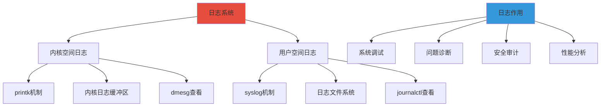
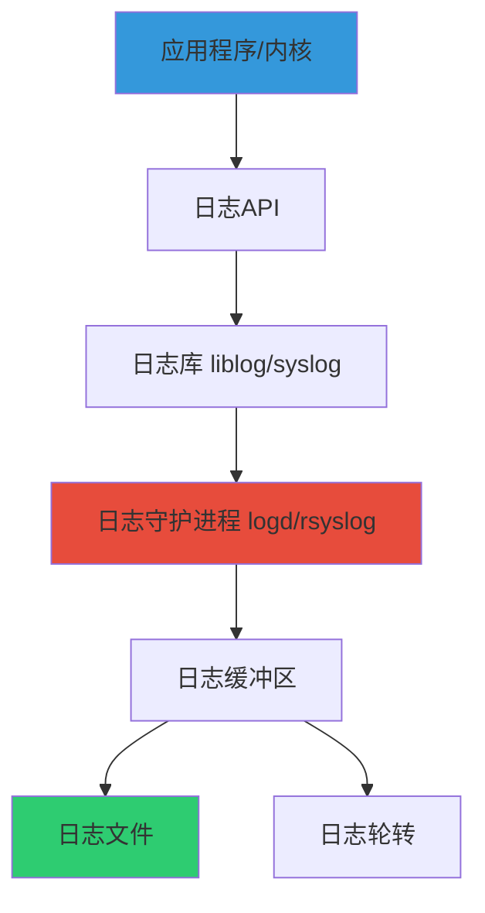
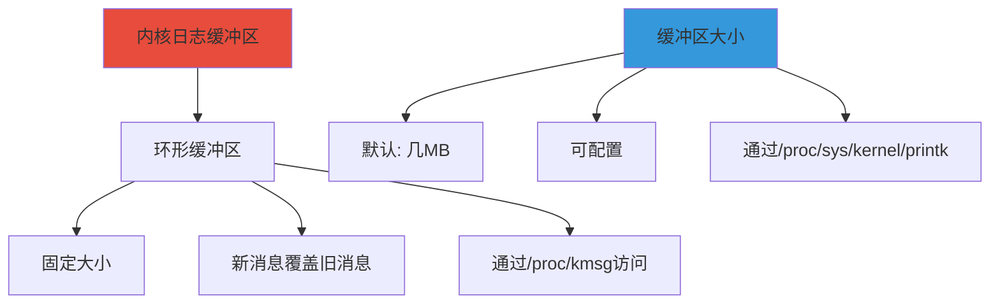
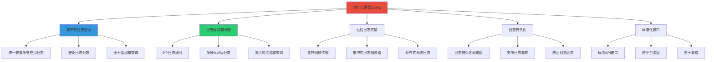
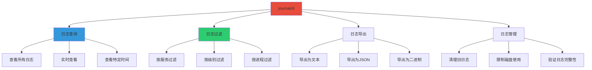
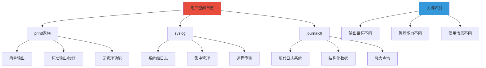
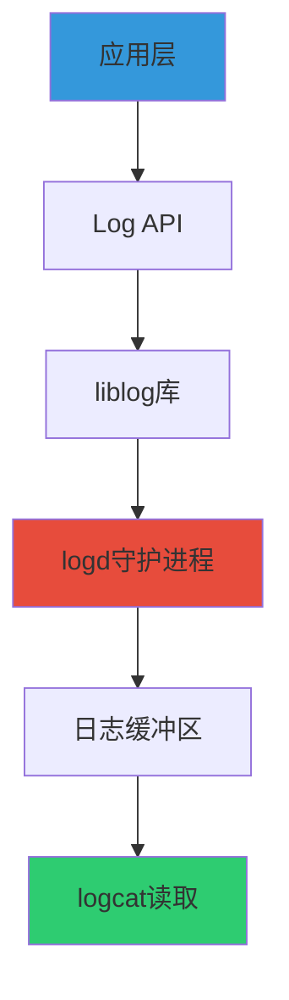
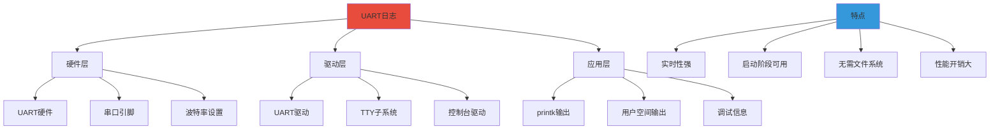

# Linux日志机制深度学习

> 基于 Linux 6.x 内核
> 参考书目：《Linux内核设计与实现》、《深入理解Linux内核》

---

## 📚 目录

- [一、日志系统概述](#一日志系统概述)
- [二、内核空间日志机制](#二内核空间日志机制)
- [三、用户空间日志机制](#三用户空间日志机制)
- [四、日志存储与管理](#四日志存储与管理)
- [五、Android日志机制](#五android日志机制)
- [六、UART日志机制](#六uart日志机制)
- [七、性能优化与最佳实践](#七性能优化与最佳实践)

---

## 一、日志系统概述

### 1.1 日志系统基本概念



### 1.2 日志级别对比

| 级别 | 内核 | 用户 | 含义 | 使用场景 |
|------|------|------|------|----------|
| **0** | KERN_EMERG | LOG_EMERG | 紧急 | 系统不可用 |
| **1** | KERN_ALERT | LOG_ALERT | 警报 | 必须立即采取措施 |
| **2** | KERN_CRIT | LOG_CRIT | 严重 | 严重情况 |
| **3** | KERN_ERR | LOG_ERR | 错误 | 错误情况 |
| **4** | KERN_WARNING | LOG_WARNING | 警告 | 警告情况 |
| **5** | KERN_NOTICE | LOG_NOTICE | 通知 | 正常但重要 |
| **6** | KERN_INFO | LOG_INFO | 信息 | 信息性消息 |
| **7** | KERN_DEBUG | LOG_DEBUG | 调试 | 调试信息 |

### 1.3 日志系统架构



---

## 二、内核空间日志机制

### 2.1 printk函数详解

#### 2.1.1 printk基本语法

```c
#include <linux/printk.h>

printk(const char *fmt, ...);
```

#### 2.1.2 printk日志级别

```c
// 内核日志级别定义 <linux/kernel.h>
#define KERN_EMERG   "<0>"  /* 系统不可用 */
#define KERN_ALERT   "<1>"  /* 必须立即采取行动 */
#define KERN_CRIT    "<2>"  /* 严重情况 */
#define KERN_ERR     "<3>"  /* 错误情况 */
#define KERN_WARNING "<4>"  /* 警告情况 */
#define KERN_NOTICE  "<5>"  /* 正常但重要的信息 */
#define KERN_INFO    "<6>"  /* 信息性消息 */
#define KERN_DEBUG   "<7>"  /* 调试级别消息 */
```

#### 2.1.3 printk使用示例

```c
// 基本使用
printk(KERN_INFO "驱动程序初始化成功\n");
printk(KERN_ERR "设备打开失败: %d\n", error_code);
printk(KERN_DEBUG "调试信息: 变量值 = %d\n", value);

// 格式化输出
printk(KERN_INFO "PID: %d, Comm: %s\n", current->pid, current->comm);
```

### 2.2 printk变体函数

#### 2.2.1 pr_*系列函数

```c
// 自动添加日志级别前缀
pr_emerg("紧急情况: %s\n", msg);
pr_alert("警报: %s\n", msg);
pr_crit("严重错误: %s\n", msg);
pr_err("错误: %s\n", msg);
pr_warn("警告: %s\n", msg);
pr_notice("通知: %s\n", msg);
pr_info("信息: %s\n", msg);
pr_debug("调试: %s\n", msg); // 仅在DEBUG模式下编译
```

#### 2.2.2 dev_*系列函数

```c
// 设备驱动专用，包含设备信息
struct device *dev;

dev_err(dev, "设备错误: %d\n", error);
dev_warn(dev, "设备警告: %s\n", warning_msg);
dev_info(dev, "设备信息: %s\n", info_msg);
```

#### 2.2.3 netdev_*系列函数

```c
// 网络设备专用
struct net_device *netdev;

netdev_err(netdev, "网络设备错误: %d\n", error);
netdev_info(netdev, "网络设备信息: %s\n", info);
```

### 2.3 内核日志缓冲区

#### 2.3.1 环形缓冲区机制



#### 2.3.2 内核日志缓冲区操作

```bash
# 查看内核日志缓冲区配置
cat /proc/sys/kernel/printk

# 输出示例：
# 4       4       1       7
# |       |       |       |
# |       |       |       +-- 默认控制台日志级别
# |       |       +---------- 最小控制台日志级别
# |       +------------------ 默认消息日志级别
# +-------------------------- 控制台日志级别

# 修改缓冲区大小（需要root权限）
echo 8192 > /proc/sys/kernel/printk
```

#### 2.3.3 内核日志查看方法

| 方法 | 路径/命令 | 特点 |
|------|-----------|------|
| **dmesg** | `dmesg` | 最常用，格式化输出 |
| **/proc/kmsg** | `/proc/kmsg` | 阻塞读取，实时 |
| **/dev/kmsg** | `/dev/kmsg` | 非阻塞读取 |

#### 2.3.4 dmesg命令详解

```bash
# 查看所有内核日志
dmesg

# 实时查看
dmesg -w

# 带时间戳显示
dmesg -T

# 按级别过滤
dmesg -l err,warn

# 清空缓冲区
dmesg -c

# 查看最后N行
dmesg | tail -n 100

# 搜索特定内容
dmesg | grep -i "usb"
```

### 2.4 内核日志实践代码

#### 2.4.1 简单内核模块示例

```c
// hello_log.c
#include <linux/module.h>
#include <linux/kernel.h>
#include <linux/init.h>

static int __init hello_init(void)
{
    // 不同级别的日志输出
    pr_emerg("紧急日志: 模块加载\n");
    pr_alert("警报日志: 模块加载\n");
    pr_crit("严重日志: 模块加载\n");
    pr_err("错误日志: 模块加载\n");
    pr_warn("警告日志: 模块加载\n");
    pr_notice("通知日志: 模块加载\n");
    pr_info("信息日志: Hello, World!\n");
    pr_debug("调试日志: 模块加载\n");

    return 0;
}

static void __exit hello_exit(void)
{
    pr_info("信息日志: 模块卸载\n");
}

module_init(hello_init);
module_exit(hello_exit);

MODULE_LICENSE("GPL");
MODULE_AUTHOR("Your Name");
MODULE_DESCRIPTION("A simple printk example");
```

#### 2.4.2 Makefile

```makefile
obj-m += hello_log.o

all:
    make -C /lib/modules/$(shell uname -r)/build M=$(PWD) modules

clean:
    make -C /lib/modules/$(shell uname -r)/build M=$(PWD) clean
```

#### 2.4.3 编译和测试

```bash
# 编译模块
make

# 加载模块
sudo insmod hello_log.ko

# 查看日志
dmesg | tail -20

# 卸载模块
sudo rmmod hello_log
```

---

## 三、用户空间日志机制

### 3.1 printf函数家族

#### 3.1.1 printf基本用法

```c
#include <stdio.h>

// 标准输出
printf("格式化字符串: %d %s\n", number, string);

// 输出到文件
fprintf(FILE *stream, "格式化字符串", ...);

// 输出到字符串
sprintf(char *str, "格式化字符串", ...);
snprintf(char *str, size_t size, "格式化字符串", ...);

// 输出到stderr
fprintf(stderr, "错误信息: %s\n", error_msg);
```

#### 3.1.2 printf变体对比

| 函数 | 输出目标 | 特点 |
|------|----------|------|
| **printf** | stdout | 标准输出 |
| **fprintf** | 指定文件 | 可指定输出流 |
| **sprintf** | 字符串 | 不检查缓冲区大小 |
| **snprintf** | 字符串 | 检查缓冲区大小，安全 |
| **fprintf(stderr)** | stderr | 标准错误输出 |

### 3.2 syslog机制

#### 3.2.1 syslog函数族

```c
#include <syslog.h>

// 打开日志连接
openlog(const char *ident, int option, int facility);

// 写入日志
syslog(int priority, const char *format, ...);

// 关闭日志连接
closelog(void);
```

#### 3.2.2 openlog参数详解

```c
// ident: 标识字符串，通常为程序名称
openlog("myapp", LOG_PID | LOG_CONS, LOG_USER);

// option 选项
LOG_PID      // 在日志中包含PID
LOG_CONS     // 如果无法写入日志，则输出到控制台
LOG_NDELAY   // 立即打开连接，不延迟
LOG_ODELAY   // 延迟打开连接，直到第一条日志
LOG_NOWAIT   // 不等待子进程（已废弃）

// facility 设施
LOG_KERN     // 内核消息
LOG_USER     // 用户级消息
LOG_MAIL     // 邮件系统
LOG_DAEMON   // 系统守护进程
LOG_AUTH     // 安全/认证消息
LOG_SYSLOG   // syslogd内部消息
LOG_LOCAL0-7 // 本地使用
```

#### 3.2.3 syslog使用示例

```c
#include <stdio.h>
#include <syslog.h>
#include <unistd.h>

int main()
{
    // 打开日志
    openlog("myapp", LOG_PID | LOG_CONS, LOG_USER);

    // 记录不同级别的日志
    syslog(LOG_EMERG, "紧急日志: 系统不可用");
    syslog(LOG_ALERT, "警报日志: 必须立即采取措施");
    syslog(LOG_CRIT, "严重日志: 严重情况");
    syslog(LOG_ERR, "错误日志: 发生错误: %d", error_code);
    syslog(LOG_WARNING, "警告日志: 配置文件未找到");
    syslog(LOG_NOTICE, "通知日志: 程序启动，PID: %d", getpid());
    syslog(LOG_INFO, "信息日志: 程序正常运行");
    syslog(LOG_DEBUG, "调试日志: 变量值 = %d", value);

    // 关闭日志
    closelog();

    return 0;
}
```

#### 3.2.5 为什么需要syslog



**syslog的核心价值：**

1. **统一日志接口**：提供标准化的日志API，所有应用使用相同的接口
2. **集中管理**：所有日志集中到一个地方，便于管理和查询
3. **灵活过滤**：支持按级别、facility、标签等多种方式过滤
4. **远程传输**：支持通过网络将日志发送到远程服务器
5. **持久化存储**：自动处理日志的存储、轮转和归档
6. **性能优化**：异步写入，减少对应用性能的影响

#### 3.2.6 syslog vs journalctl对比

| 特性 | syslog (传统) | journalctl (systemd) |
|------|---------------|---------------------|
| **存储格式** | 纯文本 | 二进制格式 |
| **结构化数据** | 无 | 支持（JSON格式） |
| **查询能力** | 基础（grep） | 强大（结构化查询） |
| **元数据** | 有限 | 丰富（PID、UID、时间戳等） |
| **性能** | 较慢 | 更快 |
| **兼容性** | 所有Linux系统 | 仅systemd系统 |
| **远程日志** | 原生支持 | 需要额外配置 |
| **日志轮转** | logrotate | 内置支持 |
| **启动日志** | 不支持 | 支持查看启动日志 |
| **实时查看** | tail -f | journalctl -f |

**syslog的优势：**
- ✅ 兼容性好，几乎所有Linux系统都支持
- ✅ 纯文本格式，易于查看和处理
- ✅ 远程日志传输成熟稳定
- ✅ 工具链丰富（rsyslog、syslog-ng等）

**journalctl的优势：**
- ✅ 结构化日志，查询能力强
- ✅ 自动记录丰富的元数据
- ✅ 性能更好，索引优化
- ✅ 内置日志轮转和压缩
- ✅ 支持查看启动日志

**选择建议：**
- **传统系统**：继续使用syslog
- **现代系统**：优先使用journalctl
- **混合使用**：可以同时使用两者

#### 3.2.7 journalctl详解

##### 3.2.7.1 journalctl基础



##### 3.2.7.2 常用journalctl命令

```bash
# ============ 基础查询 ============
# 查看所有日志
journalctl

# 实时查看日志
journalctl -f

# 查看最近的日志
journalctl -n 100
journalctl --since "1 hour ago"

# 查看特定时间的日志
journalctl --since "2026-01-20 10:00:00"
journalctl --since yesterday
journalctl --since today

# 查看启动日志
journalctl -b              # 当前启动
journalctl -b -1           # 上次启动
journalctl -b 0            # 第一次启动

# ============ 过滤查询 ============
# 按服务过滤
journalctl -u nginx.service
journalctl -u sshd
journalctl -u "*"

# 按级别过滤
journalctl -p err          # 错误级别
journalctl -p warning      # 警告级别
journalctl -p info         # 信息级别
journalctl -p err..alert   # 错误到警报

# 按进程过滤
journalctl _PID=1234
journalctl _COMM=nginx

# 按用户过滤
journalctl _UID=1000
journalctl _SYSTEMD_UNIT=nginx.service

# 按内核过滤
journalctl -k              # 内核日志
journalctl -k -p err       # 内核错误日志

# ============ 输出格式 ============
# 默认格式
journalctl

# 详细格式
journalctl -v

# JSON格式
journalctl -o json
journalctl -o json-pretty

# cat格式（不显示时间戳）
journalctl -o cat

# 带时间戳的格式
journalctl -o verbose

# ============ 日志导出 ============
# 导出为文本
journalctl > /tmp/journal.txt

# 导出为JSON
journalctl -o json > /tmp/journal.json

# 导出为二进制（可以重新导入）
journalctl --output=export > /tmp/journal.journal

# 重新导入日志
journalctl --file=/tmp/journal.journal

# ============ 日志管理 ============
# 查看磁盘使用情况
journalctl --disk-usage

# 清理旧日志
journalctl --vacuum-time=1d      # 保留1天
journalctl --vacuum-time=1w      # 保留1周
journalctl --vacuum-size=100M    # 保留100MB

# 验证日志完整性
journalctl --verify

# 查看日志文件位置
journalctl --header
```

##### 3.2.7.3 journalctl配置

```bash
# /etc/systemd/journald.conf
[Journal]
# 存储方式
# auto: 自动选择（有/var/log/journal则持久化，否则不持久化）
# persistent: 持久化到磁盘
# volatile: 仅存储在内存
# none: 不存储日志
Storage=auto

# 是否压缩日志
Compress=yes

# 是否同步写入
SyncIntervalSec=5m

# 速率限制
RateLimitIntervalSec=30s
RateLimitBurst=1000

# 磁盘使用限制
SystemMaxUse=10%            # 最大使用系统空间的10%
SystemKeepFree=15%          # 至少保留15%的空闲空间
SystemMaxFileSize=50M       # 单个日志文件最大50M
MaxRetentionSec=1month      # 最多保留1个月

# 转发到传统syslog
ForwardToSyslog=yes
ForwardToKMsg=no
ForwardToConsole=no

# 最大日志文件数量
#MaxFileSec=1month
#MaxFiles=100
```

##### 3.2.7.4 journalctl高级用法

```bash
# 组合过滤
journalctl -u nginx -p err --since "1 hour ago"

# 正则表达式过滤
journalctl -f | grep "error"

# 查看特定单元的所有日志
journalctl -u nginx.service -u php-fpm.service

# 查看某个PID的所有日志
journalctl _PID=1234

# 查看某个用户的日志
journalctl _UID=1000

# 查看某个设备的日志
journalctl _SYSTEMD_DEVICE=/dev/sda

# 查看某个引导加载程序的日志
journalctl _BOOT_ID=xxxxx

# 查看特定优先级的日志
journalctl -p 0..3

# 查看包含特定关键字的日志
journalctl | grep "keyword"

# 查看某个时间段的日志
journalctl --since "09:00" --until "1 hour ago"

# 查看某个时间段的内核日志
journalctl -k --since "1 hour ago"

# 查看某个服务的日志并实时跟踪
journalctl -u nginx.service -f

# 查看某个服务的日志并只显示最后100行
journalctl -u nginx.service -n 100

# 查看某个服务的日志并只显示错误
journalctl -u nginx.service -p err

# 查看某个服务的日志并导出
journalctl -u nginx.service > nginx.log

# 查看某个服务的日志并按时间排序
journalctl -u nginx.service --since yesterday --until today

# 查看某个服务的日志并只显示特定字段
journalctl -u nginx.service -o cat

# 查看某个服务的日志并只显示特定时间
journalctl -u nginx.service --since "2026-01-20 10:00:00" --until "2026-01-20 11:00:00"
```

#### 3.1.3 printf vs syslog vs journalctl 对比

很多初学者会有疑问：**为什么用户空间有了 printf，还需要 syslog 和 journalctl？**

这是一个非常好的问题！让我来详细解释。

##### 3.1.3.1 核心区别



##### 3.1.3.2 详细对比表

| 特性 | printf | syslog | journalctl |
|------|--------|--------|------------|
| **输出目标** | stdout/stderr | 系统日志文件 | systemd journal |
| **日志级别** | ❌ 无 | ✅ 8个级别 | ✅ 8个级别 |
| **集中管理** | ❌ 分散 | ✅ 集中 | ✅ 集中 |
| **持久化** | ❌ 需要重定向 | ✅ 自动 | ✅ 自动 |
| **远程传输** | ❌ 不支持 | ✅ 原生支持 | ⚠️ 需配置 |
| **日志轮转** | ❌ 需要手动 | ✅ 自动 | ✅ 自动 |
| **查询能力** | ❌ grep | ✅ 基础过滤 | ✅ 强大查询 |
| **元数据** | ❌ 无 | ✅ PID、时间 | ✅ 丰富元数据 |
| **性能** | ⭐⭐⭐⭐⭐ | ⭐⭐⭐⭐ | ⭐⭐⭐⭐⭐ |
| **使用场景** | 简单程序 | 系统服务 | 现代系统 |

##### 3.1.3.3 为什么需要 syslog？

**场景1：系统服务需要集中管理**

```c
// ❌ 使用 printf 的问题
void system_service() {
    printf("服务启动\n");  // 输出到哪里？stdout？
    printf("处理请求\n");  // 谁来看？如何收集？
    printf("发生错误\n");  // 如何过滤？如何查询？
}

// ✅ 使用 syslog 的优势
void system_service() {
    openlog("my_service", LOG_PID | LOG_CONS, LOG_DAEMON);

    syslog(LOG_INFO, "服务启动");  // 自动记录到系统日志
    syslog(LOG_INFO, "处理请求");  // 集中管理，便于查询
    syslog(LOG_ERR, "发生错误");   // 可以按级别过滤

    closelog();
}
```

**syslog 的核心价值：**

1. **统一管理**：所有系统服务的日志都在一个地方（/var/log/syslog）
2. **日志级别**：可以按级别过滤（只看错误，不看调试信息）
3. **远程传输**：可以发送到远程日志服务器
4. **自动轮转**：自动处理日志文件的轮转和压缩
5. **权限控制**：可以设置日志文件的访问权限

**场景2：分布式系统**

```bash
# ❌ printf 的问题
# 每台服务器的日志都在各自的 stdout 中
# 如何收集？如何关联？如何查询？

# ✅ syslog 的优势
# 所有服务器的日志都发送到中央日志服务器
# 可以统一查询、统一分析、统一告警
```

##### 3.1.3.4 为什么需要 journalctl？

**场景1：结构化查询**

```bash
# ❌ 使用 syslog + grep
grep "nginx" /var/log/syslog | grep "error" | grep "2026-01-20"
# 问题：需要多次 grep，效率低，不够灵活

# ✅ 使用 journalctl
journalctl -u nginx -p err --since "2026-01-20"
# 优势：一次查询，性能好，语义清晰
```

**场景2：丰富的元数据**

```bash
# ❌ syslog 的限制
Jan 20 10:30:45 hostname nginx[1234]: error message
# 只有基本信息：时间、主机、进程、消息

# ✅ journalctl 的优势
# 自动记录：PID、UID、GID、会话ID、单元、优先级、设备等
# 可以按任意字段查询
journalctl _PID=1234 _UID=1000 -p err
```

##### 3.1.3.5 实际使用场景对比

**场景1：简单的命令行工具**

```c
// ✅ 使用 printf
int main() {
    printf("Hello, World!\n");
    printf("Processing...\n");
    printf("Done!\n");
    return 0;
}

// 为什么用 printf？
// - 简单直接
// - 用户可以直接看到输出
// - 不需要持久化
// - 不需要复杂的查询
```

**场景2：系统服务（传统系统）**

```c
// ✅ 使用 syslog
int main() {
    openlog("my_service", LOG_PID | LOG_CONS, LOG_DAEMON);

    syslog(LOG_INFO, "服务启动");

    while (running) {
        process_request();
        syslog(LOG_DEBUG, "处理请求: %d", count);
    }

    syslog(LOG_INFO, "服务停止");
    closelog();
    return 0;
}

// 为什么用 syslog？
// - 需要持久化
// - 需要集中管理
// - 需要按级别过滤
// - 需要远程传输
```

**场景3：现代系统服务（使用 systemd）**

```bash
# ✅ 使用 journalctl
# systemd 服务会自动捕获 stdout/stderr
# 输出到 stdout/stderr，journalctl 会自动记录

# 服务代码
int main() {
    printf("服务启动\n");  // systemd 会自动捕获
    fprintf(stderr, "错误信息\n");  // systemd 会自动捕获
    return 0;
}

# 查看日志
systemctl start nginx
journalctl -u nginx -f

# 为什么用 journalctl？
// - 与 systemd 集成
// - 结构化数据
// - 强大的查询能力
// - 自动记录元数据
```

##### 3.1.3.6 类比理解

```
printf    → 就像在黑板上写字
           - 简单直接
           - 容易丢失
           - 适合临时记录

syslog    → 就像写日记本
           - 有统一的管理
           - 可以分类记录
           - 便于长期保存

journalctl → 就像现代的数据库
           - 结构化存储
           - 快速查询
           - 丰富元数据
```

##### 3.1.3.7 选择建议

| 场景 | 推荐方案 | 原因 |
|------|----------|------|
| **简单命令行工具** | printf | 简单直接，用户可见 |
| **临时调试** | printf | 快速输出，无需持久化 |
| **系统服务（传统）** | syslog | 需要持久化、集中管理 |
| **远程日志收集** | syslog | 原生支持远程传输 |
| **systemd 服务** | stdout/stderr | journalctl 自动捕获 |
| **需要强大查询** | journalctl | 结构化数据，查询能力强 |
| **现代 Linux 系统** | journalctl | 与系统集成更好 |

**总结公式：**

```
简单工具 → printf
系统服务（传统） → syslog
系统服务（systemd） → stdout/stderr（journalctl自动捕获）
远程日志 → syslog
强大查询 → journalctl
```

### 3.3 现代日志库

#### 3.3.1 zlog库

```c
#include "zlog.h"

int main()
{
    // 初始化zlog
    dzlog_init("zlog.conf", "my_cat");

    // 记录日志
    dzlog_info("程序启动");
    dzlog_debug("调试信息");
    dzlog_error("错误信息");

    // 清理
    zlog_fini();

    return 0;
}
```

#### 3.3.2 日志库对比

| 日志库 | 特点 | 适用场景 |
|--------|------|----------|
| **syslog** | 标准库，系统级 | 系统服务、守护进程 |
| **zlog** | 高性能，配置灵活 | 高性能应用 |
| **spdlog** | C++，header-only | C++应用 |
| **log4c** | 类似log4j | Java风格偏好者 |

---

## 四、日志存储与管理

### 4.1 日志文件系统

#### 4.1.1 常见日志文件位置

```bash
/var/log/syslog        # 系统日志
/var/log/auth.log      # 认证日志
/var/log/kern.log      # 内核日志
/var/log/mail.log      # 邮件日志
/var/log/daemon.log    # 守护进程日志
/var/log/messages      # 系统消息（传统）
/var/log/dmesg         # 内核启动日志
```

#### 4.1.2 日志文件格式

```
Jan 20 10:30:45 hostname program[pid]: message
|    |    |    |        |         |    |
|    |    |    |        |         |    +-- 日志消息
|    |    |    |        |         +------- 进程ID
|    |    |    |        +----------------- 程序名称
|    |    |    +------------------------- 主机名
|    |    +------------------------------ 时间
|    +----------------------------------- 日期
+------------------------------------------ 月份
```

### 4.2 日志轮转

#### 4.2.1 logrotate配置

```bash
# /etc/logrotate.conf
weekly          # 每周轮转
rotate 4        # 保留4个备份
compress        # 压缩旧日志
delaycompress   # 延迟压缩
missingok       # 文件不存在不报错
notifempty      # 空文件不轮转
create 644 root adm  # 创建新文件，权限644，属主root，组adm

# /etc/logrotate.d/rsyslog
/var/log/syslog {
    rotate 7
    daily
    missingok
    notifempty
    delaycompress
    compress
    postrotate
        /usr/lib/rsyslog/rsyslog-rotate
    endscript
}
```

#### 4.2.2 logrotate命令

```bash
# 手动执行轮转
sudo logrotate -f /etc/logrotate.conf

# 调试模式，不实际执行
sudo logrotate -d /etc/logrotate.conf

# 强制执行
sudo logrotate -vf /etc/logrotate.conf
```

### 4.3 systemd journal

#### 4.3.1 journalctl命令

```bash
# 查看所有日志
journalctl

# 实时查看
journalctl -f

# 查看特定服务
journalctl -u nginx.service

# 时间过滤
journalctl --since "1 hour ago"
journalctl --since yesterday
journalctl --since "2026-01-20 10:00:00"

# 级别过滤
journalctl -p err
journalctl -p err..alert

# 按进程过滤
journalctl _PID=1234

# 查看内核日志
journalctl -k

# 查看启动日志
journalctl -b
journalctl -b -1  # 上次启动
```

#### 4.3.2 journal配置

```bash
# /etc/systemd/journald.conf
[Journal]
Storage=auto           # 存储方式: auto/volatile/persistent/none
Compress=yes           # 压缩日志
SystemMaxUse=50M       # 最大使用空间
SystemMaxFileSize=10M  # 单个文件最大大小
MaxRetentionSec=1month # 保留时间
```

---

## 五、Android日志机制

### 5.1 Android日志架构



### 5.2 Android日志级别

| 级别 | 常量 | 数值 | 含义 | 使用场景 |
|------|------|------|------|----------|
| **Verbose** | Log.v | 2 | 详细 | 最详细的日志 |
| **Debug** | Log.d | 3 | 调试 | 调试信息 |
| **Info** | Log.i | 4 | 信息 | 一般信息 |
| **Warn** | Log.w | 5 | 警告 | 警告信息 |
| **Error** | Log.e | 6 | 错误 | 错误信息 |
| **Assert** | Log.wtf | 7 | 断言 | 严重错误 |

### 5.3 Android日志缓冲区

| 缓冲区 | 用途 | 默认大小 |
|--------|------|----------|
| **main** | 主缓冲区 | 256KB |
| **system** | 系统服务 | 256KB |
| **radio** | 无线通信 | 256KB |
| **events** | 事件日志 | 256KB |
| **crash** | 崩溃日志 | 256KB |

### 5.4 Android Log API使用

#### 5.4.1 Java层Log API

```java
import android.util.Log;

public class MyActivity extends Activity {
    private static final String TAG = "MyActivity";

    @Override
    protected void onCreate(Bundle savedInstanceState) {
        super.onCreate(savedInstanceState);

        // 不同级别的日志
        Log.v(TAG, "Verbose - 详细信息");
        Log.d(TAG, "Debug - 调试信息");
        Log.i(TAG, "Info - 一般信息");
        Log.w(TAG, "Warn - 警告信息");
        Log.e(TAG, "Error - 错误信息");
        Log.wtf(TAG, "WTF - 严重错误");
    }
}
```

#### 5.4.2 Native层日志API

```c
#include <android/log.h>

#define LOG_TAG "NativeCode"
#define LOGI(...) __android_log_print(ANDROID_LOG_INFO, LOG_TAG, __VA_ARGS__)
#define LOGE(...) __android_log_print(ANDROID_LOG_ERROR, LOG_TAG, __VA_ARGS__)

void native_function() {
    LOGI("Native code info message");
    LOGE("Native code error: %d", error_code);
}
```

### 5.5 logcat命令详解

#### 5.5.1 基本命令

```bash
# 查看所有日志
adb logcat

# 清空日志
adb logcat -c

# 查看缓冲区大小
adb logcat -g

# 实时查看
adb logcat -v time

# 保存到文件
adb logcat > log.txt
```

#### 5.5.2 过滤技巧

```bash
# 按标签过滤
adb logcat -s MyTag:I

# 按级别过滤
adb logcat *:E

# 组合过滤
adb logcat MyTag:D *:S

# 使用grep
adb logcat | grep "MyApp"

# 正则表达式
adb logcat | grep -E "(error|warning|fail)"
```

#### 5.5.3 高级用法

```bash
# 带时间戳和线程信息
adb logcat -v threadtime

# 按包名过滤
adb logcat --pid=$(adb shell pidof com.example.app)

# 查看特定缓冲区
adb logcat -b main
adb logcat -b system
adb logcat -b radio

# 生成bugreport
adb bugreport
```

---

## 六、UART日志机制

### 6.1 UART日志概述



#### 6.1.1 什么是UART日志

**UART (Universal Asynchronous Receiver/Transmitter)** 日志是通过串口输出的日志信息，是嵌入式系统和Linux开发中非常重要的调试手段。

**核心特点：**
- ✅ **启动阶段可用**：在系统启动早期就能输出日志
- ✅ **无需文件系统**：不依赖文件系统，直接输出到串口
- ✅ **实时性强**：日志实时输出，延迟低
- ✅ **硬件调试**：可以追踪硬件初始化过程
- ❌ **性能开销大**：串口速度慢，影响系统性能
- ❌ **带宽有限**：串口带宽有限，不适合大量日志

#### 6.1.2 UART日志应用场景

| 场景 | 说明 | 优先级 |
|------|------|--------|
| **系统启动调试** | 追踪内核启动过程 | ⭐⭐⭐⭐⭐ |
| **硬件初始化** | 调试驱动和硬件初始化 | ⭐⭐⭐⭐⭐ |
| **内核崩溃** | 捕获内核崩溃信息 | ⭐⭐⭐⭐⭐ |
| **早期调试** | 文件系统挂载前的调试 | ⭐⭐⭐⭐ |
| **性能分析** | 实时性能监控 | ⭐⭐⭐ |
| **生产环境** | 临时调试（谨慎使用） | ⭐⭐ |

### 6.2 UART日志配置

#### 6.2.1 内核配置

```bash
# 内核配置选项
CONFIG_SERIAL_CORE=y
CONFIG_SERIAL_CORE_CONSOLE=y
CONFIG_SERIAL_8250=y
CONFIG_SERIAL_8250_CONSOLE=y

# 启用早期控制台
CONFIG_EARLY_PRINTK=y
CONFIG_EARLY_PRINTK_DBGP=y
CONFIG_EARLY_PRINTK_USB_XDBC=y

# 控制台配置
CONFIG_CONSOLE_LOGLEVEL_DEFAULT=7
CONFIG_MESSAGE_LOGLEVEL_DEFAULT=4
```

#### 6.2.2 Bootloader配置

```bash
# U-Boot配置
CONFIG_DEBUG_UART=y
CONFIG_DEBUG_UART_BASE=0x3f8
CONFIG_DEBUG_UART_CLOCK=1843200

# 启用调试串口
CONFIG_DEBUG_LL=y
CONFIG_DEBUG_UART_8250=y
```

#### 6.2.3 内核启动参数

```bash
# /boot/grub/grub.cfg 或 /etc/default/grub
GRUB_CMDLINE_LINUX="console=ttyS0,115200n8 console=tty0"

# 参数说明：
# console=ttyS0,115200n8
#   ttyS0: 串口设备
#   115200: 波特率
#   n: 无奇偶校验
#   8: 8位数据位

# console=tty0
#   tty0: 虚拟控制台

# 多个控制台
# 内核会同时向多个控制台输出日志
```

#### 6.2.4 系统配置

```bash
# /etc/inittab (SysV init)
# 系统启动后启动getty
S0:2345:respawn:/sbin/getty -L ttyS0 115200 vt100

# /etc/systemd/system/getty@ttyS0.service (systemd)
# 启用串口登录
systemctl enable getty@ttyS0.service
systemctl start getty@ttyS0.service
```

### 6.3 UART日志使用

#### 6.3.1 查看UART日志

```bash
# 方法1: 使用minicom
sudo minicom -D /dev/ttyS0 -b 115200

# 方法2: 使用screen
sudo screen /dev/ttyS0 115200

# 方法3: 使用cu
sudo cu -l /dev/ttyS0 -s 115200

# 方法4: 使用picocom
sudo picocom -b 115200 /dev/ttyS0

# 方法5: 使用minicom配置
sudo minicom -s
# 选择 Serial port setup
# 设置 Serial Device: /dev/ttyS0
# 设置 Bps/Par/Bits: 115200 8N1
# 保存并退出
```

#### 6.3.2 UART日志级别控制

```bash
# 查看当前日志级别
cat /proc/sys/kernel/printk

# 输出示例：
# 4       4       1       7
# |       |       |       |
# |       |       |       +-- 默认控制台日志级别
# |       |       +---------- 最小控制台日志级别
# |       +------------------ 默认消息日志级别
# +-------------------------- 控制台日志级别

# 临时修改日志级别
echo 8 > /proc/sys/kernel/printk

# 永久修改
echo "kernel.printk = 8 8 1 8" >> /etc/sysctl.conf

# 动态调整控制台日志级别
dmesg -n 8

# 查看特定级别的日志
dmesg -l err,warn
```

#### 6.3.3 printk到UART

```c
// 内核代码中使用printk输出到UART
#include <linux/module.h>
#include <linux/kernel.h>

static int __init uart_log_init(void)
{
    // 这些日志会输出到UART串口
    pr_emerg("[UART] 紧急日志\n");
    pr_alert("[UART] 警报日志\n");
    pr_crit("[UART] 严重日志\n");
    pr_err("[UART] 错误日志\n");
    pr_warn("[UART] 警告日志\n");
    pr_notice("[UART] 通知日志\n");
    pr_info("[UART] 信息日志\n");
    pr_debug("[UART] 调试日志\n");

    // 使用printk直接输出
    printk(KERN_INFO "[UART] 直接输出日志\n");

    // 使用dev_*函数
    printk(KERN_INFO "[UART] 设备日志\n");

    return 0;
}

static void __exit uart_log_exit(void)
{
    pr_info("[UART] 模块退出\n");
}

module_init(uart_log_init);
module_exit(uart_log_exit);
MODULE_LICENSE("GPL");
```

#### 6.3.4 用户空间输出到UART

```c
// 用户空间程序输出到UART
#include <stdio.h>
#include <stdlib.h>
#include <unistd.h>
#include <fcntl.h>
#include <termios.h>
#include <string.h>

int uart_open(const char *device, int baud)
{
    int fd = open(device, O_RDWR | O_NOCTTY | O_NDELAY);
    if (fd == -1) {
        perror("无法打开串口设备");
        return -1;
    }

    struct termios options;
    tcgetattr(fd, &options);

    // 设置波特率
    cfsetispeed(&options, baud);
    cfsetospeed(&options, baud);

    // 8N1: 8位数据位，无奇偶校验，1位停止位
    options.c_cflag &= ~PARENB;
    options.c_cflag &= ~CSTOPB;
    options.c_cflag &= ~CSIZE;
    options.c_cflag |= CS8;

    // 启用接收
    options.c_cflag |= (CLOCAL | CREAD);

    // 原始输入模式
    options.c_lflag &= ~(ICANON | ECHO | ECHOE | ISIG);

    // 禁用软件流控
    options.c_iflag &= ~(IXON | IXOFF | IXANY);

    // 原始输出模式
    options.c_oflag &= ~OPOST;

    // 设置超时
    options.c_cc[VMIN] = 0;
    options.c_cc[VTIME] = 10;

    tcsetattr(fd, TCSANOW, &options);

    return fd;
}

void uart_send(int fd, const char *data)
{
    write(fd, data, strlen(data));
}

int main()
{
    int fd = uart_open("/dev/ttyS0", B115200);
    if (fd < 0) {
        return -1;
    }

    // 输出日志到UART
    uart_send(fd, "[UART] 用户空间日志\n");
    uart_send(fd, "[UART] 程序启动\n");

    // 也可以使用标准输出重定向
    fprintf(stdout, "[STDOUT] 标准输出日志\n");

    close(fd);
    return 0;
}
```

### 6.4 UART日志优化

#### 6.4.1 性能优化

```c
// 方法1: 使用异步日志
#include <linux/workqueue.h>

static void uart_log_work(struct work_struct *work)
{
    printk(KERN_INFO "[UART] 异步日志\n");
}

static DECLARE_WORK(uart_log_work, uart_log_work);

// 在关键路径中调度日志工作
schedule_work(&uart_log_work);

// 方法2: 使用条件编译
#ifdef DEBUG_UART
    printk(KERN_DEBUG "[UART] 调试日志\n");
#endif

// 方法3: 使用unlikely优化
if (unlikely(error)) {
    printk(KERN_ERR "[UART] 错误日志\n");
}

// 方法4: 减少日志输出
static int uart_log_level = 0;

void uart_log(int level, const char *fmt, ...)
{
    if (level > uart_log_level) {
        return;
    }

    va_list args;
    va_start(args, fmt);
    vprintk(fmt, args);
    va_end(args);
}
```

#### 6.4.2 波特率优化

```bash
# 常用波特率
# 9600:   低速，适合远程调试
# 115200: 标准速度，常用
# 460800: 高速，适合大量日志
# 921600: 超高速，性能影响大

# 修改波特率
# 方法1: 修改内核启动参数
console=ttyS0,460800n8

# 方法2: 修改UART驱动配置
# 在驱动代码中设置波特率

# 方法3: 使用stty命令
stty -F /dev/ttyS0 460800
```

#### 6.4.3 日志缓冲

```c
// 使用内核日志缓冲区
// 内核日志先写入环形缓冲区，然后异步输出到UART

// 配置内核日志缓冲区大小
echo 8192 > /proc/sys/kernel/printk

// 查看缓冲区使用情况
cat /proc/kmsg
dmesg
```

### 6.5 UART日志 vs 其他日志方式

| 特性 | UART日志 | 文件日志 | syslog | journalctl |
|------|----------|----------|--------|------------|
| **启动阶段** | ✅ 可用 | ❌ 不可用 | ❌ 不可用 | ❌ 不可用 |
| **实时性** | ⭐⭐⭐⭐⭐ | ⭐⭐⭐ | ⭐⭐⭐⭐ | ⭐⭐⭐⭐ |
| **性能影响** | ⭐⭐ | ⭐⭐⭐⭐⭐ | ⭐⭐⭐⭐ | ⭐⭐⭐⭐ |
| **存储需求** | 无 | 需要磁盘 | 需要磁盘 | 需要磁盘 |
| **查询能力** | ⭐ | ⭐⭐⭐ | ⭐⭐⭐⭐ | ⭐⭐⭐⭐⭐ |
| **远程访问** | ⚠️ 需要硬件 | ✅ 网络传输 | ✅ 网络传输 | ✅ 网络传输 |
| **带宽限制** | ⭐⭐ | ⭐⭐⭐⭐⭐ | ⭐⭐⭐⭐⭐ | ⭐⭐⭐⭐⭐ |
| **适用场景** | 启动调试、硬件调试 | 应用日志 | 系统日志 | 现代系统 |

### 6.6 UART日志实战

#### 6.6.1 启动调试

```bash
# 1. 连接串口线
# TX -> RX, RX -> TX, GND -> GND

# 2. 打开串口终端
sudo minicom -D /dev/ttyUSB0 -b 115200

# 3. 重启系统
# 观察启动日志

# 4. 分析启动日志
# 查找错误信息
# 检查驱动加载
# 验证硬件初始化
```

#### 6.6.2 内核崩溃调试

```bash
# 1. 配置内核崩溃转储
CONFIG_KEXEC=y
CONFIG_CRASH_DUMP=y

# 2. 启用UART日志
console=ttyS0,115200n8

# 3. 触发崩溃
echo c > /proc/sysrq-trigger

# 4. 查看崩溃日志
# 在UART终端查看崩溃信息
# 包括堆栈跟踪、寄存器状态等

# 5. 使用kdump分析
# 如果配置了kdump，可以生成完整的崩溃转储文件
```

#### 6.6.3 性能监控

```c
// 在关键路径中添加性能日志
#include <linux/time.h>

void performance_monitor()
{
    ktime_t start, end;
    s64 delta;

    start = ktime_get();

    // 执行关键操作
    do_critical_work();

    end = ktime_get();
    delta = ktime_to_ns(ktime_sub(end, start));

    printk(KERN_INFO "[UART] 执行时间: %lld ns\n", delta);
}
```

### 6.7 UART日志最佳实践

#### 6.7.1 使用建议

```bash
# ✅ 推荐做法
1. 启动调试：使用UART日志
2. 硬件调试：使用UART日志
3. 内核崩溃：使用UART日志
4. 临时调试：谨慎使用UART日志

# ❌ 不推荐做法
1. 生产环境：关闭UART日志
2. 高频日志：避免输出到UART
3. 大量数据：使用文件或网络
4. 长期运行：关闭UART日志
```

#### 6.7.2 安全考虑

```bash
# 1. 物理安全
# 串口线应该物理保护
# 防止未授权访问

# 2. 日志过滤
# 只输出必要的日志
# 避免敏感信息泄露

# 3. 访问控制
# 限制串口设备权限
# chmod 600 /dev/ttyS0

# 4. 加密传输
# 如果需要远程访问，使用加密通道
```

#### 6.7.3 故障排查

```bash
# 问题1: 串口没有输出
# 检查1: 串口线连接
# 检查2: 波特率设置
# 检查3: 内核启动参数
# 检查4: 串口设备权限

# 问题2: 日志输出缓慢
# 解决1: 提高波特率
# 解决2: 减少日志输出
# 解决3: 使用异步日志
# 解决4: 使用日志缓冲

# 问题3: 日志丢失
# 解决1: 增大缓冲区
# 解决2: 减少日志量
# 解决3: 使用文件存储
# 解决4: 使用网络传输
```

---

## 七、性能优化与最佳实践

### 6.1 内核日志优化

#### 6.1.1 减少日志开销

```c
// 使用条件编译避免不必要的日志处理
#ifdef DEBUG
    pr_debug("调试信息: %d\n", value);
#endif

// 使用unlikely优化错误路径
if (unlikely(error)) {
    pr_err("发生错误: %d\n", error);
    return error;
}
```

#### 6.1.2 异步日志记录

```c
// 使用工作队列延迟日志处理
static void log_work_handler(struct work_struct *work) {
    printk(KERN_INFO "异步日志消息\n");
}

static DECLARE_WORK(log_work, log_work_handler);

// 在关键路径中调度日志工作
schedule_work(&log_work);
```

### 6.2 用户空间日志优化

#### 6.2.1 缓冲日志写入

```c
// 使用缓冲I/O减少系统调用
setvbuf(log_file, NULL, _IOFBF, 8192);

// 批量写入日志
void batch_write_logs(const char **logs, int count) {
    for (int i = 0; i < count; i++) {
        fprintf(log_file, "%s\n", logs[i]);
    }
    fflush(log_file);  // 批量刷新
}
```

#### 6.2.2 日志级别控制

```c
// 运行时可配置的日志级别
static int current_log_level = LOG_INFO;

void log_message(int level, const char *format, ...) {
    if (level > current_log_level) {
        return;  // 跳过低优先级日志
    }

    va_list args;
    va_start(args, format);
    vsyslog(level, format, args);
    va_end(args);
}
```

### 6.3 安全最佳实践

#### 6.3.1 敏感信息处理

```c
// 避免记录敏感信息
void log_user_action(const char *action, const struct user *user) {
    // 不要记录密码等敏感信息
    syslog(LOG_INFO, "用户 %s 执行操作: %s",
           user->username, action);
    // 错误示例：
    // syslog(LOG_INFO, "用户 %s 密码: %s", user->username, user->password);
}
```

#### 6.3.2 日志权限控制

```bash
# 设置适当的文件权限
chmod 640 /var/log/app.log
chown root:adm /var/log/app.log

# 使用logrotate管理权限
create 640 root adm
```

---

## 总结

### 关键要点

1. **内核空间**：使用printk及其变体，通过环形缓冲区管理
2. **用户空间**：使用printf、syslog等机制，支持多种存储方式
3. **日志级别**：合理使用日志级别，避免信息过载
4. **性能优化**：注意日志记录的性能影响，特别是在关键路径中
5. **安全考虑**：避免记录敏感信息，合理设置访问权限
6. **Android日志**：使用Log API和logcat，理解多个缓冲区的作用

### 学习路径

```
基础概念 → 内核日志 → 用户日志 → 日志管理 → Android日志 → 性能优化
```

### 实践建议

1. **动手实践**：每个知识点都要亲自编写代码验证
2. **命令演练**：熟练掌握所有日志相关命令
3. **对比学习**：不断对比 Linux 和 Android 的差异
4. **案例积累**：收集和分析实际项目中的日志问题

---

**最后更新时间：** 2026-01-20  
**参考内核版本：** Linux 6.x  
**参考Android版本：** Android 10+