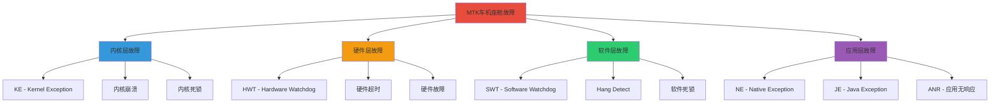
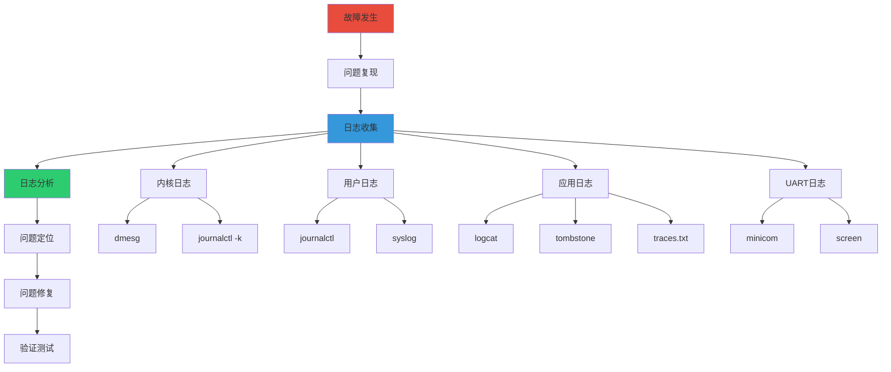

# MTK车机座舱常见故障日志分析

> 基于 MTK 车机座舱 3OS 架构
> 实际工作中常见的故障类型和日志分析方法

---

## 📚 目录

- [一、故障类型概述](#一故障类型概述)
- [二、KE (Kernel Exception) 内核异常](#二ke-kernel-exception-内核异常)
- [三、HWT (Hardware Watchdog Timeout) 硬件看门狗超时](#三hwt-hardware-watchdog-timeout-硬件看门狗超时)
- [四、SWT (Software Watchdog Timeout) 软件看门狗超时](#四swt-software-watchdog-timeout-软件看门狗超时)
- [五、Hang Detect 系统挂起检测](#五hang-detect-系统挂起检测)
- [六、NE (Native Exception) Native层异常](#六ne-native-exception-native层异常)
- [七、JE (Java Exception) Java层异常](#七je-java-exception-java层异常)
- [八、ANR (Application Not Responding) 应用无响应](#八anr-application-not-responding-应用无响应)
- [九、日志收集与分析流程](#九日志收集与分析流程)

---

## 一、故障类型概述

### 1.1 故障分类



### 1.2 日志机制在故障分析中的应用

| 故障类型 | 主要日志来源 | 关键日志命令 | 优先级 |
|----------|--------------|--------------|--------|
| **KE** | 内核日志 | dmesg, journalctl -k | ⭐⭐⭐⭐⭐ |
| **HWT** | 内核日志 + UART | dmesg, UART log | ⭐⭐⭐⭐⭐ |
| **SWT** | 内核日志 + 系统日志 | journalctl, syslog | ⭐⭐⭐⭐ |
| **Hang Detect** | 内核日志 + 调度日志 | dmesg, journalctl | ⭐⭐⭐⭐ |
| **NE** | Native日志 | adb logcat, tombstone | ⭐⭐⭐⭐ |
| **JE** | Java日志 | adb logcat | ⭐⭐⭐⭐ |
| **ANR** | Java日志 + 系统日志 | adb logcat, traces.txt | ⭐⭐⭐⭐ |

---

## 二、KE (Kernel Exception) 内核异常

### 2.1 KE概述

**Kernel Exception** 是内核层发生的异常，通常包括：
- 空指针解引用
- 内存访问越界
- 非法指令
- 页错误
- 内核断言失败

### 2.2 KE日志特征

```bash
# KE日志的典型特征
[  123.456789] BUG: unable to handle kernel NULL pointer dereference at 00000000
[  123.456790] IP: [<c1234567>] my_driver_function+0x23/0x100 [my_driver]
[  123.456791] *pde = 00000000
[  123.456792] Oops: 0000 [#1] SMP ARM
[  123.456793] Modules linked in: my_driver
[  123.456794] CPU: 0 PID: 1234 Comm: my_process Not tainted 4.19.0 #1
[  123.456795] Hardware name: MTK Platform
[  123.456796] PC is at my_driver_function+0x23/0x100 [my_driver]
[  123.456797] LR is at my_driver_caller+0x45/0x80 [my_driver]
[  123.456798] pc : [<c1234567>]    lr : [<c1234abc>]    psr: 60000013
[  123.456799] sp : c4567890  ip : 00000000  fp : c45678a0
[  123.456800] r10: 00000001  r9 : c45678b0  r8 : c45678c0
[  123.456801] r7 : 00000002  r6 : c45678d0  r5 : c45678e0  r4 : c45678f0
[  123.456802] r3 : 00000000  r2 : 00000003  r1 : c4567900  r0 : c4567910
[  123.456803] Flags: NzCv  IRQs on  FIQs on  Mode SVC_32
[  123.456804] Process my_process (pid: 1234, stack limit = 0xc4567800)
[  123.456805] Stack: (0xc4567890 to 0xc4567900)
[  123.456806] 7890: c45678a0 c1234567 c45678b0 c45678c0 c45678d0 c45678e0 c45678f0 c4567900
[  123.456807] 78a0: c45678b0 c1234abc c45678c0 c45678d0 c45678e0 c45678f0 c4567900 c4567910
[  123.456808] Call trace:
[  123.456809] [<c1234567>] my_driver_function+0x23/0x100 [my_driver]
[  123.456810] [<c1234abc>] my_driver_caller+0x45/0x80 [my_driver]
[  123.456811] [<c1234000>] driver_init+0x50/0x100 [my_driver]
[  123.456812] [<c0000000>] do_one_initcall+0x40/0x200
[  123.456813] Code: e1a0c00d e59f3010 e5933000 e1a00003 (e5933004)
[  123.456814] ---[ end trace 123456789 ]---
[  123.456815] Kernel panic - not syncing: Fatal exception
[  123.456816] Rebooting in 5 seconds..
```

### 2.3 KE日志分析步骤

#### 步骤1：收集内核日志

```bash
# 方法1: 使用dmesg
dmesg > kernel_crash.log

# 方法2: 使用journalctl
journalctl -k > kernel_crash.log

# 方法3: 使用UART日志（如果系统崩溃）
# 连接串口，实时查看
sudo minicom -D /dev/ttyUSB0 -b 115200

# 方法4: 使用Mobilelog
mobilelog collect --type kernel
```

#### 步骤2：定位异常类型

```bash
# 搜索关键错误信息
grep "BUG:" kernel_crash.log
grep "Oops:" kernel_crash.log
grep "panic:" kernel_crash.log
grep "Unable to handle" kernel_crash.log
```

#### 步骤3：分析调用栈

```bash
# 提取Call trace
grep -A 20 "Call trace:" kernel_crash.log

# 输出示例：
# Call trace:
# [<c1234567>] my_driver_function+0x23/0x100 [my_driver]
# [<c1234abc>] my_driver_caller+0x45/0x80 [my_driver]
# [<c1234000>] driver_init+0x50/0x100 [my_driver]
# [<c0000000>] do_one_initcall+0x40/0x200
```

#### 步骤4：分析寄存器状态

```bash
# 查看寄存器值
grep "r0:" kernel_crash.log
grep "r1:" kernel_crash.log
grep "PC is at" kernel_crash.log
grep "LR is at" kernel_crash.log
```

#### 步骤5：反汇编代码

```bash
# 如果有内核符号表，可以反汇编
addr2line -e vmlinux 0xc1234567

# 或者使用gdb
gdb vmlinux
(gdb) l *0xc1234567
```

### 2.4 常见KE类型及分析

#### 2.4.1 空指针解引用

```bash
# 日志特征
BUG: unable to handle kernel NULL pointer dereference at 00000000

# 分析要点
# 1. 检查哪个函数访问了空指针
# 2. 检查调用栈，找到调用者
# 3. 检查寄存器r0，通常是第一个参数
# 4. 分析为什么会传入空指针

# 解决方法
# - 添加空指针检查
# - 检查指针初始化
# - 检查内存分配是否成功
```

#### 2.4.2 内存访问越界

```bash
# 日志特征
BUG: unable to handle kernel paging request at virtual address 12345678

# 分析要点
# 1. 检查访问的地址是否合法
# 2. 检查是否访问了已释放的内存
# 3. 检查数组/缓冲区边界

# 解决方法
# - 添加边界检查
# - 使用安全的内存操作函数
# - 检查内存生命周期
```

#### 2.4.3 内核断言失败

```bash
# 日志特征
kernel BUG at drivers/mydriver/mydriver.c:123!

# 分析要点
# 1. 查看断言失败的文件和行号
# 2. 检查断言条件
# 3. 分析为什么会触发断言

# 解决方法
# - 修复代码逻辑
# - 添加更详细的调试信息
```

### 2.5 KE调试技巧

```c
// 在内核代码中添加调试信息
#include <linux/printk.h>

void my_driver_function(void *ptr)
{
    // 添加空指针检查
    if (ptr == NULL) {
        pr_err("[KE] ptr is NULL!\n");
        return;
    }

    // 添加调试日志
    pr_debug("[KE] ptr = 0x%p\n", ptr);

    // 使用WARN_ON检测异常
    WARN_ON(ptr == NULL);

    // 使用BUG_ON在关键位置触发panic
    BUG_ON(ptr == NULL && !in_interrupt());
}
```

---

## 三、HWT (Hardware Watchdog Timeout) 硬件看门狗超时

### 3.1 HWT概述

**Hardware Watchdog Timeout** 是硬件看门狗超时，表示系统在规定时间内没有"喂狗"，导致硬件看门狗触发系统复位。

### 3.2 HWT日志特征

```bash
# HWT日志的典型特征
[  123.456789] watchdog: watchdog0: watchdog did not stop!
[  123.456790] Hardware Watchdog Timer triggered!
[  123.456791] System will reboot in 5 seconds...
[  123.456792] Rebooting...
```

### 3.3 HWT日志分析步骤

#### 步骤1：收集看门狗日志

```bash
# 查看看门狗相关日志
dmesg | grep -i "watchdog"
journalctl -k | grep -i "watchdog"

# 查看内核配置
cat /proc/config.gz | gunzip | grep WATCHDOG

# 查看看门狗设备
ls -la /dev/watchdog*
cat /sys/class/watchdog/watchdog0/timeout
```

#### 步骤2：分析超时原因

```bash
# 查看系统负载
uptime
top

# 查看CPU使用率
cat /proc/stat

# 查看中断情况
cat /proc/interrupts

# 查看调度器日志
dmesg | grep -i "scheduler"
```

#### 步骤3：检查喂狗机制

```c
// 检查看门狗驱动代码
#include <linux/watchdog.h>

// 看门狗喂狗函数
static void watchdog_keepalive(void)
{
    // 检查是否正常喂狗
    pr_debug("[HWT] Feeding watchdog\n");

    // 喂狗操作
    writel(WDT_RESTART, wdt_base + WDT_RESTART_OFFSET);
}
```

### 3.4 常见HWT原因

| 原因 | 日志特征 | 解决方法 |
|------|----------|----------|
| **死锁** | CPU占用100%，无调度 | 检查锁的使用，添加超时机制 |
| **中断风暴** | 中断数激增 | 检查中断处理，优化中断处理函数 |
| **优先级反转** | 高优先级任务被阻塞 | 使用优先级继承协议 |
| **硬件故障** | 硬件无响应 | 检查硬件状态，更换硬件 |

### 3.5 HWT调试技巧

```c
// 添加看门狗调试信息
#include <linux/printk.h>
#include <linux/sched.h>

void watchdog_keepalive(void)
{
    // 记录当前任务
    pr_info("[HWT] Feeding watchdog, current: %s (PID: %d)\n",
            current->comm, current->pid);

    // 记录调度状态
    pr_debug("[HWT] CPU: %d, runnable: %d\n",
            smp_processor_id(), nr_running());

    // 喂狗
    writel(WDT_RESTART, wdt_base + WDT_RESTART_OFFSET);
}
```

---

## 四、SWT (Software Watchdog Timeout) 软件看门狗超时

### 4.1 SWT概述

**Software Watchdog Timeout** 是软件看门狗超时，通常由内核的softlockup或hardlockup检测机制触发。

### 4.2 SWT日志特征

```bash
# Softlockup日志
[  123.456789] watchdog: BUG: soft lockup - CPU#0 stuck for 23s! [my_process:1234]
[  123.456790] Modules linked in: my_driver
[  123.456791] CPU: 0 PID: 1234 Comm: my_process Not tainted 4.19.0 #1
[  123.456792] Hardware name: MTK Platform
[  123.456793] task: ffff8800c1234567 task.stack: ffff8800c1237890
[  123.456794] RIP: 0010:[<ffffffffc1234567>]  [<ffffffffc1234567>] my_function+0x23/0x100 [my_driver]
[  123.456795] RSP: 0018:ffff8800c1237890  EFLAGS: 00000246
[  123.456796] RAX: 0000000000000000 RBX: ffff8800c1234567 RCX: 0000000000000001
[  123.456797] RDX: 0000000000000002 RSI: ffff8800c1237890 RDI: ffff8800c1234567
[  123.456798] RBP: ffff8800c1237890 R08: 0000000000000000 R09: 0000000000000000
[  123.456799] R10: 0000000000000000 R11: 0000000000000246 R12: ffff8800c1234567
[  123.456800] R13: ffff8800c1234567 R14: ffff8800c1234567 R15: ffff8800c1234567
[  123.456801] FS:  00007f880c1234567(0000) GS:ffff8800c1234567(0000) knlGS:0000000000000000
[  123.456802] CS:  0010 DS: 0000 ES: 0000 CR0: 0000000080050033
[  123.456803] CR2: 0000000000000000 CR3: 00000000c1234567 CR4: 00000000000006f0
[  123.456804] Stack:
[  123.456805]  ffff8800c1237890 ffffffff81001234 ffff8800c1234567 ffff8800c1237890
[  123.456806]  ffff8800c12378a0 ffffffff81005678 ffff8800c1234567 ffff8800c1237890
[  123.456807] Call Trace:
[  123.456808]  [<ffffffffc1234567>] my_function+0x23/0x100 [my_driver]
[  123.456809]  [<ffffffff81001234>] do_one_initcall+0x40/0x200
[  123.456810]  [<ffffffff81005678>] kernel_init+0x50/0x100
[  123.456811] Code: 48 8b 05 xx xx xx xx 48 85 c0 74 xx 48 8b 00 48 85 c0 74 xx

# Hardlockup日志
[  123.456789] watchdog: BUG: hard lockup - CPU#0 stuck for 23s! [my_process:1234]
[  123.456790] Modules linked in: my_driver
```

### 4.3 SWT日志分析步骤

#### 步骤1：收集softlockup日志

```bash
# 查看softlockup日志
dmesg | grep -i "soft lockup"
journalctl -k | grep -i "soft lockup"

# 查看hardlockup日志
dmesg | grep -i "hard lockup"
journalctl -k | grep -i "hard lockup"
```

#### 步骤2：分析卡死的任务

```bash
# 查看卡死的任务信息
grep "stuck for" kernel.log

# 查看任务堆栈
grep -A 30 "Call trace:" kernel.log

# 查看CPU状态
cat /proc/stat
```

#### 步骤3：检查锁的使用

```bash
# 查看锁竞争情况
cat /proc/lock_stat

# 查看死锁检测
dmesg | grep -i "deadlock"
```

### 4.4 常见SWT原因

| 原因 | 日志特征 | 解决方法 |
|------|----------|----------|
| **死锁** | 任务长时间持有锁 | 检查锁的获取顺序，避免循环等待 |
| **忙等待** | CPU占用100% | 使用等待队列或completion |
| **中断禁用时间过长** | local_irq_disable后长时间不恢复 | 缩短临界区，使用spin_lock_irqsave |
| **无限循环** | RIP指针指向循环内部 | 检查循环条件，添加超时机制 |

### 4.5 SWT调试技巧

```c
// 添加锁调试信息
#include <linux/spinlock.h>
#include <linux/printk.h>

void my_function(void)
{
    unsigned long flags;

    pr_debug("[SWT] Acquiring lock\n");
    spin_lock_irqsave(&my_lock, flags);
    pr_debug("[SWT] Lock acquired\n");

    // 临界区代码
    do_critical_work();

    pr_debug("[SWT] Releasing lock\n");
    spin_unlock_irqrestore(&my_lock, flags);
    pr_debug("[SWT] Lock released\n");
}

// 添加超时机制
#include <linux/delay.h>

void my_function_with_timeout(void)
{
    unsigned long timeout = jiffies + msecs_to_jiffies(5000);

    while (!condition) {
        if (time_after(jiffies, timeout)) {
            pr_err("[SWT] Timeout waiting for condition!\n");
            break;
        }
        msleep(100);
    }
}
```

---

## 五、Hang Detect 系统挂起检测

### 5.1 Hang Detect概述

**Hang Detect** 是系统挂起检测，通常由内核的hung task检测机制触发，表示某个任务长时间处于D状态（不可中断睡眠）。

### 5.2 Hang Detect日志特征

```bash
# Hung task日志
[  123.456789] INFO: task my_process:1234 blocked for more than 120 seconds.
[  123.456790] "echo 0 > /proc/sys/kernel/hung_task_timeout_secs" disables this message.
[  123.456791] task:my_process        state:D stack:0    pid:1234 ppid:1233 flags:0x00004000
[  123.456792] Call trace:
[  123.456793]  [<ffffffffc1234567>] __schedule+0x23/0x100
[  123.456794]  [<ffffffffc1234abc>] schedule+0x45/0x80
[  123.456795]  [<ffffffffc1234000>] schedule_timeout+0x50/0x100
[  123.456796]  [<ffffffffc1235000>] wait_for_common+0x60/0x100
[  123.456797]  [<ffffffffc1236000>] down_interruptible+0x70/0x100
[  123.456798]  [<ffffffffc1234567>] my_function+0x23/0x100 [my_driver]
[  123.456799]  [<ffffffff81001234>] do_one_initcall+0x40/0x200
[  123.456800] INFO: lockdep is turned off.
```

### 5.3 Hang Detect日志分析步骤

#### 步骤1：收集hung task日志

```bash
# 查看hung task日志
dmesg | grep -i "hung task"
journalctl -k | grep -i "hung task"

# 查看hung task超时设置
cat /proc/sys/kernel/hung_task_timeout_secs
```

#### 步骤2：分析被阻塞的任务

```bash
# 查看被阻塞的任务
grep "blocked for more than" kernel.log

# 查看任务堆栈
grep -A 20 "Call trace:" kernel.log

# 查看任务状态
cat /proc/1234/status
cat /proc/1234/stack
```

#### 步骤3：检查锁持有者

```bash
# 查看锁统计信息
cat /proc/lock_stat

# 查看锁竞争
cat /proc/lock_stat | grep my_lock
```

### 5.4 常见Hang Detect原因

| 原因 | 日志特征 | 解决方法 |
|------|----------|----------|
| **I/O阻塞** | 任务在D状态，等待I/O | 检查I/O设备状态，添加超时机制 |
| **死锁** | 多个任务互相等待 | 检查锁的使用，避免循环等待 |
| **资源耗尽** | 内存不足，无法分配 | 检查内存使用，优化内存分配 |
| **驱动bug** | 驱动未正确唤醒等待任务 | 修复驱动代码，确保正确唤醒 |

### 5.5 Hang Detect调试技巧

```c
// 添加超时机制
#include <linux/wait.h>
#include <linux/jiffies.h>

int my_function_with_timeout(void)
{
    unsigned long timeout = msecs_to_jiffies(5000);
    int ret;

    ret = wait_event_interruptible_timeout(my_wait_queue,
                                           condition,
                                           timeout);

    if (ret == 0) {
        pr_err("[Hang] Timeout waiting for condition!\n");
        return -ETIMEDOUT;
    } else if (ret < 0) {
        pr_err("[Hang] Interrupted!\n");
        return ret;
    }

    return 0;
}

// 添加调试信息
void my_function(void)
{
    pr_debug("[Hang] Waiting for condition...\n");

    if (wait_event_interruptible(my_wait_queue, condition)) {
        pr_err("[Hang] Interrupted!\n");
        return;
    }

    pr_debug("[Hang] Condition met!\n");
}
```

---

## 六、NE (Native Exception) Native层异常

### 6.1 NE概述

**Native Exception** 是Native层（C/C++）发生的异常，通常包括段错误、总线错误、非法指令等。

### 6.2 NE日志特征

```bash
# Tombstone日志示例
********** Crash dump: **********
Build fingerprint: 'MTK/mtk_platform/mtk_platform:10/20260120/123456:user/release'
Revision: '0'
ABI: 'arm64'
Timestamp: 2026-01-20 10:30:45+0800
Process uptime: 1234s
Cmdline: com.example.myapp
pid: 1234, tid: 5678, name: ThreadName  >>> com.example.myapp <<<
uid: 10123
signal 11 (SIGSEGV), code 1 (SEGV_MAPERR), fault addr 0x0
    x0  0000000000000000  x1  0000007ffe7b9e10  x2  0000000000000001
    x3  0000000000000002  x4  0000000000000003  x5  0000000000000004
    x6  0000000000000005  x7  0000000000000006  x8  0000000000000007
    x9  0000000000000008  x10 0000000000000009  x11 000000000000000a
    x12 000000000000000b  x13 000000000000000c  x14 000000000000000d
    x15 000000000000000e  x16 000000000000000f  x17 0000000000000010
    x18 0000000000000011  x19 0000000000000012  x20 0000000000000013
    x21 0000000000000014  x22 0000000000000015  x23 0000000000000016
    x24 0000000000000017  x25 0000000000000018  x26 0000000000000019
    x27 000000000000001a  x28 000000000000001b  x29 000000000000001c
    x30 000000000000001d  x31 000000000000001e
    sp  0000007ffe7b9e10  pc  0000007ffe7b9e00  pstate 0000000080000000
backtrace:
    #00 pc 0000000000012345  /data/app/~~com.example.myapp==/lib/arm64/libnative-lib.so (native_function+128)
    #01 pc 0000000000056789  /data/app/~~com.example.myapp==/lib/arm64/libnative-lib.so (Java_com_example_MainActivity_nativeMethod+64)
    #02 pc 0000000000123456  /system/framework/arm64/boot-framework.oat (offset 0x1000000)
```

### 6.3 NE日志分析步骤

#### 步骤1：收集tombstone日志

```bash
# 查看tombstone文件
adb shell ls -la /data/tombstones/
adb shell cat /data/tombstones/tombstone_00

# 导出tombstone
adb pull /data/tombstones/tombstone_00 ./tombstone_00

# 使用Mobilelog收集
mobilelog collect --type crash
```

#### 步骤2：分析崩溃原因

```bash
# 查看信号类型
grep "signal" tombstone_00

# 查看崩溃地址
grep "fault addr" tombstone_00

# 查看崩溃函数
grep "backtrace:" -A 10 tombstone_00
```

#### 步骤3：使用addr2line定位代码

```bash
# 使用addr2line定位崩溃位置
addr2line -e libnative-lib.so -f 0x12345

# 或者使用ndk-stack
adb logcat | ndk-stack -sym ./obj/local/arm64-v8a/
```

### 6.4 常见NE类型

| 信号 | 含义 | 常见原因 |
|------|------|----------|
| **SIGSEGV (11)** | 段错误 | 空指针、内存越界 |
| **SIGBUS (7)** | 总线错误 | 对齐错误、硬件故障 |
| **SIGILL (4)** | 非法指令 | 执行了无效指令 |
| **SIGFPE (8)** | 浮点异常 | 除零、溢出 |
| **SIGABRT (6)** | 中止 | 调用abort()、断言失败 |

### 6.5 NE调试技巧

```c
#include <android/log.h>
#include <stdlib.h>

#define LOG_TAG "NativeLib"
#define LOGE(...) __android_log_print(ANDROID_LOG_ERROR, LOG_TAG, __VA_ARGS__)

void native_function(void *ptr)
{
    // 添加空指针检查
    if (ptr == NULL) {
        LOGE("[NE] ptr is NULL!");
        return;
    }

    // 添加调试日志
    LOGE("[NE] ptr = %p", ptr);

    // 使用assert
    assert(ptr != NULL);

    // 访问内存
    int value = *(int *)ptr;
    LOGE("[NE] value = %d", value);
}

// 使用信号处理
#include <signal.h>
#include <execinfo.h>

void signal_handler(int sig) {
    void *array[10];
    size_t size;

    // 获取调用栈
    size = backtrace(array, 10);

    // 打印调用栈
    LOGE("[NE] Signal %d caught:", sig);
    backtrace_symbols_fd(array, size, 2);

    // 退出
    exit(1);
}

void setup_signal_handler() {
    signal(SIGSEGV, signal_handler);
    signal(SIGBUS, signal_handler);
    signal(SIGILL, signal_handler);
}
```

---

## 七、JE (Java Exception) Java层异常

### 7.1 JE概述

**Java Exception** 是Java层发生的异常，包括运行时异常、检查异常、错误等。

### 7.2 JE日志特征

```bash
# Java异常日志示例
01-20 10:30:45.123  1234  5678 E AndroidRuntime: FATAL EXCEPTION: main
01-20 10:30:45.124  1234  5678 E AndroidRuntime: Process: com.example.myapp, PID: 1234
01-20 10:30:45.125  1234  5678 E AndroidRuntime: java.lang.NullPointerException: Attempt to invoke virtual method 'java.lang.String java.lang.Object.toString()' on a null object reference
01-20 10:30:45.126  1234  5678 E AndroidRuntime:    at com.example.myapp.MainActivity.onCreate(MainActivity.java:45)
01-20 10:30:45.127  1234  5678 E AndroidRuntime:    at android.app.Activity.performCreate(Activity.java:7802)
01-20 10:30:45.128  1234  5678 E AndroidRuntime:    at android.app.Instrumentation.callActivityOnCreate(Instrumentation.java:1299)
01-20 10:30:45.129  1234  5678 E AndroidRuntime:    at android.app.ActivityThread.performLaunchActivity(ActivityThread.java:3336)
01-20 10:30:45.130  1234  5678 E AndroidRuntime:    at android.app.ActivityThread.handleLaunchActivity(ActivityThread.java:3486)
01-20 10:30:45.131  1234  5678 E AndroidRuntime:    at android.app.servertransaction.LaunchActivityItem.execute(LaunchActivityItem.java:83)
01-20 10:30:45.132  1234  5678 E AndroidRuntime:    at android.app.servertransaction.TransactionExecutor.executeCallbacks(TransactionExecutor.java:135)
01-20 10:30:45.133  1234  5678 E AndroidRuntime:    at android.app.servertransaction.TransactionExecutor.execute(TransactionExecutor.java:95)
01-20 10:30:45.134  1234  5678 E AndroidRuntime:    at android.app.ActivityThread$H.handleMessage(ActivityThread.java:2016)
01-20 10:30:45.135  1234  5678 E AndroidRuntime:    at android.os.Handler.dispatchMessage(Handler.java:107)
01-20 10:30:45.136  1234  5678 E AndroidRuntime:    at android.os.Looper.loop(Looper.java:214)
01-20 10:30:45.137  1234  5678 E AndroidRuntime:    at android.app.ActivityThread.main(ActivityThread.java:7356)
01-20 10:30:45.138  1234  5678 E AndroidRuntime:    at java.lang.reflect.Method.invoke(Native Method)
01-20 10:30:45.139  1234  5678 E AndroidRuntime:    at com.android.internal.os.RuntimeInit$MethodAndArgsCaller.run(RuntimeInit.java:492)
01-20 10:30:45.140  1234  5678 E AndroidRuntime:    at com.zygote.ZygoteInit.main(ZygoteInit.java:930)
```

### 7.3 JE日志分析步骤

#### 步骤1：收集Java异常日志

```bash
# 查看崩溃日志
adb logcat -b crash

# 搜索FATAL EXCEPTION
adb logcat | grep "FATAL EXCEPTION"

# 使用Mobilelog收集
mobilelog collect --type crash
```

#### 步骤2：分析异常类型

```bash
# 查看异常类型
adb logcat | grep "java.lang"

# 常见异常类型
# NullPointerException
# IllegalStateException
# IndexOutOfBoundsException
# NumberFormatException
```

#### 步骤3：定位崩溃位置

```bash
# 查看崩溃行号
grep "MainActivity.onCreate(MainActivity.java:45)" crash.log

# 打开对应的Java文件
# 定位到第45行
```

### 7.4 常见JE类型

| 异常类型 | 常见原因 | 解决方法 |
|----------|----------|----------|
| **NullPointerException** | 对象为null | 添加空指针检查 |
| **IllegalStateException** | 状态不合法 | 检查对象状态 |
| **IndexOutOfBoundsException** | 数组越界 | 添加边界检查 |
| **NumberFormatException** | 数字格式错误 | 使用try-catch |

### 7.5 JE调试技巧

```java
import android.util.Log;

public class MainActivity extends Activity {
    private static final String TAG = "MainActivity";

    @Override
    protected void onCreate(Bundle savedInstanceState) {
        super.onCreate(savedInstanceState);

        try {
            // 添加空指针检查
            String str = getString();
            if (str == null) {
                Log.e(TAG, "[JE] str is null!");
                return;
            }

            // 使用安全的方法
            String result = str != null ? str.toString() : "null";
            Log.d(TAG, "[JE] result: " + result);

        } catch (Exception e) {
            // 捕获异常并记录
            Log.e(TAG, "[JE] Exception occurred", e);
        }
    }

    private String getString() {
        return null;
    }
}
```

---

## 八、ANR (Application Not Responding) 应用无响应

### 8.1 ANR概述

**ANR (Application Not Responding)** 是应用无响应，表示应用在主线程上执行了耗时操作，导致系统弹出"应用无响应"对话框。

### 8.2 ANR日志特征

```bash
# ANR日志示例
--------- beginning of ANR
01-20 10:30:45.123  1234  5678 E ActivityManager: ANR in com.example.myapp
01-20 10:30:45.124  1234  5678 E ActivityManager: PID: 1234
01-20 10:30:45.125  1234  5678 E ActivityManager: Reason: Input dispatching timed out
01-20 10:30:45.126  1234  5678 E ActivityManager: Load: 1.5 / 1.2 / 1.0
01-20 10:30:45.127  1234  5678 E ActivityManager: CPU usage from 0ms to 100ms ago:
01-20 10:30:45.128  1234  5678 E ActivityManager:   50% 1234/com.example.myapp: 50% user + 0% kernel
01-20 10:30:45.129  1234  5678 E ActivityManager:   30% 5678/system_server: 20% user + 10% kernel
01-20 10:30:45.130  1234  5678 E ActivityManager:   20% 9012/com.android.systemui: 15% user + 5% kernel
01-20 10:30:45.131  1234  5678 E ActivityManager: Stack trace:
01-20 10:30:45.132  1234  5678 E ActivityManager:   at android.os.BinderProxy.transactNative(Native Method)
01-20 10:30:45.133  1234  5678 E ActivityManager:   at android.os.BinderProxy.transact(Binder.java:754)
01-20 10:30:45.134  1234  5678 E ActivityManager:   at android.view.IWindowSession$Stub$Proxy.addToDisplay(IWindowSession.java:733)
```

### 8.3 ANR日志分析步骤

#### 步骤1：收集ANR日志

```bash
# 查看ANR日志
adb logcat | grep "ANR"

# 查看traces文件
adb shell ls -la /data/anr/
adb shell cat /data/anr/traces.txt

# 导出traces文件
adb pull /data/anr/traces.txt ./traces.txt

# 使用Mobilelog收集
mobilelog collect --type anr
```

#### 步骤2：分析ANR原因

```bash
# 查看ANR类型
grep "Reason:" traces.txt

# 常见ANR类型
# Input dispatching timed out - 输入事件处理超时
# Broadcast of Intent - 广播处理超时
# Service timeout - 服务启动超时
```

#### 步骤3：分析主线程堆栈

```bash
# 查看主线程堆栈
grep "main" traces.txt -A 30

# 查看CPU使用情况
grep "CPU usage" traces.txt -A 10
```

### 8.4 常见ANR原因

| ANR类型 | 常见原因 | 解决方法 |
|---------|----------|----------|
| **Input timeout** | 主线程阻塞 | 使用异步任务，避免主线程阻塞 |
| **Broadcast timeout** | 广播处理耗时 | 使用异步广播，优化处理逻辑 |
| **Service timeout** | 服务启动慢 | 优化服务启动，使用IntentService |
| **ContentProvider timeout** | 查询耗时 | 优化查询，使用异步加载 |

### 8.5 ANR调试技巧

```java
import android.os.Handler;
import android.os.Looper;
import android.util.Log;

public class MainActivity extends Activity {
    private static final String TAG = "MainActivity";
    private Handler mHandler = new Handler(Looper.getMainLooper());

    @Override
    protected void onCreate(Bundle savedInstanceState) {
        super.onCreate(savedInstanceState);

        // 使用异步任务
        new Thread(new Runnable() {
            @Override
            public void run() {
                // 耗时操作
                doHeavyWork();

                // 在主线程更新UI
                mHandler.post(new Runnable() {
                    @Override
                    public void run() {
                        updateUI();
                    }
                });
            }
        }).start();
    }

    private void doHeavyWork() {
        // 模拟耗时操作
        try {
            Thread.sleep(5000);
        } catch (InterruptedException e) {
            Log.e(TAG, "[ANR] Interrupted", e);
        }
    }

    private void updateUI() {
        // 更新UI
        Log.d(TAG, "[ANR] UI updated");
    }
}
```

---

## 九、日志收集与分析流程

### 9.1 统一日志收集流程



### 9.2 Mobilelog一键收集

```bash
# 使用Mobilelog收集所有日志
mobilelog collect /mnt/usb

# 收集特定类型的日志
mobilelog collect --type kernel
mobilelog collect --type crash
mobilelog collect --type anr

# 收集并上传
mobilelog collect --upload
```

### 9.3 日志分析检查清单

#### KE检查清单
- [ ] 收集dmesg日志
- [ ] 收集journalctl -k日志
- [ ] 收集UART日志（如果系统崩溃）
- [ ] 定位异常类型
- [ ] 分析调用栈
- [ ] 分析寄存器状态
- [ ] 反汇编崩溃代码

#### HWT检查清单
- [ ] 收集watchdog日志
- [ ] 检查系统负载
- [ ] 检查CPU使用率
- [ ] 检查中断情况
- [ ] 检查喂狗机制

#### SWT检查清单
- [ ] 收集softlockup日志
- [ ] 收集hardlockup日志
- [ ] 分析卡死的任务
- [ ] 检查锁的使用
- [ ] 检查中断禁用时间

#### Hang Detect检查清单
- [ ] 收集hung task日志
- [ ] 分析被阻塞的任务
- [ ] 检查锁持有者
- [ ] 检查I/O状态
- [ ] 检查资源使用

#### NE检查清单
- [ ] 收集tombstone日志
- [ ] 分析信号类型
- [ ] 分析崩溃地址
- [ ] 使用addr2line定位代码
- [ ] 检查Native代码

#### JE检查清单
- [ ] 收集Java异常日志
- [ ] 分析异常类型
- [ ] 定位崩溃位置
- [ ] 检查Java代码
- [ ] 添加异常处理

#### ANR检查清单
- [ ] 收集ANR日志
- [ ] 收集traces.txt
- [ ] 分析ANR类型
- [ ] 分析主线程堆栈
- [ ] 分析CPU使用情况

### 9.4 日志分析最佳实践

```bash
# 1. 时间同步
# 确保SOS和UOS时间同步
adb shell date
date

# 2. 日志关联
# 通过时间戳关联跨系统日志
grep "10:30:45" sos_kernel.log
grep "10:30:45" uos_android.log

# 3. 关键词搜索
# 搜索错误关键词
grep -i "error\|fail\|exception\|crash" *.log

# 4. 正则表达式
# 使用正则表达式过滤
grep -E "(error|warning|fail)" *.log

# 5. 日志统计
# 统计错误数量
grep -i "error" *.log | wc -l
```

---

## 总结

### 关键要点

1. **故障类型识别**：快速识别KE、HWT、SWT、Hang Detect、NE、JE、ANR
2. **日志收集**：使用正确的命令收集对应的日志
3. **日志分析**：按照分析步骤逐步定位问题
4. **问题定位**：结合日志信息和代码定位问题根源
5. **问题修复**：根据分析结果修复代码
6. **验证测试**：验证修复是否有效

### 学习路径

```
故障类型 → 日志收集 → 日志分析 → 问题定位 → 问题修复 → 验证测试
```

### 实践建议

1. **建立日志库**：收集各种故障的典型日志
2. **编写脚本**：自动化日志收集和分析
3. **定期总结**：总结常见问题和解决方案
4. **持续学习**：不断学习新的调试技巧

---

**最后更新时间：** 2026-01-20  
**适用平台：** MTK车机座舱 3OS架构  
**日志系统：** Mobilelog