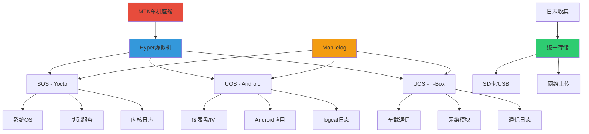
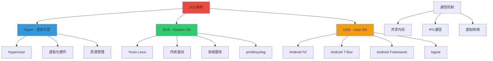
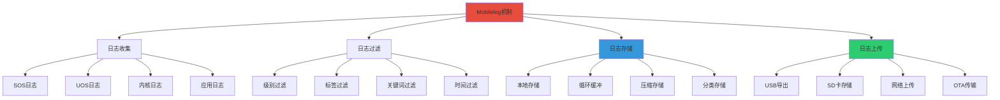
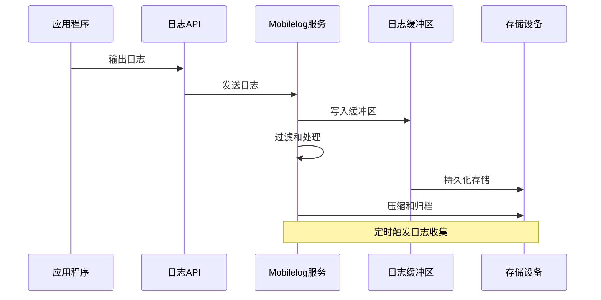
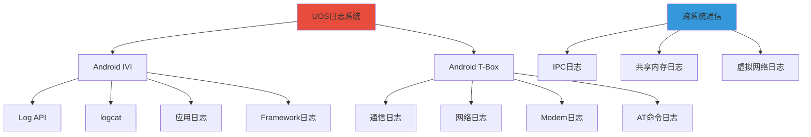

# MTK车机座舱日志机制详解

> 基于 MTK 车机座舱 3OS 架构
> Hyper虚拟机环境：SOS (Yocto) + UOS (Android/T-Box)
> 日志系统：Mobilelog 机制

---

## 📚 目录

- [一、MTK车机座舱架构概述](#一mtk车机座舱架构概述)
- [二、3OS系统架构](#二3os系统架构)
- [三、Mobilelog机制详解](#三mobilelog机制详解)
- [四、SOS (Yocto) 日志系统](#四sos-yocto-日志系统)
- [五、UOS (Android/T-Box) 日志系统](#五uos-androidt-box-日志系统)
- [六、跨系统日志收集](#六跨系统日志收集)
- [七、实际工作场景](#七实际工作场景)

---

## 一、MTK车机座舱架构概述

### 1.1 整体架构



### 1.2 SI (System Integration) 工作职责

| 职责 | 说明 | 相关日志 |
|------|------|----------|
| **系统集成** | 整合各个子系统 | 系统启动日志、服务启动日志 |
| **问题诊断** | 定位和分析问题 | 崩溃日志、异常日志 |
| **性能优化** | 优化系统性能 | 性能日志、资源使用日志 |
| **日志收集** | 收集和分析日志 | Mobilelog日志、各系统日志 |
| **版本管理** | 管理软件版本 | 版本信息、升级日志 |

---

## 二、3OS系统架构

### 2.1 3OS架构详解



### 2.2 SOS (Yocto) 特点

| 特性 | 说明 |
|------|------|
| **操作系统** | Yocto Linux (定制版) |
| **内核版本** | Linux 4.x/5.x (MTK定制) |
| **启动顺序** | 最先启动，提供基础服务 |
| **日志系统** | printk + syslog + kmsg |
| **主要功能** | 硬件抽象、驱动管理、系统服务 |

### 2.3 UOS (Android/T-Box) 特点

| 特性 | 说明 |
|------|------|
| **操作系统** | Android (MTK定制) |
| **内核版本** | Linux Kernel (Android版本) |
| **启动顺序** | 在SOS之后启动 |
| **日志系统** | logcat + Android Log API |
| **主要功能** | IVI应用、车载通信、用户交互 |

---

## 三、Mobilelog机制详解

### 3.1 Mobilelog概述



### 3.2 Mobilelog架构



### 3.3 Mobilelog配置

#### 3.3.1 配置文件位置

```bash
# Mobilelog配置文件
/etc/mobilelog.conf
/system/etc/mobilelog.conf
/vendor/etc/mobilelog.conf

# 日志级别配置
/sys/kernel/debug/mobilelog/level
/sys/kernel/debug/mobilelog/filter
```

#### 3.3.2 常用配置项

```properties
# mobilelog.conf 示例
[general]
# 日志级别: 0-7 (0=EMERG, 7=DEBUG)
log_level=6

# 日志缓冲区大小 (KB)
buffer_size=1024

# 日志轮转数量
max_log_files=10

# 日志存储路径
log_path=/data/mobilelog

# 日志压缩
enable_compress=true

# 日志上传
enable_upload=false
upload_url=http://server/log/upload

[filter]
# 过滤标签
include_tags=MTK,IVI,SYSTEM
exclude_tags=DEBUG,VERBOSE

# 过滤关键词
include_keywords=error,warning,fail
exclude_keywords=success,ok

[sos]
# SOS日志配置
enable_sos_log=true
sos_log_path=/data/mobilelog/sos

[uos]
# UOS日志配置
enable_uos_log=true
uos_log_path=/data/mobilelog/uos

[android]
# Android日志配置
enable_android_log=true
android_log_path=/data/mobilelog/android
```

### 3.4 Mobilelog命令

#### 3.4.1 常用命令

```bash
# 启动Mobilelog服务
mobilelog start

# 停止Mobilelog服务
mobilelog stop

# 查看Mobilelog状态
mobilelog status

# 手动触发日志收集
mobilelog collect

# 查看日志配置
mobilelog config

# 导出日志到USB
mobilelog export /mnt/usb

# 清空日志
mobilelog clear

# 查看日志统计
mobilelog stats
```

#### 3.4.2 日志查看命令

```bash
# 查看所有Mobilelog日志
cat /data/mobilelog/mobilelog.log

# 实时查看Mobilelog日志
tail -f /data/mobilelog/mobilelog.log

# 搜索特定日志
grep "error" /data/mobilelog/mobilelog.log

# 查看最近的日志
tail -n 100 /data/mobilelog/mobilelog.log

# 查看SOS日志
ls -la /data/mobilelog/sos/
cat /data/mobilelog/sos/kernel.log

# 查看UOS日志
ls -la /data/mobilelog/uos/
cat /data/mobilelog/uos/android.log
```

---

## 四、SOS (Yocto) 日志系统

### 4.1 SOS日志架构

```mermaid
graph TB
    A[SOS日志系统] --> B[内核空间]
    A --> C[用户空间]

    B --> B1[printk]
    B --> B2[内核缓冲区]
    B --> B3[/proc/kmsg]
    B --> B4[/dev/kmsg]

    C --> C1[syslog]
    C --> C2[systemd journal]
    C --> C3[应用日志]
    C --> C4[服务日志]

    D[日志查看] --> E[dmesg]
    D --> F[journalctl]
    D --> G[mobilelog]

    style A fill:#e74c3c
    style D fill:#3498db
```

### 4.2 内核日志

#### 4.2.1 printk使用

```c
// SOS内核模块示例
#include <linux/module.h>
#include <linux/kernel.h>

static int __init sos_init(void)
{
    // MTK特定日志标签
    pr_info("[SOS] SOS系统初始化\n");
    pr_info("[SOS] 内核版本: %s\n", UTS_RELEASE);

    // 硬件初始化日志
    pr_info("[SOS] 硬件初始化开始\n");
    pr_debug("[SOS] 调试信息: 硬件地址 0x%x\n", hardware_addr);

    return 0;
}

static void __exit sos_exit(void)
{
    pr_info("[SOS] SOS系统退出\n");
}

module_init(sos_init);
module_exit(sos_exit);
```

#### 4.2.2 查看内核日志

```bash
# 查看SOS内核日志
dmesg

# 实时查看
dmesg -w

# 按级别过滤
dmesg -l err,warn

# 查看特定模块日志
dmesg | grep "SOS"

# 查看MTK特定日志
dmesg | grep "MTK"

# 查看硬件初始化日志
dmesg | grep "hardware"
```

### 4.3 用户空间日志

#### 4.3.1 syslog使用

```c
// SOS应用日志示例
#include <syslog.h>
#include <unistd.h>

int main()
{
    // 打开日志
    openlog("sos_service", LOG_PID | LOG_CONS, LOG_USER);

    // 记录日志
    syslog(LOG_INFO, "[SOS] 服务启动, PID: %d", getpid());
    syslog(LOG_DEBUG, "[SOS] 调试信息: 配置加载");
    syslog(LOG_WARNING, "[SOS] 警告: 配置文件未找到，使用默认配置");

    // 模拟错误
    if (error) {
        syslog(LOG_ERR, "[SOS] 错误: 服务启动失败: %d", error);
    }

    closelog();
    return 0;
}
```

#### 4.3.2 systemd journal

```bash
# 查看SOS系统日志
journalctl

# 查看特定服务日志
journalctl -u sos-service

# 实时查看
journalctl -f

# 按时间过滤
journalctl --since "1 hour ago"

# 按级别过滤
journalctl -p err

# 查看启动日志
journalctl -b
```

---

## 五、UOS (Android/T-Box) 日志系统

### 5.1 UOS日志架构



### 5.2 Android IVI日志

#### 5.2.1 Log API使用

```java
// Android IVI应用日志
import android.util.Log;

public class IVIService {
    private static final String TAG = "IVI_Service";

    public void startService() {
        Log.v(TAG, "[IVI] 详细日志: 服务启动");
        Log.d(TAG, "[IVI] 调试日志: 初始化组件");
        Log.i(TAG, "[IVI] 信息日志: 服务启动成功");
        Log.w(TAG, "[IVI] 警告日志: 配置使用默认值");
        Log.e(TAG, "[IVI] 错误日志: 启动异常", exception);
    }

    public void processCommand(String cmd) {
        if (Log.isLoggable(TAG, Log.DEBUG)) {
            Log.d(TAG, "[IVI] 处理命令: " + cmd);
        }

        // 业务逻辑
    }
}
```

#### 5.2.2 logcat使用

```bash
# 查看Android IVI日志
adb logcat

# 按标签过滤
adb logcat -s IVI_Service:I
adb logcat -s MTK*:D

# 按级别过滤
adb logcat *:E

# 按包名过滤
adb logcat --pid=$(adb shell pidof com.mtk.ivi)

# 查看T-Box日志
adb logcat -b radio

# 实时查看并保存
adb logcat -v threadtime > ivi_log.txt

# 查看系统启动日志
adb logcat -b system
```

### 5.3 T-Box日志

#### 5.3.1 T-Box日志特点

| 日志类型 | 说明 | 查看方式 |
|----------|------|----------|
| **Modem日志** | 调制解调器日志 | adb logcat -b radio |
| **AT命令日志** | AT命令交互 | adb shell cat /data/tbox/at.log |
| **网络日志** | 网络通信日志 | adb logcat | grep network |
| **GPS日志** | GPS定位日志 | adb shell cat /data/tbox/gps.log |

#### 5.3.2 查看T-Box日志

```bash
# 查看Modem日志
adb logcat -b radio

# 查看AT命令日志
adb shell cat /data/tbox/at.log

# 查看GPS日志
adb shell cat /data/tbox/gps.log

# 查看网络日志
adb logcat | grep "network\|wifi\|bt"

# 查看T-Box服务日志
adb logcat | grep "TBOX\|tbox"
```

---

## 六、跨系统日志收集

### 6.1 跨系统日志架构

```mermaid
graph TB
    A[跨系统日志收集] --> B[SOS日志]
    A --> C[UOS日志]
    A --> D[Mobilelog]

    B --> B1[dmesg]
    B --> B2[journalctl]
    B --> B3[/proc/kmsg]

    C --> C1[logcat]
    C --> C2[tbox日志]
    C --> C3[应用日志]

    D --> D1[日志聚合]
    D --> D2[日志过滤]
    D --> D3[日志存储]
    D --> D4[日志导出]

    E[日志同步] --> F[共享内存]
    E --> G[IPC通信]
    E --> H[虚拟网络]

    style A fill:#e74c3c
    style D fill:#3498db
```

### 6.2 日志同步机制

#### 6.2.1 共享内存日志

```c
// 共享内存日志示例
#include <sys/mman.h>
#include <sys/stat.h>
#include <fcntl.h>

#define SHM_SIZE 4096
#define SHM_NAME "/mtk_log_shm"

void write_shared_log(const char *message)
{
    int fd = shm_open(SHM_NAME, O_RDWR, 0666);
    if (fd == -1) {
        return;
    }

    char *shm_ptr = mmap(NULL, SHM_SIZE, PROT_READ | PROT_WRITE, MAP_SHARED, fd, 0);
    if (shm_ptr == MAP_FAILED) {
        close(fd);
        return;
    }

    // 写入日志
    snprintf(shm_ptr, SHM_SIZE, "[SHM] %s\n", message);

    munmap(shm_ptr, SHM_SIZE);
    close(fd);
}
```

#### 6.2.2 IPC日志

```bash
# 查看IPC日志
adb shell cat /dev/log_ipc

# 查看系统间通信日志
adb logcat | grep "IPC\|binder\|hwbinder"

# 查看跨系统调用日志
adb logcat | grep "cross_system\|hyper_call"
```

### 6.3 统一日志收集

#### 6.3.1 Mobilelog收集脚本

```bash
#!/bin/bash
# collect_all_logs.sh

LOG_DIR="/data/mobilelog/$(date +%Y%m%d_%H%M%S)"
mkdir -p $LOG_DIR

echo "开始收集日志..."

# 收集SOS日志
echo "收集SOS日志..."
dmesg > $LOG_DIR/sos_dmesg.log
journalctl > $LOG_DIR/sos_journal.log

# 收集UOS日志
echo "收集UOS日志..."
adb logcat -d > $LOG_DIR/uos_logcat.log
adb logcat -b radio -d > $LOG_DIR/uos_radio.log

# 收集T-Box日志
echo "收集T-Box日志..."
adb shell cat /data/tbox/at.log > $LOG_DIR/tbox_at.log
adb shell cat /data/tbox/gps.log > $LOG_DIR/tbox_gps.log

# 收集系统信息
echo "收集系统信息..."
cat /proc/version > $LOG_DIR/version.txt
cat /proc/meminfo > $LOG_DIR/meminfo.txt
cat /proc/cpuinfo > $LOG_DIR/cpuinfo.txt

# 压缩日志
echo "压缩日志..."
tar -czf $LOG_DIR.tar.gz -C /data/mobilelog $(basename $LOG_DIR)

echo "日志收集完成: $LOG_DIR.tar.gz"
```

#### 6.3.2 一键收集命令

```bash
# 使用Mobilelog一键收集
mobilelog collect

# 指定输出路径
mobilelog collect /mnt/usb

# 只收集特定类型的日志
mobilelog collect --type sos
mobilelog collect --type uos
mobilelog collect --type tbox

# 收集并上传
mobilelog collect --upload
```

---

## 七、实际工作场景

### 7.1 常见问题诊断

#### 7.1.1 系统启动失败

```bash
# 1. 查看SOS启动日志
dmesg | grep -i "error\|fail"
journalctl -b -p err

# 2. 查看UOS启动日志
adb logcat -b system | grep -i "error\|fail"

# 3. 查看Mobilelog日志
cat /data/mobilelog/mobilelog.log | grep "boot"

# 4. 收集完整日志
mobilelog collect /mnt/usb
```

#### 7.1.2 应用崩溃

```bash
# 1. 查看Android崩溃日志
adb logcat -b crash | grep "FATAL"

# 2. 查看ANR日志
adb logcat | grep "ANR"

# 3. 查看Tombstone
adb shell ls -la /data/tombstones/
adb shell cat /data/tombstones/tombstone_00

# 4. 收集崩溃日志
mobilelog collect --type crash
```

#### 7.1.3 通信问题

```bash
# 1. 查看T-Box通信日志
adb logcat -b radio

# 2. 查看AT命令日志
adb shell cat /data/tbox/at.log

# 3. 查看网络日志
adb logcat | grep "network\|wifi\|bt"

# 4. 查看IPC日志
adb logcat | grep "IPC\|binder"
```

### 7.2 性能分析

#### 7.2.1 CPU性能

```bash
# 查看CPU使用率
top
htop

# 查看CPU频率
cat /sys/devices/system/cpu/cpu*/cpufreq/scaling_cur_freq

# 查看CPU负载
cat /proc/loadavg

# 查看CPU调度日志
adb logcat | grep "cpu\|scheduler"
```

#### 7.2.2 内存性能

```bash
# 查看内存使用
cat /proc/meminfo
free -h

# 查看内存分配
adb shell dumpsys meminfo

# 查看OOM日志
dmesg | grep "oom"
adb logcat | grep "oom"
```

#### 7.2.3 存储性能

```bash
# 查看存储使用
df -h

# 查看IO性能
iostat

# 查看存储日志
adb logcat | grep "storage\|emmc\|ufs"
```

### 7.3 日志分析技巧

#### 7.3.1 时间同步

```bash
# 确保SOS和UOS时间同步
adb shell date
date

# 设置时间
date -s "2026-01-20 10:30:00"
adb shell date -s 012010302026.00
```

#### 7.3.2 日志关联

```bash
# 提取相同时间段的日志
grep "10:30:45" /data/mobilelog/sos/kernel.log
grep "10:30:45" /data/mobilelog/uos/android.log

# 使用时间戳关联
dmesg -T | grep "10:30"
adb logcat -v time | grep "10:30"
```

#### 7.3.3 关键词搜索

```bash
# 搜索错误关键词
grep -i "error\|fail\|exception\|crash" /data/mobilelog/*.log

# 搜索MTK特定关键词
grep -i "mtk\|mediatek" /data/mobilelog/*.log

# 搜索硬件相关日志
grep -i "hardware\|driver\|device" /data/mobilelog/*.log
```

---

## 总结

### 关键要点

1. **3OS架构理解**：
   - SOS (Yocto): 基础系统，提供硬件抽象
   - UOS (Android): IVI应用和用户交互
   - Mobilelog: 统一日志收集和管理

2. **日志系统对比**：
   - SOS: printk + syslog + journalctl
   - UOS: logcat + Android Log API
   - Mobilelog: 跨系统日志聚合

3. **实际工作流程**：
   - 问题复现 → 日志收集 → 日志分析 → 问题定位

4. **常用命令**：
   - SOS: dmesg, journalctl, mobilelog
   - UOS: adb logcat, adb shell
   - Mobilelog: collect, export, stats

### 最佳实践

1. **日志收集**：使用mobilelog collect一键收集
2. **日志过滤**：合理使用级别和标签过滤
3. **时间同步**：确保各系统时间一致
4. **日志关联**：通过时间戳关联跨系统日志
5. **定期清理**：避免日志占用过多存储

### 学习路径

```
3OS架构 → SOS日志 → UOS日志 → Mobilelog → 跨系统收集 → 实际应用
```

---

**最后更新时间：** 2026-01-20  
**适用平台：** MTK车机座舱 3OS架构  
**日志系统：** Mobilelog