# Linux 内核综合应用实战

> 参考书目：《图解Linux内核 基于6.x》综合应用篇
> 目标：通过实际应用场景深入理解内核机制

---

## 一、实战应用概述

### 1.1 学习目标


### 1.2 实战环境准备

```bash
# 安装必要工具
sudo apt-get install -y \
    strace \
    ltrace \
    perf \
    sysstat \
    iotop \
    htop \
    bcc-tools \
    bpftrace \
    gdb \
    crash \
    linux-tools-generic

# 启用内核调试选项（如需要）
echo 1 | sudo tee /proc/sys/kernel/sysrq
echo 1 | sudo tee /proc/sys/kernel/perf_event_paranoid
```

---

## 二、进程管理实战

### 2.1 实战场景：高CPU占用进程分析

#### 场景描述
系统CPU占用率异常升高，需要快速定位问题进程并分析原因。

#### 实战步骤

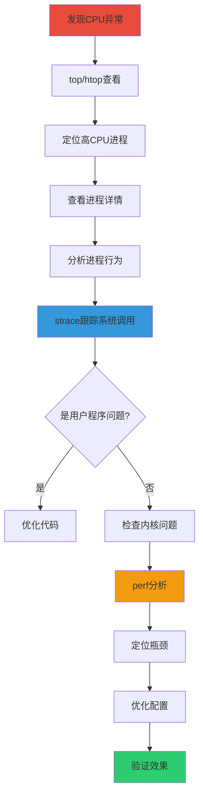

#### 实战命令

```bash
# 1. 快速定位高CPU进程
top -b -n 1 | head -20

# 2. 查看进程详细信息
ps -eo pid,ppid,cmd,%mem,%cpu,etime --sort=-%cpu | head -20

# 3. 查看进程的线程
ps -eLf | grep <PID>

# 4. 跟踪系统调用
strace -p <PID> -c  # 统计系统调用
strace -p <PID> -f  # 跟踪进程和子进程

# 5. 查看进程打开的文件
lsof -p <PID>

# 6. 查看进程的网络连接
ss -tunap | grep <PID>

# 7. 使用perf分析
perf top -p <PID>
perf record -p <PID> -g
perf report

# 8. 查看进程的内存映射
cat /proc/<PID>/maps

# 9. 查看进程的栈
cat /proc/<PID>/stack
```

#### 实战案例

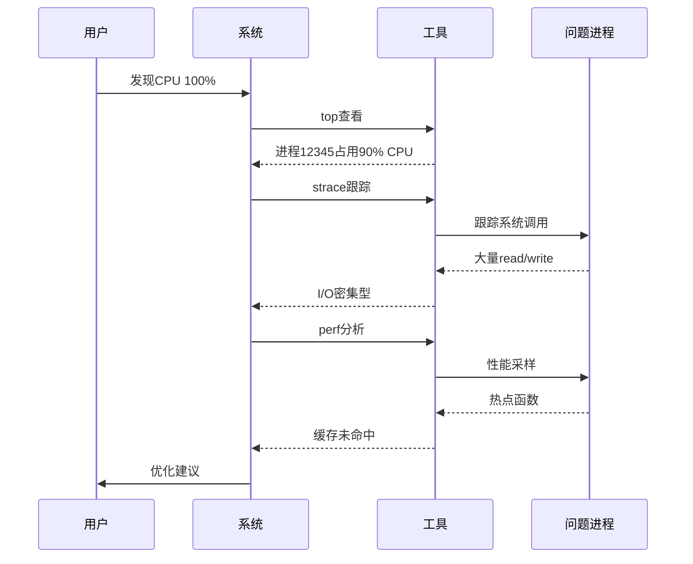

### 2.2 实战场景：僵尸进程清理

#### 场景描述
系统中出现大量僵尸进程，需要清理并找出原因。

#### 实战步骤

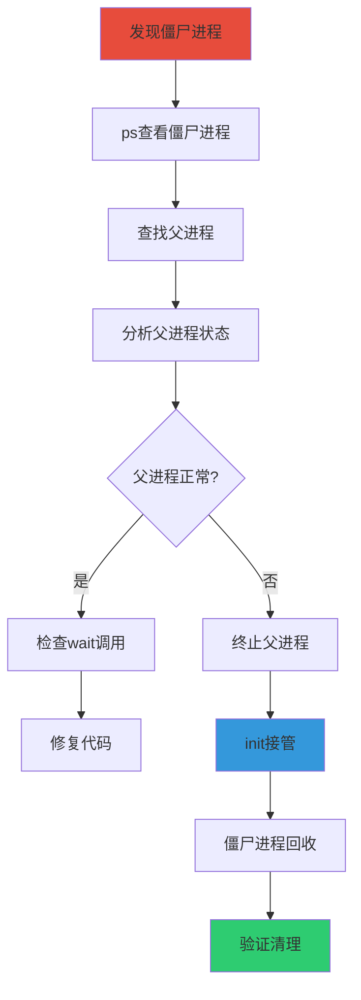

#### 实战命令

```bash
# 1. 查找僵尸进程
ps aux | grep Z

# 2. 查看僵尸进程的父进程
ps -eo pid,ppid,state,cmd | grep Z

# 3. 查看父进程详细信息
ps -fp <PPID>

# 4. 查看父进程的代码（如果有）
strace -p <PPID>

# 5. 终止父进程（让init接管）
kill -9 <PPID>

# 6. 验证僵尸进程是否被回收
ps aux | grep Z

# 7. 检查系统调用
strace -f -e trace=waitpid,wait4 <PPID>
```

### 2.3 实战场景：进程资源限制

#### 场景描述
防止进程占用过多资源导致系统不稳定，需要设置合理的资源限制。

#### 实战命令

```bash
# 1. 查看当前资源限制
ulimit -a

# 2. 临时修改资源限制
ulimit -n 4096          # 文件描述符数量
ulimit -u 4096          # 用户进程数
ulimit -v unlimited     # 虚拟内存
ulimit -m unlimited     # 物理内存

# 3. 永久修改（/etc/security/limits.conf）
echo "* soft nofile 4096" | sudo tee -a /etc/security/limits.conf
echo "* hard nofile 8192" | sudo tee -a /etc/security/limits.conf

# 4. 使用cgroup限制资源
sudo cgcreate -g cpu,memory:/mygroup

# 限制CPU使用
echo 50000 | sudo tee /sys/fs/cgroup/cpu/mygroup/cpu.cfs_quota_us
echo 100000 | sudo tee /sys/fs/cgroup/cpu/mygroup/cpu.cfs_period_us

# 限制内存使用
echo 1G | sudo tee /sys/fs/cgroup/memory/mygroup/memory.limit_in_bytes

# 将进程加入cgroup
echo <PID> | sudo tee /sys/fs/cgroup/cpu/mygroup/tasks
echo <PID> | sudo tee /sys/fs/cgroup/memory/mygroup/tasks

# 5. 查看cgroup状态
cat /sys/fs/cgroup/cpu/mygroup/tasks
cat /sys/fs/cgroup/memory/mygroup/memory.usage_in_bytes
```

---

## 三、文件系统实战

### 3.1 实战场景：磁盘I/O性能分析

#### 场景描述
系统磁盘I/O性能差，需要分析原因并优化。

#### 实战步骤

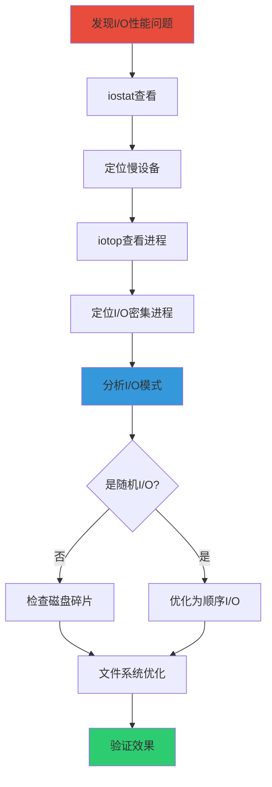

#### 实战命令

```bash
# 1. 查看磁盘I/O统计
iostat -x 1 10

# 2. 查看进程的I/O
iotop -o -b -n 5

# 3. 查看磁盘使用情况
df -h

# 4. 查看inode使用情况
df -i

# 5. 查找大文件
find / -type f -size +100M 2>/dev/null | head -20

# 6. 查看文件系统信息
tune2fs -l /dev/sda1
dumpe2fs -h /dev/sda1

# 7. 检查磁盘健康
sudo smartctl -a /dev/sda

# 8. 使用strace分析I/O
strace -c -p <PID> 2>&1 | grep -E "read|write|open"

# 9. 查看文件系统挂载选项
mount | grep sda1

# 10. 重新挂载优化选项
sudo mount -o remount,noatime,nodiratime,data=writeback /
```

### 3.2 实战场景：文件监控

#### 场景描述
监控文件系统变化，用于审计或调试。

#### 实战命令

```bash
# 1. 使用inotify监控文件变化
inotifywait -m -r -e create,delete,modify,move /path/to/watch

# 2. 查看文件的访问时间
stat filename

# 3. 查找最近修改的文件
find /path -type f -mtime -7

# 4. 查找最近访问的文件
find /path -type f -atime -7

# 5. 查找打开的文件
lsof /path/to/file

# 6. 监控文件描述符
watch -n 1 'ls -l /proc/<PID>/fd | wc -l'

# 7. 监控目录大小变化
watch -n 1 'du -sh /path/to/dir'

# 8. 使用auditd监控
sudo auditctl -w /etc/passwd -p wa -k passwd_changes
sudo ausearch -k passwd_changes
```

### 3.3 实战场景：文件系统优化

#### 实战命令

```bash
# 1. 调整ext4参数
tune2fs -o journal_data_writeback /dev/sda1
tune2fs -O dir_index /dev/sda1
tune2fs -O has_journal /dev/sda1
tune2fs -O sparse_super /dev/sda1

# 2. 调整挂载选项
sudo mount -o remount,noatime,nodiratime,data=writeback,barrier=0 /

# 3. 调整inode缓存
echo 100000 | sudo tee /proc/sys/fs/inode-state

# 4. 调整dentry缓存
echo 200000 | sudo tee /proc/sys/fs/dentry-state

# 5. 调整文件描述符限制
echo 100000 | sudo tee /proc/sys/fs/file-max

# 6. 清理页缓存
echo 3 | sudo tee /proc/sys/vm/drop_caches

# 7. 调整脏页回写
echo 5 | sudo tee /proc/sys/vm/dirty_background_ratio
echo 10 | sudo tee /proc/sys/vm/dirty_ratio
echo 1000 | sudo tee /proc/sys/vm/dirty_writeback_centisecs
echo 3000 | sudo tee /proc/sys/vm/dirty_expire_centisecs

# 8. 检查文件系统
sudo fsck -f /dev/sda1

# 9. 碎片整理
sudo e4defrag /path/to/file
sudo e4defrag /path/to/directory
```

---

## 四、内存管理实战

### 4.1 实战场景：内存泄漏检测

#### 场景描述
应用程序存在内存泄漏，需要定位并修复。

#### 实战步骤

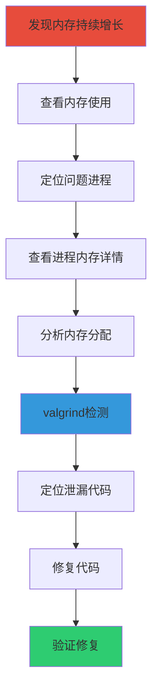

#### 实战命令

```bash
# 1. 查看系统内存使用
free -h
cat /proc/meminfo

# 2. 查看进程内存使用
ps aux --sort=-%mem | head -20
smem -k -P <process_name>

# 3. 查看进程内存映射
cat /proc/<PID>/maps
pmap -x <PID>

# 4. 查看进程内存统计
cat /proc/<PID>/status | grep -E "VmRSS|VmSize|VmPeak"

# 5. 使用valgrind检测内存泄漏
valgrind --leak-check=full --show-leak-kinds=all ./program

# 6. 使用AddressSanitizer
gcc -fsanitize=address -g program.c
./a.out

# 7. 查看slab缓存
cat /proc/slabinfo
slabtop

# 8. 查看内存碎片
cat /proc/buddyinfo

# 9. 查看swap使用
free -h
swapon -s

# 10. 监控内存使用
watch -n 1 'free -h'
```

### 4.2 实战场景：OOM（Out of Memory）分析

#### 场景描述
系统触发OOM Killer，需要分析原因。

#### 实战步骤

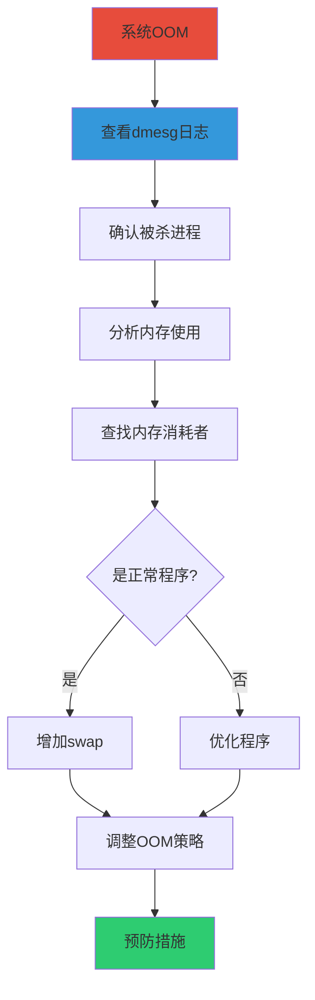

#### 实战命令

```bash
# 1. 查看OOM日志
dmesg | grep -i "killed process"
dmesg | grep -i "out of memory"
journalctl -k | grep -i oom

# 2. 查看当前内存使用
free -h
cat /proc/meminfo

# 3. 查看进程内存使用
ps aux --sort=-%mem | head -20

# 4. 查看OOM分数
cat /proc/<PID>/oom_score
cat /proc/<PID>/oom_adj

# 5. 调整OOM分数
echo -1000 | sudo tee /proc/<PID>/oom_score_adj

# 6. 调整swap
sudo swapon /swapfile
sudo swapon -s

# 7. 调整vm参数
echo 1 | sudo tee /proc/sys/vm/overcommit_memory
echo 50 | sudo tee /proc/sys/vm/overcommit_ratio

# 8. 启用OOM Killer
echo 1 | sudo tee /proc/sys/vm/panic_on_oom

# 9. 查看内存压力
cat /proc/pressure/memory

# 10. 监控内存
vmstat 1 10
```

### 4.3 实战场景：缓存优化

#### 实战命令

```bash
# 1. 查看页缓存
cat /proc/meminfo | grep -E "Cached|Buffers|Dirty|Writeback"

# 2. 清理缓存
echo 1 | sudo tee /proc/sys/vm/drop_caches  # 清理页缓存
echo 2 | sudo tee /proc/sys/vm/drop_caches  # 清理目录项和inode
echo 3 | sudo tee /proc/sys/vm/drop_caches  # 清理所有缓存

# 3. 调整脏页参数
echo 5 | sudo tee /proc/sys/vm/dirty_background_ratio
echo 10 | sudo tee /proc/sys/vm/dirty_ratio
echo 1000 | sudo tee /proc/sys/vm/dirty_writeback_centisecs
echo 3000 | sudo tee /proc/sys/vm/dirty_expire_centisecs

# 4. 调整swap使用倾向
echo 10 | sudo tee /proc/sys/vm/swappiness

# 5. 查看swap使用
cat /proc/vmstat | grep -E "pswpin|pswpout"

# 6. 预读优化
blockdev --getra /dev/sda
blockdev --setra 8192 /dev/sda

# 7. 查看缓存命中率
perf stat -e cache-references,cache-misses ./program

# 8. 使用hugepages
echo 100 | sudo tee /proc/sys/vm/nr_hugepages
cat /proc/meminfo | grep Huge

# 9. 查看内存碎片
cat /proc/buddyinfo
cat /proc/pagetypeinfo

# 10. 监控内存
vmstat 1 10
sar -r 1 10
```

---

## 五、网络栈实战

### 5.1 实战场景：网络性能调优

#### 场景描述
网络性能不佳，需要优化网络栈参数。

#### 实战步骤

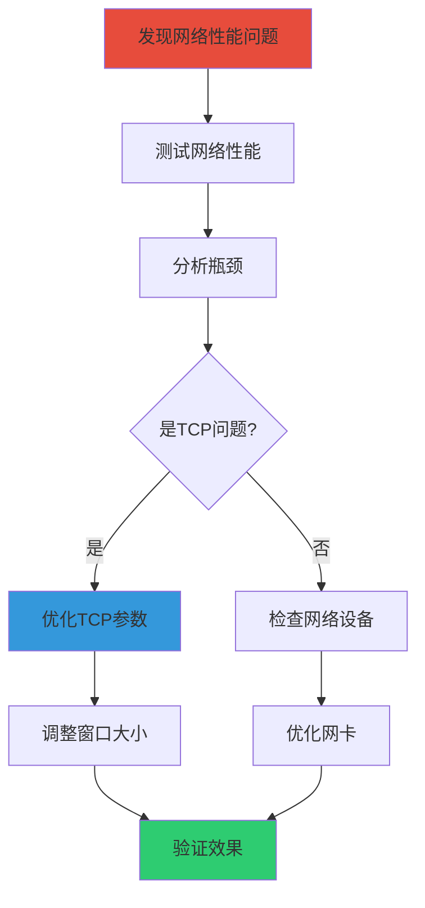

#### 实战命令

```bash
# 1. 测试网络性能
iperf3 -c <server_ip> -t 30
ping -c 100 <server_ip>

# 2. 查看网络统计
netstat -s
ss -s
cat /proc/net/snmp

# 3. 查看TCP连接
ss -tunap
netstat -tunap

# 4. 调整TCP窗口
echo "net.core.rmem_max = 16777216" | sudo tee -a /etc/sysctl.conf
echo "net.core.wmem_max = 16777216" | sudo tee -a /etc/sysctl.conf
echo "net.ipv4.tcp_rmem = 4096 87380 16777216" | sudo tee -a /etc/sysctl.conf
echo "net.ipv4.tcp_wmem = 4096 65536 16777216" | sudo tee -a /etc/sysctl.conf

# 5. 启用TCP窗口缩放
echo "net.ipv4.tcp_window_scaling = 1" | sudo tee -a /etc/sysctl.conf

# 6. 调整TCP连接队列
echo "net.core.somaxconn = 1024" | sudo tee -a /etc/sysctl.conf
echo "net.ipv4.tcp_max_syn_backlog = 2048" | sudo tee -a /etc/sysctl.conf

# 7. 启用TCP快速打开
echo "net.ipv4.tcp_fastopen = 3" | sudo tee -a /etc/sysctl.conf

# 8. 调整TCP保活
echo "net.ipv4.tcp_keepalive_time = 600" | sudo tee -a /etc/sysctl.conf
echo "net.ipv4.tcp_keepalive_intvl = 30" | sudo tee -a /etc/sysctl.conf
echo "net.ipv4.tcp_keepalive_probes = 3" | sudo tee -a /etc/sysctl.conf

# 9. 应用配置
sudo sysctl -p

# 10. 监控网络
iftop -i eth0
nload eth0
```

### 5.2 实战场景：网络连接追踪

#### 实战命令

```bash
# 1. 查看连接追踪表
sudo conntrack -L
sudo conntrack -L | wc -l

# 2. 查看连接追踪统计
sudo conntrack -S

# 3. 查看特定连接
sudo conntrack -L -p tcp --src <ip> --sport <port>

# 4. 删除连接
sudo conntrack -D -p tcp --src <ip> --sport <port>

# 5. 清空连接追踪表
sudo conntrack -F

# 6. 调整连接追踪表大小
echo "net.netfilter.nf_conntrack_max = 1000000" | sudo tee -a /etc/sysctl.conf

# 7. 调整超时时间
echo "net.netfilter.nf_conntrack_tcp_timeout_established = 1200" | sudo tee -a /etc/sysctl.conf

# 8. 查看连接追踪日志
sudo dmesg | grep conntrack

# 9. 监控连接追踪
watch -n 1 'sudo conntrack -L | wc -l'

# 10. 使用iptables记录
sudo iptables -A INPUT -m conntrack --ctstate NEW -j LOG --log-prefix "NEW_CONN: "
```

### 5.3 实战场景：防火墙配置

#### 实战命令

```bash
# 1. 查看防火墙规则
sudo iptables -L -n -v
sudo iptables -t nat -L -n -v

# 2. 清空规则
sudo iptables -F
sudo iptables -t nat -F

# 3. 设置默认策略
sudo iptables -P INPUT DROP
sudo iptables -P FORWARD DROP
sudo iptables -P OUTPUT ACCEPT

# 4. 允许本地回环
sudo iptables -A INPUT -i lo -j ACCEPT

# 5. 允许已建立的连接
sudo iptables -A INPUT -m conntrack --ctstate ESTABLISHED,RELATED -j ACCEPT

# 6. 开放特定端口
sudo iptables -A INPUT -p tcp --dport 22 -j ACCEPT
sudo iptables -A INPUT -p tcp --dport 80 -j ACCEPT
sudo iptables -A INPUT -p tcp --dport 443 -j ACCEPT

# 7. 限制连接速率
sudo iptables -A INPUT -p tcp --dport 22 -m limit --limit 3/min --limit-burst 3 -j ACCEPT

# 8. 防止DDoS
sudo iptables -A INPUT -p tcp --syn -m limit --limit 1/s --limit-burst 3 -j ACCEPT

# 9. 记录日志
sudo iptables -A INPUT -j LOG --log-prefix "DROPPED: "

# 10. 保存规则
sudo iptables-save | sudo tee /etc/iptables/rules.v4
```

---

## 六、设备驱动实战

### 6.1 实战场景：字符设备驱动开发

#### 实战步骤

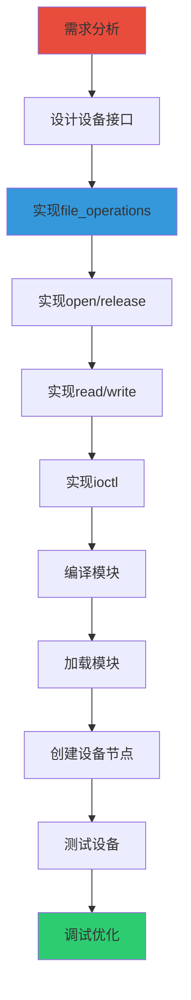

#### 实战代码框架

```c
#include <linux/module.h>
#include <linux/fs.h>
#include <linux/cdev.h>
#include <linux/uaccess.h>

#define DEVICE_NAME "mychar"
#define BUF_LEN 1024

static int major_num;
static char device_buffer[BUF_LEN];
static int buffer_pos = 0;

static int device_open(struct inode *inode, struct file *file) {
    printk(KERN_INFO "Device opened\n");
    return 0;
}

static int device_release(struct inode *inode, struct file *file) {
    printk(KERN_INFO "Device closed\n");
    return 0;
}

static ssize_t device_read(struct file *file, char __user *buf, 
                          size_t len, loff_t *off) {
    int bytes_read = 0;
    
    if (*off >= buffer_pos)
        return 0;
    
    if (*off + len > buffer_pos)
        len = buffer_pos - *off;
    
    if (copy_to_user(buf, device_buffer + *off, len))
        return -EFAULT;
    
    *off += len;
    bytes_read = len;
    
    printk(KERN_INFO "Read %d bytes\n", bytes_read);
    return bytes_read;
}

static ssize_t device_write(struct file *file, const char __user *buf,
                           size_t len, loff_t *off) {
    if (len >= BUF_LEN)
        return -ENOSPC;
    
    if (copy_from_user(device_buffer, buf, len))
        return -EFAULT;
    
    buffer_pos = len;
    printk(KERN_INFO "Wrote %d bytes\n", len);
    return len;
}

static struct file_operations fops = {
    .owner = THIS_MODULE,
    .open = device_open,
    .release = device_release,
    .read = device_read,
    .write = device_write,
};

static int __init mychar_init(void) {
    major_num = register_chrdev(0, DEVICE_NAME, &fops);
    if (major_num < 0) {
        printk(KERN_ALERT "Failed to register device\n");
        return major_num;
    }
    
    printk(KERN_INFO "Device registered with major %d\n", major_num);
    return 0;
}

static void __exit mychar_exit(void) {
    unregister_chrdev(major_num, DEVICE_NAME);
    printk(KERN_INFO "Device unregistered\n");
}

module_init(mychar_init);
module_exit(mychar_exit);

MODULE_LICENSE("GPL");
MODULE_AUTHOR("Your Name");
MODULE_DESCRIPTION("A simple character device driver");
```

#### 编译和加载

```bash
# Makefile
obj-m += mychar.o

all:
	make -C /lib/modules/$(shell uname -r)/build M=$(PWD) modules

clean:
	make -C /lib/modules/$(shell uname -r)/build M=$(PWD) clean

# 编译
make

# 加载模块
sudo insmod mychar.ko

# 查看模块
lsmod | grep mychar
cat /proc/modules | grep mychar

# 查看设备号
cat /proc/devices | grep mychar

# 创建设备节点
sudo mknod /dev/mychar c <major_num> 0
sudo chmod 666 /dev/mychar

# 测试设备
echo "Hello" > /dev/mychar
cat /dev/mychar

# 卸载模块
sudo rmmod mychar
sudo rm /dev/mychar
```

### 6.2 实战场景：设备调试

#### 实战命令

```bash
# 1. 查看内核日志
dmesg | tail
dmesg | grep mychar

# 2. 实时查看日志
dmesg -w

# 3. 使用strace调试用户程序
strace -e open,read,write ./test_program

# 4. 使用ftrace跟踪内核函数
echo function > /sys/kernel/debug/tracing/current_tracer
echo mychar_read > /sys/kernel/debug/tracing/set_ftrace_filter
cat /sys/kernel/debug/tracing/trace

# 5. 使用perf分析
perf record -e kprobes:mychar_read ./test_program
perf report

# 6. 使用crash分析
sudo crash
> bt
> mod -s mychar
> dis mychar_read

# 7. 使用gdb调试内核
sudo gdb vmlinux
(gdb) target remote :1234
(gdb) break mychar_read
(gdb) continue

# 8. 查看模块信息
modinfo mychar.ko

# 9. 查看模块参数
cat /sys/module/mychar/parameters/*

# 10. 动态调试
echo 'file mychar.c +p' > /sys/kernel/debug/dynamic_debug/control
```

---

## 七、性能分析与优化

### 7.1 实战场景：系统性能分析

#### 实战步骤


#### 实战工具使用

```bash
# 1. perf - 性能分析工具
# 记录性能数据
perf record -g ./program

# 查看报告
perf report

# 查看热点函数
perf top

# 统计系统调用
perf stat ./program

# 查看CPU周期
perf stat -e cycles,instructions,cache-references,cache-misses ./program

# 2. strace - 系统调用跟踪
strace -c ./program
strace -e trace=open,read,write ./program

# 3. ltrace - 库函数跟踪
ltrace -c ./program
ltrace -e printf ./program

# 4. valgrind - 内存分析
valgrind --leak-check=full ./program
valgrind --tool=callgrind ./program

# 5. bpftrace - 动态追踪
sudo bpftrace -e 'tracepoint:sched:sched_switch { @[comm] = count(); }'

# 6. sysstat - 系统统计
iostat -x 1 10
mpstat -P ALL 1 10
sar -u 1 10
sar -r 1 10

# 7. htop - 交互式进程查看器
htop

# 8. iotop - I/O监控
sudo iotop -o

# 9. iftop - 网络监控
sudo iftop -i eth0

# 10. vmstat - 虚拟内存统计
vmstat 1 10
```

### 7.2 实战场景：热点函数优化

#### 实战步骤

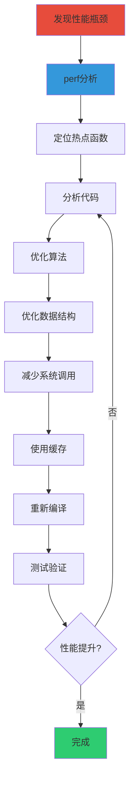

#### 优化技巧

```c
// 1. 使用内联函数
static inline int fast_function(int x) {
    return x * 2;
}

// 2. 减少函数调用
// 优化前
for (int i = 0; i < n; i++) {
    result += process(data[i]);
}

// 优化后
for (int i = 0; i < n; i++) {
    result += data[i] * 2; // 直接内联处理
}

// 3. 使用位运算
// 优化前
x = x * 4;
x = x / 2;

// 优化后
x = x << 2;
x = x >> 1;

// 4. 减少内存分配
// 优化前
for (int i = 0; i < n; i++) {
    char *buf = malloc(1024);
    process(buf);
    free(buf);
}

// 优化后
char *buf = malloc(1024);
for (int i = 0; i < n; i++) {
    process(buf);
}
free(buf);

// 5. 使用缓存友好的数据结构
// 优化前：链表（缓存不友好）
struct node {
    int value;
    struct node *next;
};

// 优化后：数组（缓存友好）
int array[SIZE];
for (int i = 0; i < SIZE; i++) {
    process(array[i]);
}

// 6. 批量处理
// 优化前
for (int i = 0; i < n; i++) {
    write(fd, &data[i], sizeof(int));
}

// 优化后
write(fd, data, n * sizeof(int));

// 7. 使用零拷贝
// 优化前
read(fd1, buffer, size);
write(fd2, buffer, size);

// 优化后
sendfile(fd2, fd1, NULL, size);

// 8. 预取数据
__builtin_prefetch(&data[i + 16]);
```

---

## 八、内核调试技巧

### 8.1 实战场景：内核崩溃调试

#### 实战步骤

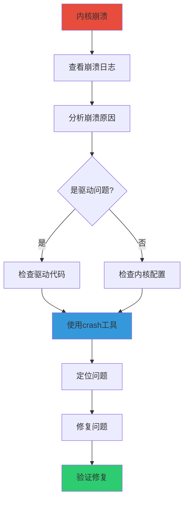

#### 实战命令

```bash
# 1. 配置kdump
sudo apt-get install kexec-tools makedumpfile
sudo systemctl enable kdump
sudo systemctl start kdump

# 2. 查看内核崩溃日志
sudo dmesg | grep -i "kernel panic"
sudo dmesg | grep -i "oops"
sudo dmesg | grep -i "bug"

# 3. 查看vmcore
ls -lh /var/crash/
sudo crash /usr/lib/debug/lib/modules/$(uname -r)/vmlinux /var/crash/<vmcore>

# 4. 使用crash分析
> bt                    # 查看堆栈
> bt -a                 # 查看所有线程的堆栈
> log                   # 查看内核日志
> sys                   # 查看系统信息
> mod -s <module>       # 加载模块符号
> dis <function>        # 反汇编函数
> struct <struct>       # 查看结构体

# 5. 使用ftrace
echo function > /sys/kernel/debug/tracing/current_tracer
echo 1 > /sys/kernel/debug/tracing/tracing_on
cat /sys/kernel/debug/tracing/trace

# 6. 使用kprobes
echo 'p:myprobe do_sys_open' > /sys/kernel/debug/tracing/kprobe_events
echo 1 > /sys/kernel/debug/tracing/events/kprobes/enable
cat /sys/kernel/debug/tracing/trace

# 7. 使用gdb调试内核
sudo gdb vmlinux /proc/kcore
(gdb) bt
(gdb) info threads
(gdb) thread apply all bt

# 8. 启用内核调试选项
CONFIG_DEBUG_INFO=y
CONFIG_DEBUG_KERNEL=y
CONFIG_DEBUG_INFO_REDUCED=y
CONFIG_FRAME_POINTER=y
CONFIG_KALLSYMS=y
CONFIG_KALLSYMS_ALL=y

# 9. 使用magic sysrq
echo 1 > /proc/sys/kernel/sysrq
# Alt+SysRq+t - 显示所有任务状态
# Alt+SysRq+m - 显示内存信息
# Alt+SysRq+w - 显示阻塞的任务

# 10. 查看内核配置
zcat /proc/config.gz | grep -i debug
```

### 8.2 实战场景：死锁调试

#### 实战命令

```bash
# 1. 查看锁信息
cat /proc/locks

# 2. 查看死锁任务
cat /proc/<PID>/stack
cat /proc/<PID>/wchan

# 3. 使用lockdep
echo 1 > /proc/sys/kernel/lockdep
cat /proc/lockdep_stats
cat /proc/lock_stat

# 4. 查看锁依赖
cat /proc/lockdep

# 5. 使用strace跟踪锁
strace -e trace=flock,fcntl ./program

# 6. 使用perf分析锁
perf record -e lock:* ./program
perf report

# 7. 查看进程状态
ps aux | grep D
cat /proc/<PID>/status | grep State

# 8. 查看内核栈
cat /proc/<PID>/stack

# 9. 使用crash分析
sudo crash vmlinux /var/crash/<vmcore>
> foreach bt
> foreach task -R

# 10. 启用lockdep调试
CONFIG_PROVE_LOCKING=y
CONFIG_LOCKDEP=y
CONFIG_DEBUG_LOCK_ALLOC=y
```

---

## 九、综合案例分析

### 9.1 案例：高并发Web服务器优化

#### 问题描述
一个Web服务器在高并发情况下性能不佳，响应时间长。

#### 分析过程

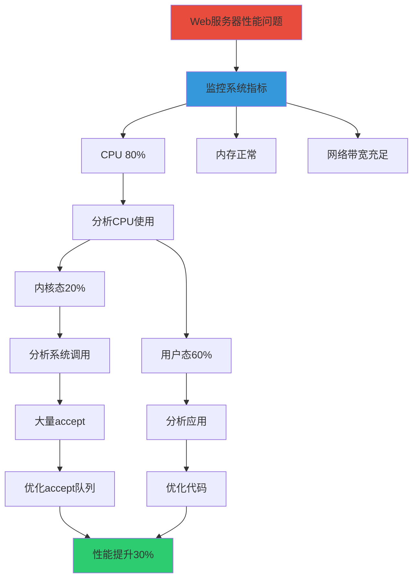

#### 解决方案

```bash
# 1. 调整TCP参数
echo "net.core.somaxconn = 65535" | sudo tee -a /etc/sysctl.conf
echo "net.ipv4.tcp_max_syn_backlog = 65535" | sudo tee -a /etc/sysctl.conf
echo "net.ipv4.tcp_tw_reuse = 1" | sudo tee -a /etc/sysctl.conf

# 2. 调整文件描述符
echo "* soft nofile 65535" | sudo tee -a /etc/security/limits.conf
echo "* hard nofile 65535" | sudo tee -a /etc/security/limits.conf

# 3. 使用epoll代替select
# 应用代码修改

# 4. 启用TCP快速打开
echo "net.ipv4.tcp_fastopen = 3" | sudo tee -a /etc/sysctl.conf

# 5. 应用配置
sudo sysctl -p

# 6. 验证效果
ab -n 10000 -c 100 http://localhost/
```

### 9.2 案例：数据库性能优化

#### 问题描述
MySQL数据库查询慢，影响应用性能。

#### 分析过程

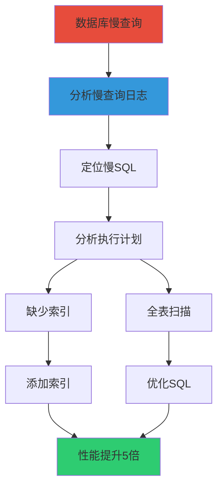

#### 解决方案

```bash
# 1. 查看慢查询
tail -f /var/log/mysql/slow.log

# 2. 分析慢查询
mysqldumpslow /var/log/mysql/slow.log

# 3. 查看执行计划
EXPLAIN SELECT * FROM table WHERE condition;

# 4. 添加索引
CREATE INDEX idx_column ON table(column);

# 5. 优化查询
-- 避免SELECT *
-- 使用索引
-- 避免子查询
-- 使用连接代替子查询

# 6. 调整MySQL参数
innodb_buffer_pool_size = 4G
innodb_log_file_size = 512M
innodb_flush_log_at_trx_commit = 2

# 7. 验证效果
mysqlslap --user=root --password --concurrency=100 --iterations=10 --query=query.sql
```

### 9.3 案例：嵌入式系统内存优化

#### 问题描述
嵌入式设备内存不足，需要优化内存使用。

#### 解决方案

```bash
# 1. 减少内核内存占用
# 配置内核选项
CONFIG_CC_OPTIMIZE_FOR_SIZE=y
CONFIG_KERNEL_GZIP=y
CONFIG_SLUB=y

# 2. 调整swap
echo 1 | sudo tee /proc/sys/vm/swappiness

# 3. 禁用不必要的服务
sudo systemctl disable bluetooth
sudo systemctl disable cups

# 4. 使用轻量级应用
# 使用busybox代替coreutils
# 使用musl libc代替glibc

# 5. 优化应用代码
# 使用静态链接
gcc -static -Os program.c -o program

# 6. 使用strace分析
strace -c ./program

# 7. 减少系统调用
# 批量处理
# 使用缓存

# 8. 查看内存使用
free -h
cat /proc/meminfo
smem -k

# 9. 使用valgrind检测泄漏
valgrind --leak-check=full ./program

# 10. 验证效果
free -h
```

---

## 十、总结与建议

### 10.1 学习路径

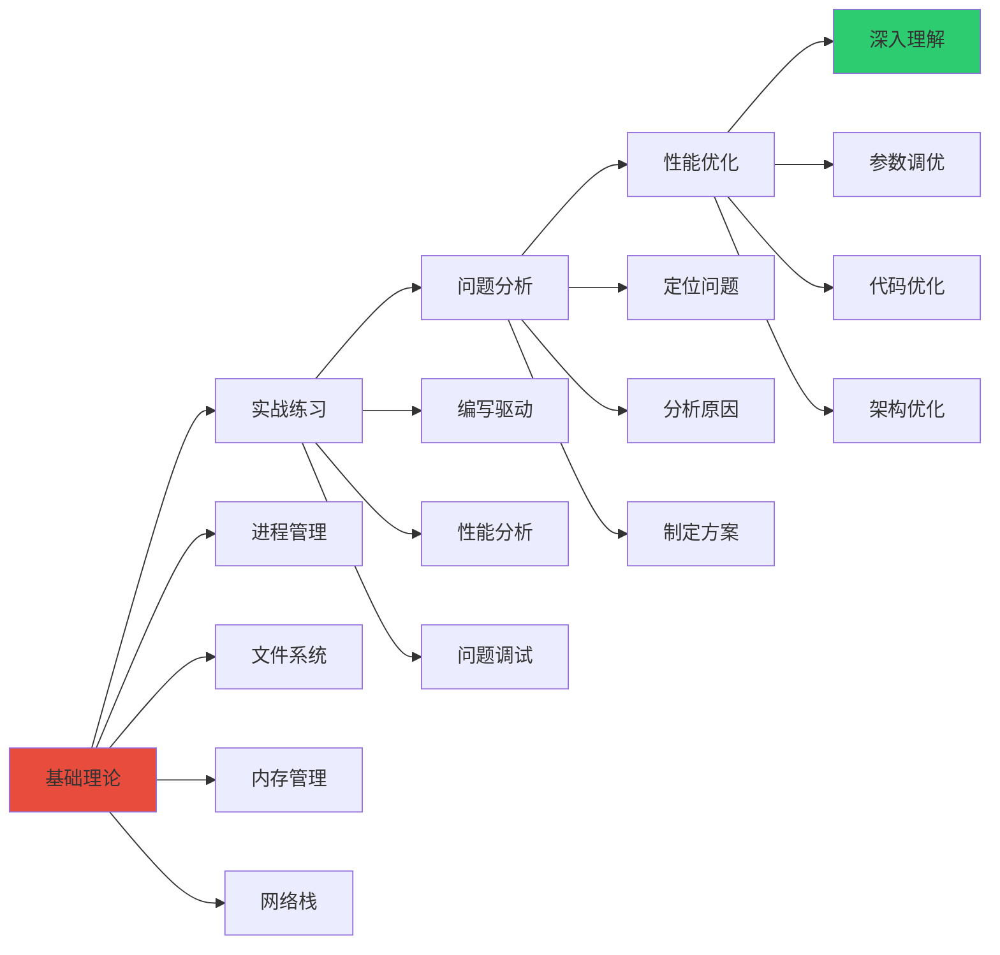

### 10.2 实战建议

1. **动手实践**：理论结合实践，多写代码多调试
2. **深入理解**：不要只知其然，要知其所以然
3. **使用工具**：熟练使用各种调试和分析工具
4. **持续学习**：内核不断更新，需要持续学习
5. **阅读源码**：阅读内核源码是学习的最好方式
6. **社区交流**：参与社区讨论，分享经验

### 10.3 推荐资源

- Linux内核源码：https://github.com/torvalds/linux
- Linux内核文档：https://www.kernel.org/doc/html/latest/
- LWN内核文章：https://lwn.net/Kernel/
-内核调试指南：https://www.kernel.org/doc/html/latest/admin-guide/kdump/index.html

---

*文档创建时间：2026年1月17日*
*内核版本参考：Linux 6.x*