# Linux 进程管理详解

> 参考书目：《Linux内核设计与实现》、《图解Linux内核 基于6.x》

---

## 一、进程概述

### 1.1 什么是进程

进程是程序执行的一个实例，是系统进行资源分配和调度的基本单位。从内核的角度看，进程由以下部分组成：

- **代码段**：存放程序代码
- **数据段**：存放程序数据
- **堆栈段**：存放局部变量和函数调用信息
- **进程控制块（PCB）**：存放进程的描述信息

### 1.2 进程与线程的区别

| 特性 | 进程 | 线程 |
|------|------|------|
| 资源拥有 | 独立拥有 | 共享进程资源 |
| 地址空间 | 独立 | 共享 |
| 通信方式 | IPC（管道、消息队列等） | 共享内存、全局变量 |
| 创建开销 | 大 | 小 |
| 切换开销 | 大 | 小 |

### 1.3 进程层次结构

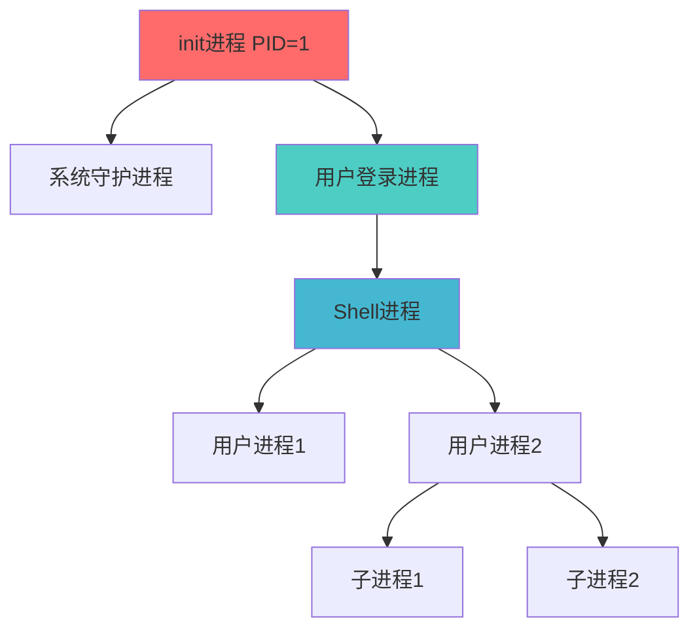

---

## 二、进程描述符（task_struct）

### 2.1 task_struct 结构概述

`task_struct` 是 Linux 内核中最重要的数据结构之一，包含了进程的所有信息。在 Linux 6.x 内核中，它定义在 `include/linux/sched.h` 中。

```mermaid
graph TB
    A[task_struct 进程描述符] --> B[进程标识信息]
    A --> C[进程状态信息]
    A --> D[进程调度信息]
    A --> E[进程亲属关系]
    A --> F[内存管理信息]
    A --> G[文件系统信息]
    A --> H[信号处理信息]
    A --> I[时间信息]
    A --> J[资源限制信息]
    
    B --> B1[PID/TGID]
    B --> B2[用户/组ID]
    B --> B3[会话ID]
    
    C --> C1[state]
    C --> C2[exit_state]
    C --> C3[flags]
    
    D --> D1[prio]
    D --> D2[static_prio]
    D --> D3[normal_prio]
    D --> D4[rt_priority]
    
    E --> E1[parent]
    E --> E2[real_parent]
    E --> E3[children]
    E --> E4[sibling]
    
    F --> F1[mm]
    F --> F2[active_mm]
    F --> F3[stack]
    
    G --> G1[fs]
    G --> G2[files]
    G --> G3[nsproxy]
    
    style A fill:#2ecc71
    style B fill:#3498db
    style C fill:#e74c3c
    style D fill:#f39c12
```

### 2.2 关键字段详解

#### 2.2.1 进程标识相关

```c
struct task_struct {
    volatile long state;          /* 进程状态 */
    int exit_state;               /* 退出状态 */
    unsigned int flags;           /* 进程标志 */
    unsigned int ptrace;          /* ptrace标志 */
    
    /* 进程标识符 */
    pid_t pid;                    /* 进程ID */
    pid_t tgid;                   /* 线程组ID */
    
    /* 用户标识符 */
    uid_t uid;                    /* 真实用户ID */
    gid_t gid;                    /* 真实组ID */
    uid_t euid;                   /* 有效用户ID */
    gid_t egid;                   /* 有效组ID */
    uid_t suid;                   /* 保存的用户ID */
    gid_t sgid;                   /* 保存的组ID */
    
    /* ... 其他字段 */
};
```

#### 2.2.2 进程调度相关

```c
struct task_struct {
    int prio, static_prio, normal_prio;
    unsigned int rt_priority;
    const struct sched_class *sched_class;
    struct sched_entity se;
    struct sched_rt_entity rt;
    
    /* 调度相关统计 */
    u64 utime;                    /* 用户态运行时间 */
    u64 stime;                    /* 内核态运行时间 */
    u64 gtime;                    /* 虚拟机运行时间 */
    unsigned long nvcsw;          /* 自愿上下文切换次数 */
    unsigned long nivcsw;         /* 非自愿上下文切换次数 */
    
    /* ... 其他字段 */
};
```

#### 2.2.3 进程亲属关系

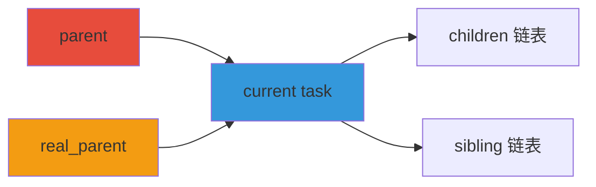

### 2.3 task_struct 的分配与释放

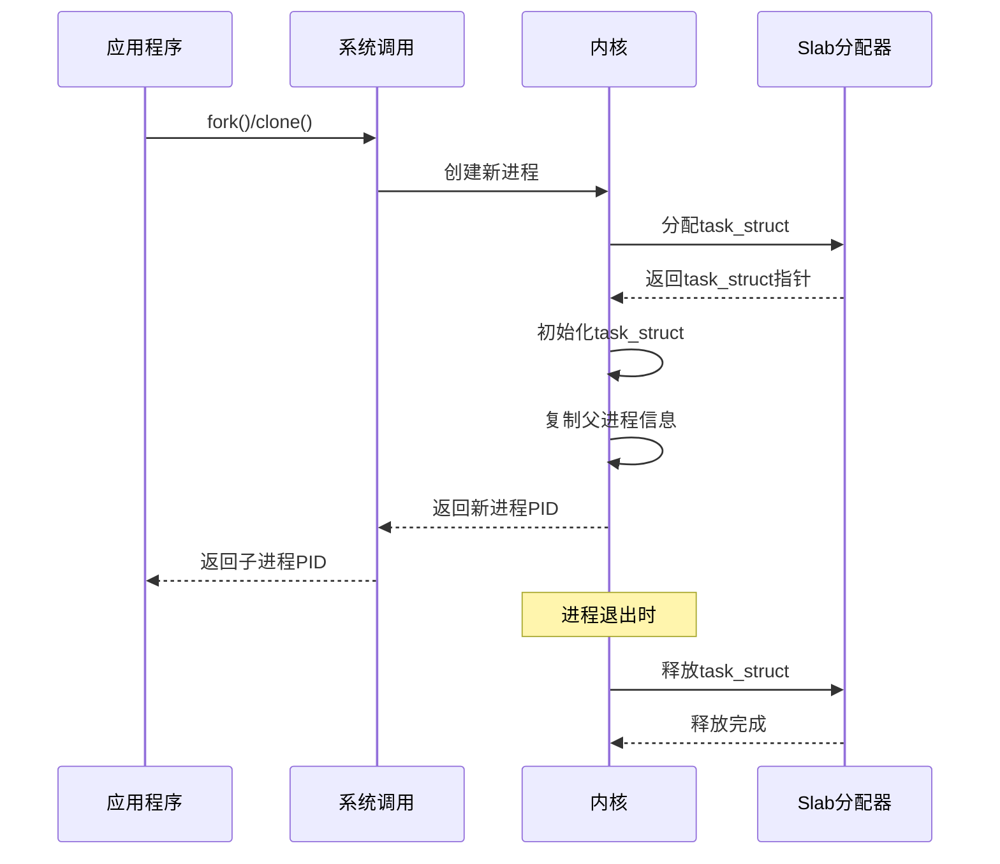

---

## 三、进程状态

### 3.1 进程状态转换图

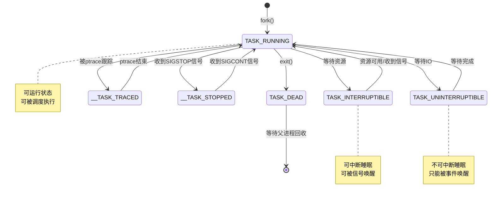

### 3.2 进程状态详细说明

| 状态 | 宏定义 | 说明 |
|------|--------|------|
| 可运行 | `TASK_RUNNING` | 进程正在CPU上运行或在运行队列中等待 |
| 可中断睡眠 | `TASK_INTERRUPTIBLE` | 进程被挂起，等待某个条件，可被信号唤醒 |
| 不可中断睡眠 | `TASK_UNINTERRUPTIBLE` | 进程被挂起，等待某个条件，不能被信号唤醒 |
| 被跟踪 | `__TASK_TRACED` | 进程被ptrace程序跟踪 |
| 已停止 | `__TASK_STOPPED` | 进程收到SIGSTOP等信号停止 |
| 已死亡 | `TASK_DEAD` | 进程已退出，等待父进程回收 |

### 3.3 进程状态操作函数

```c
// 设置进程状态
set_current_state(state);

// 设置进程状态并检查是否有抢占请求
set_current_state(state);
preempt_check_resched();

// 唤醒进程
wake_up_process(task);
wake_up_state(task, state);

// 进程睡眠
schedule();                // 主动让出CPU
wait_event(wq, condition); // 等待事件
```

---

## 四、进程创建

### 4.1 进程创建流程

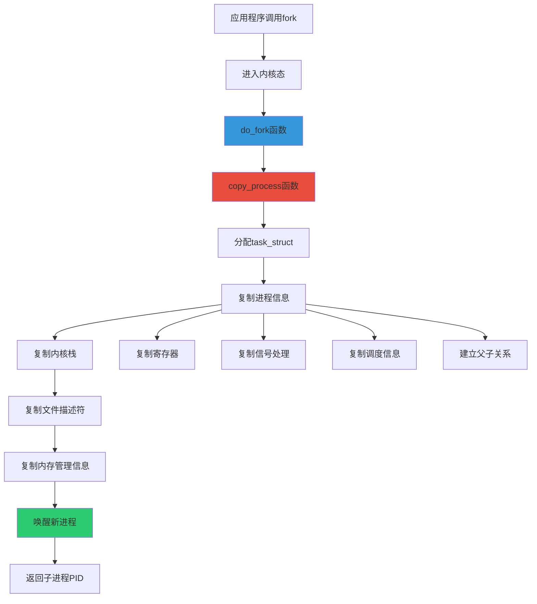

### 4.2 copy_process 函数详解

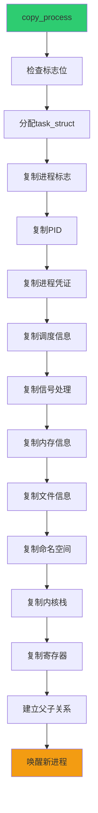

### 4.3 fork、vfork、clone 的区别

| 特性 | fork | vfork | clone |
|------|------|-------|-------|
| 创建方式 | 完全复制 | 共享地址空间 | 可定制复制 |
| 父子进程地址空间 | 独立 | 共享 | 可选 |
| 执行顺序 | 并发 | 子进程先执行 | 并发 |
| 用途 | 创建新进程 | 创建后立即exec | 创建线程 |
| 性能 | 较低 | 较高 | 高 |

### 4.4 写时复制（Copy-on-Write）

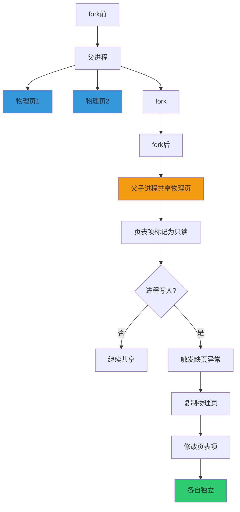

---

## 五、进程调度

### 5.1 调度器架构

Linux 6.x 使用 **CFS（Completely Fair Scheduler，完全公平调度器）** 作为普通进程的调度算法。

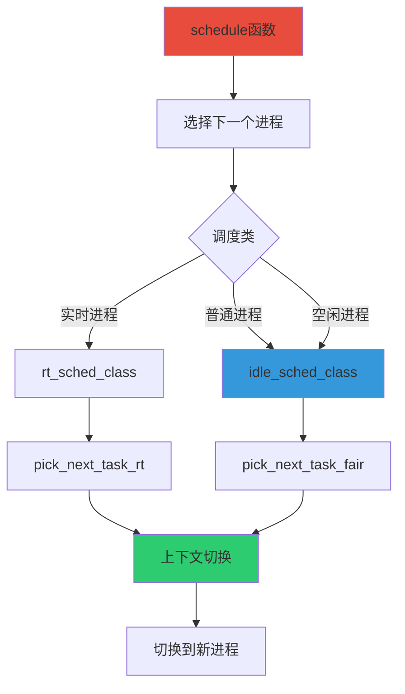

### 5.2 CFS 调度原理

CFS 使用红黑树来管理可运行进程，红黑树的键值是进程的虚拟运行时间（vruntime）。

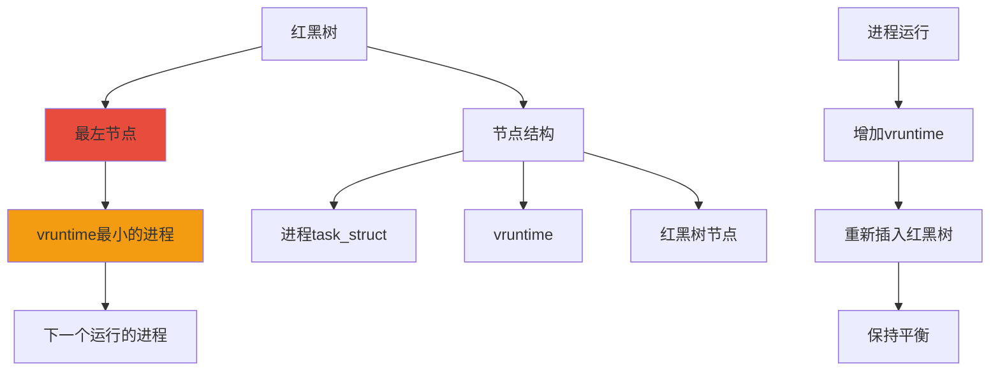

### 5.3 vruntime 计算公式

```
vruntime = 实际运行时间 × (NICE_0_LOAD / 进程权重)
```

其中：
- 实际运行时间：进程在CPU上运行的时间
- NICE_0_LOAD：nice值为0的进程权重（默认为1024）
- 进程权重：由nice值决定

### 5.4 进程优先级

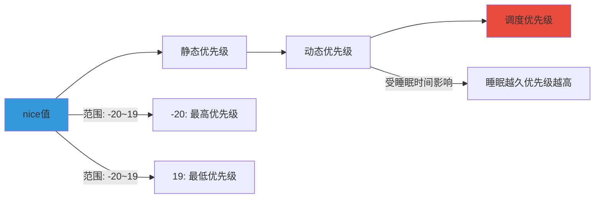

### 5.5 调度时机

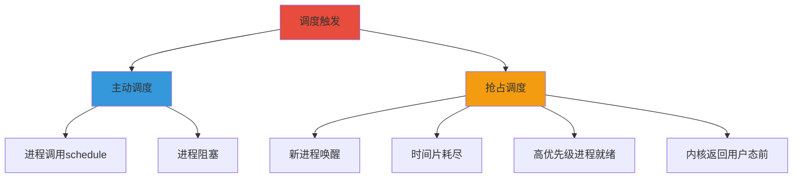

---

## 六、进程终止

### 6.1 进程终止流程

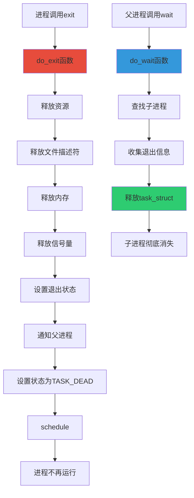

### 6.2 孤儿进程与僵尸进程

#### 僵尸进程


#### 孤儿进程


### 6.3 exit 与 _exit 的区别

| 特性 | exit | _exit |
|------|------|-------|
| 实现位置 | glibc库函数 | 系统调用 |
| 清理工作 | 执行 | 不执行 |
| 调用atexit | 是 | 否 |
| 刷新stdio缓冲区 | 是 | 否 |
| 关闭文件描述符 | 是 | 否 |

---

## 七、进程间通信（IPC）

### 7.1 IPC 机制分类

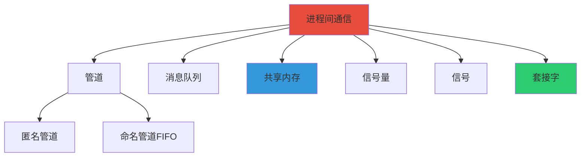

### 7.2 管道通信

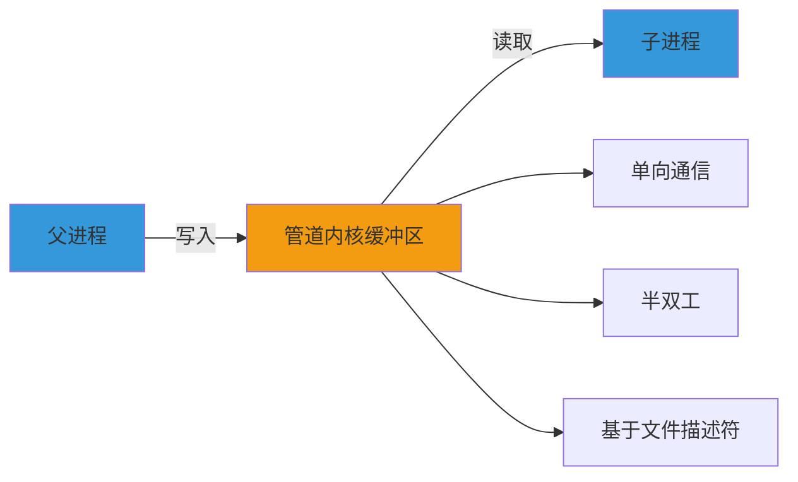

### 7.3 共享内存

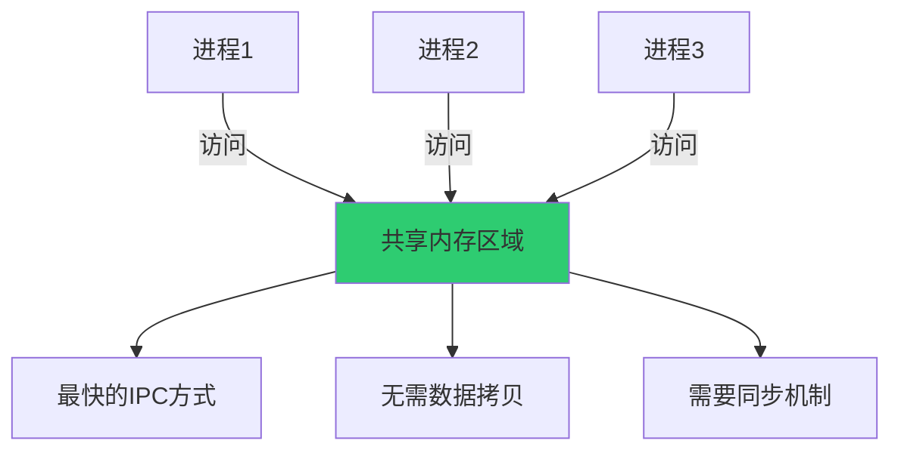

### 7.4 消息队列

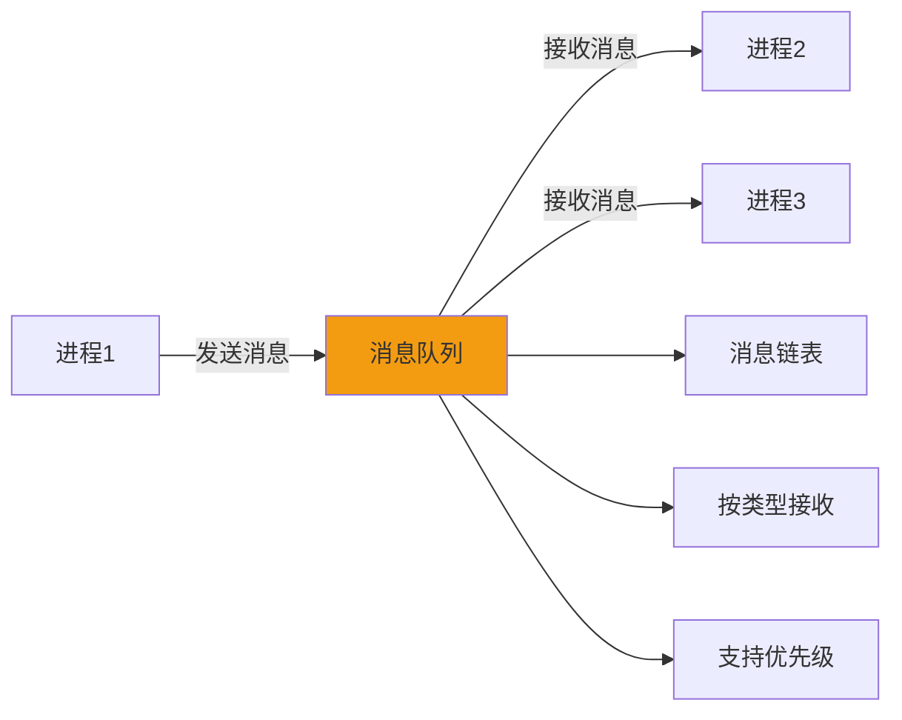

---

## 八、线程管理

### 8.1 线程实现方式

Linux 使用 **轻量级进程（LWP）** 来实现线程，线程和进程使用相同的 `task_struct` 结构。

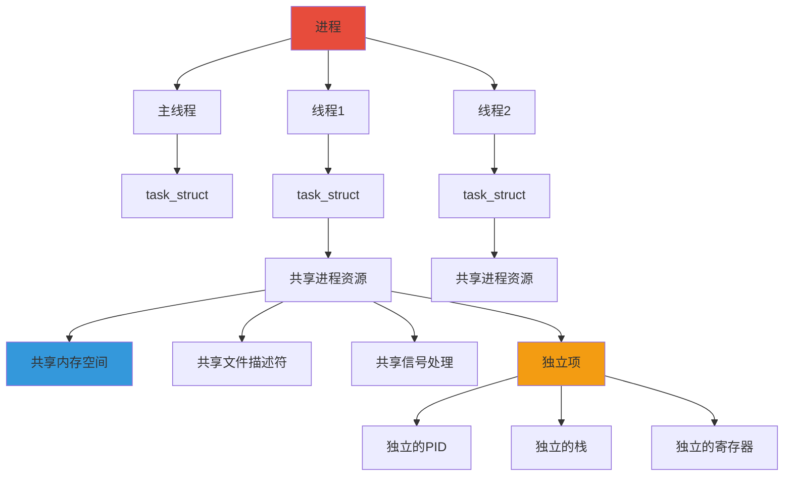

### 8.2 线程创建（pthread_create）

```mermaid
sequenceDiagram
    participant App as 应用程序
    participant Lib as pthread库
    participant Sys as 系统调用
    participant Kernel as 内核
    
    App->>Lib: pthread_create()
    Lib->>Sys: clone(CLONE_VM|CLONE_FS...)
    Sys->>Kernel: 创建新线程
    Kernel->>Kernel: 分配task_struct
    Kernel->>Kernel: 共享父进程资源
    Kernel->>Kernel: 创建独立栈
    Kernel-->>Sys: 返回新线程PID
    Sys-->>Lib: 返回成功
    Lib-->>App: 返回线程ID
    Kernel->>Kernel: 执行线程函数
```

### 8.3 线程同步

```mermaid
graph TB
    A[线程同步机制] --> B[互斥锁 mutex]
    A --> C[条件变量 condition]
    A --> D[读写锁 rwlock]
    A --> E[信号量 semaphore]
    A --> F[屏障 barrier]
    
    B --> B1[保护临界区]
    B --> B2[同一时刻只有一个线程]
    
    C --> C1[等待条件满足]
    C --> C2[通知机制]
    
    D --> D1[读者-写者问题]
    D --> D2[多读单写]
    
    style A fill:#e74c3c
    style B fill:#3498db
```

---

## 九、进程管理相关系统调用

### 9.1 进程控制

| 系统调用 | 功能 |
|----------|------|
| `fork()` | 创建子进程 |
| `vfork()` | 创建共享地址空间的子进程 |
| `clone()` | 创建进程或线程 |
| `execve()` | 执行新程序 |
| `exit()` | 终止当前进程 |
| `wait()` / `waitpid()` | 等待子进程终止 |
| `getpid()` | 获取进程ID |
| `getppid()` | 获取父进程ID |

### 9.2 进程调度

| 系统调用 | 功能 |
|----------|------|
| `nice()` | 设置进程nice值 |
| `setpriority()` | 设置进程优先级 |
| `getpriority()` | 获取进程优先级 |
| `sched_setscheduler()` | 设置调度策略 |
| `sched_getscheduler()` | 获取调度策略 |
| `sched_yield()` | 让出CPU |

### 9.3 进程间通信

| 系统调用 | 功能 |
|----------|------|
| `pipe()` | 创建管道 |
| `mkfifo()` | 创建命名管道 |
| `shmget()` | 创建共享内存 |
| `shmat()` | 附加共享内存 |
| `msgget()` | 创建消息队列 |
| `msgsnd()` | 发送消息 |
| `msgrcv()` | 接收消息 |
| `semget()` | 创建信号量集 |
| `semop()` | 操作信号量 |

---

## 十、进程管理调试工具

### 10.1 常用命令

```mermaid
graph TB
    A[进程管理工具] --> B[ps]
    A --> C[top]
    A --> D[htop]
    A --> E[pgrep]
    A --> F[pkill]
    A --> G[strace]
    A --> H[ltrace]
    
    B --> B1[查看进程快照]
    C --> C1[实时监控进程]
    D --> D1[交互式进程监控]
    E --> E1[查找进程]
    F --> F1[终止进程]
    G --> G1[跟踪系统调用]
    H --> H1[跟踪库函数调用]
    
    style A fill:#e74c3c
    style C fill:#3498db
    style G fill:#f39c12
```

### 10.2 /proc 文件系统

```mermaid
graph TB
    A[/proc文件系统] --> B[/proc/PID]
    B --> C[cmdline]
    B --> D[status]
    B --> E[stat]
    B --> F[maps]
    B --> G[fd]
    B --> H[stack]
    
    C --> C1[命令行参数]
    D --> D1[进程状态信息]
    E --> E1[进程统计信息]
    F --> F1[内存映射]
    G --> G1[打开的文件描述符]
    H --> H1[内核栈]
    
    style A fill:#2ecc71
    style B fill:#3498db
```

---

## 十一、总结

### 11.1 进程管理核心概念

1. **进程描述符（task_struct）**：内核管理进程的核心数据结构
2. **进程状态**：可运行、可中断睡眠、不可中断睡眠等
3. **进程创建**：fork、vfork、clone，使用写时复制优化
4. **进程调度**：CFS完全公平调度器，基于vruntime
5. **进程终止**：exit系统调用，父进程wait回收
6. **进程间通信**：管道、消息队列、共享内存、信号量等
7. **线程管理**：轻量级进程，共享进程资源

### 11.2 学习要点

```mermaid
mindmap
  root((进程管理))
    task_struct
      字段结构
      分配与释放
      亲属关系
    进程状态
      状态转换
      状态操作
      睡眠与唤醒
    进程创建
      fork/vfork/clone
      写时复制
      exec加载
    进程调度
      CFS调度器
      vruntime
      优先级
      调度时机
    进程终止
      exit流程
      僵尸进程
      孤儿进程
    IPC
      管道
      消息队列
      共享内存
      信号量
    线程
      轻量级进程
      pthread库
      同步机制
```

---

## 参考资源

- 《Linux内核设计与实现》
- 《图解Linux内核 基于6.x》
- Linux内核源码：https://github.com/torvalds/linux
- Linux内核文档：https://www.kernel.org/doc/html/latest/

---

*文档创建时间：2026年1月17日*
*内核版本参考：Linux 6.x*