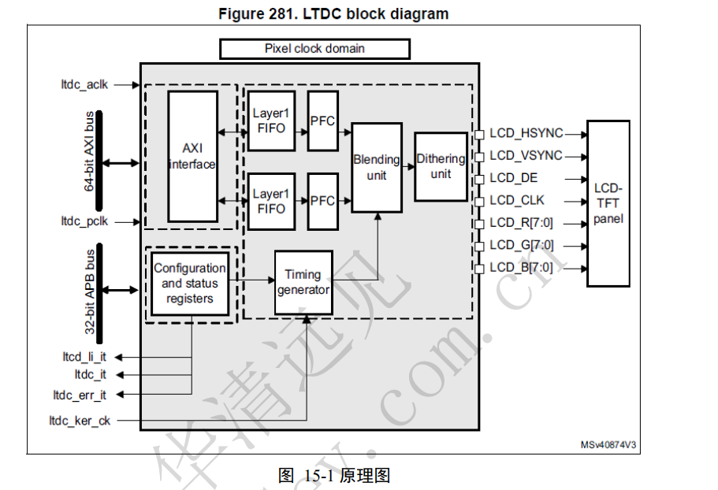

# 目录

## framebuffer子系统(eLCDIF控制器)
eLCDIF通常是一个较为简单的显示接口控制器  
LTDC：是一个更为复杂和功能丰富的显示控制器,，它通常用于驱动高分辨率的TFT显示屏。


Framebuffer子系统为用户空间操作显示设备提供了统一的接口，屏蔽了底层硬件之间的差异，用户只需要操作一块内存缓冲区即可把需要的图像显示到LCD设备上。  
  

核心层： 主要实现字符设备的创建，为不同的显示设备提供文件通用处理接口；同时创建graphics设备类，占据主设备号29。  
硬件设备层： 主要提供显示设备的时序、显存、像素格式等硬件信息，实现显示设备的私有文件接口，并创建显示设备文件/dev/fbx(x=0~n)暴露给用户空间。 硬件设备层的代码需要驱动开发人员根据具体的显示设备提供给内核。  
/dev/fb0 就是 LCD 对应的设备文件， /dev/fb0 是个字符设备，因此肯定有file_operations 操作集， fb 的 file_operations 操作集定义在 drivers/video/fbdev/core/fbmem.c 文件中   

在fbmem.c文件中 file_operation 中的open、read等函数都是使用iminor函数获取inode设备文件对应的次设备号；  
然后调用get_fb_info函数根据设备文件的次设备号，从registered_fb全局数组找到对应的fb_info结构体；  

Linux 下 Framebuffer 驱动的编写流程， Linux 内核将所有的 Framebuffer 抽象为一个叫做 fb_info 的结构
体， fb_info 结构体包含了 Framebuffer 设备的完整属性和操作集合，因此每一个 Framebuffer 设
备都必须有一个 fb_info。换言之就是， LCD 的驱动就是构建 fb_info，并且向系统注册 fb_info
的过程。 fb_info 结构体定义在 include/linux/fb.h 文件里面   


## 核心层分析

#### 注册字符设备、创建设备类
**下面函数全在内核源码/drivers/video/fbdev/core/fbmem.c中**  
实现功能：  
1.注册了主设备号  
2.设备号和file_operation绑定  
3.创建了grapics设备类  
```sh
1.在内核启动时，Framebuffer子系统的 fbmem_init() 函数会被系统自动调用  
第9行：register_chrdev注册一个设备号为FB_MAJOR的字符设备，与该设备号绑定的file_operations结构体为fb_fops， fb_fops为显示设备提供通用的文件操作接口。
FB_MAJOR可以找到，就是29

第15行：同时调用class_create()函数在/sys/class/目录下创建graphics设备类
```

#### fb_fops 文件通用处理接口
##### fb_open()函数
实现功能： 
1.注册了次设备号
2.找到fb_into结构体
3.判断执行我们自己的fb_open函数，没有就执行代码中的通用fb_open函数
```sh
第3行：调用iminor函数获取inode设备文件对应的次设备号；
第7行：调用get_fb_info函数根据设备文件的次设备号，从registered_fb全局数组找到对应的fb_info结构体；
第10-11行：判断LCD设备的fb_info结构体的fbops成员是否有提供fb_open函数，如果有提供就执行该函数
```

##### fb_read()函数
实现功能： 
1.找到fb_into结构体
2.判断执行我们自己的fb_read函数，没有就执行代码中的通用fb_read函数
3.分配一块内存保存读取数据
4.读取数据位置指向起始位置
5.读取到的数据拷贝到用户空间
```sh
第5行：file_fb_info()函数的作用也是根据文件的次设备号，从registered_fb全局数组找到对应的fb_info结构体；
第17-18行：判断LCD设备的fb_info结构体是否有提供私有的fb_read文件操作接口，如果有提供直接调用LCD的私有fb_read函数并返回； 若没有提供，则继续往下执行通用的fb_read函数；
第34~35行：分配一块最大为PAGE_SIZE(值为4096)的buffer；
第39行：把源地址指向需要从framebuffer读取数据的起始位置；
第44~59行：使用copy_to_user()函数把从framebuffer读取到的数据拷贝到用户空间。
```

##### fb_write()函数
fb_write()函数和fb_read()函数实现的几乎是相同的  
不相同的地方是fb_read()函数使用copy_to_user()把内核空间的数据拷贝到用户空间  
而fb_write()函数是使用copy_from_user()把用户空间的数据拷贝到内核空间。大家可自行阅读fbmem.c的代码对比这两个函数。  

##### fb_ioctl()函数


## 硬件设备层分析
在我们编写具体的LCD驱动程序时，我们只需要关系硬件设备层，在硬件设备层根据具体的单板和LCD屏幕 参数编写对应驱动程序。
**每一个LCD驱动对应一个fb_info结构体，编写驱动程序时需要把它注册到核心层 的registered_fb数组，以便内核管理。**


#### register_framebuffer()函数
```sh
int register_framebuffer(struct fb_info *fb_info)
{
  int ret;

  mutex_lock(&registration_lock);
  ret = do_register_framebuffer(fb_info);
  mutex_unlock(&registration_lock);

  return ret;
}
```
从以上代码可知，真正注册fb_info结构体的函数是do_register_framebuffer()，该函数代码如下：   
```sh
static int do_register_framebuffer(struct fb_info *fb_info)
{
  ...
  for (i = 0 ; i < FB_MAX; i++)
    if (!registered_fb[i])
      break;
  fb_info->node = i;

  ...

  fb_info->dev = device_create(fb_class, fb_info->device,
             MKDEV(FB_MAJOR, i), NULL, "fb%d", i);
  ...
  registered_fb[i] = fb_info;
  ...
}
```
第4-6行：找出registered_fb数组中空闲的元素的下标；  
第11-12行：以registered_fb数组空闲元素的下标作为LCD设备的次设备号，在/dev/目录下创建fbi(i为registered_fb数组空闲元素的下标)设备文件；  
第14行：把LCD硬件设备对应的fb_info结构体存入registered_fb数组。registered_fb数组如下：  
```sh
struct fb_info *registered_fb[FB_MAX]
```

```sh
FB_MAX 宏 (位于 内核源码/include/uapi/linux/fb.h)

#define FB_MAX                        32      /* sufficient for now */
```


## 驱动程序实现

```sh
编程思路：
1.分配fb_info结构体；
2.设置fb_info结构体；
3.向核心层注册fb_info结构体；
4.根据LCD的相关参数设置LCD控制器。
```


## HDMI移植(LTDC控制器)

SiI9022是一个信号转换芯片，用于将HDMI信号转换为DSI信号  
而LTDC是一个显示控制器，用于驱动和控制LCD显示屏。  


```sh
HDMI接口传输的不仅仅是RGB颜色信息，还包括其他同步信号和可能的音频数据

RGB信号通常指的是红绿蓝三原色的数字信号，它们是图像显示的基础。
HDMI接口传输的是TMDS（Transition Minimized Differential Signaling）编码信号，这是一种差分信号编码方式，用于减少电磁干扰并提高信号传输的可靠性。

HDMI接口传输的视频信号包括了像素时钟、水平同步和垂直同步信号，这些同步信号对于显示器来说是必要的，它们控制着图像的刷新率和显示的同步。
RGB信号本身不包含这些同步信息，因此在转换过程中需要添加这些同步信号。

HDMI接口支持多种颜色空间，包括RGB、YCbCr等，并且支持不同的色深（如8位、10位、12位等）。
RGB信号可能需要转换到HDMI接口支持的颜色空间和色深，以确保正确的颜色显示。

HDMI接口可以同时传输音频信号和各种控制信号，如HDCP（高带宽数字内容保护）。
如果视频源包含音频或需要HDCP保护，那么这些信息也需要在RGB转HDMI的过程中被编码和嵌入。

HDMI接口支持多种高级功能，如3D视频、以太网通道、音频回传通道等。
将RGB信号转换为HDMI格式可以确保这些高级功能的正常使用。

许多现代显示设备，如电视、显示器和投影仪，都配备了HDMI接口作为标准输入接口。
为了使这些设备能够接收和显示来自计算机或其他视频源的信号，需要将RGB信号转换为HDMI接口兼容的格式。

```

开发板的芯片只支持RGB接口，而现在屏幕基本上都支持HDMI接口，所以转  


STM32MP157A 系列 SoC 中默认没有 HDMI 相关控制器， FS-MP1A 使用 SiI9022 芯片将 RGB 信号转化为 HDMI 信号。 
STM32MP157A 集成 LTDC(LCD-TFT Display Controller)，提供一个 24bit RGB 并行接口用于连接到各种 LCD 和 TFT 面板。  
LTDC（Liquid Crystal Display TFT Display Controller）是液晶显示器控制器，专门用于控制TFT（Thin Film Transistor，薄膜晶体管）液晶显示屏。  
LTDC控制器负责管理显示数据的传输、屏幕刷新、颜色处理、图层混合等任务，以确保图像正确显示在LCD屏幕上。  
     
Pixel clock domain（像素时钟域）：这是整个LTDC的时钟域，确保所有操作与像素时钟同步。  
AXI interface（AXI接口）：这是LTDC与外部系统（如CPU或GPU）通信的接口，用于接收显示数据和命令。  
Layer1 FIFO 和 Layer1 PFC：这是第一图层的数据缓冲区和像素格式转换器，用于存储和转换将要显示的像素数据。  
Blending unit（混合单元）：这个单元负责将多个图层的像素数据混合在一起，以实现透明效果和图层叠加。  
Dithering unit（抖动单元）：用于改善颜色显示质量，通过抖动技术减少颜色带和图像噪声。  
Configuration and status registers（配置和状态寄存器）：用于配置LTDC的行为和监控其状态。  
Timing generator（时序生成器）：负责生成控制LCD显示的时序信号，如水平同步（HSYNC）、垂直同步（VSYNC）等。  
LCD control signals（LCD控制信号）：这些信号包括LCD_HSYNC、LCD_VSYNC、LCD_DE（数据使能）、LCD_CLK（时钟）等，用于控制LCD面板的显示。  
LCD data signals（LCD数据信号）：这些信号包括LCD_R[7:0]、LCD_G[7:0]、LCD_B[7:0]，用于传输RGB颜色数据到LCD面板。  
32-bit APB bus（32位APB总线）：这是用于配置LTDC寄存器的低速总线。  
Interrupts（中断信号）：包括lcd_li_it、lcd_if_it、lcd_err_it、lcd_serr_it、lcd_vdes_it、lcd_vsync_it、lcd_err_if_it、lcd_kerr_it，用于通知处理器LTDC的状态变化或错误。   