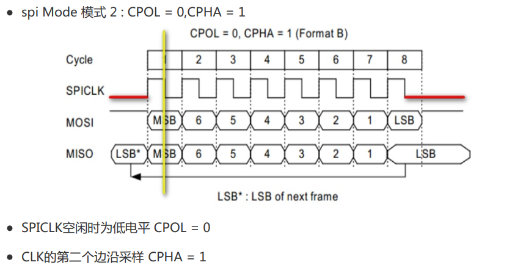
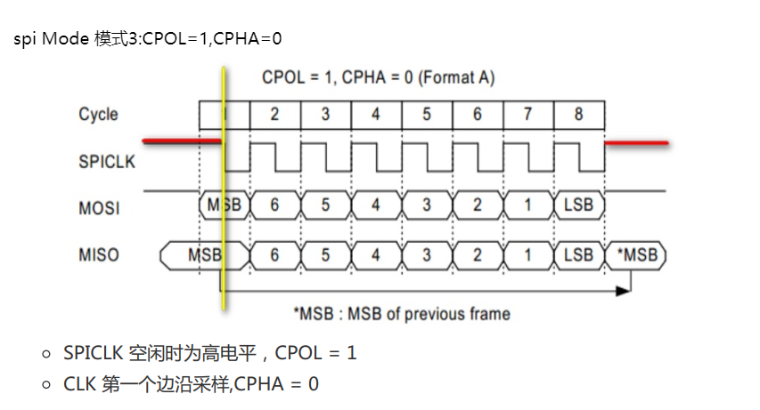
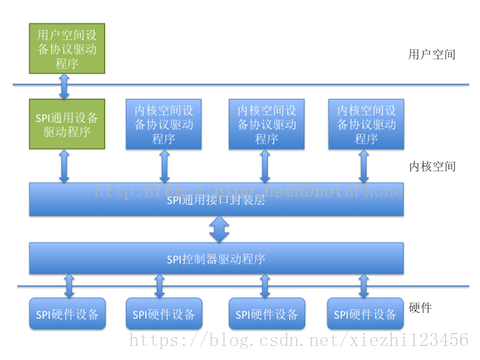
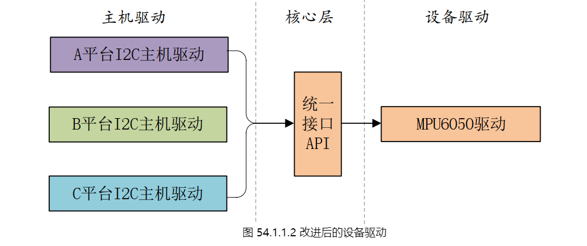

# 目录

## SPI介绍  
    SPI 英文名叫Serial Peripheral Interface,中文名叫 串行外围设备接口。
    SPI是一个 同步协议接口，所有的传输都参照一个共同的时钟，这个同步时钟信号由主机(处理器)产生。
    当 SPI 总线上接入多个设备时,则需要通过 片选,没有被选中的外设不会参与 SPI 传输  

|信号|描述|
|---|---|
|MOSI|主机输出 / 从机输入|
|MISO|主机输入 / 从机输出|
|SCLK|串行时钟信号|
|CS|外设片选|


## spi 传输原理  

主机和从机都包含一个串行移位寄存器，主机通过向它的SPI串行寄存器写入一个字节发起
一次传输。  
寄存器通过MOSI信号线将字节传送给从机，从机也将自己的移位寄存器中的内容通过
MISO信号线返回给主机。  
这样两个移位寄存器中的内容就被交换了。从机的写操作和读操作时同步完成的，因此SPI
成为一个很有效的协议  
  

### 同步传输
同步传输时,需要注意一下几点:  
**如果只是进行写操作，主机只需忽略收到的字节  
如果主机要读取从机的一个字节，就必须发送一个空字节来引发从机的传输**  
通过SPI总线，在主机和从机之间传输数据，必须保证主机发出的时序和从机所要求的时序一致才可  

## spi 传输模式
为了保证主机与从机之间的时序要求,提出了 时钟极性 和 时钟相位  
||时钟极性（Clock Polarity）|时钟相位（Clock Phase）|
|---|---|---|
|简称|CPOL或POL|CPHA或PHA|
|含义|指SPI CLK空闲时的电平，是0还是1|指数据采样的时候，是CLK的第一个边沿还是第二个边沿|  

CPHA=0，CLK的第一个边沿采样  
CPHA=1，CLK的第二个边沿采样  

根据 CPOL 与 CPHA 可以产生4种模式  
Mode 0 : CPOL = 0,CPHA = 0  
Mode 1 : CPOL = 0,CPHA = 1  
Mode 2 : CPOL = 1,CPHA = 0  
Mode 3 : CPOL = 1,CPHA = 1  

    
   
 
  
主板原理图中：
RCLK  锁存寄存器时钟，高电平存储  
SRCLK  移位寄存器时钟，上升沿移位  
SER  串行数据输入端  

分别对应STM32MP157的 SPI4_NSS、 SPI4_CLK、 SPI4_MOSI  
NSS  从设备使能信号，用于使能从机设备  
CLK  数据时钟信号  
MOSI  Master output Slave input 主机数据输出，从机数据输入  

## SPI驱动框架  
在 Linux 内核中 spi 驱动主要包括 spi 总线驱动与 spi 设备驱动  
spi 总线驱动一般是指 spi 控制器驱动   
spi 设备驱动一般是指连接在 spi 总线上的从设备驱动,比如 mcp2515 驱动就是属于 spi设备驱动  

  

1.SPI控制器驱动程序  
SPI控制器不用关心设备的具体功能，它只负责把上层协议驱动准备好的数据按SPI总线的时序要求发送给SPI设备，同时把从设备收到的数据返回给上层的协议驱动，因此，内核把SPI控制器的驱动程序独立出来。SPI控制器驱动负责控制具体的控制器硬件，诸如DMA和中断操作等，因为多个上层的协议驱动可能会通过控制器请求数据传输操作，所以，SPI控制器驱动同时也要负责对这些请求进行队列管理，保证先进先出原则。  

2.SPI通用接口封装层  
为简化SPI驱动程序编写工作，同时也为了降低协议驱动程序和控制器驱动程序的耦合度，Linux内核把控制器驱动和协议驱动的一些通用操作封装成标准的接口，加上一些通用的逻辑处理操作，组成了SPI通用接口封装层。好处是，对于控制器驱动程序，只要实现标准的接口回调API，并把它注册到通用接口层即可，无需直接和协议层驱动程序进行交互。而对于协议层驱动来说，只需通过通用接口层提供的API即可完成设备和驱动的注册，并通过通用接口层的API完成数据的传输，无需关注SPI控制器驱动的实现细节。  

3.SPI协议驱动程序  
控制器驱动程序并不清楚和关注设备的具体功能，SPI设备的具体功能是由SPI协议驱动程序完成的，SPI协议驱动程序了解设备的功能和通信数据的协议格式。向下，协议驱动通过通用接口层和控制器交换数据，向上，协议驱动通常会根据设备的具体功能和内核的其它子系统进行交互，例如，和MTD层交互以便把SPI接口的存储设备实现为某个文件系统，和TTY子系统交互把SPI设备实现为一个TTY设备，和网络子系统交互以便把一个SPI设备实现为一个网络设备，等等。如果是一个专有的SPI设备，也可以按照设备的协议要求，实现自己的专有协议驱动。  

**协议驱动程序这种玩法我自己理解就是在SPI控制器节点下加从设备节点的方法**

4.SPI通用设备驱动程序  
有时候，考虑到连接在SPI控制器上的设备的可变性，在内核没有配备相应的协议驱动程序，对于这种情况，内核准备了通用的SPI设备驱动程序，该通用设备驱动程序向用户空间提供了控制SPI控制的控制接口，具体的协议控制和数据传输工作交由用户空间根据具体的设备来完成，在这种方式中，只能采用同步的方式和SPI设备进行通信，通常用于一些数据量较少的简单SPI设备。  

## 主机驱动与外设驱动分离的设计思想
Linux中SPI、I2C、USB等子系统都利用典型的把主机驱动和外设驱动分离的想法  
主机端只负责产生总线上的传输波形，而外设端通过标准的API让主机端以适当的波形访问自身。  

这里涉及4个软件模块：  
```sh
 1）主机端的驱动。根据具体的I2C、SPI、USB等控制器的硬件手册，操作具体的I2C、SPI、USB等控制器，产生总线的各种波形。
  2）连接主机和外设的纽带。外设不直接调用主机端的驱动来产生波形，而是调一个标准的API。由这个标准的API把这个波形的传输请求间接“转发”给了具体的主机端驱动。在这里，最好把关于波形的描述也以某种数据结构标准化。
  3）外设端的驱动。外设接在I2C、SPI、USB总线上，但外设本身可以是触摸屏、网卡、声卡或任意一种类型的设备。在相关的i2c_driver、spi_driver、usb_driver这种xxx_driver的probe（）函数中去注册它具体的类型。当这些外设要求I2C、SPI、USB等去访问它的时候，它调用“连接主机和外设的纽带”模块的标准API。
  4）板级逻辑。板级逻辑用来描述主机和外设是如何互联的。假设板子上有多个SPI控制器和多个SPI外设，究竟谁接在谁上面管理互联关系，既不是主机端的责任，也不是外设端的责任，这属于板级逻辑的责任。通常出现在arch/arm/mach-xxx下面或者arch/arm/boot/dts下面。
```


1.一个平台的主机驱动对应一个设备驱动  
  
主机驱动是必要的，不同的平台I2C控制器不同，但右侧的设备就是那一个，应该只要一个通用的驱动程序即可。
2.每个平台的 I2C 控制器都提供一个统一的接口(也叫做主机驱动)，每个设备的话也只提供一个驱动程序(设备驱动)，每个设备通过统一的 I2C接口驱动来访问，这样就可以大大简化驱动文件。  
  
3.实际的 I2C 驱动设备肯定有很多种，不止 MPU6050 这一个，那么实际的驱动架构如图  
  
这就将主机驱动和设备驱动分隔了，在实际的驱动开发中，一般 I2C 主机控制器驱动已经由
半导体厂家编写好了，而设备驱动一般也由设备器件的厂家编写好了，我们只需要提供设备信
息即可，比如 I2C 设备的话提供设备连接到了哪个 I2C 接口上， I2C 的速度是多少等等。  

相当于将设备信息从设备驱动中剥离开来，驱动使用标准方法去获取到设备信息(比如从设备树中获
取到设备信息)，然后根据获取到的设备信息来初始化设备。  

这样就相当于驱动只负责驱动，设备只负责设备，想办法将两者进行匹配即可。  

  
注册驱动，总线就会在设备中寻找匹配；注册设备，总线就会在驱动中寻找匹配；  

