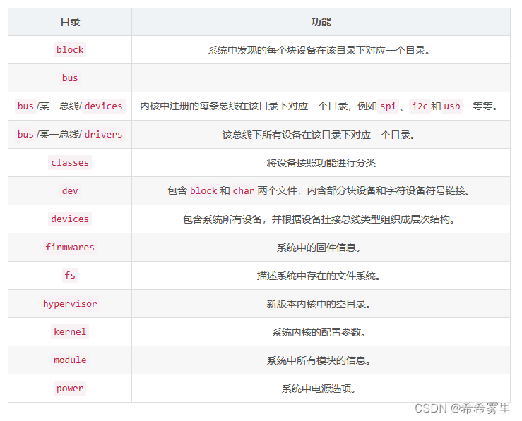
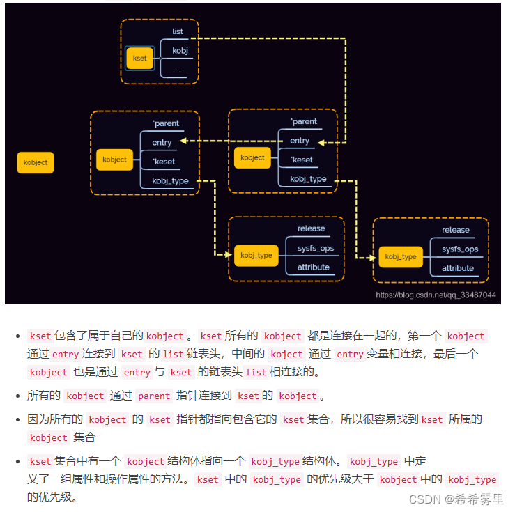

# 目录
```sh
https://www.cnblogs.com/downey-blog/p/10501514.html
介绍了如何创建sys下的文件夹和文件

https://blog.csdn.net/GCE7212201/article/details/53339699
根哥推荐
```

## linux驱动在sys下添加读写属性 
```sh
1.LED设备注册：当LED驱动程序初始化时，它会创建一个LED设备，并将其注册到LED类中。  
这通常通过调用 led_classdev_register() 或 led_classdev_register_ext() 函数完成。  

2.创建亮度属性：在LED类设备注册过程中，驱动程序会提供一个 led_classdev 结构体，  
该结构体包含了LED设备的各种属性和回调函数。其中，brightness_set 或 brightness_set_blocking 回调函数用于设置LED的亮度。  

3.sysfs文件系统：LED类设备注册后，内核会自动在 /sys/class/leds/ 目录下为每个  
LED设备创建一个子目录。在这个子目录中，会创建一个名为 brightness 的文件，  
该文件与LED设备的 led_classdev 结构体中的 brightness 属性相关联。  

4.文件操作回调：当用户空间程序读写 brightness 文件时，内核会调用 led_classdev   
结构体中定义的 brightness_set 或 brightness_set_blocking 回调函数。  
这些回调函数负责实际控制LED的亮度。  

5.用户空间交互：用户空间程序可以通过标准的文件操作（如 open(), read(), write(),   
close()）来控制LED的亮度。例如，写入 1 到 brightness 文件会打开LED，写入 0 会关闭LED。  
```

## 一、sysfs文件系统  
#### 1.1 sysfs系统是什么  
**sysfs是一种虚拟文件系统，提供一种访问内核数据结构的方法从而允许用户空间程序查看和控制系统的设备和资源。**  
	
sysfs文件系统是挂载在sys文件目录下的，我们可以通过sys下面的目录和文件清楚的了解Linux系统的嵌入式设备的系统状况。  
sysfs 把连接在系统上的设备和总线组织成为一个分级的文件，它们可以由用户空间存取，向用户空间导出内核的数据结构Q以及它们的属性。  

在sys目录下，各文件的功能如下：  
  

#### 1.2 sysfs的运行机制原理
sysfs 提供一种机制，使得可以显式的描述内核对象、对象属性及对象间关系。  
```sh
一组接口，针对内核，用于将设备映射到文件系统中。
一组接口，针对用户程序，用于读取或操作这些设备。描述了内核中的 sysfs 要素及其在用户空间的表现，如下图所示：
```
  
```sh
sys下面的目录和文件反映了整台机器的系统状况。这些目录代表了完全不同的设备类型，这些目录只是给我们提供了如何去看整个设备模型的不同视角。真正的设备信息放在 devices 子目录下,Linux 系统中的所有设备都可以在这个目录里找到。
如上图所示，bus 下对应驱动和设备，classes下有设备的不同分类，分类下也对应各种设备，实际上它们都是 devices 目录下设备文件的符号链接。
```


## 二、sysfs中重要的结构体
#### 2.1 kobject和kset之间的关系 
从下面的图，非常清晰的知道kset和kobject之间的关系和联系。  
  

#### 2.2 kobject结构体
kobject是设备模型的核心，在后台运行。它为内核带来类似于面向对象的编程风格。  

在内核中include/linux/kobject.h中定义了kobject结构体，在kobject结构体中包含了一些成员变量，其中比较重要的name、parent、sd、kref以及ktype。具体结构代码如下：  
```sh
name:	指向这个kobject的名称。使用kobject_set_name(struct kobject* kobj，const char * name)函数可以修改它。
entry： 简单讲就是要挂载入kset的链表。
parent:	指向此kobject父项的指针。它用于构建描述对象之间关系的层次结构。
sd:		指向struct sysfs dirent结构，它表示该结构内sysfs节点中的这个kobject。
kref:	提供kobject上的引用计数。
ktype: 	描述该对象，kset说明这个对象属于哪套（组）对象。
*/
struct kobject {
	const char		*name;
	struct list_head	entry;
	struct kobject		*parent;
	struct kset		*kset;
	struct kobj_type	*ktype;
	struct kernfs_node	*sd; /* sysfs directory entry */
	struct kref		kref;
#ifdef CONFIG_DEBUG_KOBJECT_RELEASE
	struct delayed_work	release;
#endif
	unsigned int state_initialized:1;   //初始化状态
	unsigned int state_in_sysfs:1;      //是否在sys中  
	unsigned int state_add_uevent_sent:1;
	unsigned int state_remove_uevent_sent:1;
	unsigned int uevent_suppress:1;
};
```
常使用kobject_create_and_add来进行创建和添加目录。在添加到系统之前，必须使用kobject_ create()函数分配kobject，并将已经分配但尚未初始化的kob ject指针及其kobject_type 指针作为参数。kobject_add()函数用于添加kobject并将其链接到系统，同时根据其层次结构创建目录及其默认属性。功能与之相反的函数是kobject_ del(),将kobject删除链接。  
```sh
struct kobject *kobject_create(void)
{
	struct kobject *kobj;
 
	kobj = kzalloc(sizeof(*kobj), GFP_KERNEL);
	if (!kobj)
		return NULL;
 
	kobject_init(kobj, &dynamic_kobj_ktype);
	return kobj;
}
 
struct kobject *kobject_create_and_add(const char *name, struct kobject *parent)
{
	struct kobject *kobj;
	int retval;
 
	kobj = kobject_create();
	if (!kobj)
		return NULL;
 
	retval = kobject_add(kobj, parent, "%s", name);
	if (retval) {
		printk(KERN_WARNING "%s: kobject_add error: %d\n",
		       __func__, retval);
		kobject_put(kobj);
		kobj = NULL;
	}
	return kobj;
}
```

#### 2.3 kset结构体 
内核对象集（kset）主要将相关的内核对象组合在一起，kset是object的集合。   

kset结构体还比kobject多了一个链表头，可以将子目录项对应的kobject结构体实例加入该链表，使得kset可以遍历这些子目录项的kobject。   
```sh
struct kset {
	struct list_head list;    //挂载kobject结构的链表
	spinlock_t list_lock;     //保护链表访问的自旋锁
	struct kobject kobj;      //自身包含一个kobject结构  
	const struct kset_uevent_ops *uevent_ops;
} __randomize_layout;
```


```sh
#include <linux/types.h>
#include <linux/kernel.h>
#include <linux/delay.h>
#include <linux/ide.h>
#include <linux/init.h>
#include <linux/module.h>
#include <linux/errno.h>
#include <linux/gpio.h>
#include <linux/cdev.h>
#include <linux/device.h>
#include <linux/of.h>
#include <linux/of_address.h>
#include <linux/of_gpio.h>
#include <asm/mach/map.h>
#include <asm/uaccess.h>
#include <asm/io.h>
 
typedef struct
{
	dev_t devid; 			/* 设备号 */
	int major;				/* 主设备号 */
	int minor;				/* 次设备号 */
	struct cdev cdev;   	/* cdev */
	struct class *class;	/* 类 */
	struct device *device;  /* 设备 */
}CHARDEV_HANDLE_T;
 
#define CDEV_CNT		1		  		/* 设备号个数 */
#define CDEV_NAME		"my_leddrv"		/* 名字 */
 
static CHARDEV_HANDLE_T stMyled = {0};
 
static int led_drv_open(struct inode *node, struct file *file)
{
	//filp->private_data = &cdev_data;  /* 设置私有数据 */
    printk(KERN_INFO "%s %s line is %d \r\n", __FILE__, __FUNCTION__, __LINE__);
    return 0;
}
 
static int led_drv_read(struct file *file, char __user *buf, size_t size, loff_t *offset)
{
    printk(KERN_INFO "%s %s line is %d \r\n", __FILE__, __FUNCTION__, __LINE__);
    return 0;
}
 
static int led_drv_write(struct file *file, const char __user *buf, size_t size, loff_t *offset)
{
    printk(KERN_INFO "%s %s line is %d \r\n", __FILE__, __FUNCTION__, __LINE__);
    return 1;
}
 
static int led_drv_release(struct inode *node, struct file *file)
{
    printk(KERN_INFO "%s %s line is %d \r\n", __FILE__, __FUNCTION__, __LINE__);
    return 0;
}
 
/* 设备操作函数 */
static struct file_operations led_drv_fops =
{
    .owner = THIS_MODULE,
    .open  = led_drv_open,
    .read  = led_drv_read,
    .write = led_drv_write,
    .release = led_drv_release,
};
 
ssize_t para_show(struct device *dev, struct device_attribute *attr, char *buf)
{
    printk(KERN_INFO "%s %s line is %d \r\n", __FILE__, __FUNCTION__, __LINE__);
    return sprintf(buf, "hello world!\n");
}
 
ssize_t para_store(struct device *dev, struct device_attribute *attr, const char *buf, size_t count)
{
    printk(KERN_INFO "%s %s line is %d \r\n", __FILE__, __FUNCTION__, __LINE__);
    printk(KERN_INFO "%s\n", buf);
    return count;
}
 
static DEVICE_ATTR(para, 0664, para_show, para_store);
 
/* 入口函数 */
static int __init led_init(void)
{
	printk(KERN_INFO "%s %s line is %d \r\n", __FILE__, __FUNCTION__, __LINE__);
/* 注册字符设备驱动 */
    /* 1、创建设备号 */
    if (stMyled.major) { /* 定义了设备号 */
        stMyled.devid = MKDEV(stMyled.major, 0);
        register_chrdev_region(stMyled.devid, CDEV_CNT, CDEV_NAME);
    } else { /* 没有定义设备号 */
        alloc_chrdev_region(&stMyled.devid, 0, CDEV_CNT, CDEV_NAME); /* 申请设备号 */
        stMyled.major = MAJOR(stMyled.devid); /* 获取分配号的主设备号 */
        stMyled.minor = MINOR(stMyled.devid); /* 获取分配号的次设备号 */
    }
    printk("major=%d, minor=%d\r\n", stMyled.major, stMyled.minor);
 
    /* 2、初始化 cdev */
    stMyled.cdev.owner = THIS_MODULE;
    cdev_init(&stMyled.cdev, &led_drv_fops);				//file_operations
 
    /* 3、添加一个 cdev */
    cdev_add(&stMyled.cdev, stMyled.devid, CDEV_CNT);
 
    /* 4、创建类 */
    stMyled.class = class_create(THIS_MODULE, CDEV_NAME);	///sys/class/目录下会创建一个新的文件夹
    if (IS_ERR(stMyled.class)) {
        return PTR_ERR(stMyled.class);
    }
 
    /* 5、创建设备 */
    stMyled.device = device_create(stMyled.class, NULL, stMyled.devid, NULL, CDEV_NAME);//dev目录下创建相应的设备节点
    if (IS_ERR(stMyled.device)) {
        return PTR_ERR(stMyled.device);
    }
	
	/* 6、将属性文件加入sysfs文件系统中 */
    device_create_file(stMyled.device, &dev_attr_para);
	
    return 0;
}
 
/* 出口函数 */
static void __exit led_exit(void)
{
	printk(KERN_INFO "%s %s line is %d \r\n", __FILE__, __FUNCTION__, __LINE__);
	
    /* 注销字符设备驱动 */
    cdev_del(&stMyled.cdev); /* 删除 cdev */
    unregister_chrdev_region(stMyled.devid, CDEV_CNT); /* 注销 */
 
    device_destroy(stMyled.class, stMyled.devid);
    class_destroy(stMyled.class);
	
	/* 移除sysfs中的device属性节点 */
	//device_remove_file(stMyled.device, &dev_attr_para);
}
 
module_init(led_init);
module_exit(led_exit);
MODULE_LICENSE("GPL");
MODULE_AUTHOR("donga");
```


## DEVICE_ATTR宏
```sh
static DEVICE_ATTR(delay_on, 0644, led_delay_on_show, led_delay_on_store);
在/sys/class/leds/中具体某个led文件夹里面创建delay_on属性文件
cat delay_on调用led_delay_on_show函数，echo调用led_delay_on_store函数
```

DEVICE_ATTR 宏在linux/device.h中有如下定义：  
```sh
/* 路径：linux/device.h */
#define DEVICE_ATTR(_name, _mode, _show, _store) \
	struct device_attribute dev_attr_##_name = __ATTR(_name, _mode, _show, _store)
 
struct device_attribute {
    struct attribute	attr;
    ssize_t (*show)(struct device *dev, struct device_attribute *attr,
                    char *buf);
    ssize_t (*store)(struct device *dev, struct device_attribute *attr,
                     const char *buf, size_t count);
};
 
/* 路径：include/linux/sysfs.h */
#define __ATTR(_name, _mode, _show, _store) {				\
	.attr = {.name = __stringify(_name),				\
		 .mode = VERIFY_OCTAL_PERMISSIONS(_mode) },		\
	.show	= _show,						\
	.store	= _store,						\
}
```
DEVICE_ATTR 宏用来定义一个 struct device_attribute 结构体，并对各成员初始化。  

#### 参数说明
```sh
DEVICE_ATTR(_name, _mode, _show, _store)
_name：名称，也就是将在sysfs中生成的文件名称；
_mode：属性文件的权限mode，与普通文件相同，UGO的格式。只读0444，只写0222，或者读写都行的0666；
_show：显示函数，cat该文件时，此函数被调用；
_store：写函数，echo内容到该文件时，此函数被调用；
```

#### 调用方法
```sh
static DEVICE_ATTR(demo, 0664, demo_show, demo_store);
demo_show、demo_store函数由我们自己定义，展开后

struct device_attribute dev_attr_demo = {
	.attr = {.name = __stringify(demo),
	.mode = VERIFY_OCTAL_PERMISSIONS(0664) },
	.show	= demo_show,
	.store	= demo_store,
}
调用 DEVICE_ATTR 后，就将 device_attribute 结构体初始化完成了。还需要使用 device_create_file() 或 sysfs_create_group() 将属性文件加入sysfs文件系统中。
```


在Linux驱动中经常会用到DEVICE_ATTR宏，可以定义一个struct device_attribute设备属性，
并使用sysfs的API函数，便可以在设备目录下创建出属性文件，当我们在驱动程序中实现了
show和store函数后，便可以使用cat和echo命令对创建出来的设备属性文件进行读写，从而达到控制设备的功能。
