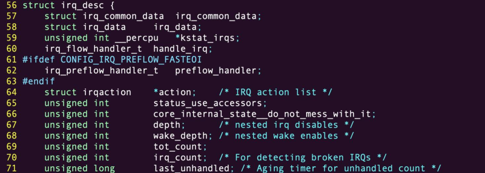
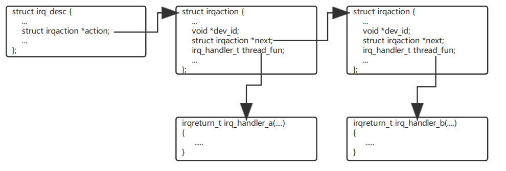
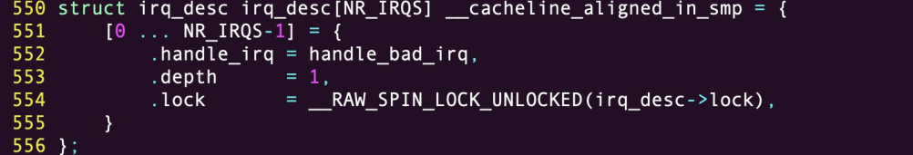
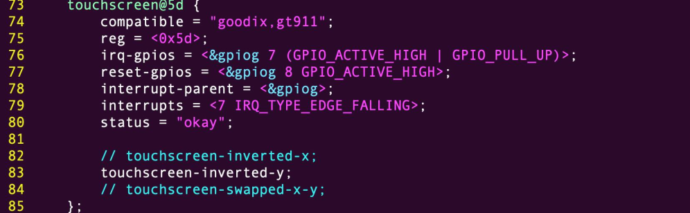

# 目录

## 中断控制器
```sh
NVIC —— 单核cpu —————— cortexM典型单核
GIC  —— 多核cpu —————— cortexA典型多核
```

## 中断子系统

内核每个中断都有与之对应的结构 irq_desc，结构体 irq_desc 用来描述中断的信息。  
  
irq_desc 是个比较大的结构体，成员很多，上图是 irq_desc 结构体定义的部分代码，其中 action 成员和我们后文使用中断关系比较紧密， action 实际上是个链表头。  
  
在中断使用的时候需要根据外设的不同编写各自的中断处理函数，而中断注册的过程就是构建一个
irqaction 结构体，将写好的中断处理函数赋值给 irqaction 成员 thread_fun，最后将构建好的 irqaction 结构体挂在 action 链表上，如果有多个驱动注册同一个中断则 action 链表上会有多个 irqaction。  
  
内核中对于 irq_desc 的管理有两种方式，一种是定义一个 irq_desc[NR_IRQS]的顺序表， 另外一种方式是通过 radix tree(基数树)去管理，通过配置内核配置项 CONFIG_SPARSE_IRQ 来决使用哪种方法，现在内核中大多数使用后者。  
第一种方法定义如下：  
  
这种方式在系统在启动时会定义一个足够大的数组一般会大于实际硬件中断数量， NR_IRQS 定义了
数组长度，由于一个硬件系统基本上不会使用到所有中断资源，所以这种方法 irq_desc 数组中很多成员实际上是没有使用的。
另外一种方式是通过 radix tree(基数树)去管理，这种方法在内核启动过程中根据实际的使用情况动态分配 irq_desc 并构建 radix tree，在使用时遍历 radix tree 即可找到对应的 irq_desc。
不管内核中用那种管理对于驱动开发者而言都没有影响。  

## 中断注册
内核中提供了多个多个中断注册函数，其中使用较多的是 request_irq  
```sh
int request_irq(unsigned int irq, irq_handler_t handler, unsigned long flags, const char *name, void *dev);
参数说明：
irq：中断号
handler：中断处理函数
flags：中断类型标志
name：设备名称
dev：设备 ID  
```

### 中断号获取
这里的中断号不是指硬件的中断号，而是一个软件的概念，以 ARM 体系结构为例，早期在使用平台
代码的时候，在内核中会存在类似于 irqs.h 的文件，这类文件中定义了几乎所有对应 SOC 相关的中断号，比如 arch/arm/mach-s3c24xx/include/mach/irqs.h 内容：  
    

在使用了设备树之后的平台就没有这类文件了，设备号的获取通常有两个方法：  
第一个方法是通过设备树节点 interrupt-parent 和 interrupts 属性获取， interrupt-parent 和 interrupts 属性在内核处理设备树节点时会被转换成中断号，然后赋值给特定的结构体传递到驱动中， 比如 platform_device中的 IORESOURCE_IRQ 资源， i2c_client 的 irq 成员等。  
  
上图中是一个第 78 行和 79 行， interrupt-parent 和 interrupts 表示触摸屏使用的是 gpiog7 这个管脚对应的外部中断，触发方式是下降沿触发，这两个属性最终会被转化成一个数字即中断号赋值到 i2c_client->irq并传递到驱动中。驱动中通过这个中断号注册中断即可。  
第二个方法是通过 gpio 属性获取，在有些驱动中随着驱动的运行阶段 gpio 可能在中断功能和 gpio 功能之间切换，这时上一种方法就不合适了，这种情况通常设备树会只会传递 gpio 属性到驱动中，在驱动中可以直接通过 gpio 相关 api 对其操作，也可通过 gpio_to_irq 之类的函数将 gpio 转换为中断号，再进行中断处理。


## 中断API函数
#### 获取中断号函数
中断信息一般写到了设备树里面， 可以通过 irq_of_parse_and_map 函数从 interupts 属性中提取到对应的设备号。  
```sh
unsigned int irq_of_parse_and_map(struct device_node *dev,int index);

dev： 设备节点
index：索引号， interrupts 属性可能包含多条中断信息，通过 index 指定要获取的信息。
返回值：中断号
```

使用 GPIO 的话，可以使用 gpio_to_irq 函数来获取 gpio 对应的中断号
```sh
int gpio_to_irq(unsigned int gpio)

gpio： 要获取的 GPIO 编号
返回值： GPIO 对应的中断号
```

#### 申请中断函数
request_irq函数可能会导致睡眠，因此不能在中断上下文或者其他禁止睡眠的代码段中使用 request_irq 函数。
request_irq 函数会激活(使能)中断，所以不需要手动去使能中断。
```sh
int request_irq(unsigned int irq,
                irq_handler_t handler,
                unsigned long flags,
                const char *name,
                void *dev)
irq：要申请中断的中断号
handler：中断处理函数，当中断发生会执行此中断处理函数
flags：中断标志，可以在文件 include/linux/interrupt.h 里面查看所有的中断标志
name：中断名字，设置以后可以在/proc/interrupts 文件中看到对应的中断名字
dev： 如果将 flags 设置为 IRQF_SHARED， dev 用来区分不同的中断，一般情况下将dev 设置为设备结构体， dev 会传递给中断处理函数 irq_handler_t 的第二个参数。
返回值： 0 中断申请成功，负值中断申请失败，如果返回-EBUSY 表示中断已经被申请了
```

|中断标志|描述|
|---|---|
|IROF_SHARED|多个设备共享一个中断线,共享的所有中断都必须指定此标志如果使用共享中断的话，request irq 函数的 dev 参数就是唯区分他们的标志。
|IROF_ONESHOT|单次中断，中断执行一次就结束|
|IROF_TRIGGER_NONE|无触发|
|IROF_TRIGGER_RISING|上升沿触发|
|IROF_TRIGGER_FALLING|下降沿触发|
|IROF_TRIGGER_HIGH|高电平触发|
|IROF_TRIGGER_LOW|低电平触发|

#### 中断释放函数
中断使用完成以后就要通过 free_irq 函数释放掉相应的中断。 如果中断不是共享的，free_irq 会删除中断处理函数并且禁止中断。  
```sh
void free_irq(unsigned int irq,void *dev);

irq： 要释放的中断号
dev：如果中断设置为共享(IRQF_SHARED)，此参数用来区分具体的中断。共享中断只有在释放最后中断处理函数的时候才会被禁止掉
```

#### 中断处理函数
使用 request_irq 函数申请中断的时候需要设置中断处理函数  
```sh
irqreturn_t (*irq_handler_t) (int, void *);

第一个参数：要中断处理函数要相应的中断号
第二个参数：一个指向 void 的指针，是个通用指针，需要与 request_irq 函数的 dev 参数保持一致。用于区分共享中断的不同设备，dev 也可以指向设备数据结构
返回值：irqreturn_t 类型
```

irqreturn_t 类型定义如下所示：  
```sh
enum irqreturn {
    IRQ_NONE = (0 << 0),
    IRQ_HANDLED = (1 << 0),
    IRQ_WAKE_THREAD = (1 << 1),
};
typedef enum irqreturn irqreturn_t;
irqreturn_t 是个枚举类型， 一共有三种返回值。 一般中断服务函数返回值使用如下形式
return IRQ_RETVAL(IRQ_HANDLED)
```

#### 中断使能和禁止函数
enable_irq 和 disable_irq 用于使能和禁止指定的中断。  
```sh
void enable_irq(unsigned int irq)
void disable_irq(unsigned int irq)
void disable_irq_nosync(unsigned int irq)

irq：要禁止的中断号
disable_irq 函数要等到当前正在执行的中断处理函数执行完才返回， 因此需要保证不会产生新的中断， 并且确保所有已经开始执行的中断处理程序已经全部退出。
disable_irq_nosync 函数调用以后立即返回， 不会等待当前中断处理程序执行完毕。

使能/关闭全局中断
local_irq_enable()      用于使能当前处理器中断系统，
local_irq_disable()     用于禁止当前处理器中断系统。
一般不能直接简单粗暴的通过这两个函数来打开或者关闭全局中断，这样会使系统崩溃。
在打开或者关闭全局中断时，要考虑到别的任务的感受，要保存中断状态，处理完后要将中断状态恢复到以前的状态

local_irq_save(flags)       用于禁止中断，并且将中断状态保存在 flags 中
local_irq_restore(flags)    用于恢复中断，将中断到 flags 状态。
```


## 中断上下部
前文我们提到了中断处理函数编写的注意事项， 其中包括：  
1、 中断处理函数要尽快返回， 不能有太耗时的操作  
2、 中断处理函数中不能有可能引起睡眠的操作  


上半部负责读中断源，并在清中断后登记中断下半部，而耗时的工作在下半部处理。
上半部只能通过中断处理程序实现， 下半部的实现目前有 3 种实现方式， 分别为： 软中断、 tasklet 、工作队列（work queues）


底半部机制的主要目的是：
分离紧急处理： 中断通常在硬件触发的情况下发生，需要尽快处理以保持系统的稳定性。但有些操作可能耗时较长，如果在中断上下文中执行，会影响其他中断的处理和整个系统的实时性。底半部机制可以将这些耗时操作推迟到中断处理程序之外执行，确保紧急操作优先得到处理。
提高系统响应性： 在中断上下文中执行的操作必须尽可能地快速完成，以避免影响其他中断的处理。通过将耗时的操作移到底半部机制中，可以保持中断处理的简洁和高效，从而提高系统的响应性。
避免竞争条件： 在中断上下文中执行的操作与其他中断处理程序共享数据，可能导致竞争条件和死锁。通过将某些操作移到底半部机制中，可以减少竞争条件的可能性，从而提高系统的稳定性。

#### 软中断
Linux 内核使用结构体 softirq_action 表示软中断
```sh
struct softirq_action               //softirq_action 结构体中的 action 成员变量就是软中断的服务函数
{
    void (*action)(struct softirq_action *);
};
在 kernel/softirq.c 文件中一共定义了 10 个软中断
static struct softirq_action softirq_vec[NR_SOFTIRQS];   

enum
{
    HI_SOFTIRQ=0, /* 高优先级软中断 */
    TIMER_SOFTIRQ, /* 定时器软中断 */
    NET_TX_SOFTIRQ, /* 网络数据发送软中断 */
    NET_RX_SOFTIRQ, /* 网络数据接收软中断 */
    BLOCK_SOFTIRQ,
    BLOCK_IOPOLL_SOFTIRQ,
    TASKLET_SOFTIRQ, /* tasklet 软中断 */
    SCHED_SOFTIRQ, /* 调度软中断 */
    HRTIMER_SOFTIRQ, /* 高精度定时器软中断 */
    RCU_SOFTIRQ, /* RCU 软中断 */
    NR_SOFTIRQS
};
数组 softirq_vec 是个全局数组，因此所有的 CPU(对于 SMP 系统而言)都可以访问到，每个 CPU 都有自己的触发和控制机制，并且只执行自己所触发的软中断。但是各个 CPU 所执行的软中断服务函数确是相同的，都是数组 softirq_vec 中定义的 action 函数。
```

要使用软中断，必须先使用 open_softirq 函数注册对应的软中断处理函数
```sh
void open_softirq(int nr, void (*action)(struct softirq_action *))
//nr：要开启的软中断，也就是上面的10个软中断
//action：软中断对应的处理函数
```
注册好软中断以后需要通过 raise_softirq 函数触发
```sh
void raise_softirq(unsigned int nr)
//nr：要触发的软中断 
```

#### tasklet
tasklet是通过软中断实现的， 软中断用轮询的方式处理， 假如是最后一种中断， 则必须循环完所有的中断类型， 才能最终执行对应的处理函数。  
为了提高中断处理数量，改进处理效率， 产生了 tasklet 机制。 tasklet 采用无差别的队列机制， 有中断时才执行， 免去了循环查表之苦。  

```sh
tasklet 机制的优点：
无类型数量限制， 效率高， 无需循环查表， 支持 SMP 机制。
一种特定类型的 tasklet 只能运行在一个 CPU 上， 不能并行， 只能串行执行。
多个不同类型的 tasklet 可以并行在多个CPU 上。
软中断是静态分配的， 在内核编译好之后， 就不能改变。
但 tasklet 就灵活许多， 可以在运行时改变，比如添加模块时 。
```

调用 tasklet 以后， tasklet 绑定的函数并不会立马执行， 而是有中断以后， 经过一个很短的不确定时间在来执行。  

Linux 内核使用 tasklet_struct 结构体来表示 tasklet  
```sh
struct tasklet_struct
{ 
    struct tasklet_struct *next; /* 下一个 tasklet */
    unsigned long state; /* tasklet 状态 */
    atomic_t count; /* 计数器， 记录对 tasklet 的引用数 */
    void (*func)(unsigned long); /* tasklet 执行的函数 */
    unsigned long data; /* 函数 func 的参数 */
};

next： 链表中的下一个 tasklet， 方便管理和设置 tasklet
state: tasklet 的状态
count： 表示 tasklet 是否出在激活状态， 如果是 0， 就处在激活状态， 如果非 0， 就处在非激活状态
void (*func)(unsigned long)： 结构体中的 func 成员是 tasklet 的绑定函数， data 是它唯一的参数。func 函数就是 tasklet 要执行的处理函数，用户定义函数内容，相当于中断处理函数
date： 函数执行的传递给func的参数
```

如果要使用 tasklet， 必须先定义一个 tasklet， 然后使用 tasklet_init 函数初始化 tasklet
```sh
void tasklet_init(struct tasklet_struct *t,
					void (*func)(unsigned long),
					unsigned long data);
t：要初始化的 tasklet
func： tasklet 的处理函数。
data： 要传递给 func 函数的参数
```

使用宏 DECLARE_TASKLET 一次性完成 tasklet 的定义和初始化， DECLARE_TASKLET 定义在include/linux/interrupt.h 文件中  
```sh
DECLARE_TASKLET(name, func, data)
name：要定义的 tasklet 名字， 就是一个 tasklet_struct 类型的变量
func：tasklet 的处理函数
data：传递给 func 函数的参数
```

在上半部中断处理函数中调用 tasklet_schedule 函数就能使 tasklet 在合适的时间运行
```sh
void tasklet_schedule(struct tasklet_struct *t)
t：要调度的 tasklet，DECLARE_TASKLET 宏里面的 name， tasklet_struct 类型的变量
```

杀死 tasklet 使用 tasklet_kill 函数,这个函数会等待 tasklet 执行完毕， 然后再将它移除。 该函数可能会引起休眠， 所以要禁止在中断上下文中使用。
```sh
tasklet_kill(struct tasklet_struct *t)
t：要删除的 tasklet
```

#### 工作队列（workqueue）
工作队列（workqueue） 是实现中断下文的机制之一， 是一种将工作推后执行的形式。   

工作队列在进程上下文执行，工作队列将要推后的工作交给一个内核线程去执行，因为工作队列工作在进程上下文，因此工作队列允许睡眠或重新调度  

工作队列tasklet 机制有什么不同呢？
tasklet 也是实现中断下文的机制, 最主要的区别是 tasklet不能休眠， 而工作队列是可以休眠的。 所以， tasklet 可以用来处理比较耗时间的事情， 而工作队列可以处理非常复杂并且更耗时间的事情。因此如果要推后的工作可以睡眠就可以选择工作队列，否则的话就只能选择软中断或tasklet。

Linux 内核使用 work_struct 结构体表示一个工作  
```sh
struct work_struct {
    atomic_long_t data;
    struct list_head entry;
    work_func_t func; /* 工作队列处理函数 */
};
```

这些工作组织成工作队列，工作队列使用 workqueue_struct 结构体表示  
```sh
struct workqueue_struct {
    struct list_head pwqs;
    struct list_head list;
    struct mutex mutex;
    int work_color;
    int flush_color;
    atomic_t nr_pwqs_to_flush;
    struct wq_flusher *first_flusher;
    struct list_head flusher_queue;
    struct list_head flusher_overflow;
    struct list_head maydays;
    struct worker *rescuer;
    int nr_drainers;
    int saved_max_active;
    struct workqueue_attrs *unbound_attrs;
    struct pool_workqueue *dfl_pwq;
    char name[WQ_NAME_LEN];
    struct rcu_head rcu;
    unsigned int flags ____cacheline_aligned;
    struct pool_workqueue __percpu *cpu_pwqs;
    struct pool_workqueue __rcu *numa_pwq_tbl[];
};

```

Linux 内核使用工作者线程(worker thread)来处理工作队列中的各个工作， Linux 内核使用worker 结构体表示工作者线程

每个 worker 都有一个工作队列，工作者线程处理自己工作队列中的所有工作。在驱动开发中，只需要定义工作(work_struct)即可，关于工作队列和工作者线程基本不用去管。
```sh
struct worker {
    union {
        struct list_head entry;
        struct hlist_node hentry;
    };
    struct work_struct *current_work;
    work_func_t current_func;
    struct pool_workqueue *current_pwq;
    bool desc_valid;
    struct list_head scheduled;
    struct task_struct *task;
    struct worker_pool *pool;
    struct list_head node;
    unsigned long last_active;
    unsigned int flags;
    int id;
    char desc[WORKER_DESC_LEN];
    struct workqueue_struct *rescue_wq;
};

```

初始化工作：INIT_WORK
```sh
#define INIT_WORK(_work, _func)
_work ：要初始化的工作（work_struct)
_func ：工作对应的处理函数
```

工作的创建和初始化：DECLARE_WORK
```sh
#define DECLARE_WORK(n, f)
n ：定义的工作(work_struct)
f： 工作对应的处理函数
```

工作的调度函数： schedule_work
```sh
bool schedule_work(struct work_struct *work)
work： 要调度的工作。
返回值： 0 成功，其他值 失败
```

工作队列模块
```sh
/* 定义工作(work) */
struct work_struct testwork;
 
/* work 处理函数 */
void testwork_func_t(struct work_struct *work);
{
    /* work 具体处理内容 */
}
 
/* 中断处理函数 */
irqreturn_t test_handler(int irq, void *dev_id)
{
    ......
    /* 调度 work */
    schedule_work(&testwork);
    ......
}
 
/* 驱动入口函数 */
static int __init xxxx_init(void)
{
    ......
    /* 初始化 work */
    INIT_WORK(&testwork, testwork_func_t);
 
    /* 注册中断处理函数 */
    request_irq(xxx_irq, test_handler, 0, "xxx", &xxx_dev);
    ......
}
```