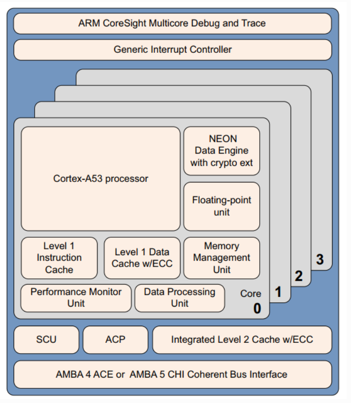
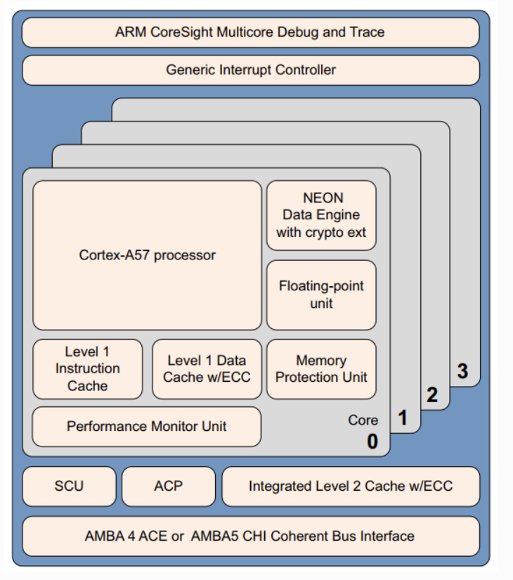

# ARM架构学习

Armv8/Armv9架构入门指南：https://armv8-doc.readthedocs.io/en/latest/index.html  
Armv8架构虚拟化介绍：https://calinyara.github.io/technology/2019/11/03/armv8-virtualization.html

## 第一章：Arm各代版本

#### history
| 架构版本 | 推出时间 | 标志性特性 | 典型核心/处理器 | 应用领域 | 主要指令集支持 |
|:---------|:---------|:-----------|:----------------|:---------|:----------|
| ARMv3 | 1990s初 | 32位寻址 | ARM6, ARM7 | 早期嵌入式 | A32、T16 (Thumb) |
| ARMv4 | 1990s中 | 明确Thumb指令集 | ARM7TDMI, ARM9 | 功能手机、嵌入式 | A32、T16 |
| ARMv5 | ~2000 | Jazelle (Java加速) | ARM9E, ARM10 | 早期智能手机、PDA | A32、T16 |
| ARMv6 | ~2001 | SIMD, SMP支持, Thumb-2 | ARM11 | 第一代iPhone、功能手机 | A32、T32 (Thumb-2) |
| ARMv7 | ~2005 | Cortex品牌 (A/R/M), NEON, VFP | Cortex-A8/A9, Cortex-M3 | 智能手机、微控制器 | A64、A32 (兼容)、T32 (兼容) |
| ARMv8 | ~2011 | 64位 (AArch64)，31个64位寄存器 | Cortex-A53/A57/A76, Apple A/M系列 | 现代手机、服务器、笔记本 | A64、A32 (兼容)、T32 (兼容) |
| ARMv9 | ~2021 | SVE2, CCA (Realms)，AI/ML/DSP增强 | Cortex-X2/A710, Cortex-M85 | 下一代移动、AI、HPC、自动驾驶 | A64(通常不再支持A32执行) |

#### T16、T32、A32、A64概念
| 指令集 | 位宽 | 特点 | 优点 | 缺点 | 好比 |
|:-------|:-----|:-----|:-----|:-----|:-----|
| A32 | 32位 | 原始、复杂 | 指令能力强，效率高 | 代码体积大，占内存 | 写小作文指挥 |
| T16 | 16位 | 精简、简单 | 代码体积小，省内存 | 需要更多指令，性能低 | 用速记符号指挥 |
| T32 | 16/32位混合 | 智能、混合 | 既省内存，性能又高 | - | 智能混合指令书 |
| A64 | 固定32位 | 全新、64位 | 性能极致，地址空间巨大 | 不兼容旧32位程序 | 全新高效指挥系统 |

## 第二章：Armv7,Armv8和Armv9轻松理解
| 特性维度 | ARMv7 | ARMv8 | ARMv9 |
|:---------|:------|:------|:------|
| 架构位宽 | 32位 | 64位 (兼容32位) | 64位 (通常不再兼容32位大核) |
| 核心标志 | Cortex品牌，Thumb-2, NEON | 64位革命，新指令集，虚拟化 | AI与安全，SVE2, 机密计算 |
| 指令集 | A32, T32 (Thumb-2) | A64, A32 (兼容) | A64 (增强) |
| 关键特性 | TrustZone, VFP | 加密扩展，更大寄存器，SMP优化 | SVE2, CCA (Realms), SME |
| 市场影响 | 统治移动时代 | 进军服务器/PC | 定义下一个十年 (AI, 云, 自动驾驶) |
| 典型代表 | Cortex-A9/A15, Cortex-M3/M4 | Cortex-A53/A76, Apple M1/A14 | Cortex-X2/A710, 未来旗舰SoC |

### 第一小节：深入Armv7  
#### 1. 架构位宽：纯32位架构。  
    代表着寄存器长度是32位的  
    寻址空间是32位的：  
        CPU可以通过地址总线访问内存。32位的地址总线意味着它可以生成 2^32 个不同的地址。  
        每个地址对应一个字节（Byte）的内存，所以最大可访问的内存是 4 GB (2^32 bytes = 4 GB)。  

#### 2. 指令集： 支持A32和T32  
    A32 (ARM指令集): 每条指令的长度固定为32位。  
    T32 (Thumb-2指令集): 是16位和32位指令的混合集。这是ARMv7的一项核心创新，但它最终生成的机器码所操作的数据和地址仍然是32位的。  

#### 3. 品牌与核心：  
    cortex-A：  
        定位： “大脑”。用于运行复杂的**操作系统**（如Linux, Android, iOS, Windows Phone）和用户应用程序。  
        特点：  
            高性能。  
            支持内存管理单元（MMU），可以实现虚拟内存，让多个程序感觉自己独占了整个内存空间。  
            通常支持多核（SMP）。  
    cortex-R：
        定位： “快速反应的专家”。用于对时间有极端严格要求、需要高可靠性的场合。  
        特点：  
            实时性： 保证在确定的、极短的时间内响应事件。  
            高可靠性： 支持错误校正码（ECC）、锁步（Dual-core lockstep）等技术。在一个核心计算时，另一个核心同步计算并核对结果，一旦出错立即纠正，用于绝对不能失败的场景。  
            通常不需要MMU，但需要MPU（内存保护单元）。
    cortex-M：  
        定位： “无处不在的感官和神经”。用于深度嵌入式、超低功耗的设备。  
        特点：  
            极低功耗： 设计目标就是省电，许多设备靠电池可以运行数年。  
            低成本： 芯片价格极低（可低至几毛钱）。  
            高能效： 专注于处理特定的小任务，效率极高。  
            简化： 使用更简单的T32 (Thumb-2)指令集为主，不支持MMU。  

**小总结：**   
| 特性 | Cortex-A (应用) | Cortex-R (实时) | Cortex-M (微控制器) |
|:-----|:----------------|:----------------|:---------------------|
| 定位 | 运行复杂OS和应用 | 高可靠性实时控制 | 超低功耗嵌入式控制 |
| OS示例 | Linux, Android, iOS | FreeRTOS, µC/OS | FreeRTOS, bare-metal (裸机) |
| 关键特性 | 高性能, MMU, 多核 | 实时, 锁步, ECC | 低功耗, 低成本, 高能效 |
| 好比 | 电脑的CPU | 汽车的ABS系统 | 遥控器里的芯片 |

#### 4. 关键技术创新：
    Thumb-2指令集: 对原有 16位Thumb指令集（T16） 的增强扩展。它创造性地将16位和32位指令混合在一起。  

它是如何工作的？
          
&emsp;&emsp;混合指令： 编译器在编译时，会将简单的操作编译成16位指令以节省空间，将复杂的、对性能要求高的操作编译成32位指令以提升效率。 
&emsp;&emsp;无缝切换： 最关键的是，CPU在执行Thumb-2代码时，无需在ARM和Thumb状态之间进行缓慢的模式切换。它可以自动解码每条指令是16位还是32位。

    NEON (高级SIMD): 多媒体加速引擎。NEON是ARM的单指令多数据（SIMD） 协处理器扩展。它允许一条指令同时处理多个数据，专为大规模数据并行处理而设计。  
        要解决什么问题？
            处理视频编解码、音频处理、3D图形、图像处理等多媒体任务时，需要对大量数据（如像素、音频样本）执行相同的操作。用普通的CPU指令一条条处理效率极低。
        它是如何工作的？
            NEON拥有一套独立的128位宽寄存器。这意味着它可以：将寄存器划分为16个8位整数、8个16位整数、4个32位整数/浮点数，或2个64位整数/浮点数。
            一条NEON指令可以同时对这一组数据执行相同的操作。
        示例： 一条加法指令可以一次完成8对（16位）像素值的加法，而不是普通CPU需要8条指令。
        带来的好处：
            性能飙升： 对音视频编解码等算法的加速效果可达5倍甚至10倍以上。
            能效更高： 用更少的时钟周期完成更多工作，更省电。
            用户体验： 让移动设备能够流畅播放高清视频、运行大型游戏。
        简单比喻：
            普通CPU指令像一个收银员一次扫描一件商品。
            NEON指令像一台高科技扫描仪，一次能同时扫描一整购物车的商品。
    VFP (矢量浮点单元): 科学计算的基石。VFP是一个执行硬件浮点运算的协处理单元。它专门处理小数运算（如 3.14 * 2.78）。  
        要解决什么问题？ 在没有硬件浮点单元时，CPU需要用大量整数指令来“模拟”小数运算，速度非常慢。这对于需要大量科学计算的应用（如导航、物理模拟、高精度图形）来说是致命的性能瓶颈。
        它是如何工作的？
            它包含一套专用的浮点寄存器和一个执行单元。
            当CPU遇到浮点指令时，会将其派发给VFP单元执行，计算完成后再取回结果。
            常见的版本是VFPv3和VFPv4，后者增加了“乘加”指令（FMA），进一步提升了计算效率和精度。
        带来的好处：
            极高的浮点计算速度： 比软件模拟快数十甚至上百倍。
            更高的计算精度： 专为浮点设计，误差更小。
            与NEON的关系： NEON主要处理整数和单精度浮点的并行计算，而VFP更专注于标量的双精度和高精度浮点计算。两者相辅相成。
        简单比喻：
            软件模拟浮点：像用纸笔手动计算复杂的小数乘法。
            VFP单元： 像给你一个高级科学计算器，按个按钮就能瞬间得到精确结果。
    TrustZone安全扩展: 芯片里的“保险库”。TrustZone是一种系统级的安全解决方案，它通过硬件在同一个CPU内核中创建了两个完全隔离的执行环境：安全世界（Secure World） 和 正常世界（Normal World）。
        要解决什么问题？ 
            保护设备中最敏感的数据（如指纹、密码、支付密钥）和代码（如加密算法），即使设备的操作系统（如Android）被恶意软件攻破，这些敏感信息也不会泄露。
        它是如何工作的？
            硬件隔离： CPU的每一个操作（内存、缓存、外设访问）都会带有一个安全位标记（NS bit），表明当前是处于安全世界还是正常世界。
            世界切换： 通过一个特殊的硬件指令SMC，CPU可以在两个世界之间切换。这种切换类似于一次特权级别切换，非常快速。
            权限控制：
            正常世界（运行大型操作系统）无法访问安全世界的内存和资源。
            安全世界（运行一个精简、高度可信的安全OS，如OP-TEE）可以访问所有资源，但通常只处理最关键的任务。
            外设支持： 总线和其他硬件（如内存控制器、GPU、指纹传感器）也可以被配置为只接受来自安全世界的访问。
        带来的好处：
            硬件级安全： 比纯软件方案可靠得多。
            成本效益高： 不需要单独的安全芯片，实现了系统单芯片（SoC）级别的安全。
            广泛应用： 用于指纹支付、数字版权管理（DRM）、企业设备认证等。
        简单比喻：
            把你的手机SoC想象成一个大公司。
            正常世界就是开放办公区，所有人（App）都可以活动，但比较混乱。
            安全世界就是办公区深处的高强度保险库，需要特殊权限（SMC指令）才能进入，里面存放着最珍贵的资产（密钥）。办公区的人甚至不知道保险库内部的具体情况。

#### 5. 影响： 奠定了ARM在移动手机和嵌入式市场的绝对统治地位。

### 第二小节：深入Armv8架构
#### 1. 架构位宽：64位/32位双架构。  
    AArch32：一个成熟的、兼容过去的32位人格  
    AArch64：一个全新的、更强大的64位人格  

**小总结**  
| 特性 | AArch64 (新世界) | AArch32 (旧世界保护区) |
|:-----|:-----------------|:-----------------------|
| 架构 | 全新的64位架构 | 兼容ARMv7-A的32位架构 |
| 指令集 | A64 (固定32位长度) | A32 (32位) 和 T32 (16/32位混合) |
| 通用寄存器 | 31个64位 (X0-X30) | 16个32位 (R0-R15) |
| SIMD/FP | 强制标配 (集成到指令集) | 可选扩展 (NEON/VFP) |
| 寻址空间 | 64位 (理论16EB) | 32位 (4GB) |
| 目的 | 未来：高性能、新应用、服务器 | 过去：兼容现有32位生态 |   

#### 2. 关键技术创新   
    64位能力：  
        核心体现：  
            更大的寄存器： 通用寄存器（X0-X30）从32位扩展到64位宽。这意味着：  
            可以处理范围更大的整数（从 ±20亿到 ±9*10^18）。  
            可以存放更大的内存地址。  
            更多的寄存器： 数量从16个（包括PC和SP）增加到31个（X0-X30）。  
                性能巨大提升： 这是最容易被忽略但至关重要的一点。更多的寄存器意味着CPU可以在芯片内部的高速存储单元中同时保存更多的数据和地址，极大减少了访问低速外部内存的次数。函数调用时需要保存到栈里的上下文更少，效率自然飙升。  
            巨大的内存寻址空间： 理论寻址空间从ARMv7的 2^32 (4GB) 扩展到 2^64 (16 Exabytes)。虽然初代实现多用48位地址（256TB），但这已是4GB的数万倍。  
                打破瓶颈： 彻底打破了移动设备和高性能服务器（如数据库、虚拟机）的内存墙，让ARM芯片能够处理前所未有的海量数据任务。  
        简单比喻：  
            32位CPU 像一条4车道的县级公路，车（数据）多了就会堵（访问内存）。  
            64位CPU 像一条31车道、并且每个车道都更宽的高速公路，车流畅通无阻，能去的目的地（内存地址）也更远。  

    全新的A64指令集：轻装上阵，设计优雅  
        核心特点：  
            固定长度： 所有指令都是32位长。这简化了CPU前端的解码器设计，解码逻辑更简单，有助于提升主频和能效。  
            规整的编码格式： 指令的操作码、寄存器地址等字段的位置非常固定和规整。这同样降低了解码复杂度。  
            摒弃历史包袱： 移除了许多不常用或行为复杂的指令（如LDM/STM多寄存器加载存储被LDP/STP双寄存器指令对替代），以及条件执行（几乎所有指令都可以条件执行）被大幅减少，只在分支指令中常见。  
            集成化： NEON（高级SIMD）和浮点（FP）指令被完全集成到基础指令集中。在AArch64下，不再有“协处理器”的概念，所有CPU核心都必须支持这些功能，确保了软件生态的一致性。  
        设计哲学： A64的设计优先考虑了能效和解码效率，而不是像传统CISC架构那样追求极致的代码密度。这在移动时代是更明智的选择。  
    加密扩展 (Crypto): 为安全通信而生  
    这是一个专门的指令集扩展，用于硬件加速常见的加密和解密算法。  
        包含的指令：  
            AES (Advanced Encryption Standard): 用于加速AES加密和解密，这是当今最常用的对称加密算法（如HTTPS、Wi-Fi加密）。  
            SHA (Secure Hash Algorithm): 用于加速SHA-1、SHA-256等哈希算法，这是数字签名、数据完整性校验的核心。  
            PMULL (Polynomial Multiply): 用于加速伽罗瓦域乘法，是 AES-GCM 等认证加密模式的关键操作。  
        带来的好处：  
            速度极快： 相比用普通指令实现的软件算法，硬件加速可以将加密/解密/哈希的速度提升数十甚至上百倍。  
            功耗极低： 专用硬件单元用最少的时钟周期完成任务，比软件模拟省电得多。  
            增强用户体验： 使得开启全盘加密、使用VPN、进行安全HTTPS浏览等操作几乎没有性能损耗，用户无感即可享受安全保护。  
        简单比喻：  
            软件加密 像让一位数学家用纸笔来手动计算复杂的加密公式。  
            加密扩展 像是给了他一个专用的“加密计算器”，一键就能得到结果。  
    更强大的虚拟化支持：进军数据中心的钥匙  
    虚拟化允许在一台物理服务器上同时运行多个独立的操作系统（虚拟机）。ARMv8在硬件层面极大地增强了对虚拟化的支持。  
        核心机制：  
            新增异常等级 (EL2 - Hypervisor)： ARMv8定义了4个特权级别（EL0-EL3）。EL2是专门为运行虚拟化管理程序（Hypervisor）而设计的。  
                EL0: 用户空间应用程序 (Non-secure, Secure)  
                EL1: 操作系统内核 (Non-secure, Secure)  
                EL2: Hypervisor (新增)  
                EL3: Secure Monitor (固件，用于切换安全世界)  
            硬件辅助的世界切换： Hypervisor运行在EL2，拥有比Guest操作系统（运行在EL1）更高的权限。它可以直接管理和分配物理硬件资源（CPU、内存、中断）给各个虚拟机，而无需进行复杂的软件模拟。  
                引入了一套专门的指令和寄存器，让EL2能高效地陷入（Trap）和模拟虚拟机对硬件的访问请求。  
            带来的好处：  
                性能更高： 硬件辅助的虚拟化比传统的“二进制翻译”或“准虚拟化”等软件方案性能开销小得多，虚拟机性能更接近物理机。  
                安全性更强： 虚拟机之间的隔离由硬件保证，一个虚拟机的崩溃不会影响其他虚拟机或Hypervisor。  
                生态意义： 这是ARM处理器能够进军云计算和数据中心市场的技术基石。亚马逊AWS的Graviton处理器、微软Azure的ARM服务器等都依赖于此。
            简单比喻：  
                软件虚拟化 像一个物业经理，需要不停地和每个业主（虚拟机）沟通协调，代他们去开灯开门，效率低下。  
                ARMv8硬件虚拟化 像给整栋楼装上了智能中央控制系统。物业经理（Hypervisor）在控制室（EL2）就能直接、高效地管理所有房间的电源和门锁，业主（虚拟机）感觉自己在独享整个房间。  
#### 3. Armv8处理器  
##### Cortex-A53：能效之王  
A53的核心设计哲学是在最小的芯片面积和功耗下，提供可接受的64位性能。它是一款顺序执行（in-order） 处理器。  
    1. 微架构设计（Microarchitecture）  
        流水线： 8级整数流水线。流水线较短，有利于降低功耗和延迟。   
        执行方式： 顺序执行（In-Order）。这意味着处理器必须按照指令的顺序来执行它们。如果一条指令（例如从内存加载数据）被延迟了，后面的指令即使不依赖它，也必须等待。
        优点： 硬件设计极其简单，芯片面积非常小，功耗极低。  
        缺点： 无法通过乱序执行来掩盖指令延迟，性能上限较低。    
        架构宽度： 大部分单元是 2-wide 的，即每个周期可以解码2条指令、发射2条指令、退休2条指令。这在顺序核心中已经相当不错。  
    2. 关键特性  
        极高的能效比（Performance per Watt）： 这是A53最大的招牌。它的功耗可以做得非常低，非常适合始终在线的任务和低负载场景。  
        极高的面积效率（Performance per mm²）： 芯片占用的物理面积很小，厂商可以轻松地在一个芯片中集成4个甚至8个A53核心。  
        完整的ARMv8支持： 支持AArch64和AArch32两种执行状态，包含NEON/FPU和加密扩展。  
    3. 应用场景  
        作为“小核”：在big.LITTLE配置中（如搭配A57/A72），处理后台任务、通话、待机、音乐播放等轻量级工作。  
        作为独立核心：常用于低端入门级手机、电视盒子、物联网设备、嵌入式控制器等对成本和功耗极其敏感的领域。例如著名的树莓派3（4x A53）。  
    4. 简单比喻  
        Cortex-A53就像一个高效的自行车信使。  
        速度不是最快的，但他极其省油（功耗低），体型小巧（面积小），在城市拥堵的道路（内存延迟）中也能找到自己的路（顺序执行），非常适合运送小件包裹（轻负载任务）。你雇8个这样的信使成本也很低。  

**Cortex‑A53 处理器是一款中档、低功耗处理器，在单个集群中具有一到四个内核，每个内核都有一个L1 缓存子系统、一个可选的集成 GICv3/4 接口和一个可选的 L2 缓存控制器。**
  

**Cortex‑A57 处理器完全实现了 ARMv8‑A 架构。它支持多核操作，在单个集群中具有一到四核多处理。通过AMBA5 CHI 或 AMBA 4 ACE 技术，可以实现多个一致的 SMP 集群。可通过 CoreSight 技术进行调试和跟踪。**
  

##### Cortex-A57：性能先锋  
A57的核心设计哲学是提供前所未有的高性能，以满足移动设备和早期服务器的需求。它是一款乱序执行（out-of-order） 处理器。    
    1. 微架构设计（Microarchitecture）  
        流水线： 15级以上（具体长度未公开，但比A53长得多）的整数流水线。更长的流水线有助于提升时钟频率，但带来了更高的分支预测失败惩罚。  
        执行方式： 乱序执行（Out-of-Order, OoO）。这是与A53最本质的区别。处理器会分析指令之间的依赖关系，并动态调度那些已准备好操作数的指令优先执行，而不必严格遵循代码顺序。  
        优点： 能极大地掩盖内存访问、缓存未命中等带来的延迟，充分挖掘指令级并行（ILP），性能远高于同频的顺序执行核心。  
        缺点： 硬件设计极其复杂，需要大量的晶体管来实现调度器、重排序缓冲区等，导致芯片面积大、功耗高。  
        架构宽度： 更宽的设计，通常是 3-wide 的解码、发射和退休。  
    2. 关键特性  
        高性能： 在发布时，它是ARM性能最强的核心，整数性能相比Cortex-A15有显著提升。  
        先进的乱序执行引擎： 拥有更大的重排序缓冲区（ROB）和更深的指令窗口，能更有效地挖掘指令并行度。  
        强大的矢量/浮点性能： 拥有更宽的NEON/FPU单元，每个周期可以执行更多的浮点操作，适合高性能计算。  
        服务器级特性： 支持ECC错误校验内存，这是进入服务器市场的重要特性。  
    3. 应用场景  
        作为“大核”：在big.LITTLE配置中（如搭配A53），处理游戏、大型应用启动、网页渲染等重负载任务。    
        早期ARM服务器：一些早期的ARM服务器芯片（如AMD Opteron A1100系列）采用了8核甚至16核的A57设计进行尝试。  
        高端移动设备：用于2015年左右的三星、高通等品牌的旗舰手机SoC中（如高通骁龙810）。  
    4. 简单比喻  
        Cortex-A57就像一辆高性能的跑车。  
        它拥有强大的引擎（乱序执行），速度极快，可以超车（乱序） 以避开拥堵。但它油耗很高（功耗大），车身宽大（面积大），而且如果选错了路（分支预测失败），需要更长的时间掉头（流水线清空）。  

##### 小总结
| 特性 | Cortex-A53 (小核) | Cortex-A57 (大核) |
|:-----|:------------------|:------------------|
| 设计目标 | 极致能效比、面积效率 | 巅峰性能 |
| 执行方式 | 顺序执行 (In-Order) | 乱序执行 (Out-of-Order) |
| 流水线 | 8级（短） | 15+级（长） |
| 性能 | 中等，能效极高 | 高，但能效较低 |
| 功耗 | 非常低 | 高（尤其在高负载时） |
| 芯片面积 | 非常小 | 大 |
| 典型角色 | LITTLE core | Big core |
| 应用场景 | 入门手机、IoT、后台任务 | 旗舰手机、高性能计算 |

#### 4. 影响  
    移动端： 苹果A7芯片（首款搭载ARMv8的消费级芯片）开启了移动64位时代，Android迅速跟进。  
    高性能计算与服务器： 凭借能效优势，ARM得以进入数据中心（如亚马逊Graviton芯片）和超算领域。  
    PC端： 为后来苹果M1芯片的成功，以及高通骁龙PC芯片的发展铺平了道路。  

### 第三小节：深入Armv9架构
#### 1. 架构位宽：基于64位架构演进。

#### 2. 关键技术创新（三大支柱）：
   1. 增强的机器学习（ML）和数字信号处理（DSP）能力：  
        SVE2 (可伸缩矢量扩展2): 这是最核心的特性。  
   2. 机密计算架构（CCA - Confidential Compute Architecture）：  
        Realms（领域）: 引入了独立于“安全世界”和“非安全世界”的第三态。  
   3. 更高的性能和效率：
        包括分支预测优化、更快的内存访问（DSU优化）、更高的指令吞吐量（IPC）等，旨在提供持续的年化性能提升。  

#### 3. 影响与未来：
    AI无处不在： 让CPU本身成为更强大的AI推理引擎。
    安全重塑： 为云端和终端的数据隐私保护树立新标准。
    专用计算： 通过SVE2等特性，使通用CPU能更高效地处理专用任务，降低对额外加速核的依赖。  

## 第三章： 
