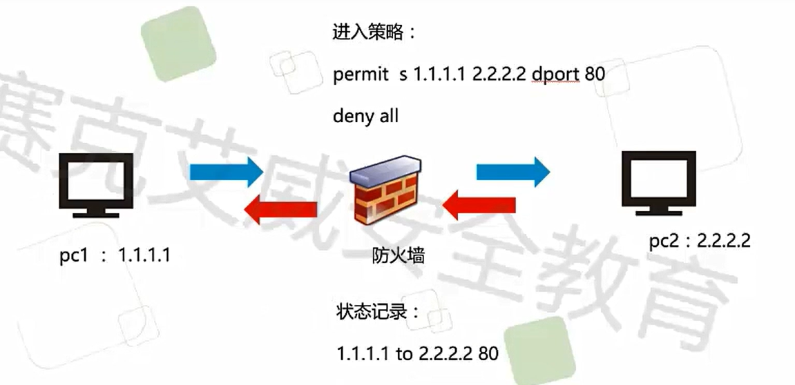

# 目录

iptables是一个基于包过滤的防火墙  

iptables是与最新的 3.5 版本 Linux 内核集成的 IP 信息包过滤系统。如果 Linux 系统连接到因特网或
LAN、服务器或连接 LAN 和因特网的代理服务器，则该系统有利于在 Linux 系统上更好地控制 IP 信息
包过滤和防火墙配置
防火墙在做信息包过滤决定时，有一套遵循和组成的规则，这些规则存储在专用的信 息包过滤表中，而这
些表集成在 Linux 内核中。在信息包过滤表中，规则被分组放在我们所谓的链(chain)中。而
netfilter/iptables IP 信息包过滤系统是一款功能强大的工具，可用于添加、编辑和移除规则。
虽然 netfilter/iptables IP 信息包过滤系统被称为单个实体，但它实际上由两个组件netfilter 和 iptables
组成。
netfilter 组件也称为内核空间(kernelspace)，是内核的一部分，由一些信息包过滤表组成，这些表包
含内核用来控制信息包过滤处理的规则集。

iptables ==> 保安  
对来访的流量做出过滤的操作

### 防火墙类型
#### 包过滤防火墙
在Linux系统下,包过滤功能是内建于核心的(作为一个核心模块，或者直接内建)，同时还有
些可以运用于数据包之上的技巧，不过最常用的依然是查看包头以决定包的命运。
包过
滤防火墙将对每一个接收到的包做出允许或拒绝的决定。具体地讲，它针对每一个数据包的
包头，按照包过滤规则进行判定，与规则相匹配的包依据路由信息继续转发，否则就丢弃。
包过滤是在IP层实现的，包过滤根据数据包的源IP地址、目的IP地址、协议类型(TCP包
UDP包、ICMP包)、源端口、目的端口等包头信息及数据包传输方向等信息来判断是否允许
数据包通过。
包过滤也包括与服务相关的过滤，这是指基于特定的服务进行包过滤，由于
绝大多数服务的监听都驻留在特定TCP/UDP端口，因此，为阻断所有进入特定服务的链接
防火墙只需将所有包含特定TCP/UDP目的端口的包丢弃即可  
  

#### 状态检测防火墙

状态检测防火墙基本保持了简单包过滤防火墙的优点，性能比较好，同时对应用是透明的，在此基
础上，对于安全性有了大幅提升。这种防火墙摒弃了简单包过滤防火墙仅仅考察进出网络的数据包
不关心数据包状态的缺点，在防火墙的核心部分建立状态连接表，维护了连接，将进出网络的数据
当成一个个的事件来处理。可以这样说，状态检测包过滤防火墙规范了网络层和传输层行为，而应
用代理型防火墙则是规范了特定的应用协议上的行为

### iptables的表和链

表(tables)提供特定的功能，iptables内置了4个表，即filter表、nat表、mangle表和
raw表，分别用于实现包过滤，网络地址转换、包重构(修改)和数据跟踪处理。
链(chains)是数据包传播的路径，每一条链其实就是众多规则中的一个检查清单，每一条
链中可以有一 条或数条规则。当一个数据包到达一个链时，iptables就会从链中第一条规则
开始检查，看该数据包是否满足规则所定义的条件。如果满足，系统就会根据 该条规则所定
义的方法处理该数据包;否则iptables将继续检查下一条规则，如果该数据包不符合链中任-
条规则，iptables就会根据该链预先定 义的默认策略来处理数据包。

### iptables工作场景
第一种情况:入站数据流向
从外界到达防火墙的数据包，先被PREROUTING规则链处理(是否修改数据包地址等)
之后会进行路由选择(判断该数据包应该发往何处)，如果数据包 的目标主机是防火墙本机
(比如说Internet用户访问防火墙主机中的web服务器的数据包)，那么内核将其传给INPUT
链进行处理(决定是否允许通 过等)，通过以后再交给系统上层的应用程序(比如Apache服
务器)进行响应。
第二冲情况:转发数据流向
来自外界的数据包到达防火墙后，首先被PREROUTING规则链处理，之后会进行路由选
葵
如果数据包的目标地址是其它外部地址(比如局域网用户通过网 关访问QO站点的数据
，则内核将其传递给FORWARD链进行处理(是否转发或拦截)，然后再交给
包)
POSTROUTING规则链(是否修改数据包的地 址等)进行处理。
第三种情况:出站数据流向
防火墙本机向外部地址发送的数据包(比如在防火墙主机中测试公网DNS服务器时)
首先被OUTPUT规则链处理，之后进行路由选择，然后传递给POSTROUTING规则链(是否修
改数据包的地址等)进行处理。

### iptables规则
iptables的基本语法格式
iptables [-t 表名] 命令选项 [链名 】[条件匹配][j目标动作或跳转|
说明:表名、链名用于指定 iptables命令所操作的表和链，命令选项用于指定管理iptables规则的方
式(比如:插入、增加、删除、查看等;条件匹配用于指定对符合什么样 条件的数据包进行处理;
目标动作或跳转用于指定数据包的处理方式(比如允许通过、拒绝、丢弃、跳转(Jump)给其它链
处理。

-A 在指定链的末尾添加(append)
一条新的规则
-D 删除(delete)指定链中的某一条规则，可以按规则序号和内容删除
-I 在指定链中插入(insert)一条新的规则，默认在第一行添加
-R 修改、替换(replace)指定链中的某一条规则，可以按规则序号和内容替换
-L 列出(1ist)指定链中所有的规则进行查看
-E 重命名用户定义的链，不改变链本身
-F 清空(flush)
-N 新建(new-chain)一条用户自己定义的规则链
-X 删除指定表中用户自定义的规则链
(delete-chain
-P 设置指定链的默认策略(policy)
-2将所有表的所有链的字节和数据包计数器清零
-n 使用数字形式(numeric)显示输出结果
-v查看规则表详细信息(verbose)的信息
-V 查看版本(version)
-h 获取帮助(help)

 
