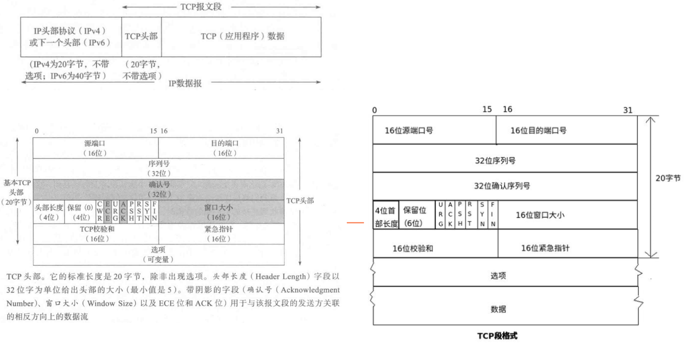

input 就是输入的意思，因此 input 子系统就是管理输入的子系统  
input 子系统分为 input 驱动层、 input 核心层、 input 事件处理层，最终给用户空间提供可访问的设备节点， input 子系统框架如图所示：  
  

驱动层：输入设备的具体驱动程序，比如按键驱动程序，向内核层报告输入内容。  
核心层：承上启下，为驱动层提供输入设备注册和操作接口。通知事件层对输入事件进行处理。  
事件层：主要和用户空间进行交互。

input 子系统的所有设备主设备号都为 13，我们在使用 input 子系统处理输入设备的时候就不需要去注册字符设备了，我们只需要向系统注册一个 input_device 即可。

## 开始

#### 1、注册 input_dev