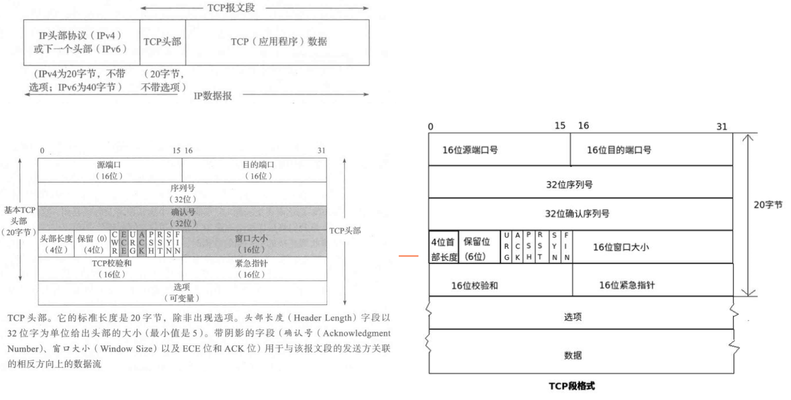
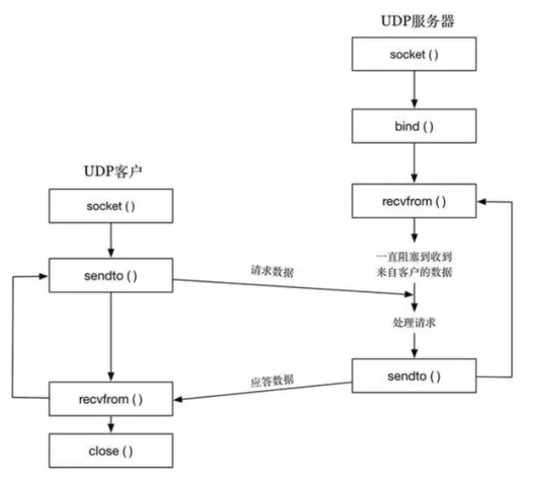

# 目录
- [目录](#目录)
  - [socket编程](#socket编程)
    - [socket是什么](#socket是什么)
    - [IP和端口](#ip和端口)
    - [字节序](#字节序)
    - [通用套接字地址结构](#通用套接字地址结构)
  - [TCP](#tcp)
    - [数据包结构](#数据包结构)
  - [UDP](#udp)

## socket编程
### socket是什么
    应用层与运输层之间的产物
**作用：将运输层的很多复杂操作封装成一些简单的接口，来让应用层调用，以此来实现进程在网络中的通信**

    原理：一种特殊的文件API函数，返回值是一个特殊的文件描述符。用于打开网络接口的文件,我们的一般网络通信的时候,使用的是两台电脑上的不同进程,故socket在网卡的相关位置创建一个虚拟文件系统,用与接收和发送消息。

**本质一：一个非负整数（一种特殊的文件描述符）  
本质二：一个打开的文件（和操作其他文件一样）**

创建套接字函数原型  

    int socket(int domain, int type, int protocol);
```sh
参数信息
domain: 指定套接字的地址族
        AF_UNIX/AF_LOCAL —— 用于本地通讯
        AF_INET —— IPv4地址族，用于使用IPv4地址通讯
        AF_INET6 —— IPv6地址族，用于使用IPv6地址进行通讯
type: 指定套接字的类型
        SOCK_STREAM —— 流套接字（TCP通信）
        SOCK_DGRAM —— 数据报套接字（UDP通信）
protocol: 指定使用的协议
        通常使用0表示默认方式
        IPPROTO_TCP
        IPPROTO_UDP
        IPPROTO_SCTP
        只有当第一个参数为AF_INET或AF_INET6时且使用SCTP协议时才需要配置，其他情况下配0即可
```

### IP和端口

**IP是什么**  
一种网络协议，用于在Internet上唯一表示和定位设备  
IPv4由32位二进制数字组成
IPv6由128位二进制数字组成

**IP地址作用**  
将数据包从源设备发送到目标设备，类似于邮件中的寄件人和收件人地址

**端口是什么**  
用于标识特定应用程序或服务的数字

在网络设备中，每个设备都有65535个端口号


### 字节序

**什么是字节序**  
程序在内存中存储的方式

```sh
大端字节序（网络字节序）
    低地址  存  高数据位
    高地址  存  低数据位

    使用场景：ARM 和 网络通讯数据

小端字节序（本机字节序）
    低地址  存  低数据位
    高地址  存  高数据位

    使用场景：inter芯片 和 x86 
```

**IP地址转换成网络字节序**
十进制  —>  IP网络字节序（二进制数据）
```sh
in_addr_t inet_addr(const char *cp);
```
例：192.168.100.1 -> 0x164a8c0(成功返回的是32位无符号整数，用16进制打印出来表示)  
c0 ---> 192  
a8 ---> 168  
64 ---> 100  

十进制字符串形成的IPv4地址转换为网络字节
```sh
int inet_aton(const char *cp, struct in_addr *inp);
```
struct in_addr结构体指针，用于保存转换后的IPv4地址  

```sh
int inet_pton(int af, const char *src, void *dst);
```
af —— 地址族，用于指定IPv4或IPv6  
src —— 点分十进制形式的IPv4或IPv6地址的C字符串  
dst —— 指向存储转换后地址的内存空间

**网络字节序转换成IP字符串**  
IP网络字节序（二进制数据）转换为点分十进制
```sh
char *inet_ntoa(struct in_addr in);
```
网络字节序转换成字节序
```sh
const char *inet_ntop(int af, const void *src, char *dst, socklen_t size);
```
同上inet_pton
size —— 缓存区dst大小

字符串转int
```sh
int atoi(const char *nptr);
```

本机字节序转换成网络字节序
```sh
uint16_t htons(uint16_t hostshort);
```

网络字节序转本机字节序
```sh
uint16_t ntohs(uint16_t netshort);
```

### 通用套接字地址结构
**struct sockaddr**
```sh
struct  sockaddr{

　　sa_family_t  sa_family;　  //地址族，最常用的是"AF_INET"(IPV4)和"AF_INET6"(IPV6);　
　　char  sa_data[14]；　　    //包含套接字中的目标地址和端口信息;
}；
```
sockaddr的缺陷：sa_data把目标地址和端口信息混在一起了  

**struct sockaddr_in**  
sockaddr_in结构体解决了sockaddr的缺陷，把port和addr 分开储存在两个变量中  
struct  sockaddr_in/  struct  sockaddr_in6结构体
```sh
struct  sockaddr_in{
    sa_family_t         sin_family;     //地址族
    uint16_t            sin_port;       //16位TCP/UDP端口号
    struct  in_addr     sin_addr;       //32位IP地址
    char                sin_zero[8];    //不使用
}；

struct  in_addr{
　　in_addr_t　　　　s_addr;　　         //32位IPV4地址
}
```

```sh
struct sockaddr_in6 {
     sa_family_t        sin6_family;    //地址族
     in_port_t          sin6_port;      //端口号
     uint32_t           sin6_flowinfo;  //IPV6 流量信息
     struct in6_addr    sin6_addr;      //IP地址
     uint32_t           sin6_scope_id;  //作用域ID
};

struct in6_addr {- [目录](#目录)
  - [socket编程](#socket编程)
    - [socket是什么](#socket是什么)
    - [IP和端口](#ip和端口)
    - [字节序](#字节序)
    - [通用套接字地址结构](#通用套接字地址结构)
  - [TCP](#tcp)
  - [UDP](#udp)

　　unsigned　　char s6_addr[16];       //IPv6 地址 */
};
```

**struct sockaddr_storage**  

    相对于sockaddr来说，它结构体的内存空间扩充到了128字节，足以存储IPV6地址


## TCP  
tcp服务器代码：
tcp客户端代码：
多进程服务器：
多线程服务器：
**通讯特点**        

    面向连接                            ——  三次握手、四次挥手
    高可靠性                            ——  出错重传机制
    无丢失、无重复、无出错、按时到达     
    全双工

|服务器|客户端|含义
|---|---|---|
|1.socket|socket|创建套接字|
|2.bind|bind(可省略)|绑定socket到端口|
|3.listen||监听socket端口|
|4.accept|connect|响应socket连接请求(连接远程主机)
|5.read/write(recv/send)|read/write(recv/send)|发送/接收数据
|6.close|close|关闭套接字

```sh
函数原型
int socket(int domain, int type, int protocol);
int bind(int sockfd, const struct sockaddr *addr, socklen_t addrlen);
int listen(int sockfd, int backlog);
int accept(int sockfd, struct sockaddr *addr, socklen_t *addrlen);
ssize t recv(int sockfd, void *buf, size_t len, int flags);
ssize_t send(int sockfd, const void *buf, size_t len, int flags);
int connect(int sockfd, const struct sockaddr *addr, socklen_t addrlen);
```

参数列表
```sh
domain: 指定套接字的地址族
        AF_UNIX/AF_LOCAL —— 用于本地通讯
        AF_INET —— IPv4地址族，用于使用IPv4地址通讯
        AF_INET6 —— IPv6地址族，用于使用IPv6地址进行通讯
type: 指定套接字的类型
        SOCK_STREAM —— 流套接字（TCP通信）
        SOCK_DGRAM —— 数据报套接字（UDP通信）
protocol: 指定使用的协议
        通常使用0表示默认方式
        IPPROTO_TCP
        IPPROTO_UDP
        IPPROTO_SCTP
        只有当第一个参数为AF_INET或AF_INET6时且使用SCTP协议时才需要配置，其他情况下配0即可
sockfd: socket函数返回的套接字描述符
addr: 指定特定协议的地址结构的指针
addrlen: 该地址结构的长度
backlog: 最大连接个数（一般小于30）
buf: 指定缓冲区位置
len: 指定缓冲区大小
flags: 通常设置成0
```

### 数据包结构

```sh
端口号: 端口号是unsigned short类型，占2个字节，16位
序列号(seq): 标识了TCP发送端到TCP接收端的数据流的一个字节，该字节代表着包含该序列号的报文段的数据中的第一个字节, 32位
确认号(ack): 包含发送确认的一端所期望收到的下一个序号。因此，确认序号应当是上次已成功收到数据字节序号加!(不是单纯的序号加1，还包括数据字节数), 32位
头部长度: 给出了头部长度，以32位字为单位

协议标志位:
    CWR -- 拥塞窗口减(发送方降低它的发送速率)
    ECE -- ECN回显(发送方接收到一个更早的拥塞通告)
    URG -- 为1表示紧急指针有效
    ACK -- 为1表示确认序列号有效 -- 可以理解为一个应答数据包
    PSH -- 为1表示此包为加急包，应尽快将此包交给应用层
    RST --为l表示需要重新建立连接
    SYN -- 为1表示同步序号用于发起一个连接 -- 可以理解成为握手请求包
    FIN -- 为l表示发端完成发送任务 -- 可以理解成挥手请求包,

窗口大小: 用于TCP流量控制
发送数据的窗口大小，告诉对方在不等待确认的情况下，可以最大发来多大的数据，由于6位最大只能表示65535，如果需要更大的窗口，需要使用选项中的窗口扩大因子选项


紧急指针: 只有URG位字段被设置时才有效
紧急指针指的是本报文段中紧急数据的最后一个字节的序号，表示前面的数据需要加急处理发送

选项: 其他扩展配置，比如扩大窗口大小，时间戳等等

```


## UDP

区别：  
无连接、数据报传输、无粘包现象、有边界保护

  

|服务器|客户端|含义
|---|---|---|
|1.socket|socket|创建套接字|
|2.bind||绑定socket到端口|
|3.sendto()/recvfrom()|sendto()/recvfrom()|数据发送接收|
|4.close|close|关闭套接字|


```sh
函数原型
ssize_t sendto(int sockfd, const void *buf, size_t len, int flags, const struct sockaddr *dest addr, socklen_t addrlen);
ssize t recyfromlint sockfd, void *buf, size t len, int flags, struct sockaddr *src addr, socklen_t *addrlen);
```
参数列表
```sh
flags: 标志参数，为0时表示阻塞方式
```
