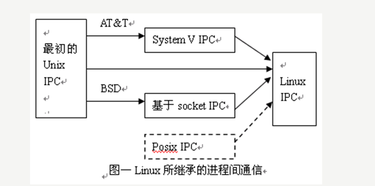

# 进程

## 程序和进程的组成结构

|程序|text|rodate|data|bss|堆|栈|系统相关信息|
|---|---|---|---|---|---|--|----------------
|程序| &#10004;| &#10004;| &#10004;| &#10004;|
|进程| &#10004;| &#10004;| &#10004;| &#10004;| &#10004;| &#10004;| &#10004;| &#10004| 

#### 进程相关命令
<table>
    <tr>
        <td>pstree</td>
        <td>以树形的结构显示进程的信息</td>
    </tr>
    <tr>
        <td>ps</td>
        <td>查看当前系统进程的工具</td>
    </tr>
    <tr>
        <td>kill</td>
        <td>给指定的PID进程发送信号</td>
    </tr>
    <tr>
        <td>bg(background)</td>
        <td>将一个挂起的进程在后台的运行</td>
    </tr>
    <tr>
        <td>fg(foreground)</td>
        <td>将后台的进程到前台运行</td>
    </tr>
    <tr>
        <td>pstree</td>
        <td>以树形的结构显示进程的信息</td>
    </tr>
</table>

#### 进程控制函数
<table>
   <tr style="color:red">
      <td>fork</td>
      <td>创建一个新进程</td>
   </tr>
   <tr style="color:red">
      <td>clone</td>
      <td>按指定条件创建子进程</td>
   </tr>
   <tr style="color:red">
      <td>execve</td>
      <td>运行可执行文件</td>
   </tr>
   <tr style="color:red">
      <td>exit</td>
      <td>中止进程</td>
   </tr>
   <tr>
      <td>_exit</td>
      <td>立即中止当前进程</td>
   </tr>
   <tr>
      <td>getpgid</td>
      <td>获取指定进程组标识号</td>
   </tr>
   <tr>
      <td>setpgid</td>
      <td>设置指定进程组标志号</td>
   </tr>
   <tr>
      <td>getpgrp</td>
      <td>获取当前进程组标识号</td>
   </tr>
   <tr>
      <td>setpgrp</td>
      <td>设置当前进程组标志号</td>
    </tr>
      <tr style="color:red">
          <td>getpid</td>
          <td>获取进程标识号</td>
    </tr>
      <tr>
          <td>getppid</td>
          <td>获取父进程标识号</td>
    </tr>
      <tr style="color:red">
          <td>getpriority</td>
          <td>获取调度优先级</td>
    </tr>
      <tr style="color:red">
          <td>setpriority</td>
          <td>设置调度优先级</td>
    </tr>
      <tr>
          <td>modify_ldt</td>
          <td>读写进程的本地描述表</td>
    </tr>
      <tr>
          <td>nanosleep</td>
          <td>使进程睡眠指定的时间</td>
    </tr>
      <tr>
          <td>nice</td>
          <td>改变分时进程的优先级</td>
    </tr>
      <tr style="color:red">
          <td>pause</td>
          <td>挂起进程，等待信号</td>
    </tr>
      <tr>
          <td>personality</td>
          <td>设置进程运行域</td>
    </tr>
      <tr style="color:red">
          <td>prctl</td>
          <td>对进程进行特定操作</td>
    </tr>
      <tr>
          <td>ptrace</td>
          <td>进程跟踪</td>
    </tr>
      <tr>
          <td>sched_get_priority_max</td>
          <td>取得静态优先级的上限</td>
    </tr>
      <tr>
          <td>sched_get_priority_min</td>
          <td>取得静态优先级的下限</td>
    </tr>
      <tr>
          <td>sched_getparam</td>
          <td>取得进程的调度参数</td>
    </tr>
      <tr>
          <td>sched_getscheduler</td>
          <td>取得指定进程的调度策略</td>
    </tr>
      <tr>
          <td>sched_rr_get_interval</td>
          <td>取得按RR算法调度的实时进程的时间片长度</td>
    </tr>
      <tr>
          <td>sched_setparam</td>
          <td>设置进程的调度参数</td>
    </tr>
      <tr>
          <td>sched_setscheduler</td>
          <td>设置指定进程的调度策略和参数</td>
    </tr>
      <tr>
          <td>sched_yield</td>
          <td>进程主动让出处理器,并将自己等候调度队列队尾</td>
    </tr>
      <tr>
          <td>vfork</td>
          <td>创建一个子进程，以供执行新程序，常与execve等同时使用</td>
    </tr>
      <tr style="color:red">
          <td>wait</td>
          <td>等待子进程终止（阻塞）</td>
    </tr>
      <tr>
          <td>wait3</td>
          <td>参见wait</td>
    </tr>
      <tr>
          <td>waitpid</td>
          <td>等待指定子进程终止（由第三个参数决定阻塞还是非阻塞）</td>
    </tr>
      <tr>
          <td>wait4</td>
          <td>参见waitpid</td>
    </tr>
      <tr>
          <td>capget</td>
          <td>获取进程权限</td>
    </tr>
      <tr>
          <td>capset</td>
          <td>设置进程权限</td>
    </tr>
      <tr>
          <td>getsid</td>
          <td>获取会晤标识号</td>
    </tr>
      <tr>
          <td>setsid</td>
          <td>设置会晤标识号</td>
      </tr>
</table>

#### 进程运行状态
<table style="text-align:center">
   <tr>
      <td><strong>进程运行状态</td>
      <td><strong>描述</td>
   </tr>
   <tr>
      <td>就绪态</td>
      <td>进程所需要的条件已经准备完成，等待CPU调度</td>
   </tr>
   <tr>
      <td>运行态（R）</td>
      <td>进程占用CPU，并在CPU上运行</td>
   </tr>
   <tr>
      <td>等待态</td>
      <td>此时进程在等待一个事件的发生或某种资源</td>
   </tr>
   <tr style="color:green">
      <td>可中断等待态(S)</td>
      <td>进程正在休眠，等待某个资源来唤醒它(可以被其他信号中断唤醒)</td>
   </tr>
   <tr style="color:green">
      <td>不可中断(D)</td>
      <td>进程正在休眠，等待某个资源来唤醒它(不可以被其他信号中断唤醒)</td>
   </tr>
   <tr>
      <td>停止态（T）</td>
      <td>此时进程暂停接受某种处理（gdb调试断电信息处理）</td>
   </tr>
   <tr>
      <td>僵尸态（Z）</td>
      <td>进程已经结束，但是还没有释放进程资源</td>
   </tr>
</table>

## 进程间通讯  

|最初的Unix IPC|System V IPC|
|---|---|
|有名管道|共享内存|
|无名管道|消息队列|
|信号|信号灯集|  

  

#### 管道（Pipe）及有名管道（named pipe）  

#### 信号（Signal）  

#### 消息队列  

#### 共享内存  

#### 信号灯集（semaphore）  

#### 套接口（Socket）  

# 线程
## 同步
## 互斥

## I/O多路复用

# 高级I/O（五种I/O模型）

**目的：解决阻塞IO影响其他程序执行和非阻塞IO造成的资源浪费的情况
功能：IO多路复用可以同时监听多个IO操作**

|五种I/O模型|描述|异/同步|
|---|---|---|
|阻塞式I/O|调用结果返回之前，当前线程会被挂起(线程进入非可执行状态，在这个状态下，OS不会给线程分配时间片，即线程暂停运行)，调用结果返回后线程进入就绪态|同|
|非阻塞式I/O|当程序执行到非阻塞I0操作时，不会在原地阻塞而是直接返回错误结果|同
|I/O复用|同时阻塞监听多个/0操作，任意一个或多个触发后都会继续执行|同|
|信号驱动式I/O|内核在描述符就绪时会发送SIGIO信号通知|同|
|异步I/O|给内核传递描述符、缓冲区指针、缓冲区大小和文件偏移，并告知内核再操作完成后如何通知我们|异|

异步I/O和信号驱动模型的主要区别在于:信号驱动式I/O是由内核通知我们何时可以启动 一个/O操作，而异步!/O模型是由内核通知我们//O操作何时完成