# 进程

## 程序和进程的组成结构

|程序|text|rodate|data|bss|堆|栈|系统相关信息|
|---|---|---|---|---|---|--|----------------
|程序| &#10004;| &#10004;| &#10004;| &#10004;|
|进程| &#10004;| &#10004;| &#10004;| &#10004;| &#10004;| &#10004;| &#10004;| &#10004| 

#### 进程相关命令
<table>
    <tr>
        <td>pstree</td>
        <td>以树形的结构显示进程的信息</td>
    </tr>
    <tr>
        <td>ps</td>
        <td>查看当前系统进程的工具</td>
    </tr>
    <tr>
        <td>kill</td>
        <td>给指定的PID进程发送信号</td>
    </tr>
    <tr>
        <td>bg(background)</td>
        <td>将一个挂起的进程在后台的运行</td>
    </tr>
    <tr>
        <td>fg(foreground)</td>
        <td>将后台的进程到前台运行</td>
    </tr>
    <tr>
        <td>pstree</td>
        <td>以树形的结构显示进程的信息</td>
    </tr>
</table>

#### 进程控制函数
<table>
   <tr style="color:red">
      <td>fork</td>
      <td>创建一个新进程</td>
   </tr>
   <tr style="color:red">
      <td>clone</td>
      <td>按指定条件创建子进程</td>
   </tr>
   <tr style="color:red">
      <td>execve</td>
      <td>运行可执行文件</td>
   </tr>
   <tr style="color:red">
      <td>exit</td>
      <td>中止进程</td>
   </tr>
   <tr>
      <td>_exit</td>
      <td>立即中止当前进程</td>
   </tr>
   <tr>
      <td>getpgid</td>
      <td>获取指定进程组标识号</td>
   </tr>
   <tr>
      <td>setpgid</td>
      <td>设置指定进程组标志号</td>
   </tr>
   <tr>
      <td>getpgrp</td>
      <td>获取当前进程组标识号</td>
   </tr>
   <tr>
      <td>setpgrp</td>
      <td>设置当前进程组标志号</td>
    </tr>
      <tr style="color:red">
          <td>getpid</td>
          <td>获取进程标识号</td>
    </tr>
      <tr>
          <td>getppid</td>
          <td>获取父进程标识号</td>
    </tr>
      <tr style="color:red">
          <td>getpriority</td>
          <td>获取调度优先级</td>
    </tr>
      <tr style="color:red">
          <td>setpriority</td>
          <td>设置调度优先级</td>
    </tr>
      <tr>
          <td>modify_ldt</td>
          <td>读写进程的本地描述表</td>
    </tr>
      <tr>
          <td>nanosleep</td>
          <td>使进程睡眠指定的时间</td>
    </tr>
      <tr>
          <td>nice</td>
          <td>改变分时进程的优先级</td>
    </tr>
      <tr style="color:red">
          <td>pause</td>
          <td>挂起进程，等待信号</td>
    </tr>
      <tr>
          <td>personality</td>
          <td>设置进程运行域</td>
    </tr>
      <tr style="color:red">
          <td>prctl</td>
          <td>对进程进行特定操作</td>
    </tr>
      <tr>
          <td>ptrace</td>
          <td>进程跟踪</td>
    </tr>
      <tr>
          <td>sched_get_priority_max</td>
          <td>取得静态优先级的上限</td>
    </tr>
      <tr>
          <td>sched_get_priority_min</td>
          <td>取得静态优先级的下限</td>
    </tr>
      <tr>
          <td>sched_getparam</td>
          <td>取得进程的调度参数</td>
    </tr>
      <tr>
          <td>sched_getscheduler</td>
          <td>取得指定进程的调度策略</td>
    </tr>
      <tr>
          <td>sched_rr_get_interval</td>
          <td>取得按RR算法调度的实时进程的时间片长度</td>
    </tr>
      <tr>
          <td>sched_setparam</td>
          <td>设置进程的调度参数</td>
    </tr>
      <tr>
          <td>sched_setscheduler</td>
          <td>设置指定进程的调度策略和参数</td>
    </tr>
      <tr>
          <td>sched_yield</td>
          <td>进程主动让出处理器,并将自己等候调度队列队尾</td>
    </tr>
      <tr>
          <td>vfork</td>
          <td>创建一个子进程，以供执行新程序，常与execve等同时使用</td>
    </tr>
      <tr style="color:red">
          <td>wait</td>
          <td>等待子进程终止（阻塞）</td>
    </tr>
      <tr>
          <td>wait3</td>
          <td>参见wait</td>
    </tr>
      <tr>
          <td>waitpid</td>
          <td>等待指定子进程终止（由第三个参数决定阻塞还是非阻塞）</td>
    </tr>
      <tr>
          <td>wait4</td>
          <td>参见waitpid</td>
    </tr>
      <tr>
          <td>capget</td>
          <td>获取进程权限</td>
    </tr>
      <tr>
          <td>capset</td>
          <td>设置进程权限</td>
    </tr>
      <tr>
          <td>getsid</td>
          <td>获取会晤标识号</td>
    </tr>
      <tr>
          <td>setsid</td>
          <td>设置会晤标识号</td>
      </tr>
</table>


#### 进程运行状态
<table style="text-align:center">
   <tr>
      <td><strong>进程运行状态</td>
      <td><strong>描述</td>
   </tr>
   <tr>
      <td>就绪态</td>
      <td>进程所需要的条件已经准备完成，等待CPU调度</td>
   </tr>
   <tr>
      <td>运行态（R）</td>
      <td>进程占用CPU，并在CPU上运行</td>
   </tr>
   <tr>
      <td>等待态</td>
      <td>此时进程在等待一个事件的发生或某种资源</td>
   </tr>
   <tr style="color:green">
      <td>可中断等待态(S)</td>
      <td>进程正在休眠，等待某个资源来唤醒它(可以被其他信号中断唤醒)</td>
   </tr>
   <tr style="color:green">
      <td>不可中断(D)</td>
      <td>进程正在休眠，等待某个资源来唤醒它(不可以被其他信号中断唤醒)</td>
   </tr>
   <tr>
      <td>停止态（T）</td>
      <td>此时进程暂停接受某种处理（gdb调试断电信息处理）</td>
   </tr>
   <tr>
      <td>僵尸态（Z）</td>
      <td>进程已经结束，但是还没有释放进程资源</td>
   </tr>
</table>

## 进程间通讯  

|最初的Unix IPC|System V IPC|
|---|---|
|有名管道|共享内存|
|无名管道|消息队列|
|信号|信号灯集|  

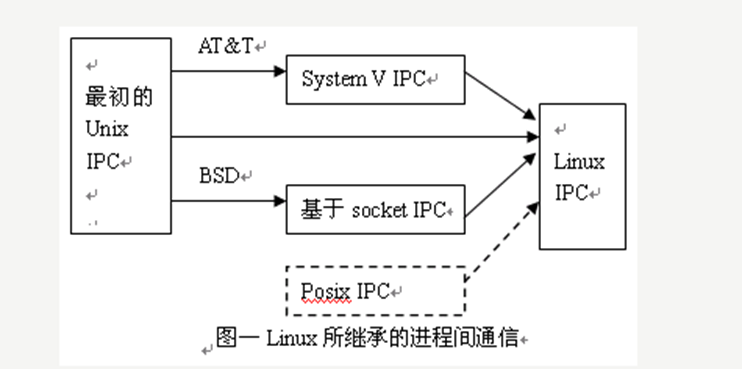  

#### 管道（Pipe）及有名管道（named pipe）  

    线程之间通讯：全局变量  
    但进程不行，进程之间都是拥有的4G内存空间，其中0-3G的用户空间是独立的，3G-4G的内核空间是共享的，任何一个进程的全局变量在另一个进程中都看不到。  

<table>
  <tr>
    <td> 管道特点 </td>
    <td> 描述 </td>
  </tr>
  <tr>
    <td> 半双工通讯 </td>
    <td> 数据只有向数据只能向一个方向流动；【A->B ,B->A】 </td>
  </tr>
  <tr>
    <td> 无名管道只能用于具有亲缘关系的进程[父子或者兄弟进程] </td>
    <td> 因为只有子进程会拷贝父进程的地址空间，它们拥有相同的文件描述符。可以对同一块内存区域进行操作。</td>
  </tr>
  <tr>
    <td> 一个进程向管道中写的内容被管道另一端的进程读出 </td>
    <td> 写入的内容每次都添加在管道缓冲区的末尾，并且每次都是从缓冲区的头部读出数据 </td>
  </tr>
</table>

|无名管道|有名管道|
|---|---|
|int pipe(int pipefd[2])|int mkfifo(const char *pathname, mode_t mode)|
|pipefd  数组的首地址 ，pipefd[0]表示读端,pipefd[1]表示写端|pathname 管道文件创建路径 mode 创建的管道文件权限 3位8进制数


#### 信号（Signal） 

    信号是在软件层次上对中断的一种模拟机制。他是进程通信机制中唯一的异步通信机制  
    一个信号的产生叫做生成，接收到一个信号的行为叫做捕捉。

|信号的生命周期|
|---|
<1>产生信号 
<2>发送信号给进程
<3>信号的处理和注销  

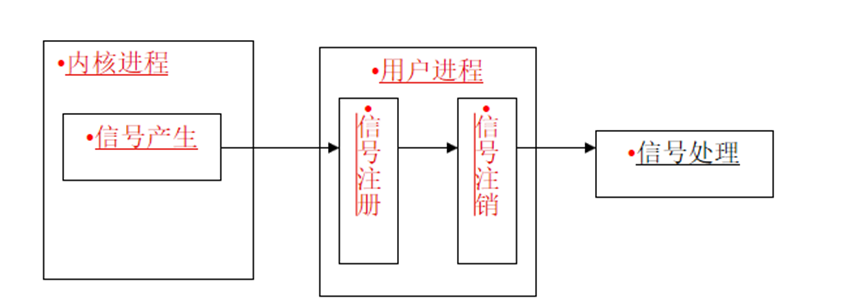  

信号的产生：是指触发信号的事件（例如，硬件异常，定时器超时，或这外部中断等待）  
信号的注册：是指将信号值加入到目标进程的未处理的信号集合中。  
信号注销机制会把当前信号从目标进程的未处理的信号集合中注销，防止多次CPU多次调度的处理。  
信号注销之后，立即执行信号处理函数，执行完毕之后，信号本次的发送对当前进程的影响就彻底的结束了。

|linux系统对信号的处理|描述|
|---|---|
|<1>忽略信号| SIGKILL (杀死当前进程)和 SIGSTOP（停止当前进程）不能忽略|
|<2>捕捉信号|定义并注册信号处理函数，当信号发生时，执行相应的处理函数|
|<3>执行省缺操作 interrupt|操作系统中对每一个信号对做了相应的默认处理（就是执行信号默认的操作）例如：SIGCON 继续当前进程。|

##### 信号处理函数  
sighandler_t signal(int signum, sighandler_t handler);  
参数：
	@signum		捕捉的信号名称。 例如：SIGINT,SIGCHLD
	@handler		信号处理的方式函数，他是一个函数指针。

|信号处理总结|
|---|
|1、一旦安装了信号处理函数，它便一直安装|
|2、在一个信号处理函数运行期间，正被递交的信号是阻塞的|
|3、如果一个信号在被阻塞期间产生了一次或多次，那么该信号被解阻塞之后通常只递交一次，也就是说Unix信号默认是不排队的
|4、可通过sigprocmask函数选择阻塞或解阻塞一组信号


##### 信号发送函数  
上面信号的发送都是shell命令发送的，能不能使用函数发送呢  
|||
|---|---|
|<1>给指定的pid号发送信号|int kill(pid_t pid,int sigum);|
|<2>给自己发送信号|int raise(int signum);|


##### 定时闹钟函数[alarm]和挂起函数[pause]
|alarm（）|pause（）|
|---|---|
|闹钟函数，它可以在进程中设置一个定时器|用于将调用进程挂起直到收到信号为止|
|unsigned int alarm(unsigned int seconds);|int  pause(void);|
|给进程启动一个定时器，经过seconds秒后把SIGALRM信号发送给当前进程。|挂起一个进程，直到进程收到一个信号，进程会继续执行 |

### SystemV IPC对象  

    共享内存,消息队列，信号灯集统称为System V IPC对象

|打开一个文件|调用一个IPC对象|
|---|---|
|inode号|标识号|
|内核使用inode中的信息来定位文件数据，并为进程创建一个文件描述符|进程可以通过系统调用（操作系统提供的函数）传递的识别号来对我们的IPC对象|

    ipcs用于显示系统IPC对象[共享内存,消息队列，信号灯集]的信息
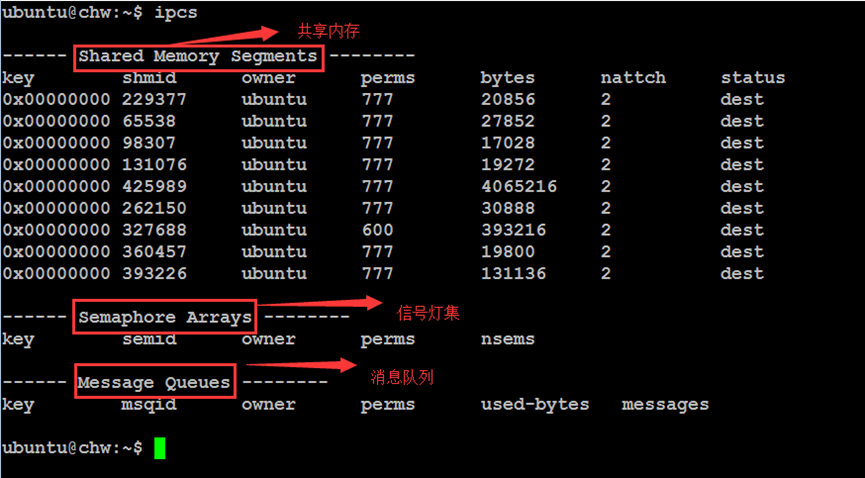  
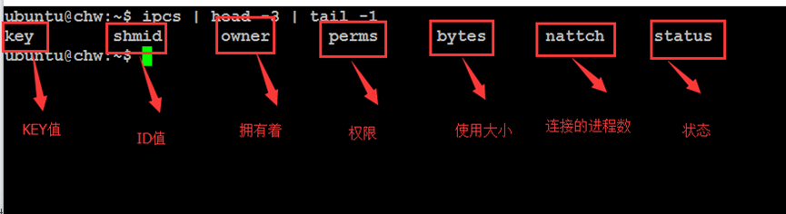  

ID 资源条目的唯一表示号。  
KEY 应用程序读取资源使用的参数  
每个IPC机制，系统都为其分配了唯一的ID，所有针对该IPC机制的操作都使用对应的ID，因此通信双方都需要通过某个方法来获取ID值。为了解决获取ID值的问题，操作系统引入了key值，约定，IPC创建的时候使用key值作为参数，相同的key值可以得到同一个IPC对象的ID(即一方创建，另一方通过key参数来获得ID)。它保证了双方可以获取用于传递数据的IPC机制的ID值  

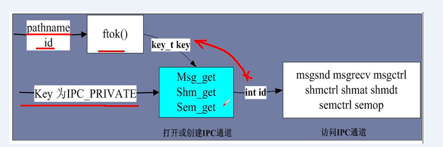  

注意:在IPC的通信模式下，不管是使用消息队列还是共享内存，甚至是信号灯，每个IPC的对象都有唯一的名字,称为"键"(key)。通过"键"，进程能够识别所用的对象。"键"与IPC对象的关系就如同文件名称于文件，通过文件名，进程能够读写文件内的数据，甚至多个进程能够公用一个文件。而在 IPC的通讯模式下，通过"键"的使用也使得一个IPC对象能为多个进程所共用。  

**总结：进程都是通过IPC对象唯一的名字,称为键key,找到IPC对象。但内核还是通过IPC对象的ID来找到它.不同进程只要获得同一IPC对象的键key,就可以实现操作同一IPC对象,从而实际进程间通信.**  
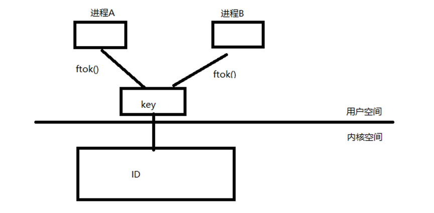  
|获取key值方法|函数|
|---|---|
|<1>调用ftok函数|key_t ftok(const char *pathname, int proj_id);|
|<2>使用IPC_PRIVATE对象（了解即可）|

#### 共享内存  
System V进程间的通信，在系统建立IPC通信的时候，必须指定一个ID值。而该ID的值，我们就可以通过ftok()函数来间接的得到。

    共享内存就是就是允许两个不相关的进程访问同一个物理内存。可以理解为多个进程共享同一块物理内存  

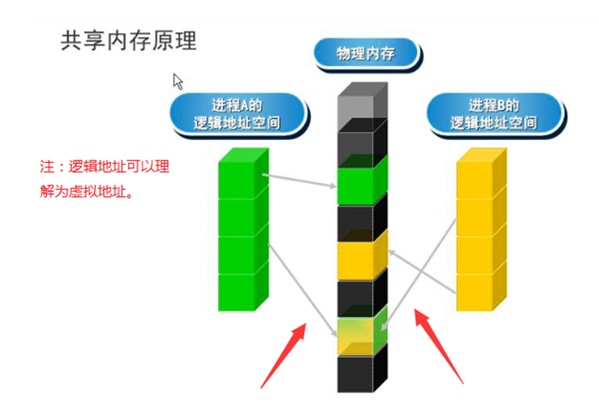  
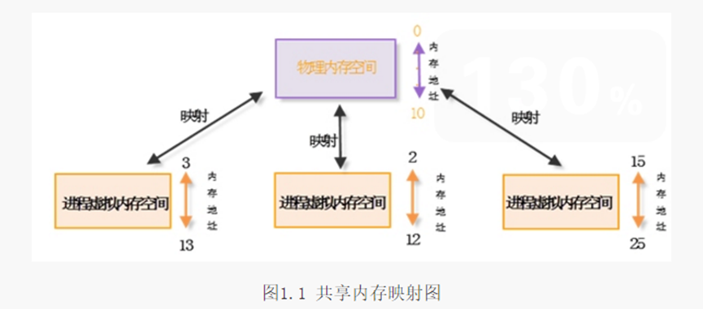  

|实现步骤|函数|
|---|---|
|<1>创建共享内存|int shmget(key_t key, size_t size, int shmflg);|
|<2>映射共享内存|void * shmat(int shmid, const void *shmaddr, int shmflg);|
|<3>撤销共享内存的映射|int shmdt (const void * shmaddr);|
|<4>删除共享内存|int shmctl(int shmid, int cmd,struct shmid_ds *buf);|
```sh
@ key     IPC_PRIVATE  : 用于亲缘间进程的通信  
		   ftok()函数获得: 用于非亲缘关系的进程  
@size     申请共享内存的大小   
@shmflg  权限标志 (和open（）参数差不多）  
@ shmid 共享内存段的标识 [由shmget()函数得到]  
@ shmaddr[将共享内存映射到指定的地址空间] 	  
NULL        让系统自动完成映射  
@ shmflg[映射的标志] 0            映射可以读写;  
                    SHM_RDONLY   映射后只能读  
@cmd      共享内存的控制命令
IPC_RMID   删除共享内存。  
@buf       shmid 的一些信息。  
NULL       表示不需要使用它。  
```
#### 消息队列  

    消息队列就是一个消息的链表。我们可以把这个消息看成一个记录[固定的格式]。这个记录中包含了很多的信息，并且具有一定的格式和优先级。对消息队列有写权限的进程可以向中按照一定的规则添加新消息；对消息队列有读权限的进程则可以从消息队列中读走消息。

操作系统提供了一个struct msg_ids结构体来记录消息队列的全局数据结构。
```sh
struct msqid_ds{
    struct   ipc_perm    msg_perm;  //被用来传递ipc操作权限信息
    struct   msg         *msg_first;  //指向消息队列第一个结点
    struct   msg         *msg_last;   //指向详细队列最后一个结点
	  ……;
};
```
|实现步骤|函数|功能|
|---|---|---|
|<1>创建消息队列|int msgget(key_t key ,int msgflag);|创建消息队列信息。得到其ID
|<2>发送消息队列|int msgsnd(int msqid, const void *msgp, size_t msgsz, int msgflg);|向消息队列中添加消息|
|<3>接收消息队列的信息|ssize_t msgrcv(int msqid, void *msgp, size_t msgsz, long msgtyp,int msgflg);|接收指定类型的消息 |
|<4>删除消息队列|int msgctl(int msqid, int cmd, struct msqid_ds *buf);|对消息队列进行控制|
```ah
@key  IPC_PRIVATE 或者 ftok()
@msgflg     
IPC_CREAT | 0666   对应的消息队列不存在，则创建, 存在直接返回ID
	        或 IPC_CREAT | IPC_EXEL | 0666 对应的消息队列段存在则调用失败。
										  否则，创建新的消息队列段。
msqid  消息队列的ID 
msgp   消息存放的地址
msgsz  消息正文的大小--- sizeof(msg_t) - sizeof(long)
msgflg 
        0:阻塞的方式发送消息 
        IPC_NOWAIT:非阻塞发送消息(当消息队列中没有可用空间时，不阻塞，立即返回一个错误码EAGAIN) 
注意：msgp在系统内部一个指定了一个消息的模板。用于我们发送和接收消息
struct msgbuf{
long mtype; //消息的类型
char mtext[1];  //消息的正文。
};	

msgtyp 接收的消息的类型 
msgflg   0(阻塞方式调用) 或 IPC_NOWAIT (没有指定类型消息，不阻塞，立即返回)
@cmd    消息队列控制命令
IPC_RMID   删除消息队列
@buf	  填充当前进程的信息到msqid_ds 结构体中。
          一般我们置为NULL，不适用。

```

#### 信号灯集（semaphore）  

||system信号量|posix信号量|
|---|---|---|
|是什么|信号灯集|之前学的信号量|
|用在哪|进程直接的通讯|线程之间的通讯|
||计数信号量|单个的计数信号量|

**计数信号量：它表示一个或者多个信号量组成了一个集合，我们也称之后为信号灯集**

信号灯概述  
信号灯的出现主要是为了解决多任务程序并发执行时，对资源的访问出现的竞争同步的问题。  
信号量最初是对资源的一种抽象和模拟，最初的信号量(整型信号量)，就是通过一个数值，来表示某种资源的个数  
在你这个抽象的基础上，他的发明者Dijkstra(迪杰斯塔拉)为其制定了两个原子性(一次性执行完的，不可被中断的)的操作，P操作(passeren（申请通过）)，V操作（vrijgeven释放)来实现对互斥资源的访问  
后来处于对(1).多个临界资源的访问，(2)和资源使用数量的限制(在有些情况下，当资源数量低于某一下限值时，便不予分配).信号量的概念得到进一步发展，形成了所谓的”信号灯集”.  

|二值信号灯|计数信号灯|
|---|---|
|最简单的信号灯形式，信号灯的值只能取0或1,类似互斥锁。|信号灯的值可以取任意非负值(当然受内核本省的约束)，用来统计资源，其值就代表可用资源的个数。|

总结：
从上面的描述可知，信号量的大致的发展，”信号灯集”是在”(简单)信号量”的基础上发展过来的。是为了解决以下问题：  
<1>.多个临界资源的访问  
<2>.资源保护的目的  

**信号灯集和共享内存**  
一般来说，我们的信号灯集和我们的共享内存联合起来使用的。就是我们所谓的P,V操作。一般是实现，我们进程之间的同步。  
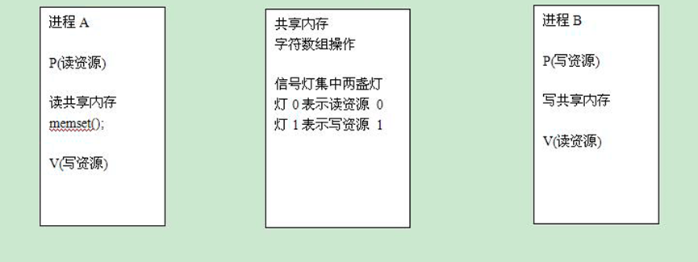  
|实现步骤|函数|
|---|---|
|<1>获得一个指定的key值|key_t ftok( const char *pathname, int proj_id);|
|<2>.创建IPC对象|int semget(key_t key, int nsems, int semflg);|
|<3>初始化信号灯集中信号灯的值|int semctl(int semid,int semnum,int cmd, .....);|
|<4>操作IPC对象-----申请资源(P)，释放资源(V)|int semop(int semid, struct sembuf *sops, unsigned nsops);|
|<5>.删除IPC对象|if(semctl(semid,0,IPC_RMID) < 0)|


#### 套接口（Socket）  


# 线程
<table>
  <td> 进程的缺陷 </td>
  <tr>
    <td> 进程之间的切换需要消耗系统很大的开销 </td>
  </tr>
  <tr>
    <td> 进程只能在一个时刻干一件事情 </td>
  </tr>
  <tr>
    <td> 进程在执行的过程中如果阻塞了，整个进程就会挂起 </td>
  </tr>
</table>

**解决进程的缺陷---线程**  

```sh
注意点：
主线程总是第一个运行的线程对等线程的执行顺序不明确
线程间共享资源：内存空间、全局变量，进程中打开的文件描述符等，用户ID
等
私有资源：线程ID(tid)，系统相关的数据(函数运行环境)，局部变量，私有栈

PID是由Linux内核分配的
TID是有pthread库分配的

PID在整个系统中是唯一的
TID只有在它所属的进程上下文中才有意义
```

```sh
创建线程
int pthread_create(pthread_t *thread, const pthread _attr t *attr
                      void *(*start_routine) (void *), void *arg);
thread:获得线程ID，pthread_t为unsigned long类型

attr:线程的属性(分离属性和结合属性)，通常为NULL表示使用默认属性为结合属性
分离属性(detached):操作系统自动回收存储器资源
结合属性(joinable):用户手动回收存储区资源

start_routine:线程的执行函数，即线程执行的代码，采用回调方式执行线程函数 (回调函数)

arg:给线程函数传递的参数
```

```sh
线程终止
void pthread_exit(void *retval);
注：
1、主线程(main)函数中遇到return或者调用了exit()函数退出当前进程，整个进程终止，此时所有的其他线程也将终止
2、子线程如果调用return或pthread_exit，则只有该线程结束，但调用exit或_exit则整个进程结束
3、主线程如果调用了pthread_exit函数，则主线程结束，其他线程不会结束，直到所有的线程都结束的时候，进程才结束
4、retval必须是线程结束后不会被释放的值，否则主线程无法回收
```

## 互斥和同步
||互斥|同步|
|---|---|---|
|概念|多个线程对共享资源的访问是互斥的，即同一时刻只能有一个线程访问共享资源|多个线程相互之间配合，按照一定的顺序，完成任务|
|实现机制|互斥锁、互斥量|条件变量、信号量|

|互斥实现步骤|函数|
|---|---|
|定义互斥锁|pthread_mutex_t mutex;|
|初始化互斥锁（静态初始化）|pthread mutex t mutex=PTHREAD MUTEX INITIALIZER;|
|获得互斥锁|int pthread mutex lock(pthread mutex t*mutex);|
|释放互斥锁|int pthread mutex unlock(pthread mutex t*mutex);
|销毁互斥锁|int pthread mutex destroy(pthread mutex t*mutex);|

**锁住数据，而不是代码**   
条件变量提供了一种线程间的通知机制,当某个共享数据达到某个值时,唤醒等待这个共享数据的线程.  
|条件变量实现步骤|函数|
|---|---|
|定义条件变量|pthread_cond_t cond;|
|初始化条件变量（静态初始化）|pthread cond_t cond = PTHREAD COND INITIALIZER;|
|等待条件变量满足条件，若不满足条件则阻塞|int pthread cond wait(pthread_cond_t *restrict cond, pthread mutex_t *restrict mutex);|
|唤醒条件变量|唤醒所有条件变量：int pthread cond broadcast(pthread cond t *cond);唤醒至少一个条件变量：int pthread _cond_signal(pthread cond t*cond);|
|销毁条件变量|int pthread cond_destroy(pthread _cond_t *cond);|


信号量是一种特殊的变量，它只能取自然数值并且只支持两种操作：等待(P)和信号(V).假设有信号量SV，对其的P、V操作如下：  
```sh
P，如果SV的值大于0，则将其减一；若SV的值为0，则挂起执行
V，如果有其他进行因为等待SV而挂起，则唤醒；若没有，则将SV值加一
```
信号量的取值可以是任何自然数，最常用的，最简单的信号量是二进制信号量，只有0和1两个值. 
```sh
sem_init函数用于初始化一个未命名的信号量
sem_destory函数用于销毁信号量
sem_wait函数将以原子操作方式将信号量减一,信号量为0时,sem_wait阻塞
sem_post函数以原子操作方式将信号量加一,信号量大于0时,唤醒调用sem_post的线程
```

|信号量实现步骤|函数|功能|
|---|---|
|定义信号量|sem_t sem;||
|初始化信号量|int sem init(sem t*sem,int pshared, unsigned int valve)|创建资源，初始化信号量|
|P操作|int sem_wait(sem_t *sem);|等待信号量并减小信号量的值|
|V操作|int sem_post(sem_t *sem);|增加信号量的值并唤醒等待该信号量的线程|
```sh
pshared：这个参数指示信号量是仅在进程的线程之间共享（值为0），还是可以跨进程共享（非零值）。如果信号量要在多个进程间共享，它必须位于共享内存区域。
value：信号量的初始值，这个值决定了同时可以有多少个线程访问共享资源。
```

## I/O多路复用

# 高级I/O（五种I/O模型）

**目的：解决阻塞IO影响其他程序执行和非阻塞IO造成的资源浪费的情况
功能：IO多路复用可以同时监听多个IO操作**

|五种I/O模型|描述|异/同步|
|---|---|---|
|阻塞式I/O|调用结果返回之前，当前线程会被挂起(线程进入非可执行状态，在这个状态下，OS不会给线程分配时间片，即线程暂停运行)，调用结果返回后线程进入就绪态|同|
|非阻塞式I/O|当程序执行到非阻塞I0操作时，不会在原地阻塞而是直接返回错误结果|同
|I/O复用|同时阻塞监听多个/0操作，任意一个或多个触发后都会继续执行|同|
|信号驱动式I/O|内核在描述符就绪时会发送SIGIO信号通知|同|
|异步I/O|给内核传递描述符、缓冲区指针、缓冲区大小和文件偏移，并告知内核再操作完成后如何通知我们|异|

异步I/O和信号驱动模型的主要区别在于:信号驱动式I/O是由内核通知我们何时可以启动 一个/O操作，而异步!/O模型是由内核通知我们//O操作何时完成

### 阻塞I/O和非阻塞I/O
阻塞式 I/O对文件的 I/O 操作（读写操作）是阻塞式的，非阻塞式 I/O 同理就是对文件的I/O 操作是非阻塞的  

阻塞式 I/O： 当对文件进行读操作时，如果数据未准备好、 文件当前无数据可读，那么读操作可能会使调用者阻塞，直到有数据可读时才会被唤醒  
**非阻塞式 I/O：即使没有数据可读，也不会被阻塞、而是会立马返回错误！**

**在调用 open()函数打开文件时，为参数 flags 指定 O_NONBLOCK 标志， open()调用成功后，后续的 I/O 操作将以非阻塞式方式进行；这就是非阻塞 I/O 的打开方式，如果未指定 O_NONBLOCK 标志，则默认使用阻塞式 I/O 进行操作。**


以阻塞方式读取鼠标
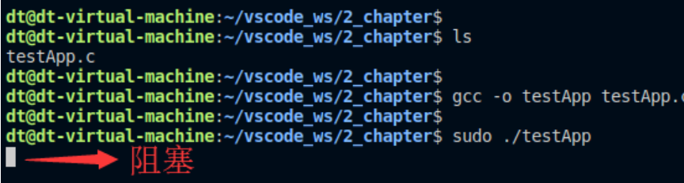  
会直接阻塞在这里，当有鼠标移动或者按键操作才会阻塞结束，执行后面的内容。

以非阻塞方式读取鼠标
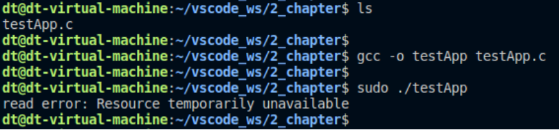  
程序直接结束，并且调用 read()返回错误  
原因在于调用 read()时， 如果鼠标并没有移动或者被按下（没有发生输入事件） ， 是没有数据可读，故而导致失败返回  

然后加循环，使用轮训方式不断地去读取，直到鼠标有数据可读， read()将会成功返回了。

```sh
当对文件进行读取操作时，如果文件当前无数据可读，那么阻塞式 I/O 会将调用者应用程序挂起、进入
休眠阻塞状态，直到有数据可读时才会解除阻塞；而对于非阻塞 I/O，应用程序不会被挂起，而是会立即返
回，它要么一直轮训等待，直到数据可读，要么直接放弃！
所以阻塞式 I/O 的优点在于能够提升 CPU 的处理效率，当自身条件不满足时，进入阻塞状态，交出 CPU
资源，将 CPU 资源让给别人使用；而非阻塞式则是抓紧利用 CPU 资源，譬如不断地去轮训， 这样就会导致
该程序占用了非常高的 CPU 使用率！
```

```sh
以阻塞方式同时读取鼠标和键盘
...
#define MOUSE "/dev/input/event3"
int main(void)
{
    char buf[100];
    int fd, ret;
    /* 打开鼠标设备文件 */
    fd = open(MOUSE, O_RDONLY);
    if (-1 == fd) {
        perror("open error");
        exit(-1);
    }
    /* 读鼠标 */
    memset(buf, 0, sizeof(buf));
    ret = read(fd, buf, sizeof(buf));
    printf("鼠标: 成功读取<%d>个字节数据\n", ret);
    /* 读键盘 */
    memset(buf, 0, sizeof(buf));
    ret = read(0, buf, sizeof(buf));
    printf("键盘: 成功读取<%d>个字节数据\n", ret);
    /* 关闭文件 */
    close(fd);
    exit(0);
}
```
因为 read 此时是阻塞式读取，我们只能先动鼠标，再按按键。实现不了并发执行。  


使用非阻塞方式，将读取鼠标和读取键盘操作放入到一个循环中，通过轮训方式来实现并发读取鼠标和键盘，可以实现并发读取。但这样使用轮训方式，该程序的 CPU 占用率特别高。所以后面有了I/O多路复用来解决这个问题。  

### I/O多路复用
I/O 多路复用（IO multiplexing） 它通过一种机制，可以监视多个文件描述符，一旦某个文件描述符（也就是某个文件） 可以执行 I/O 操作时， 能够通知应用程序进行相应的读写操作。 I/O 多路复用技术是为了解决：在并发式 I/O 场景中进程或线程阻塞到某个 I/O 系统调用而出现的技术，使进程不阻塞于某个特定的I/O 系统调用。  
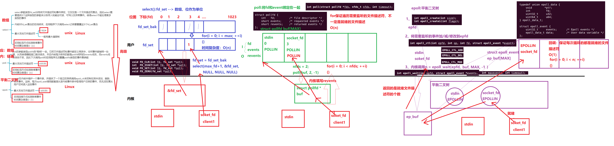  

Linux下有三种IO复用方式：epoll，select和poll，为什么用epoll，它和其他两个有什么区别呢？  
```sh
对于select和poll来说，所有文件描述符都是在用户态被加入其文件描述符集合的，每次调用都需要将整个集合拷贝到内核态；epoll则将整个文件描述符集合维护在内核态，每次添加文件描述符的时候都需要执行一个系统调用。系统调用的开销是很大的，而且在有很多短期活跃连接的情况下，epoll可能会慢于select和poll由于这些大量的系统调用开销。
select使用线性表描述文件描述符集合，文件描述符有上限；poll使用链表来描述；epoll底层通过红黑树来描述，并且维护一个ready list，将事件表中已经就绪的事件添加到这里，在使用epoll_wait调用时，仅观察这个list中有没有数据即可。
select和poll的最大开销来自内核判断是否有文件描述符就绪这一过程：每次执行select或poll调用时，它们会采用遍历的方式，遍历整个文件描述符集合去判断各个文件描述符是否有活动；epoll则不需要去以这种方式检查，当有活动产生时，会自动触发epoll回调函数通知epoll文件描述符，然后内核将这些就绪的文件描述符放到之前提到的ready list中等待epoll_wait调用后被处理。
select和poll都只能工作在相对低效的LT模式下，而epoll同时支持LT（水平触发模式）和ET模式（边沿触发模式）。
综上，当监测的fd数量较小，且各个fd都很活跃的情况下，建议使用select和poll；当监听的fd数量较多，且单位时间仅部分fd活跃的情况下，使用epoll会明显提升性能。 
```
1.文件描述符加入文件描述符集合的方式  
2.描述文件描述符的方式  
3.内核判断是否有文件描述符就绪过程  


Epoll对文件操作符的操作有两种模式：LT（电平触发）和ET（边缘触发），二者的区别在于当你调用epoll_wait的时候内核里面发生了什么：  
```sh
LT（电平触发）：类似select，LT会去遍历在epoll事件表中每个文件描述符，来观察是否有我们感兴趣的事件发生，如果有（触发了该文件描述符上的回调函数），epoll_wait就会以非阻塞的方式返回。若该epoll事件没有被处理完（没有返回EWOULDBLOCK），该事件还会被后续的epoll_wait再次触发。
ET（边缘触发）：ET在发现有我们感兴趣的事件发生后，立即返回，并且sleep这一事件的epoll_wait，不管该事件有没有结束。
```
在使用ET模式时，必须要保证该文件描述符是非阻塞的（确保在没有数据可读时，该文件描述符不会一直阻塞）；并且每次调用read和write的时候都必须等到它们返回EWOULDBLOCK（确保所有数据都已读完或写完）