# 目录
- [目录](#目录)
	- [1.系统移植关于内核的编译和内核配置修改 设备树编译](#1系统移植关于内核的编译和内核配置修改-设备树编译)
	- [2.字符设备驱动框架流程](#2字符设备驱动框架流程)
			- [2.1  驱动如何提供函数接口](#21--驱动如何提供函数接口)
				- [字符设备接口](#字符设备接口)
			- [2.2  上层如何找到这些接口](#22--上层如何找到这些接口)
			- [2.3  接口与设备号的关联](#23--接口与设备号的关联)
			- [2.4  设备号注册的方式](#24--设备号注册的方式)
			- [2.5  设备号和cdev关联](#25--设备号和cdev关联)
			- [2.6  如何创建设备文件](#26--如何创建设备文件)
	- [3.platform架构流程](#3platform架构流程)
			- [3.1  platform架构的组成](#31--platform架构的组成)
			- [3.2  总线驱动编写流程](#32--总线驱动编写流程)
			- [3.2  platform device](#32--platform-device)
			- [3.3  platform driver](#33--platform-driver)
			- [3.4  匹配机制](#34--匹配机制)
			- [3.5  设备资源](#35--设备资源)
	- [4.设备树](#4设备树)
			- [4.1  设备树的基本语法](#41--设备树的基本语法)
			- [4.2  设备树通用属性](#42--设备树通用属性)
			- [4.3  如何查看通用属性描述](#43--如何查看通用属性描述)
			- [4.4  如何在设备中查看设备树](#44--如何在设备中查看设备树)
	- [5.中断](#5中断)
			- [5.1  中断的概念](#51--中断的概念)
			- [5.2  中断在设备树中的信息](#52--中断在设备树中的信息)
			- [5.3  各中断控制器的描述信息](#53--各中断控制器的描述信息)
			- [5.4  中断上下部概念](#54--中断上下部概念)
			- [5.5  tasklet和工作队列实现](#55--tasklet和工作队列实现)
	- [6.adc](#6adc)
			- [6.1  adc基础概念](#61--adc基础概念)
			- [6.2  中断信息](#62--中断信息)
			- [6.3  时钟信息](#63--时钟信息)
			- [6.4  阻塞IO](#64--阻塞io)
	- [7.I2c](#7i2c)
			- [7.1  I2c基础概念](#71--i2c基础概念)
			- [7.2  I2C时序](#72--i2c时序)

## 1.系统移植关于内核的编译和内核配置修改 设备树编译
## 2.字符设备驱动框架流程
#### 2.1  驱动如何提供函数接口
	函数指针。  
	
	在调用函数的时候，通常自己通过函数名调用。但是本质上函数也是一种类型，我们在声明定义了一个函数时，其实在编译时，编译器会把函数的源代码转换为可执行代码并分配一段存储空间，这段存储空间(内存空间)有一个起始地址。而函数名也就是它的起始地址。既然有地址就可以用指针来存储。而这个指针就是函数指针。

	当时当函数多了，不好管理，如何解决呢?

	在驱动写对外接口时指定相对应的规则  
##### 字符设备接口
    file_operations 结构体提供了一组函数指针，用于实现文件系统中各种文件 操作的接口。这些操作可以包括文件的打开、读取、写入、关闭、映射等。每个函数指针对应一个特定的文件操作，文件系统驱动可以通过实现这些函数来定义如何处理特定的文件操作。
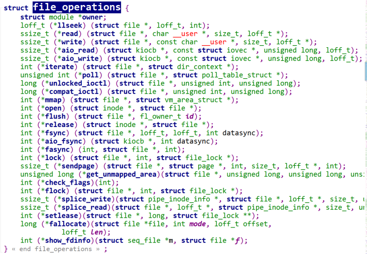  

	应用层操作硬件图解  
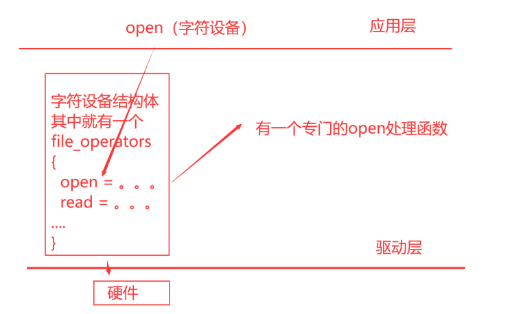  

	因为linux一切皆文件，我们对应的设备也会抽象成文件，所以它提供了一个文件操作的结构体struct file operations，这个结构体保存的就是我们对设备操作提供的接口(函数指针。可以做回调函数，对参数和返回值做了限定)。这些函数接口内核都做了定义，所以我们必须要按照它的语法来实现。内核对应的函数接口有很多，我们不需要把所有的接口都实现。一般就是常见的打开，关闭和读写。
	因为我们所有的字符驱动都要遵循这个规则，在我们不会写的时候，可以去看一下别人怎么写的。使用sourceinsight搜索功能进行搜索，使用alt+shift+f可以进行全局搜file operations.

#### 2.2  上层如何找到这些接口
	刚才我们在底下提供了⼀个file_operations,上层的应⽤程序怎么能找到我们file_operations？
	找到了之后它才可以调⽤这些接⼝。那怎么找了？操作系统设计了⼀套架构。如下图。
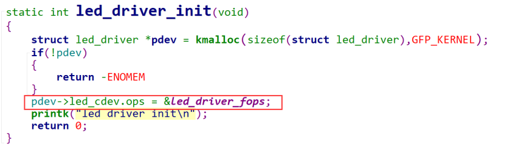  

	操作字符设备 ----> 我们是使用open函数打开一个设备节点，/dev/xxx  
	但现在我们并没有这样的设备文件，如何添加？  
	内核里面有一个专门管理我们所有字符设备的cdev map，通过一个设备号来记录我们的字符设备，而我们字符设备的信息也是通过这个设备号的索引记录它的一些相关信息struct cdev devx，这个结构体里面就是存放我们file_operations方法的，最后将这个方法返回给上层去使用。

#### 2.3  接口与设备号的关联
	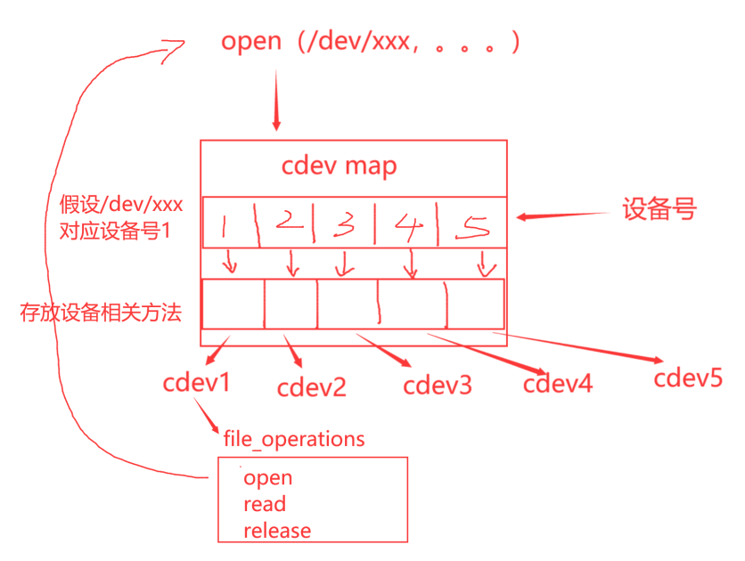
	cdev这个结构体是存储我们设备相关的信息的，但是我们要想明白一件事，我们这个cdev的结构体肯定是没办法把所有的设备的信息都描述清楚，是将设备的独特的特性存放起来，比如操作这个设备的一些方法。通过查找可知道cdev结构体的原型，如下图
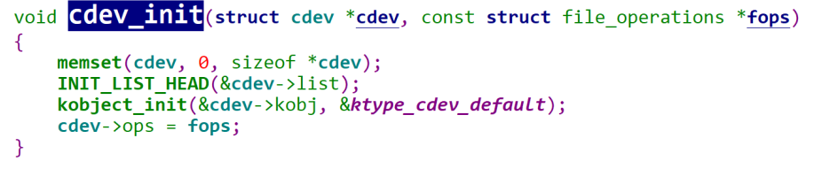  

	其中file_operations就在其中  
	cdev表示设备的公用信息，这个就对应c++中的继承（把别人的东西，在我这边使用），但是c语言中没有继承这个语法，所以我们使用嵌套来实现。
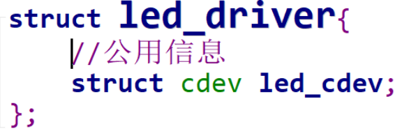

	在这里led_driver来表示我们当前的设备，我们把他想象成一个描述了led_driver的类，里面有一个成员，存放的是这个类相关的用法。在我们真正要去操作的时候，就需要一个用这个类生成的对象。
	我们在这是创建以一个新的设备，所以需要给它分配空间。在C语言中我们有三种选择，静态区，栈区和堆区。
	栈区排除：不可能调用完函数就释放
	静态区和堆区中由于堆区更灵活，选择堆区  

  

	在内核中我们使用的是kmalloc函数，kmalloc有两个参数，一个是分配空间得大小size，另外一个是标志flags(一般就用GFP_KERNEL在这里表示分配普通内存)

	上面只是单纯的写了file_operations和分配了设备的内存空间，但没有联系。

	我们的直观想法就这样写，但这样虽然可以关联起来，但在驱动中，有cdev_init()函数是专门来初始化这个结构体的

	在这个函数里面还初始化了cdev这个结构体中的其他成员，所以我们使用它就可以了。

#### 2.4  设备号注册的方式
	上面我们将cdev和file_operation关联起来了，但我们上层无法找到cdev，从我们上面的架构图中可以知道我们存在一个设备号，也可以说是我们的索引，有了它我们就可以找到对应的cdev了。
	dev_t  本质上是unsigned int类型 32位
	设备号：12bit主设备号 + 20次设备号

	注册设备号可以手动注册，也可以系统自动分配
	手动指定设备号：主次设备号不能和别的设备冲突
	动态分配设备号：使用alloc_chrdev_region()函数

#### 2.5  设备号和cdev关联
	上面注册完设备号后，就可以通过/proc/device查看到注册的设备了。  
	上层调用就是通过设备号来找到对应的cdev结构体，然后得到相应的操作方法实现操作。

	上面的操作，我们实现了cdev结构体，实现了设备号的注册，但是这两个并没有得到关联。  

	在内核里的管理方式了，内核在字符设备的管理上用的时哈希表的形式，说白了就是一个链表。(kobj_map)
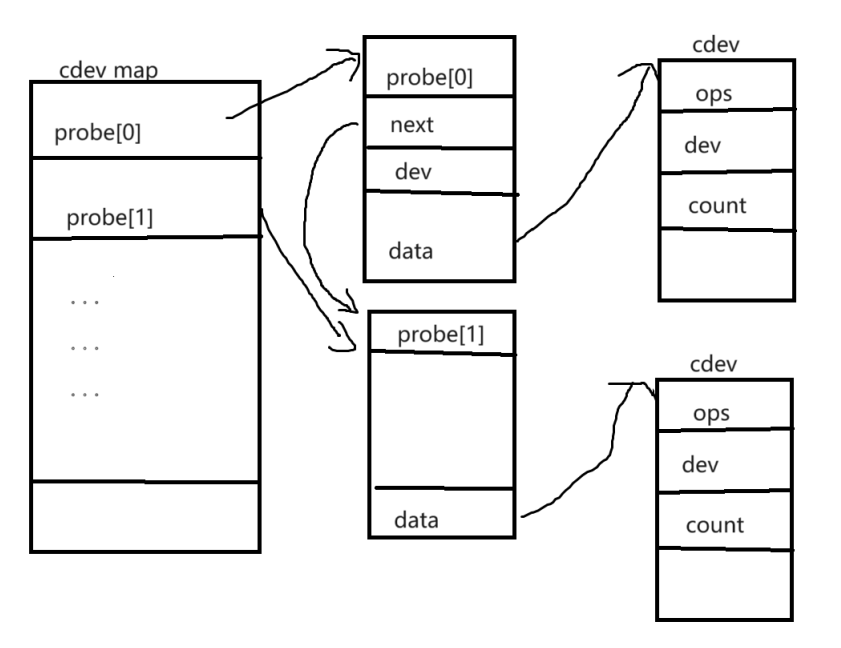  

	既然是链表，肯定会有增删改查。这里内核也提供了一个函数cdev_add()
	它将cdev和设备号绑定放到了cdev_map中了

#### 2.6  如何创建设备文件
	就算我们把设备号和cdev关联起来了，并且也让内核进行了管理，但是我们发现还是没有对应的设备节点，没有设备节点我们就没办法进行操作，这时候我们就需要自己创建一个设备节了。
	手动创建设备节点：
	mknod 设备文件名 		设备文件类型 主设备号 次设备号
	mknod /dev/led-driver 	c 			243 	0

	内核自动创建设备文件的程序：
	1.devtmpfs
	2.udev
	3.mdev
	总结：devtmpfs是linux内核中的一个虚拟文件系统，首先对内核版本有需求，其次这种是直接在内核中进行创建，不会通知用户空间。后面udev和mdev都是用户空间的程序，使用udev或mdev的好处就在于设备在添加或移除时都会通知用户空间。针对与动态加载驱动程序还是利用后者更合理。
	在嵌入式当中用的较多的就是mdev了，具体体现呢就在于系统启动脚本中rcS里的mdev -s。
	在系统启动时，通过执行“mdev -s”去扫描/sys/class和/sys/block,在目录中查找dev文件。/sys/class下的每一个文件夹都代表一个子系统。而这些信息呢又是有uevent接口提供的，同样在统计目录下还有一个uevent信息。

	我们发现，我们要想进行自动创建设备节点，我们/sys/class中得要有对应得设备信息。而这些设备信息主要是就是设备号和设备名。设备号和设备名都是在我们程序中写得，说明我们得想办法将这些信息引入到/sys/class中。
	总结：如何让内核自动创建设备文件？
	1.驱动程序提供设备信息（设备号和设备名），加入到/sys/class信息中。
	2.由获取设备信息得程序进行创建设备节点（devtmpfs，udev，mdev）

	实现步骤：
	**提供class信息：**
	我们需要做大概两步，第一步：在class目录创建一个类，第二步在类底下创建一个设备，将设备信息放入这个设备下。
	在内核中，系统给我们提供了一个创建class得函数接口class_create()

	首先加入我们的类信息
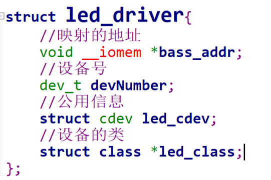  

	然后在初始化的时候创建这个类
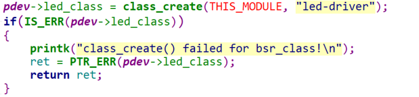  

	还需要添加错误释放逻辑，因为在这里容易出现创建的类名冲突
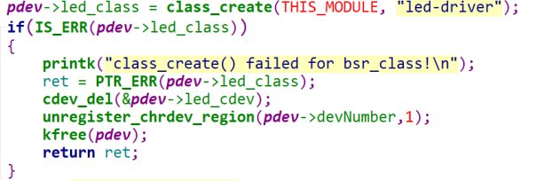  

	最后再驱动退出接口中加入销毁类的函数接口class_destroy()
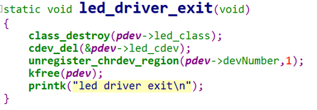  

	然后加载驱动后，就可以在/sys/class里面看到文件节点了

	我们可以发现目前这个目录下面什么都没有，因为我们这个class_create接口只是负责创建类，并没有相关的设备信息，接下来我们就要导出设备信息了
	
	**提供device信息**
	内核中也提供了创建设备的接口，device_create()

	首先加入我们的类信息
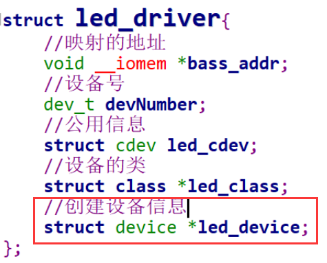 

	然后在初始化的时候创建这个类  
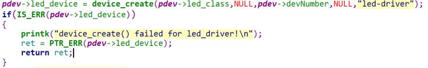  

	记住，错误判断中还需要释放其他资源  
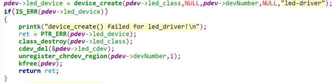  

	最后在驱动退出接口中，记得使用device_destroy()接口释放资源
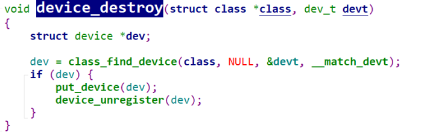  

	需要注意的是这个地方device_destroy（）需要传递的是class类和对应的设备号信息。
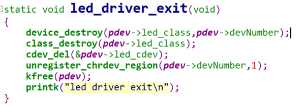  

	这时候就发现/sys/class下创建了对应的类和设备了，且/dev下生成了设备文件了。

## 3.platform架构流程
#### 3.1  platform架构的组成
	总线驱动框架的思路，他要求我们把设备和驱动都注册到总线上去，当注册设备的时候，会去寻找同名的驱动，当注册驱动的时候，也会去找同名的设备。相互查找，进行匹配。一旦匹配成功，驱动就可以通过匹配到的进行获取设备的信息。
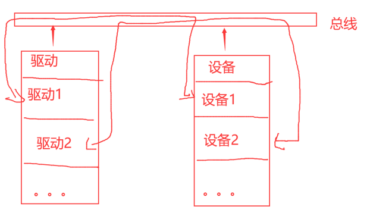

**总线**  

	总线是连接各个部件的信息传输线，使各个部位共享的传输介质。

**平台总线**  

	cpu核与硬件控制器之间的通信，挂载的都是控制器设备。
	在驱动概念中虚拟抽象出来一个总线结构----->platform bus。
	platform bus就将我们原先的驱动和设备信息分开，一个叫platform device，一个叫plaform driver

**边缘设备之间通信的总线**  

	我们也叫专用接口式总线，其中就包含i2c，usb，spi，uart这种外部总线，这种挂载的通常都是符合实际总线时序的外围设备，不同的边缘设备之间通信的总线时序是不一样的，对于这些总线，linux内核都是单独实现的。

	总结：总线在操作系统中的本质就是两个链表：一个是挂载设备的链表，一个是挂载驱动的链表。通过匹配机制进行结合。
#### 3.2  总线驱动编写流程
**如何基于总线进行编写驱动**

	1.根据自己的设备，来确定总线的类型
	platform bus/iic bus/usb bus等
	2.根据总线的类型，确定设备在总线上如何描述(platform)
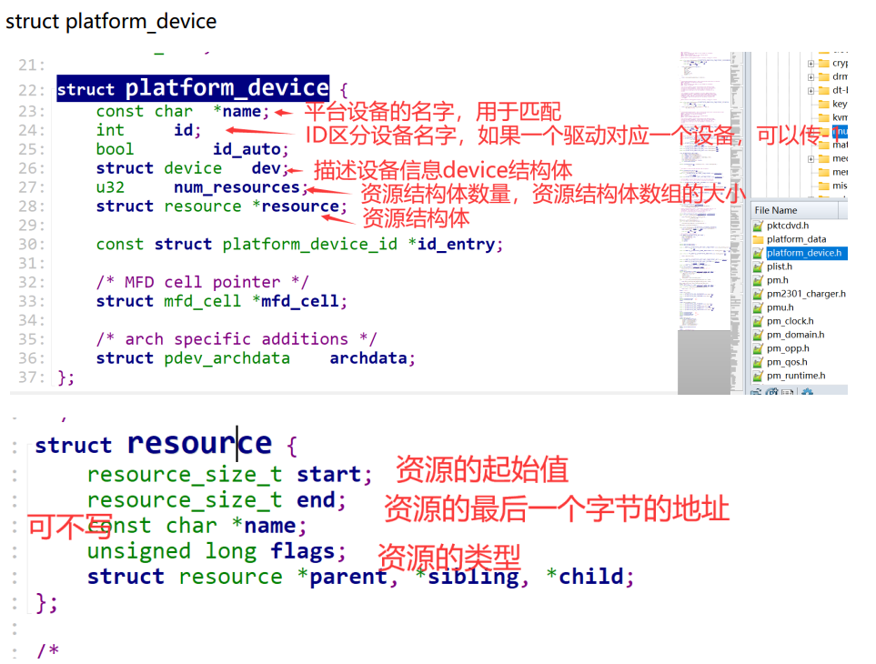  

	3.根据总线的类型，确定驱动在总线上如何描述(platform)
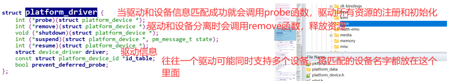  

	4.根据总线的类型，确定在总线上如何注册设备
	int platform_device_register(struct platform_device *pdev);
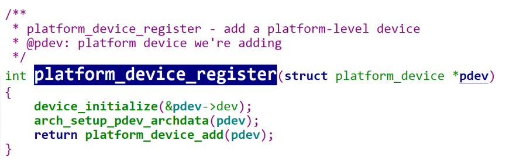  

	5.根据总线类型，确定在总线上如何注册驱动
	int platform_driver_register(struct platform_driver *pdrver);
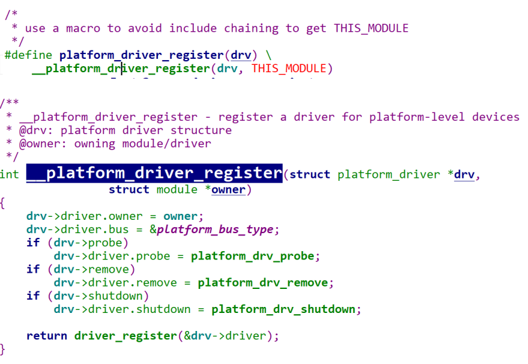  

	6.根据总线的类型，确定设备和驱动匹配原则
	如果驱动提供了id_table（表），就拿设备的名字和id_table中记录的名字进行匹配。
	如果驱动没有提供id_table,那就拿设备的名字和驱动的名字进行匹配。	
	7.一旦设备和驱动匹配后，操作系统就会调用驱动提供的probe函数。
	在这个函数中一般需要要做两件事情：
	1.获取匹配的硬件资源
	2.注册字符设备（可选）
#### 3.2  platform device
	我们这里是需要提供设备信息的，所以需要用struct platform_device结构体进行记录，这个结构体需要初始化的内容很多，这里我们先只提供对应的名字。
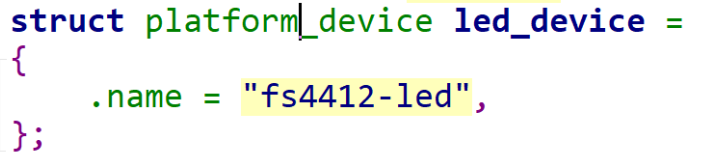  

	这样设备信息就有了，我们接下来把他注册到platform总线上，使用platform_device_register接口。有注册就会有注销，使用platform_device_unregister接口。
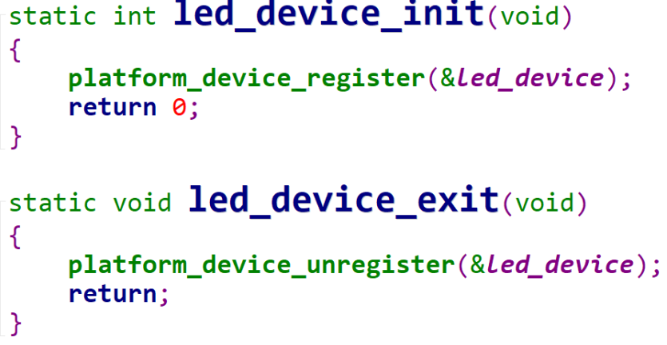  

	记得添加头文件，然后添加makefile文件，用之前的方式，改一下编译的名字就可以。
	在/sys/bus/platform/devices下看一下是否注册进去了。
#### 3.3  platform driver
	这里对应的驱动也有一个结构体进行描述，struct platform_driver，我们要对它进行初始化，但是有点不同的是这个地方，这个地方我们知道有一个匹配函数指针，还有一个退出的函数指针，目前我们还不知道怎么去做，我们就借鉴。
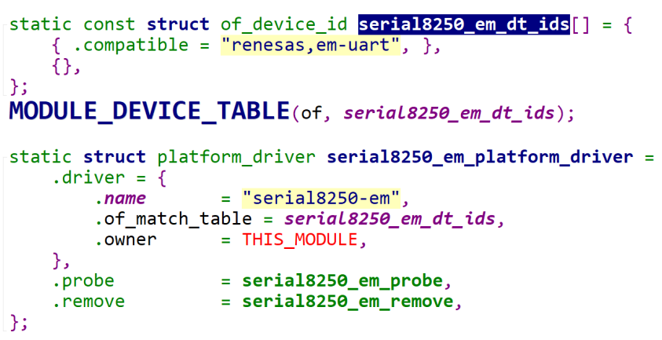  

	这里我们看到，别人这里初始化了driver信息，他这个里面除了提供了驱动的名字以及所有者意外还提供了匹配规则。然后还有probe匹配函数、remove删除函数等，在这里我们去掉它的匹配规则，将其他的先抄过去。然后进行修改。
	查看/sys/bus/platform/driver目录下，就会生成对应的文件夹。
#### 3.4  匹配机制
	我们发现卸载设备的时候出问题了，这是因为没有定义release函数。因为我们设备在卸载的时候，我们操作系统必须要调用一个函数，这个函数就是release。我们device根本没有提供任何函数，但是操作系统必须要调用，所以报错了。那么我们之前是通过cdev这个结构体进行提供relase函数，在这个里面我们需要使用platform_device中的struct device结构体进行提供。这个函数原本的含义是需要在卸载设备的时候释放掉设备的资源，但是我们这里没有需要释放的资源，直接写一个函数加个打印即可。
#### 3.5  设备资源
	上面提供了platform设备和platform驱动，但是目前只是简单的串联起来了。接下来就是需要在platform设备中添加对应的资源，让我们的platform驱动可以进行使用这些资源进行使用，比如开灯和关灯。

	在platform_device中呢，有一个结构体专门进行描述资源信息的，那就是struct resource结构体。
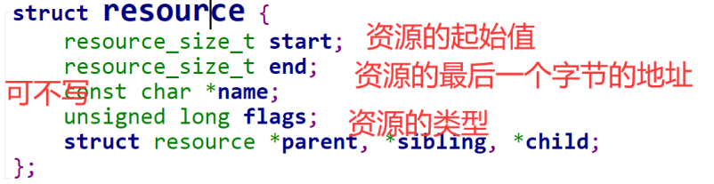   
**提供设备信息(资源)**
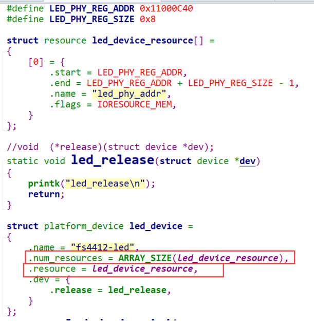    
**获取设备信息(资源)**
	使用platform_get_resource函数就可以进行获取，通常来说我们资源的获取都会放在probe函数中实现。
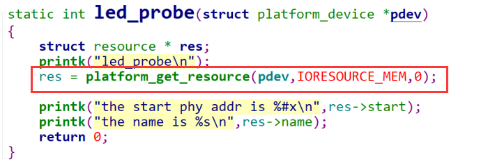  

## 4.设备树
#### 4.1  设备树的基本语法
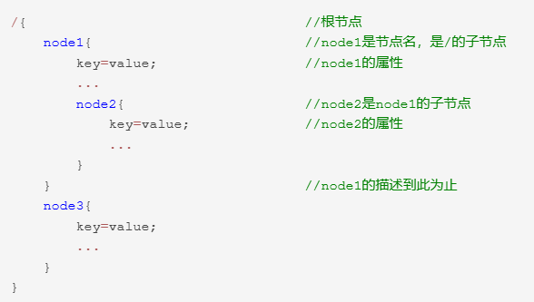   

	属性就是简单的键值对，其值可以是空的，也可以包含任意字节流。设备树中可以表示一些基本数据表示形式
	1.文本字符串，用双引号表示：
	a-string-property = "A string";
	2.数组是用尖括号分割的32位无符号整数
	a-cell-property = <1 2 3 4>;
	3.二进制数据用方括号分隔
	a-byte-data-property = [01 23 34 56];
	注意写的时候用十六进制表示二进制，且0x可以不用写。
	4.可以用逗号隔开不同数据类型的组合
	mixed-propery = "a string",[0x01 0x23 0x45 0x67],<0x12345678>
	5.逗号还可以用于字符串列表
	a-string-list-property = "first string", "second string";  

	属性名可以任意，但是赋值的时候需要遵从设备树的语法原则。需要注意的是，内核中有一些属性是通用属性，这些属性在使用的时候内核会自己解析。除了通用属性之外，我们还可以向节点添加任意的属性和子节点，但是需要注意一些规则，首先，特定于设备的新属性名称应使用制造商作为前缀，以便它们不会与现有的标准属性名称冲突，其次，必须在绑定中记录属性和子节点的含义，以便设备驱动作者知道如何解析数据。

#### 4.2  设备树通用属性
**compatible**  

	这个属性叫做“兼容性”属性，这是一个非常重要的属性。compatible属性的值是一个字符串列表，用于将设备和驱动绑定起来。字符串列表用于选择设备所要使用的驱动程序。通常写法：
	compatible = "manufacturer,model","manufacturer,model";
	其中manufacturer表示厂商，model一般是模块对应的驱动名字.
	每个节点都要有这个属性，不然驱动匹配不了。  
**reg**  

	这个属性一般描述设备地址空间资源信息，reg属性的值一般是(address,length),一般用于描述某个外设的寄存器地址范围信息，也可以描述器件的地址。通常写法：
	reg = <0xaddress 0xlength>
	0xaddress是地址，0xlength是大小。
	这个地方我们需要提供led等的寄存器地址信息。
  

	提到reg属性呢，就要提到节点的命名规则，节点名称必须采用<name>[@<unit-address>]的命名规则。
	<name>是一个简单的ASCII字符串，长度最多为31个字符。通常，节点是根据它所代表的设备类型来命名。如果节点描述具有地址的设备，即赋予了reg属性，我们就需要给出后面的@unitaddress。unit-address就是reg属性的第一个地址。多个相同类型设备节点的name可以一样，只要unit-address不同即可。
	这种命名规则就是为了防止出现同名的设备节点。
#### 4.3  如何查看通用属性描述
#### 4.4  如何在设备中查看设备树
## 5.中断
#### 5.1  中断的概念
#### 5.2  中断在设备树中的信息
#### 5.3  各中断控制器的描述信息
#### 5.4  中断上下部概念
#### 5.5  tasklet和工作队列实现
## 6.adc
#### 6.1  adc基础概念
#### 6.2  中断信息
#### 6.3  时钟信息
#### 6.4  阻塞IO
## 7.I2c
#### 7.1  I2c基础概念
#### 7.2  I2C时序