# 目录

## IIC子系统框架
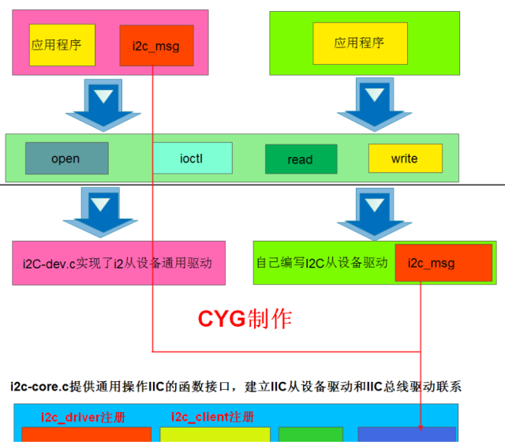  
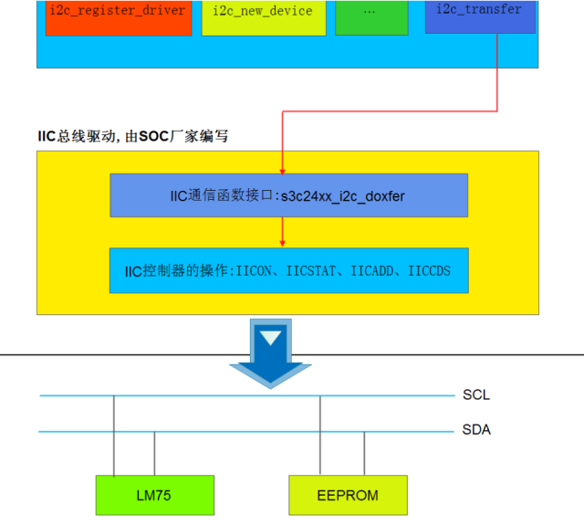  


## 基于i2c-dev通用驱动框架编写应用程序

从图中可知i2c-dev.c中已经实现好了通用的IIC从设备驱动。它会为SOC芯片上的每个IIC控制器生成一个主设备号为89的设备节点，并且实现了文件的操作函数接口。用户空间可以通过i2c设备节点，访问i2c控制器。每个i2c控制器的编号从0开始，对应i2c设备文件的次设备号。  


**注意:如果想看到这个设备节点，我们必须配置一下我们的Linux内核，让它包含我们的IC控制器驱动。**    

第一步：在Limnux内核中,找到平台的IIC控制器驱动  

平台的IIC控制器驱动默认存放在Limux内核源码树:driversi2c/busses目录下存放。我们当前平台为s5pc100,但是这个目录并没有s5pc100相关的IIC驱动，但是我们会发现有个i2c-s3c2410.c的文件，这个是针对于s3c2410平台编写的IC控制器驱动。比较幸运的是s3c2410的IIC控制器操作方法和s5pc100的IIC控制器操作方法一样。好了接下来我们修改一下这个目录下的Kconfig文件，让它支持我们的s5pc100平台。修改如下:
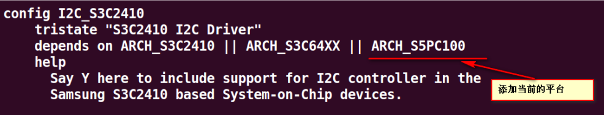  

第二步:配置Linux内核，让内核包含IIC控制器驱动  
```sh
Device Drivers --->
    <*>I2C support --->
        I2C Hardware Bus support ---
            S3C2410 12C Driver
```

需要注意的是，前面的Kconfig一定要修改正确，否则这里将看不到S3C2410I2C Driver。配置好后重新编译Limu内核,然后重新启动开发板，家在新编译好的Linux内核，启动结束后，我们在/dev目录下可以看到i2c控制器驱动对应的设备节点。 

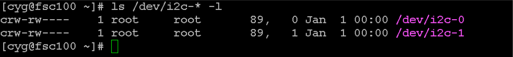   

从上面的Limux ⅡC子系统框架可以看出，每层之间的数据交互是通过i2c msg来打包传递的。如果我们想基于i2c-dev提供的通用IIC从设备驱动框架编写应用程序，我们在应用层，必须要填充好i2cmsg.  
好了，我们先来看看i2cmsg是如何定义的?  
在/usr/include/linux/i2c.h文件中，可以看到i2c msg结构体的定义，定义如下:  
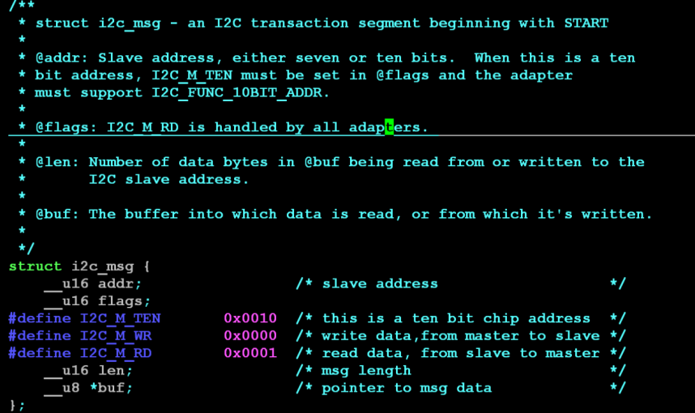  
需要注意的是I2C M WR是我自己添加的，标准的头文件中并没有这一项。下面我们以Lm75设备为列，来看看如何填充这个结构体。  
(1)Lm75 从机地址  
从Lm75手册中可以看到，Lm75从机地址如下  
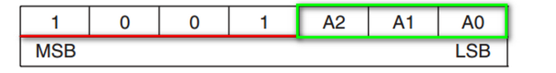  
从硬件原理图中，我们可以看到1m75接线如下:
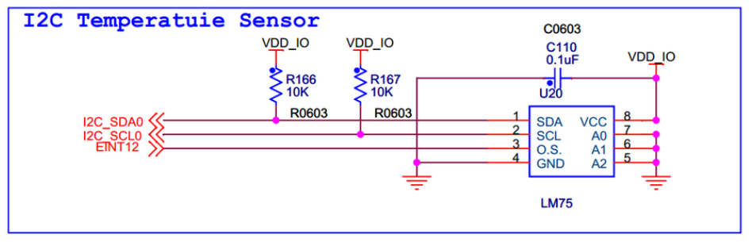  
所以，我们可以确定lm75作为从机时，其从机地址为0x48.  
(2)Lm75的温度格式  
从Lm75的手册中我们可以查询到如下信息  
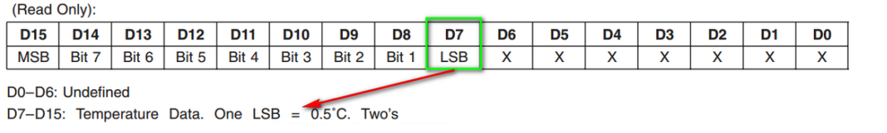  
可以看出，当我们从Lm75中读取的温度用两个字节表示，第一个字节表示温度的整数部分，第二个字节表示小数部
分。
第二个字节的最高位为1表示，小数部分为0.5，第二个字节的最高位为0表示，小数部分为0。  
好了，有这些信息，我们就可以填充i2cmsg结构体了，填充如下:  
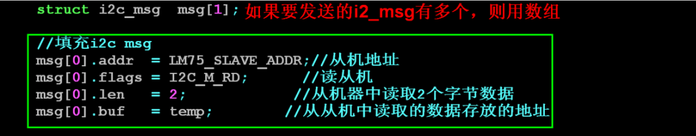  
嗯，我们在上层已经填充好了i2cmsg结构体，怎么告诉驱动层呢?  
回顾一下，我们编写的字符驱动提供的接口有:open/read /wite hoct 。聪明的你一定猜到了,i2c-dev中已经实现了这些接口。我们只需要调用这些接口，就可以将我们的i2cmsg传递下去。虽然，我们可以通过readwrite来传递i2c-msg,但是大神们更喜欢使用ioct接口。嗯，既然是使用ioctl那肯定需要命令，需要什么命令呢?  
我们先来看看，底层支持的命令:  
大家可以从usr/include/inuxi2c-dev.h文件中看到i2c-dev在底层支持的命令。这里只介绍一些常用的命令。  
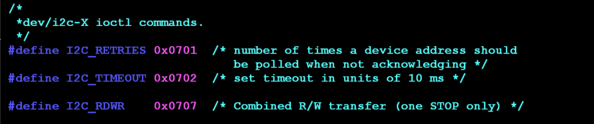  
1.设置重试次数-------I2CRETRIES  
ioctl(fd,I2C RETRIES,count);  
设置适配器收不到ACK时重试的次数为count。默认的重试次数为1。  
2.设置超时-------------I2C TIMEOUT  
ioctl(fd, 12C TIMEOUT,time);  
设置超时时间为time，单位为iiffes。  
3.获取适配器功能-------I2CFUNCS  
ioctl(fle,I2C FUNCS,(unsignedlong*)&func)  
获取的i2c适配器功能保存在fnc中。获取的是一个整数，这个整数的每一位表示i2c适配器支持的功能。  
大家可以再/usr/include/linux/i2c.h头文件中，查询到每一位支持代表的功能。  
常用的适配器功能查询位如下:  
  
4.读写数据---------I2C RDWR  
ioctl(file,12C RDWR,(structi2c rdwr ioctl data *)&xxx ioctl data);  
这一行代码可以使用I2C协议和设备进行通信。它进行连续的读写，中间没有间歇。只有当适配器支  
持I2C FUNC I2C此命令才有效。参数是一个指针，指向一个结构体，它的定义如:  
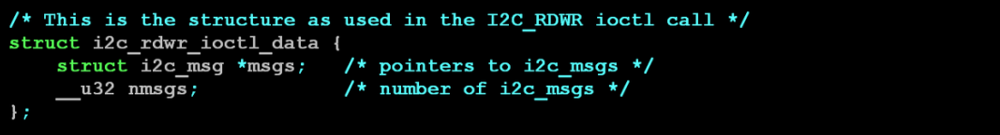  
## IIC从设备驱动编写
自己编写i2c从设备驱动，向上层应用工程师提供更简单的接口。  
我们先简单回顾一下，前面我在讲设备模型时，提到总线，设备，驱动三个概念。在总线这一块，我们学习了如何基于platform总线，编写驱动程序  
在注册驱动的时候，我们先填充好platform driver结构体,然后通过platform drvier register()注册驱动。  
在注册设备的时候，我们先填充好platform device结构体,然后通过platform device register()注册设备  
设备和驱动在注册的时候，会通过名字相互匹配，匹配成功后，会执行platorm driver提供的probeO函数。我们最终在probe函数里面，注册了字符设备。  
那基于IIC总线写驱动，是不是也有对应结构体和函数接口呢?  

### IIC总线上驱动注册
1.驱动描述结构体  
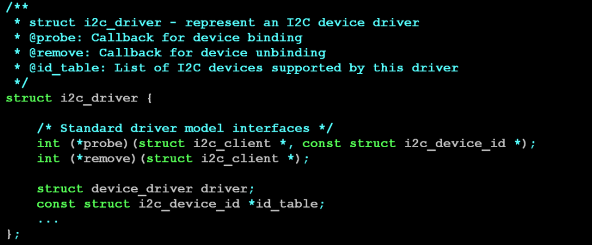   
2.驱动注册函数  
   
3.驱动注销函数  
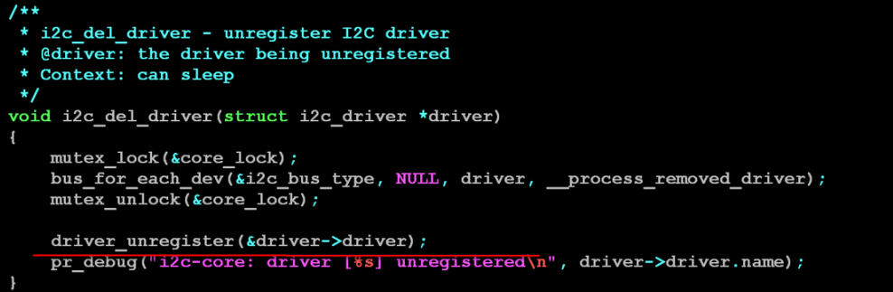   

### IIC总线上设备注册
1.IIC总线上从设备的描述结构体  
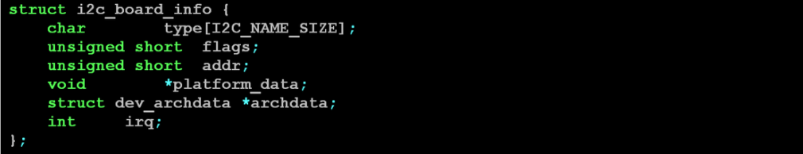    
般我们只需要在这个结构体中填充好type(从设备的名字)和addr(从设备地址)两个成员即可。  
例如:针对我们的lm75设备，我们需要做如下事情  
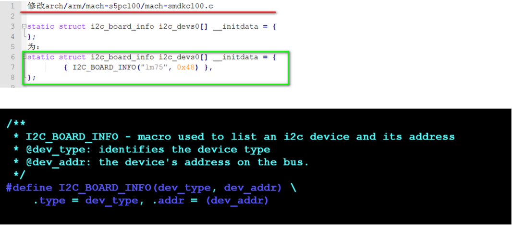    
2.向系统中注册设备信息  
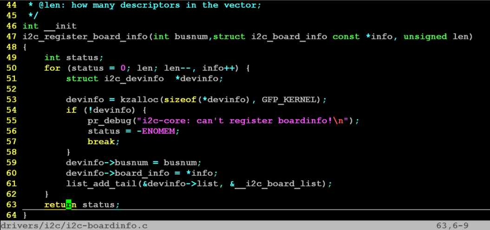   
注意:如果其他地方如果需要使用这里注册的设备结构信息，只需要遍历链表_i2c board_list，通过总线号即可找到相应的设备信息。  

问题:什么时候会用到这些信息呢?  

系统启动的时候，会把从设备信息，注册到i2cboradlist。  
12C总线驱动(控制器驱动)在匹配到12C控制器设备的时候，会调用(我们可以从drivers/i2c/bussesi2c-s3c2410.c的s3c24xxi2c probe函数中查看)    


问题:驱动中是如何获得i2c从设备信息呢?  
i2c driver的probe函数在调用的时候，会将i2c_client结构体传递过去，i2c_client包含了从设备的信息  
int xxx _probe(struct i2c client*client, const struct i2c device id *id)  
问题:最终IIC总线上的从设备是不是用i2c_client结构体描述的呀?  
嗯，是的呢!,它的定义如下:  
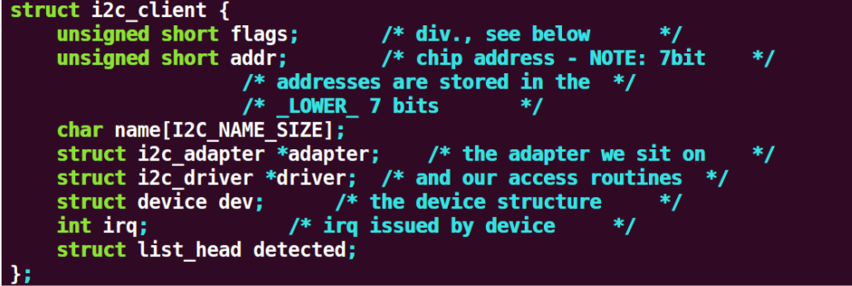    

3.i2c_msg传递  
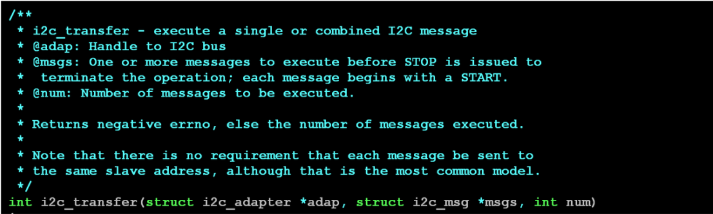   

## 外部访问i2c总线
参考： https://doc.embedfire.com/linux/imx6/driver/zh/latest/linux_driver/i2c_mpu6050.html  

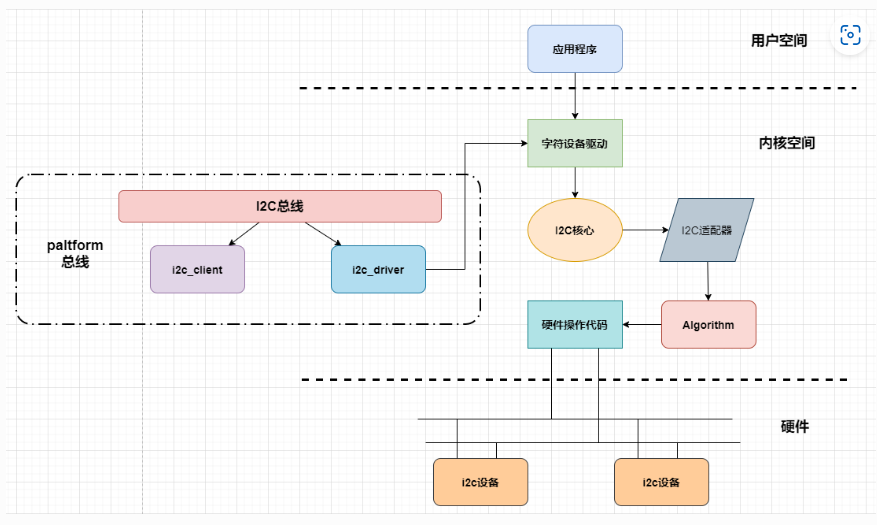
```sh
每一个I2C总线————————IIC控制器（适配器）——————struct i2c_adapter——————struct i2c_algorithm

注：
IIC控制器：用于标识物理i2c总线以及访问它所需的访问算法的结构

i2c_algorithm结构体实际提供了一些函数指针，这些函数就是外部访问i2c总线的接口  
i2c设备例如mpu6050、i2c接口的oled屏等等就是通过这些函数接口使用i2c总线实现收、发数据的。
```
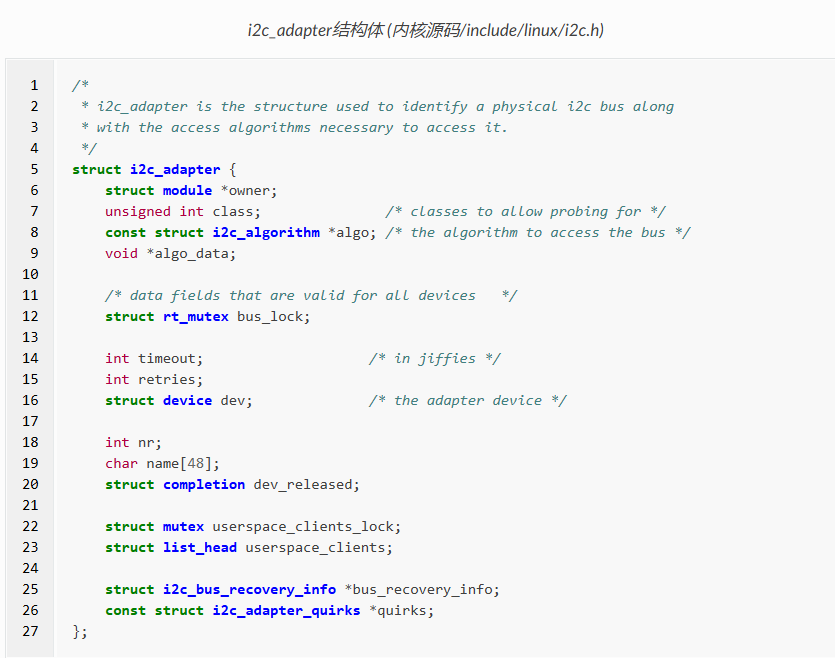  
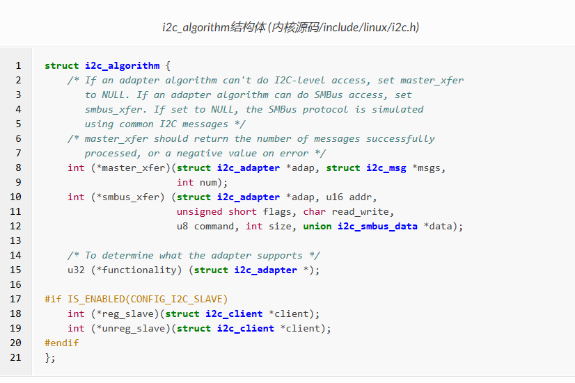  


### i2c总线的运行机制
```sh
1、注册I2C总线
2、将I2C驱动添加到I2C总线的驱动链表中
3、遍历I2C总线上的设备链表，根据i2c_device_match函数进行匹配，如果匹配调用i2c_device_probe函数
4、i2c_device_probe函数会调用I2C驱动的probe函数

i2c总线维护着两个链表（I2C驱动、I2C设备），管理I2C设备和I2C驱动的匹配和删除等
```