# 目录

## 概念

input 就是输入的意思，因此 input 子系统就是管理输入的子系统  
input 子系统分为 input 驱动层、 input 核心层、 input 事件处理层，最终给用户空间提供可访问的设备节点， input 输入子系统框架如图所示：  
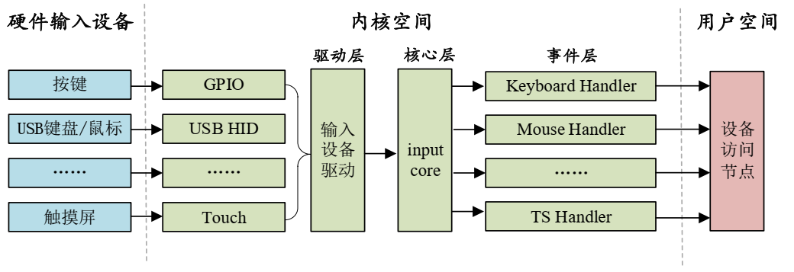  

驱动层：输入设备的具体驱动程序，比如按键驱动程序，向内核层报告输入内容。  
核心层：承上启下，为驱动层提供输入设备注册和操作接口。通知事件层对输入事件进行处理。  
事件层：主要和用户空间进行交互。


input 子系统的所有设备主设备号都为 13，我们在使用 input 子系统处理输入设备的时候就不需要去注册字符设备了，我们只需要向系统注册一个 input_device 即可。

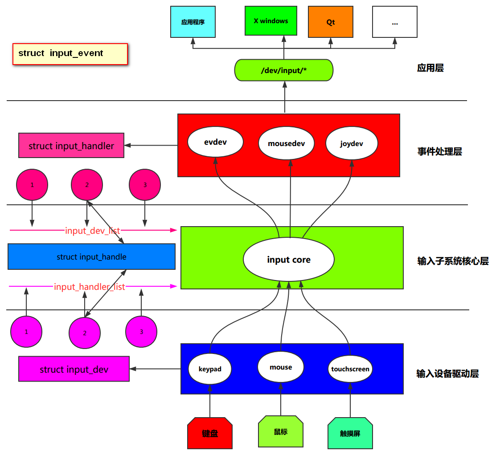  

```sh
我们只需要用两个函数就可以完成了：  
struct input_dev *input_allocate_device(void);   
用于动态分配一个input_dev结构体，并初始化它，以便它可以被注册到内核的输入子系统中.
在驱动程序中，它用于创建一个新的输入设备。  
int input_register_device(struct input_dev *dev);   
将一个已经分配和初始化的 input_dev 结构注册到内核的输入子系统的 input core 中。这个函数会将输入设备添加到系统中，使其能够接收事件并被用户空间程序识别。  
```

## 原理
### input子系统架构
编写输入设备驱动程序的时候，如果想使用Linux内核的输入子系统框架，我们就必须向输入子系统核心层注册一个输入设备，这个输入设备用struct input_dev结构体描述，注册的时候，会发生如下事情:  
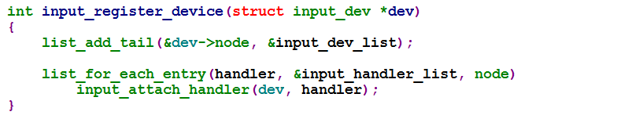   
<1>将我们的输入设备添加了输入子系统核心层提供的input_dev_list链表中。  
<2>遍历input_handler_list链表，探测可以和当前输入设备对接的handler(处理器)，一旦匹配成功之后，就会在struct input_handle结构体中记录input_dev和input_handler。  
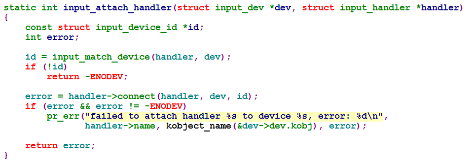  
在Linux内核中，connect 是一个函数指针，通常在某些驱动程序的上下文中使用，用于将设备（如输入设备、网络设备等）与特定的处理程序（handler）关联起来。这个函数指针通常在驱动程序初始化时设置，以便在设备准备好或有数据到达时，能够调用相应的处理函数。   
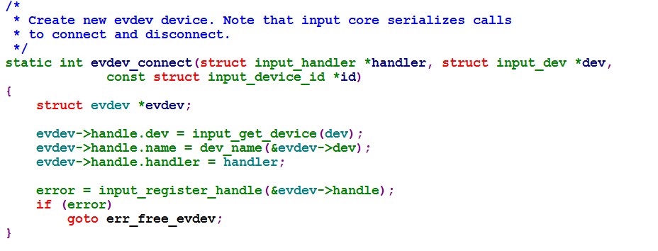   
evdev在事件处理层  
他获取了一个已注册的dev设备，设备名和处理器，然后注册了一个input_handler
用于将输入设备（input_dev）连接到一个输入处理程序（input_handler）。这个函数是输入子系统中的API，用于处理输入设备的注册和事件传递。  
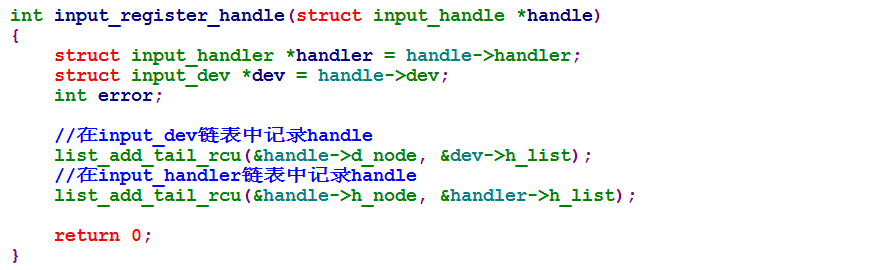   
注册一个输入处理程序（input_handler），记录input_dev和input_handler。  
这有点像实际生活中的一对情侣，如果想合法，你就必须去民政局办结婚证进行登记哈,这里的input_handle就是这张结婚证，input_dev和input_handler都会持有这张结婚证。

**问题:是谁注册了input_handler呢?**  
回答:当然是我们事件处理层的驱动了.接下来我们看看事件处理层的驱动在加载的时候，干了一些什么?这里以evdev.c为例  
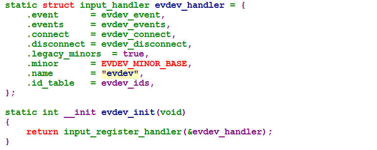  
嗯，注册了一个 input_handler。  
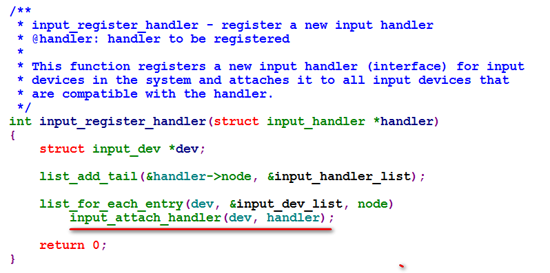  
从这儿可以看出，在注册input_handler的时候，遍历input_dev_list链表,探测可以匹配的input_dev。哦，原来他们是相互查找，那就不用管谁先谁后了，最终都能有情人终成眷属。  
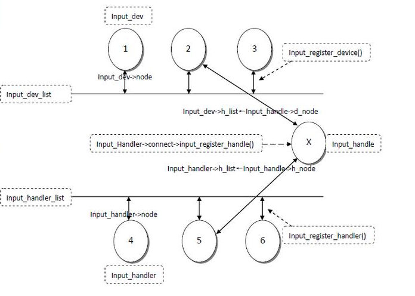  

```sh
总结：
1.事件处理层的驱动不用我们写了，Linux内核根据不同的输入设备上报的事件，把他们的共性抽象出来了，编写了不同的事件处理层驱动，要知道事件处理层驱动，向应用层工程师提供了访问输入的函数接口哦!（input_handler不用管了）
2.输入子系统核心层制定了标准，让输入设备input_dev和事件处理input_handler对应起来，骚年，你觉得这一层还需要们写吗?（如何匹配不用管了）
3.输入设备驱动层和具体的硬件输入设备打交道了，不同的输入设备必须得写驱动啦!（只需要注册一个input_dev，将它放到input core就行了）

终极大招:
一个输入事件，如鼠标移动、键盘按下等通过InputDeviceDriver->Inputcore->Event handler->userspace的顺序到达用户控件的应用程序。
```


### 基于输入子系统编写输入设备驱动  
1. 通过input_dev_register函数注册一个struct input_dev结构体(输入设备)到input core  
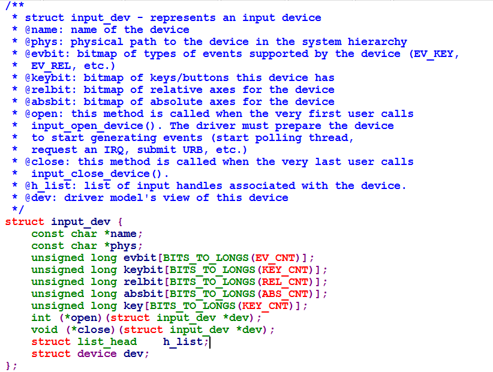  

相关函数：  
struct input_dev *input_allocate_device(void);   
用于动态分配一个input_dev结构体，并初始化它，以便它可以被注册到内核的输入子系统中.  
int input_register_device(struct input_dev *dev);   
将一个已经分配和初始化的 input_dev 结构注册到内核的输入子系统的 input core 中。这个函数会将输入设备添加到系统中，使其能够接收事件并被用户空间程序识别。   
相关案例代码如下:  
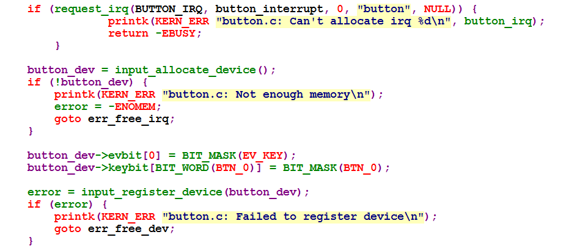  
**注意:
<1>在注册输入设备的时候，需要给输入设备指定输可以上报的事件类型(例如:EV_KEY)以及可以上报的按键类型(就是可以上报的按键码[键值]) ,这里的事件类型和按键类型
都是使用位图的形式表示。
<2>设置事件类型和按键类型，也可以使用__set_bit函数完成**  
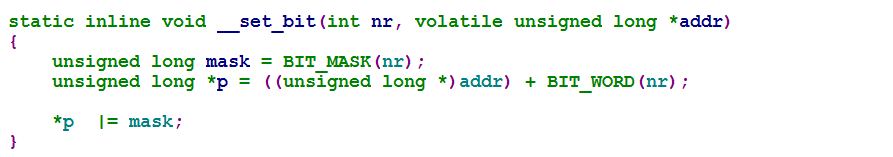  
我们可以在Linux内核源码树下的include/linux/input.h文件找到常用的事件类型和按键类型,在Documentation/input/event-codes.txt文件中可以找到具体事件码的解释。  

<1>常用的时间类型  
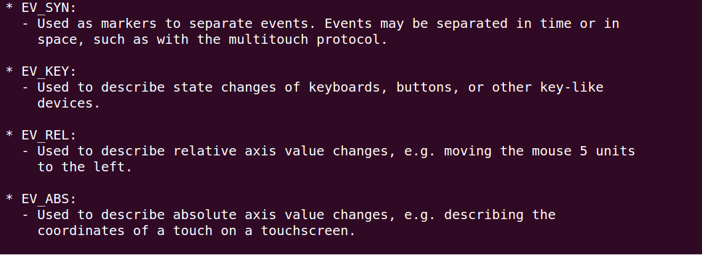  
<2>常用的按键码  
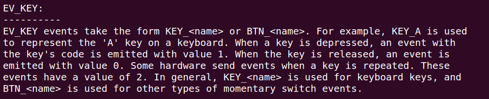   

2.在输入设备驱动的中断被触发的时候，我们需要在其中断处理函数中上报事件  
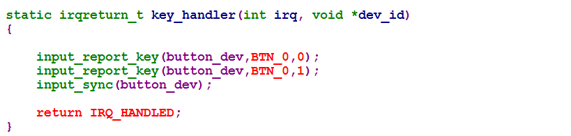  
相关事件上报函数:   
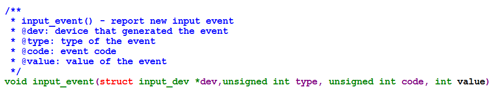  
相关的派生函数:  
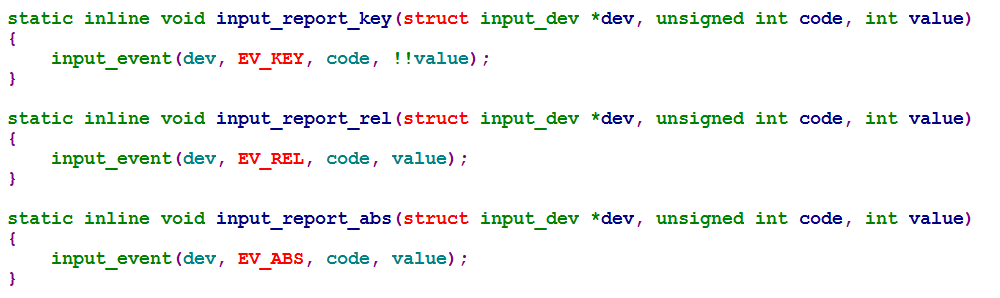  
上报结束的时候调用的函数:  
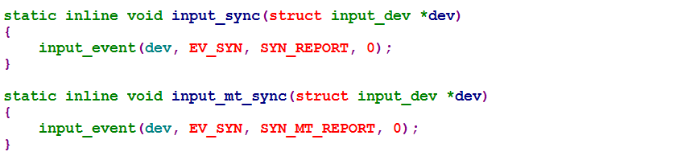  
例如:  
在触摸屏驱动设计中，一次坐标及按下状态的整个报告过程如下  
input_report_abs(input_dev,ABS_X,x);//x坐标  
input_report_abs(input_dev,ABS_Y,y);//Y坐标             
input_report_abs(input_dev,ABS_PRESSURE,pres);//压力                 
input_sync(struct input_dev *dev);//同步     

#### 终极大招
一个输入事件，如鼠标移动、键盘按下等通过InputDeviceDriver->Inputcore->Event handler->userspace的顺序到达用户控件的应用程序。   