# 1. 目录
- [1. 目录](#1-目录)
	- [1.1. 1.系统移植关于内核的编译和内核配置修改 设备树编译](#11-1系统移植关于内核的编译和内核配置修改-设备树编译)
	- [1.2. 2.字符设备驱动框架流程](#12-2字符设备驱动框架流程)
			- [1.2.0.1. 2.1  驱动如何提供函数接口](#1201-21--驱动如何提供函数接口)
				- [1.2.0.1.1. 字符设备接口](#12011-字符设备接口)
			- [1.2.0.2. 2.2  上层如何找到这些接口](#1202-22--上层如何找到这些接口)
			- [1.2.0.3. 2.3  接口与设备号的关联](#1203-23--接口与设备号的关联)
			- [1.2.0.4. 2.4  设备号注册的方式](#1204-24--设备号注册的方式)
			- [1.2.0.5. 2.5  设备号和cdev关联](#1205-25--设备号和cdev关联)
			- [1.2.0.6. 2.6  如何创建设备文件](#1206-26--如何创建设备文件)
	- [1.3. 3.platform架构流程](#13-3platform架构流程)
			- [1.3.0.1. 3.1  platform架构的组成](#1301-31--platform架构的组成)
			- [1.3.0.2. 3.2  总线驱动编写流程](#1302-32--总线驱动编写流程)
			- [1.3.0.3. 3.2  platform device](#1303-32--platform-device)
			- [1.3.0.4. 3.3  platform driver](#1304-33--platform-driver)
			- [1.3.0.5. 3.4  匹配机制](#1305-34--匹配机制)
			- [1.3.0.6. 3.5  设备资源](#1306-35--设备资源)
	- [1.4. 4.设备树](#14-4设备树)
			- [1.4.0.1. 4.1  设备树的基本语法](#1401-41--设备树的基本语法)
			- [1.4.0.2. 4.2  设备树通用属性](#1402-42--设备树通用属性)
			- [1.4.0.3. 4.3  获取设备树生成的设备信息资源](#1403-43--获取设备树生成的设备信息资源)
			- [1.4.0.4. 4.4  拓展设备树信息](#1404-44--拓展设备树信息)
			- [1.4.0.5. 4.5  GPIO的信息](#1405-45--gpio的信息)
	- [1.5. 5.中断](#15-5中断)
			- [1.5.0.1. 5.1  中断的概念](#1501-51--中断的概念)
			- [1.5.0.2. 5.2  中断在设备树中的信息](#1502-52--中断在设备树中的信息)
			- [1.5.0.3. 5.3  各中断控制器的描述信息](#1503-53--各中断控制器的描述信息)
			- [1.5.0.4. 5.4  中断上下部概念](#1504-54--中断上下部概念)
			- [1.5.0.5. 5.5  tasklet和工作队列实现](#1505-55--tasklet和工作队列实现)
	- [1.6. 6.adc](#16-6adc)
			- [1.6.0.1. 6.1  adc基础概念](#1601-61--adc基础概念)
			- [1.6.0.2. 6.2  中断信息](#1602-62--中断信息)
			- [1.6.0.3. 6.3  时钟信息](#1603-63--时钟信息)
			- [1.6.0.4. 6.4  阻塞IO](#1604-64--阻塞io)
	- [1.7. 7.I2c](#17-7i2c)
			- [1.7.0.1. 7.1  I2c基础概念](#1701-71--i2c基础概念)
			- [1.7.0.2. 7.2  I2C时序](#1702-72--i2c时序)

## 1.1. 1.系统移植关于内核的编译和内核配置修改 设备树编译
## 1.2. 2.字符设备驱动框架流程
#### 1.2.0.1. 2.1  驱动如何提供函数接口
	函数指针。  
	
	在调用函数的时候，通常自己通过函数名调用。但是本质上函数也是一种类型，我们在声明定义了一个函数时，其实在编译时，编译器会把函数的源代码转换为可执行代码并分配一段存储空间，这段存储空间(内存空间)有一个起始地址。而函数名也就是它的起始地址。既然有地址就可以用指针来存储。而这个指针就是函数指针。

	当时当函数多了，不好管理，如何解决呢?

	在驱动写对外接口时指定相对应的规则  
##### 1.2.0.1.1. 字符设备接口
    file_operations 结构体提供了一组函数指针，用于实现文件系统中各种文件 操作的接口。这些操作可以包括文件的打开、读取、写入、关闭、映射等。每个函数指针对应一个特定的文件操作，文件系统驱动可以通过实现这些函数来定义如何处理特定的文件操作。
  

	应用层操作硬件图解  
  

	因为linux一切皆文件，我们对应的设备也会抽象成文件，所以它提供了一个文件操作的结构体struct file operations，这个结构体保存的就是我们对设备操作提供的接口(函数指针。可以做回调函数，对参数和返回值做了限定)。这些函数接口内核都做了定义，所以我们必须要按照它的语法来实现。内核对应的函数接口有很多，我们不需要把所有的接口都实现。一般就是常见的打开，关闭和读写。
	因为我们所有的字符驱动都要遵循这个规则，在我们不会写的时候，可以去看一下别人怎么写的。使用sourceinsight搜索功能进行搜索，使用alt+shift+f可以进行全局搜file operations.

#### 1.2.0.2. 2.2  上层如何找到这些接口
	刚才我们在底下提供了⼀个file_operations,上层的应⽤程序怎么能找到我们file_operations？
	找到了之后它才可以调⽤这些接⼝。那怎么找了？操作系统设计了⼀套架构。如下图。
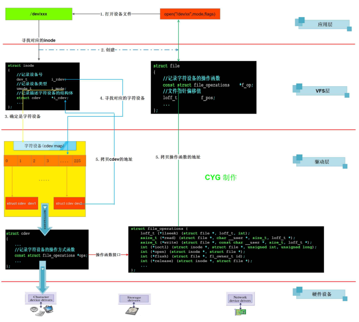  

	操作字符设备 ----> 我们是使用open函数打开一个设备节点，/dev/xxx  
	但现在我们并没有这样的设备文件，如何添加？  
	内核里面有一个专门管理我们所有字符设备的cdev map，通过一个设备号来记录我们的字符设备，而我们字符设备的信息也是通过这个设备号的索引记录它的一些相关信息struct cdev devx，这个结构体里面就是存放我们file_operations方法的，最后将这个方法返回给上层去使用。

#### 1.2.0.3. 2.3  接口与设备号的关联
  
	cdev这个结构体是存储我们设备相关的信息的，但是我们要想明白一件事，我们这个cdev的结构体肯定是没办法把所有的设备的信息都描述清楚，是将设备的独特的特性存放起来，比如操作这个设备的一些方法。通过查找可知道cdev结构体的原型，如下图
  

	其中file_operations就在其中  
	cdev表示设备的公用信息，这个就对应c++中的继承（把别人的东西，在我这边使用），但是c语言中没有继承这个语法，所以我们使用嵌套来实现。
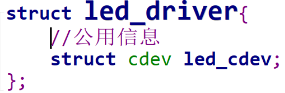

	在这里led_driver来表示我们当前的设备，我们把他想象成一个描述了led_driver的类，里面有一个成员，存放的是这个类相关的用法。在我们真正要去操作的时候，就需要一个用这个类生成的对象。
	我们在这是创建以一个新的设备，所以需要给它分配空间。在C语言中我们有三种选择，静态区，栈区和堆区。
	栈区排除：不可能调用完函数就释放
	静态区和堆区中由于堆区更灵活，选择堆区  

  

	在内核中我们使用的是kmalloc函数，kmalloc有两个参数，一个是分配空间得大小size，另外一个是标志flags(一般就用GFP_KERNEL在这里表示分配普通内存)

	上面只是单纯的写了file_operations和分配了设备的内存空间，但没有联系。  
	

	我们的直观想法就这样写，但这样虽然可以关联起来，但在驱动中，有cdev_init()函数是专门来初始化这个结构体的


	在这个函数里面还初始化了cdev这个结构体中的其他成员，所以我们使用它就可以了。

#### 1.2.0.4. 2.4  设备号注册的方式
	上面我们将cdev和file_operation关联起来了，但我们上层无法找到cdev，从我们上面的架构图中可以知道我们存在一个设备号，也可以说是我们的索引，有了它我们就可以找到对应的cdev了。
	dev_t  本质上是unsigned int类型 32位
	设备号：12bit主设备号 + 20次设备号

	注册设备号可以手动注册，也可以系统自动分配
	手动指定设备号：主次设备号不能和别的设备冲突
	动态分配设备号：使用alloc_chrdev_region()函数

#### 1.2.0.5. 2.5  设备号和cdev关联
	上面注册完设备号后，就可以通过/proc/device查看到注册的设备了。  
	上层调用就是通过设备号来找到对应的cdev结构体，然后得到相应的操作方法实现操作。

	上面的操作，我们实现了cdev结构体，实现了设备号的注册，但是这两个并没有得到关联。  

	在内核里的管理方式了，内核在字符设备的管理上用的时哈希表的形式，说白了就是一个链表。(kobj_map)
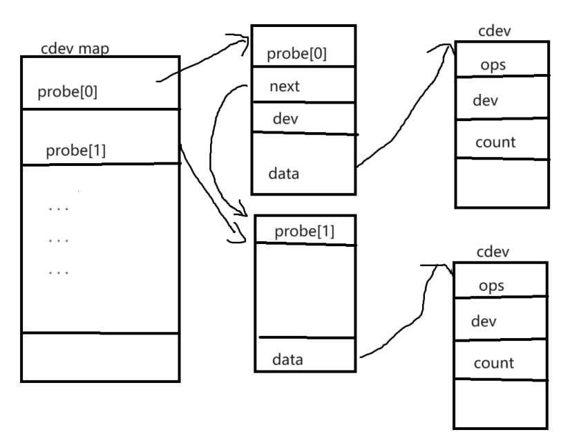  

	既然是链表，肯定会有增删改查。这里内核也提供了一个函数cdev_add()
	它将cdev和设备号绑定放到了cdev_map中了

#### 1.2.0.6. 2.6  如何创建设备文件
	就算我们把设备号和cdev关联起来了，并且也让内核进行了管理，但是我们发现还是没有对应的设备节点，没有设备节点我们就没办法进行操作，这时候我们就需要自己创建一个设备节了。
	手动创建设备节点：
	mknod 设备文件名 		设备文件类型 主设备号 次设备号
	mknod /dev/led-driver 	c 			243 	0

	内核自动创建设备文件的程序：
	1.devtmpfs
	2.udev
	3.mdev
	总结：devtmpfs是linux内核中的一个虚拟文件系统，首先对内核版本有需求，其次这种是直接在内核中进行创建，不会通知用户空间。后面udev和mdev都是用户空间的程序，使用udev或mdev的好处就在于设备在添加或移除时都会通知用户空间。针对与动态加载驱动程序还是利用后者更合理。
	在嵌入式当中用的较多的就是mdev了，具体体现呢就在于系统启动脚本中rcS里的mdev -s。
	在系统启动时，通过执行“mdev -s”去扫描/sys/class和/sys/block,在目录中查找dev文件。/sys/class下的每一个文件夹都代表一个子系统。而这些信息呢又是有uevent接口提供的，同样在统计目录下还有一个uevent信息。

	我们发现，我们要想进行自动创建设备节点，我们/sys/class中得要有对应得设备信息。而这些设备信息主要是就是设备号和设备名。设备号和设备名都是在我们程序中写得，说明我们得想办法将这些信息引入到/sys/class中。
	总结：如何让内核自动创建设备文件？
	1.驱动程序提供设备信息（设备号和设备名），加入到/sys/class信息中。
	2.由获取设备信息得程序进行创建设备节点（devtmpfs，udev，mdev）

	实现步骤：
	**提供class信息：**
	我们需要做大概两步，第一步：在class目录创建一个类，第二步在类底下创建一个设备，将设备信息放入这个设备下。
	在内核中，系统给我们提供了一个创建class得函数接口class_create()

	首先加入我们的类信息
  

	然后在初始化的时候创建这个类
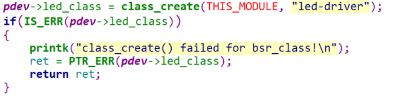  

	还需要添加错误释放逻辑，因为在这里容易出现创建的类名冲突
  

	最后再驱动退出接口中加入销毁类的函数接口class_destroy()
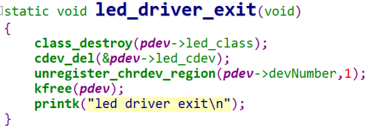  

	然后加载驱动后，就可以在/sys/class里面看到文件节点了

	我们可以发现目前这个目录下面什么都没有，因为我们这个class_create接口只是负责创建类，并没有相关的设备信息，接下来我们就要导出设备信息了
	
	**提供device信息**
	内核中也提供了创建设备的接口，device_create()

	首先加入我们的类信息
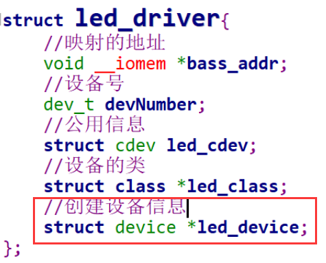 

	然后在初始化的时候创建这个类  
  

	记住，错误判断中还需要释放其他资源  
  

	最后在驱动退出接口中，记得使用device_destroy()接口释放资源
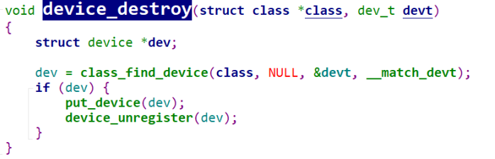  

	需要注意的是这个地方device_destroy（）需要传递的是class类和对应的设备号信息。
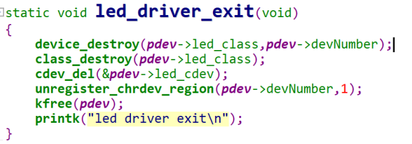  

	这时候就发现/sys/class下创建了对应的类和设备了，且/dev下生成了设备文件了。

## 1.3. 3.platform架构流程
#### 1.3.0.1. 3.1  platform架构的组成
	总线驱动框架的思路，他要求我们把设备和驱动都注册到总线上去，当注册设备的时候，会去寻找同名的驱动，当注册驱动的时候，也会去找同名的设备。相互查找，进行匹配。一旦匹配成功，驱动就可以通过匹配到的进行获取设备的信息。


**总线**  

	总线是连接各个部件的信息传输线，使各个部位共享的传输介质。

**平台总线**  

	cpu核与硬件控制器之间的通信，挂载的都是控制器设备。
	在驱动概念中虚拟抽象出来一个总线结构----->platform bus。
	platform bus就将我们原先的驱动和设备信息分开，一个叫platform device，一个叫plaform driver

**边缘设备之间通信的总线**  

	我们也叫专用接口式总线，其中就包含i2c，usb，spi，uart这种外部总线，这种挂载的通常都是符合实际总线时序的外围设备，不同的边缘设备之间通信的总线时序是不一样的，对于这些总线，linux内核都是单独实现的。

	总结：总线在操作系统中的本质就是两个链表：一个是挂载设备的链表，一个是挂载驱动的链表。通过匹配机制进行结合。
#### 1.3.0.2. 3.2  总线驱动编写流程
**如何基于总线进行编写驱动**

	1.根据自己的设备，来确定总线的类型
	platform bus/iic bus/usb bus等
	2.根据总线的类型，确定设备在总线上如何描述(platform)
  

	3.根据总线的类型，确定驱动在总线上如何描述(platform)
  

	4.根据总线的类型，确定在总线上如何注册设备
	int platform_device_register(struct platform_device *pdev);
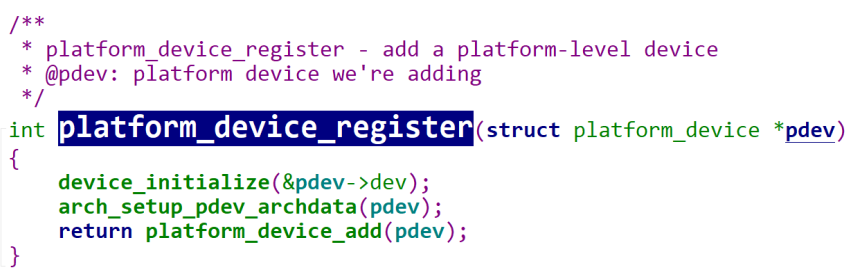  

	5.根据总线类型，确定在总线上如何注册驱动
	int platform_driver_register(struct platform_driver *pdrver);
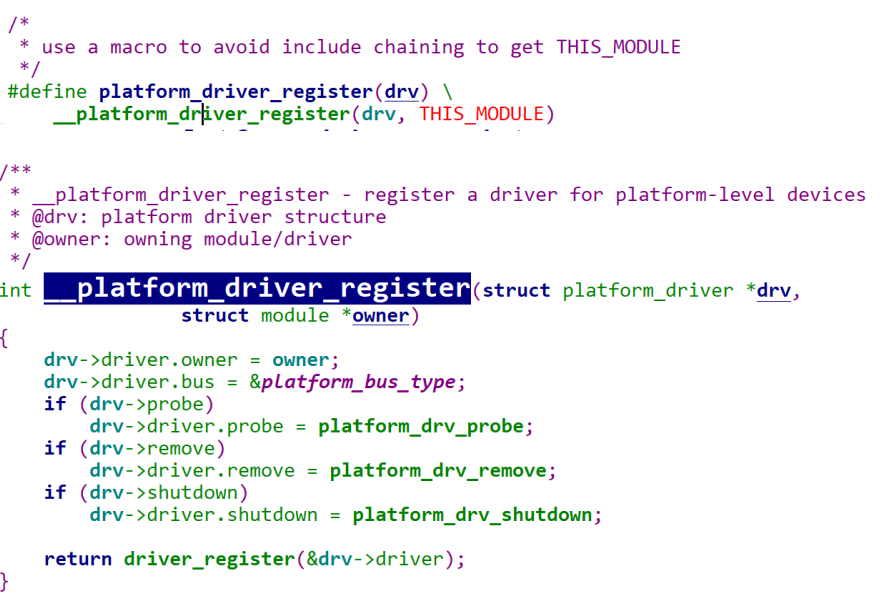  

	6.根据总线的类型，确定设备和驱动匹配原则
	如果驱动提供了id_table（表），就拿设备的名字和id_table中记录的名字进行匹配。
	如果驱动没有提供id_table,那就拿设备的名字和驱动的名字进行匹配。	
	7.一旦设备和驱动匹配后，操作系统就会调用驱动提供的probe函数。
	在这个函数中一般需要要做两件事情：
	1.获取匹配的硬件资源
	2.注册字符设备（可选）
#### 1.3.0.3. 3.2  platform device
	我们这里是需要提供设备信息的，所以需要用struct platform_device结构体进行记录，这个结构体需要初始化的内容很多，这里我们先只提供对应的名字。
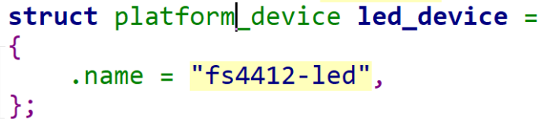  

	这样设备信息就有了，我们接下来把他注册到platform总线上，使用platform_device_register接口。有注册就会有注销，使用platform_device_unregister接口。
  

	记得添加头文件，然后添加makefile文件，用之前的方式，改一下编译的名字就可以。
	在/sys/bus/platform/devices下看一下是否注册进去了。
#### 1.3.0.4. 3.3  platform driver
	这里对应的驱动也有一个结构体进行描述，struct platform_driver，我们要对它进行初始化，但是有点不同的是这个地方，这个地方我们知道有一个匹配函数指针，还有一个退出的函数指针，目前我们还不知道怎么去做，我们就借鉴。
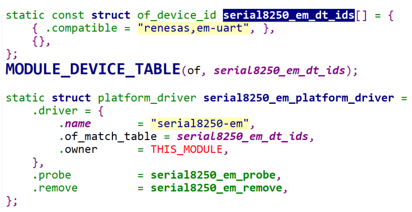  

	这里我们看到，别人这里初始化了driver信息，他这个里面除了提供了驱动的名字以及所有者意外还提供了匹配规则。然后还有probe匹配函数、remove删除函数等，在这里我们去掉它的匹配规则，将其他的先抄过去。然后进行修改。
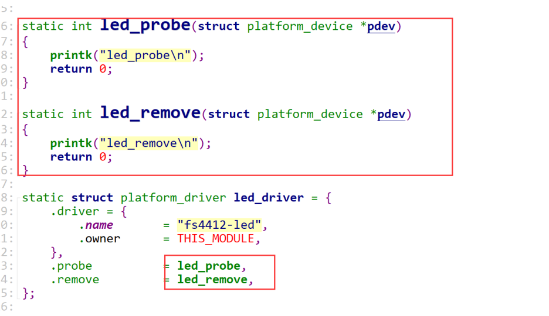

	查看/sys/bus/platform/driver目录下，就会生成对应的文件夹。
#### 1.3.0.5. 3.4  匹配机制
	我们发现卸载设备的时候出问题了，这是因为没有定义release函数。因为我们设备在卸载的时候，我们操作系统必须要调用一个函数，这个函数就是release。我们device根本没有提供任何函数，但是操作系统必须要调用，所以报错了。那么我们之前是通过cdev这个结构体进行提供relase函数，在这个里面我们需要使用platform_device中的struct device结构体进行提供。这个函数原本的含义是需要在卸载设备的时候释放掉设备的资源，但是我们这里没有需要释放的资源，直接写一个函数加个打印即可。
#### 1.3.0.6. 3.5  设备资源
	上面提供了platform设备和platform驱动，但是目前只是简单的串联起来了。接下来就是需要在platform设备中添加对应的资源，让我们的platform驱动可以进行使用这些资源进行使用，比如开灯和关灯。

	在platform_device中呢，有一个结构体专门进行描述资源信息的，那就是struct resource结构体。
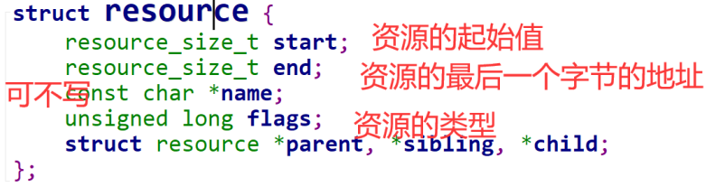   
**提供设备信息(资源)**
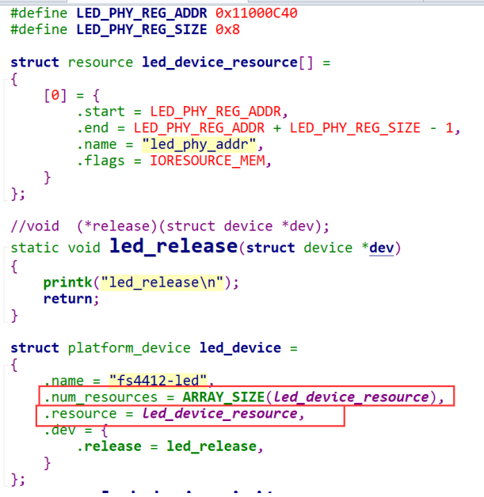    
**获取设备信息(资源)**
	使用platform_get_resource函数就可以进行获取，通常来说我们资源的获取都会放在probe函数中实现。
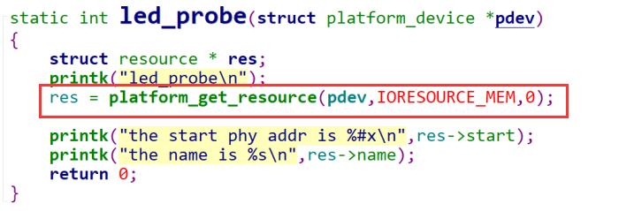  

## 1.4. 4.设备树
#### 1.4.0.1. 4.1  设备树的基本语法
   

	属性就是简单的键值对，其值可以是空的，也可以包含任意字节流。设备树中可以表示一些基本数据表示形式
	1.文本字符串，用双引号表示：
	a-string-property = "A string";
	2.数组是用尖括号分割的32位无符号整数
	a-cell-property = <1 2 3 4>;
	3.二进制数据用方括号分隔
	a-byte-data-property = [01 23 34 56];
	注意写的时候用十六进制表示二进制，且0x可以不用写。
	4.可以用逗号隔开不同数据类型的组合
	mixed-propery = "a string",[0x01 0x23 0x45 0x67],<0x12345678>
	5.逗号还可以用于字符串列表
	a-string-list-property = "first string", "second string";  

	属性名可以任意，但是赋值的时候需要遵从设备树的语法原则。需要注意的是，内核中有一些属性是通用属性，这些属性在使用的时候内核会自己解析。除了通用属性之外，我们还可以向节点添加任意的属性和子节点，但是需要注意一些规则，首先，特定于设备的新属性名称应使用制造商作为前缀，以便它们不会与现有的标准属性名称冲突，其次，必须在绑定中记录属性和子节点的含义，以便设备驱动作者知道如何解析数据。

#### 1.4.0.2. 4.2  设备树通用属性
**compatible**  

	这个属性叫做“兼容性”属性，这是一个非常重要的属性。compatible属性的值是一个字符串列表，用于将设备和驱动绑定起来。字符串列表用于选择设备所要使用的驱动程序。通常写法：
	compatible = "manufacturer,model","manufacturer,model";
	其中manufacturer表示厂商，model一般是模块对应的驱动名字.
	每个节点都要有这个属性，不然驱动匹配不了。  
**reg**  

	这个属性一般描述设备地址空间资源信息，reg属性的值一般是(address,length),一般用于描述某个外设的寄存器地址范围信息，也可以描述器件的地址。通常写法：
	reg = <0xaddress 0xlength>
	0xaddress是地址，0xlength是大小。
	这个地方我们需要提供led等的寄存器地址信息。
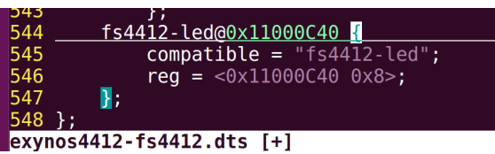  

	提到reg属性呢，就要提到节点的命名规则，节点名称必须采用<name>[@<unit-address>]的命名规则。
	<name>是一个简单的ASCII字符串，长度最多为31个字符。多个相同类型设备节点的name可以一样，只要unit-address不同即可。
	这种命名规则就是为了防止出现同名的设备节点。  

上板子测试，可以查看/proc/device-tree看到标签名  

通过设备树创建的节点也会生成platform设备注册到platform总线上。查看/sys/bus/platform/devices目录下是否有对应的设备。 


#### 1.4.0.3. 4.3  获取设备树生成的设备信息资源

目前我们设备树已经新加了我们的fs4412-led节点，我们也发现运行起来后，也可以进行
platform设备的注册，但是这样我们原先的platform驱动就可以匹配上了吗？
答案是不行的，我们回想一下之前我们写platform设备和platform驱动的时候，是不是没有用到
compatible信息，我们是直接创建了一个platform_device结构体，将里面的name属性设置，
然后利用他们之间的机制进行匹配。现在我们没有自己定义platform_device结构体，那么对应
的name属性就没有了。这时候肯定就匹配不上了。现在我们需要使用compatible这个信息进行
匹配了，我们先看看别人是怎么使用的。

目前我们只在设备树上添加了一个子节点，可以发现也能运行起来，也可以进行platform设备的注册，但这样可以和我们原先的无设备树的platform驱动匹配上吗？

答案是不行的，我们之前platform设备和platform驱动没用到compatible信息，直接用name属性进行匹配的。
```sh
而正常流程中设备和驱动匹配：
驱动重写：如果设备有 driver_override 属性，内核会检查是否有匹配的驱动程序名称  
设备树匹配:内核会尝试通过 of_driver_match_device 函数来匹配设备的 compatible 属性与驱动程序的 of_match_table。  
ACPI匹配：对于使用ACPI的系统，内核也会尝试通过 acpi_driver_match_device 函数来进行匹配 
ID表匹配：如果驱动程序提供了ID表（如 platform_device_id），内核会尝试通过 platform_match_id 函数来匹配设备ID

最后如果以上都匹配失败，内核会退回到使用设备名称与驱动名称进行匹配，也就是name属性匹配
```
现在我们使用了设备树来保存设备信息，对应的name属性也就少了一个，匹配不上了。  

现在我们需要使用compatible这个信息进行匹配了，我们先看看别人是怎么使用的  
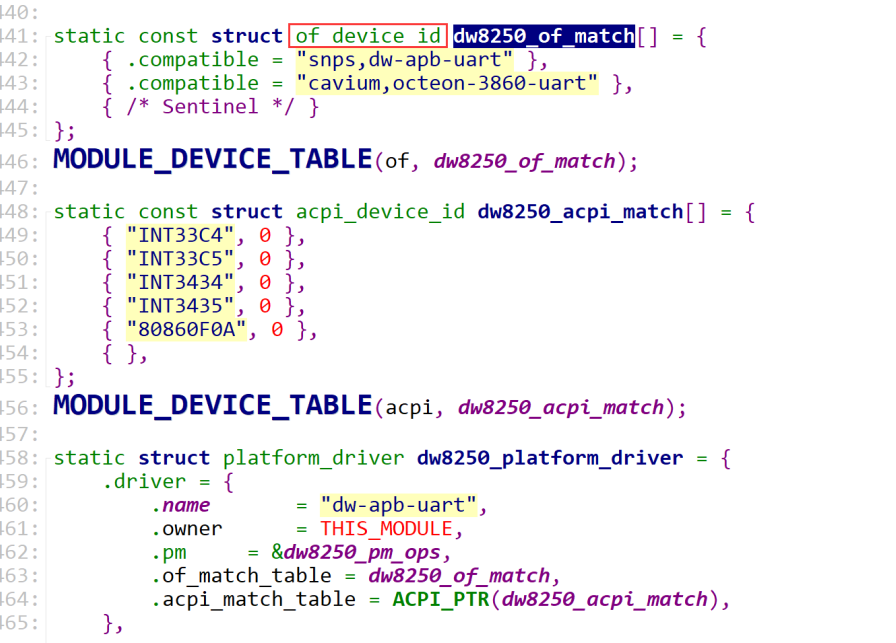  
用of_device_id这个结构体来记录compatible信息的，然后将这个信息传到platform_driver中的driver结构体中的of_match_table。
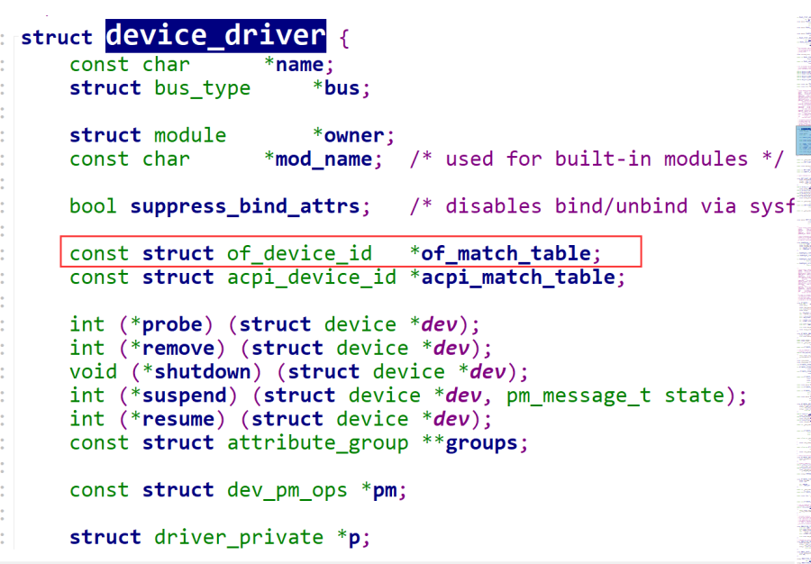  

自己代码模拟写  
  
发现匹配到了。
那现在我可以进行操作了吗？可以是可以，但是还是需要添加对应的控制，如果只通过获取到的
寄存器的地址还是不知道怎么去操作的。对于真正的驱动开发中，驱动工程师是不知道这个这些
地址怎么控制的，几位控制一个引脚？高电平灯亮还是低电平灯亮？第几个引脚？都是不知道
的，如果我们在驱动代码中写死了，这不就相当于驱动又和特定平台绑定了么。

#### 1.4.0.4. 4.4  拓展设备树信息  
**自定义属性**  
上面写的通用属性没办法将全部的信息告诉我们驱动工程师，这时候就需要使用设备树的自定义属性能力了。  
对于led灯来说，我们还需要提供我们要控制第几个引脚，什么电平有效，引脚的模式是什么，几位控制一个引脚。那我们就将这些信息提供到设备树中。  
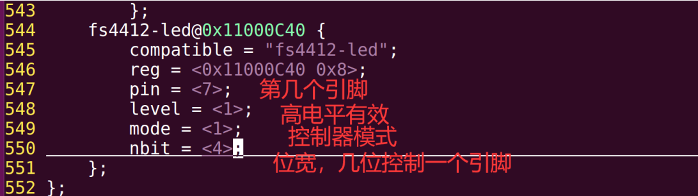  
需要注意的是，内核自己只会去解析通用属性，而我们后面加的这4个是我们自定义的属性，我们需要自己解析。先编译看看设备中的现象。  
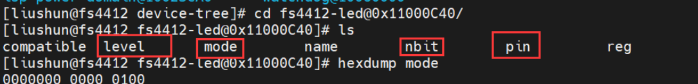  
可以发现这些信息已经存放在在设备树节点中了。  

**解析自定义属性**
内核在解析设备树节点后，会生成platform_device结构体，主要是填充platform_device中的struct device结构体里面的struct device_node。
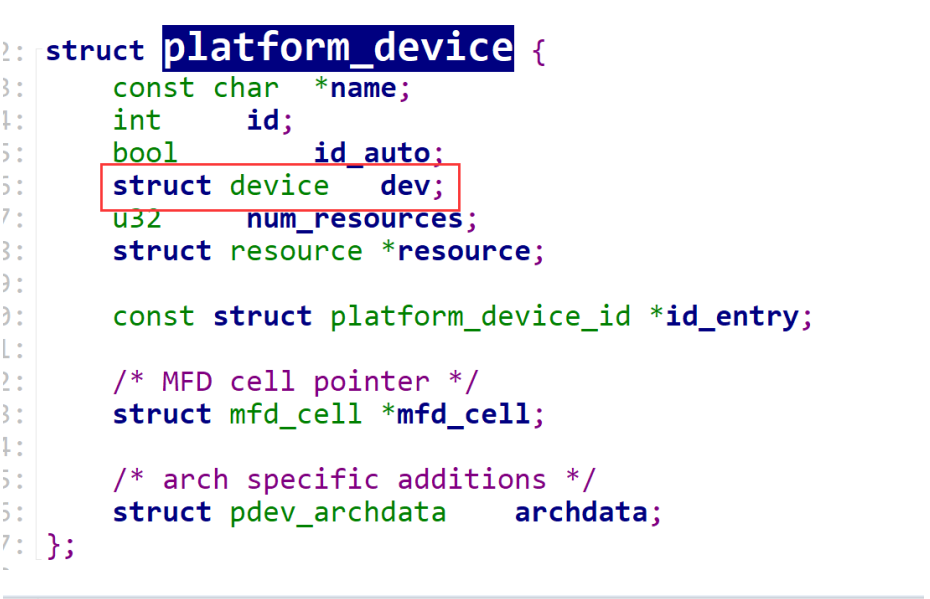  
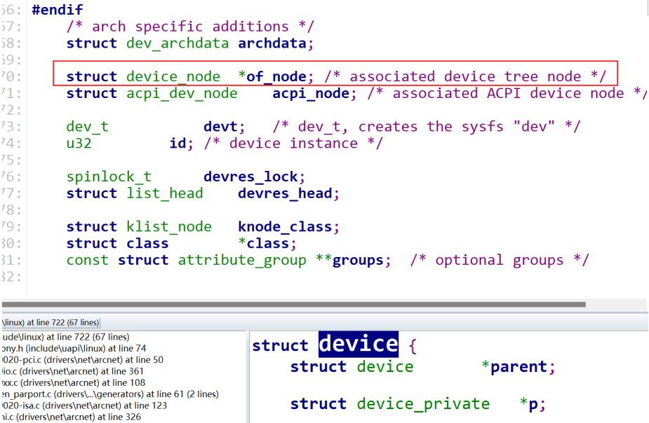  

这个struct device_node结构体装的就是设备树节点信息。
内核在解析这个节点的时候，会根据节点的状态，判断是否注册到platform总线上，这个地方有
一个通用属性status。这个属性是标识了这个节点的状态。一共有4个值：
okay：表示设备使能。
disabled：表示设备不使能，但将来可能会运行。
fail：表示设备无法运行，在设备中检测到严重错误，如果没有修理就不能运行
fail-sss：表示设备无法运行，在设备中检测到严重错误，没有休息不能运行，sss的部分是特定于
设备的错误情况。
可以不写这个属性，表示默认使能。如果不想使能可以写status = "disabled";  

内核就是通过这个属性来判断我们当前这个节点是否注册到platform总线上，如果是使能的状
态，就会构建一个platform_device结构体也就是设备。然后去匹配驱动，他会先去找通用属性
进行解析，比如reg属性内核就会将其解析成IORESOURCE_MEM的资源。然后我们就能用
platform_get_resource去获取。其他的自定义属性呢就会装载到上面说的struct device_node
中，然后内核提供了一系列的接口，方便我们获取。这些接口就在内核中的/include/linux/of.h
中，of全称为Open Firmware，大家只要看到内核中出现of打头的接口，那就是跟设备树相关的
函数。  

读取自定义属性值：  
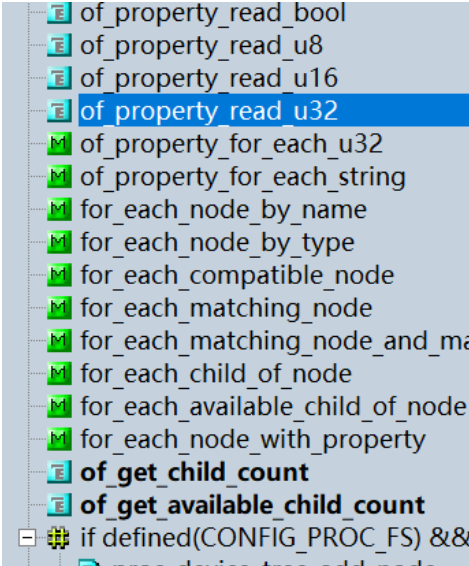  
提供了很多read函数，来读取不同的值。我们要根据设备树中写的类型选择对应的函数，我们可
以看到我们写的4个自定义属性都是通过<>分割的，那这个里面装的是32位无符号整型的，所以
我们使用of_property_read_u32接口就行。  
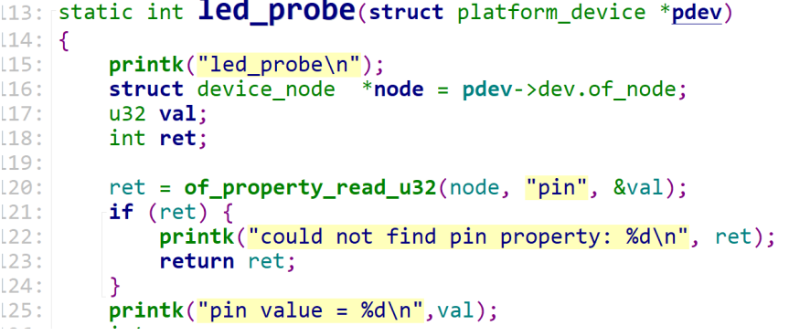  

#### 1.4.0.5. 4.5  GPIO的信息  
上面写的是通用框架，任何设备驱动都可以那么去写，但是针对于我们是led灯的驱动的情况，我们还是没办法做到完全通用，因为什么？
1.我们的寄存器偏移量还是自己写的  
```sh
#define LED CON REG OFFSET OxO
#define LED DAT REG OFFSET OX4
```
我们可以看到，在我们字符设备中去操作led灯还是依靠这个偏移量来控制不同的寄存器的操作的，对于exynos4412这一款芯片是这样，但是对其他的芯片就不一定了。  

2.我们的控制位置是按照均匀分布去设计的  
```sh
reg value &= ~(0x1 << pin);
reg value |= (level<< pin);
```
这个地方我们可以看到我们是设想寄存器的布局都是均匀的，根据位宽和对于的管脚就可以推算出来，但是在很多其他芯片里面可能就不是这样了。  
所以我们能得出结论是，我们能保证exynos4412这款芯片上的所有led灯通用，其他芯片就不能保证了。  

而之前我们的这一套框架是针对所有的驱动来说的，实际上如果我们想操作一个gpio不用这么复杂，对于gpio呢我们设备树有专门的通用属性。  

**设备名-gpio**  
设备名-gpio = <&gpio控制器的标签名 管脚编号 标志>； 

通过在/linux/Documentation/devicetree/bindings目录下查找内核中一个gpio的信息该如何描述，  
使用grep -rn "gpio"指令找到一个芯片厂家是samsung，然后芯片型号是exynos查看
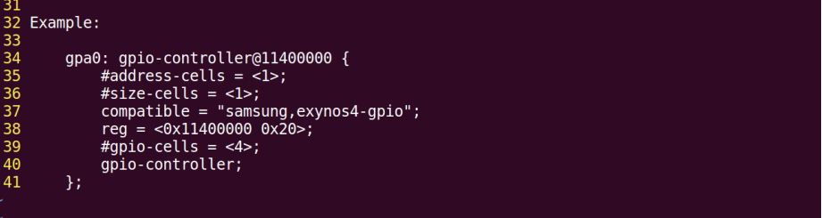  
```sh
1.compatible：这个之前学过了，兼容性属性，为的就是匹配驱动。
2.reg：这个之前也学过了，用来描述物理地址和范围的
3.#gpio-cells：通常是#xxx-cells = <>,<>里面存放一个数，含义是用多少个
无符号32位整数来描述xxx，而这个多少个就是<>里面的数，xxx这里是gpio。这段话后面加了
一个描述should be 4，意思是他希望我们在这个属性后面的<>里面填4，也就是说他希望我们
用4个无符号32位整数来描述gpio。那这4位分别是什么呢
```
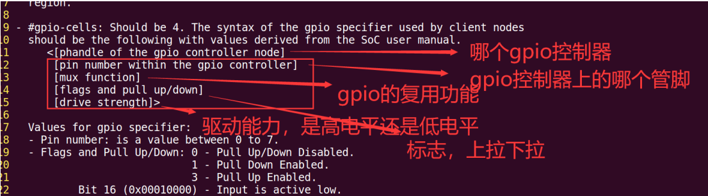  

## 1.5. 5.中断
#### 1.5.0.1. 5.1  中断的概念
内部中断：  
内部中断通常是由CPU内部条件触发，比如控制器异常，一般是跟程序直接相关的，可能有一些出错处理，提高系统的健壮性。所以内部中断更多的是指CPU内部的异常处理。  
外部中断：
外部中断也是我们侠义中的“中断”，外面提到中断呢一般就是指外部中断，通常是由外设
硬件触发，比如键盘，鼠标，网卡等，其主要目的是为了数据传输或者硬件故障处理等等。说的再通俗易懂一点就是通过SOC芯片外部管脚的电平变化进行触发的中断，我们就叫外部中断，常见的触发方式有边沿触发（上升沿，下降沿，双边沿）、电平触发（高电平，低电平）。

**中断执行流程**   
无论是外部中断还是内部中断，基本都遵循以下流程：  
1.中断检测： CPU检测到中断信号  
2.中断响应： CPU暂停当前程序，并且保存当前状态  
3.中断服务： 调用对应的中断处理函数  
4.中断返回： 中断处理完后，CPU恢复之前的状态并继续执行  

GIC支持3种中断类型，分别是：  
SGI：软件中断  
PPI ：私有中断  
SPI：共享中断  
#### 1.5.0.2. 5.2  中断在设备树中的信息
```sh
通用属性
interrupt-parent = <&中断控制器的标签名>； //直属的控制器 gpio/gic/combiner
interrupts = <1个或多个无符号32位整数描述的中断信息>； //#interrupt-cells
interrupt-names = "名称"；
```

我们只需要记住你需要加的这一类属性属于哪个控制器，比如我们用的是GPIO的控制器，那我们就可以直接去搜索"gpiocontroller",那我们现在要学习中断，就可以去搜索"interrupt-controller"。去设备树文件中搜索。  
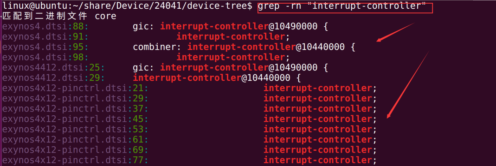  
#### 1.5.0.3. 5.3  各中断控制器的描述信息
控制中断能否被允许产生，以及控制中断的优先级。
arm出了两款中断控制器：
一个是针对cortex-m系列的NVIC。（stm32）
一个是针对cortex-a系列的GIC。
#### 1.5.0.4. 5.4  中断上下部概念
#### 1.5.0.5. 5.5  tasklet和工作队列实现
## 1.6. 6.adc
#### 1.6.0.1. 6.1  adc基础概念
#### 1.6.0.2. 6.2  中断信息
#### 1.6.0.3. 6.3  时钟信息
#### 1.6.0.4. 6.4  阻塞IO
## 1.7. 7.I2c
#### 1.7.0.1. 7.1  I2c基础概念
#### 1.7.0.2. 7.2  I2C时序